<!--ts-->

   * [1.概述](#1概述)
   * [2.数组](#2数组)
      * [2.1 数组中的重复数字@@@](#21-数组中的重复数字)
      * [2.2 二维数组中的查找](#22-二维数组中的查找)
      * [2.3 旋转数组旋转数组的最小数字@@](#23-旋转数组旋转数组的最小数字)
      * [2.4 调整数组顺序使奇数位于偶数前面](#24-调整数组顺序使奇数位于偶数前面)
      * [2.5 顺时针打印矩阵@@@](#25-顺时针打印矩阵)
      * [2.6 数组中出现次数超过一半的数字](#26-数组中出现次数超过一半的数字)
      * [2.7 最小的k个数@@@](#27-最小的k个数)
      * [2.8 连续子数组的最大和@@](#28-连续子数组的最大和)
      * [2.9 数组排成最小的数@@@@](#29-数组排成最小的数)
      * [2.10 数组中的逆序对@@@@](#210-数组中的逆序对)
      * [2.11 数字在排序数组中出现的次数](#211-数字在排序数组中出现的次数)
      * [2.12 数组中只出现一次的数字@@@](#212-数组中只出现一次的数字)
      * [2.13 和为s的数字@@@](#213-和为s的数字)
      * [2.13 扑克牌中的顺子](#213-扑克牌中的顺子)
      * [2.14 股票的最大利润](#214-股票的最大利润)
      * [2.15 构建乘积数组](#215-构建乘积数组)
   * [3. 字符串](#3-字符串)
      * [3.1 替换空格](#31-替换空格)
      * [3.2 正则表达式匹配@@@](#32-正则表达式匹配)
      * [3.3 表示数值的字符串](#33-表示数值的字符串)
      * [3.4 数字序列中某一位的数字@@@](#34-数字序列中某一位的数字)
      * [3.5 第一个只出现一次的字符](#35-第一个只出现一次的字符)
      * [3.6 反转字符串](#36-反转字符串)
      * [3.7 字符串转整数](#37-字符串转整数)
   * [3 链表](#3-链表)
      * [3.1 从尾到头打印链表](#31-从尾到头打印链表)
      * [3.2 删除链表中的节点](#32-删除链表中的节点)
      * [3.3 链表中倒数第k个节点](#33-链表中倒数第k个节点)
      * [3.4 链表中环的入口节点](#34-链表中环的入口节点)
      * [3.5 反转链表@@@](#35-反转链表)
      * [3.6 合并两个排序的链表](#36-合并两个排序的链表)
      * [3.7 复杂链表的复制(字节考过)](#37-复杂链表的复制字节考过)
      * [3.8 二叉搜索树与双向链表@@@](#38-二叉搜索树与双向链表)
      * [3.9 两个链表的第一个公共节点](#39-两个链表的第一个公共节点)
      * [3.10 圆圈中最后剩余的数字@@@](#310-圆圈中最后剩余的数字)
   * [4. 二叉树&amp;递归](#4-二叉树递归)
      * [4.1 二叉树迭代@@@](#41-二叉树迭代)
      * [4.2 二叉树遍历类](#42-二叉树遍历类)
         * [4.2.1 重建二叉树@@@](#421-重建二叉树)
         * [4.2.2 二叉搜索树的后序遍历序列](#422-二叉搜索树的后序遍历序列)
         * [4.2.3 树的子结构](#423-树的子结构)
         * [4.2.4 二叉树的镜像](#424-二叉树的镜像)
         * [4.2.4 对称的二叉树](#424-对称的二叉树)
         * [4.2.5 二叉树中和为某值的路径@@@](#425-二叉树中和为某值的路径)
      * [4.3 二叉树的下一个节点@@](#43-二叉树的下一个节点)
      * [4.4 从上向下打印二叉树](#44-从上向下打印二叉树)
      * [4.5 序列化二叉树](#45-序列化二叉树)
      * [4.6 数据流中的中位数@@@](#46-数据流中的中位数)
      * [4.7 二叉搜索树的第k大节点@@@](#47-二叉搜索树的第k大节点)
      * [4.8 二叉树的深度](#48-二叉树的深度)
      * [4.9 树中两个节点的最低公共祖先@@@](#49-树中两个节点的最低公共祖先)
      * [4.10 二叉堆实现优先队列](#410-二叉堆实现优先队列)
      * [4.11 <strong>二叉搜索树操作集锦</strong>](#411-二叉搜索树操作集锦)
         * [4.11.1 <strong>判断</strong> <strong>BST</strong> <strong>的合法性</strong>](#4111-判断-bst-的合法性)
         * [4.11.2 <strong>在</strong> <strong>BST</strong> <strong>中查找一个数是否存在</strong>](#4112-在-bst-中查找一个数是否存在)
         * [4.11.3 <strong>在</strong> <strong>BST</strong> 中插入一个数](#4113-在-bst-中插入一个数)
         * [4.11.4 在BST中删除一个数](#4114-在bst中删除一个数)
         * [4.11.5 总结](#4115-总结)
   * [5. 栈和队列](#5-栈和队列)
      * [5.1 俩个栈实现队列@@](#51-俩个栈实现队列)
      * [5.2 包含min函数的栈](#52-包含min函数的栈)
      * [5.3 栈的压入、弹出序列](#53-栈的压入弹出序列)
      * [5.4 队列的最大值](#54-队列的最大值)
      * [5.5 单调栈](#55-单调栈)
   * [6. 递归和循环](#6-递归和循环)
      * [6.2 数值的整数次方](#62-数值的整数次方)
      * [6.3  打印从1到最大的n位数](#63--打印从1到最大的n位数)
      * [6.4 1-n整数中1出现的次数](#64-1-n整数中1出现的次数)
      * [6.5 丑数](#65-丑数)
      * [6.6 求1 2 … n](#66-求12n)
   * [7. 查找和排序](#7-查找和排序)
      * [7.1 第一个只出现一次的字符](#71-第一个只出现一次的字符)
      * [7.2 在排序数组中查找数字](#72-在排序数组中查找数字)
      * [7.4 二分查找套路](#74-二分查找套路)
   * [8. 动态规划和贪心算法](#8-动态规划和贪心算法)
      * [8.0 动态规划](#80-动态规划)
         * [8.0.1 线性规划](#801-线性规划)
            * [<strong>求解 dp[i] 形式一</strong>](#求解-dpi-形式一)
            * [求解 dp[i] 形式二](#求解-dpi-形式二)
         * [8.0.2 区间规划](#802-区间规划)
         * [8.0.3 约束规划](#803-约束规划)
      * [8.1 <strong>斐波那契数列</strong>](#81-斐波那契数列)
      * [8.2 凑零钱问题](#82-凑零钱问题)
      * [8.3 最长增长子序列（LIS）](#83-最长增长子序列lis)
         * [8.3.1 子序列问题解题模板](#831-子序列问题解题模板)
         * [8.3.2 <strong>最⻓回文子序列</strong>](#832-最回文子序列)
         * [8.3.3 <strong>最⻓公共子序列</strong>](#833-最公共子序列)
      * [8.4 编辑距离](#84-编辑距离)
      * [8.5 剪绳子](#85-剪绳子)
      * [8.6 连续子数组的最大和](#86-连续子数组的最大和)
      * [8.7 数字翻译为字符串](#87-数字翻译为字符串)
      * [8.8 礼物的最大价值](#88-礼物的最大价值)
      * [8.9 最长不包含重复字符的子字符串](#89-最长不包含重复字符的子字符串)
      * [8.10 <em>KMP</em>字符匹配算法](#810-kmp字符匹配算法)
      * [8.11 高楼扔鸡蛋](#811-高楼扔鸡蛋)
      * [8.12 n个骰子的点数](#812-n个骰子的点数)
      * [8.13 正则表达式匹配](#813-正则表达式匹配)
      * [8.14 打家劫舍问题](#814-打家劫舍问题)
         * [8.14.1 打家劫舍问题2](#8141-打家劫舍问题2)
      * [8.15 <strong>股票买卖问题</strong>](#815-股票买卖问题)
      * [8.16 <strong>博弈问题</strong>](#816-博弈问题)
         * [8.16.1 石头游戏](#8161-石头游戏)
      * [8.17 <strong>四键键盘</strong>](#817-四键键盘)
   * [9. 回溯](#9-回溯)
      * [9.1 全排列问题](#91-全排列问题)
      * [9.2 矩阵中的路径](#92-矩阵中的路径)
      * [9.3 机器人的运动范围](#93-机器人的运动范围)
      * [9.4 字符串的排列](#94-字符串的排列)
      * [9.5 N皇后问题](#95-n皇后问题)
      * [9.6 数组中所有目标和为target](#96-数组中所有目标和为target)
   * [10. 位运算](#10-位运算)
      * [10.1 n&amp;(n-1)](#101-nn-1)
      * [10.2 不用加减乘除做加法](#102-不用加减乘除做加法)
   * [11. 常见算法思维](#11-常见算法思维)
      * [11.1 双指针](#111-双指针)
         * [11.1.1 快慢指针法](#1111-快慢指针法)
         * [11.1.2 左右指针法](#1112-左右指针法)
         * [11.1.3 滑动窗口算法](#1113-滑动窗口算法)
            * [11.1.3.1 <strong>最小覆盖子串</strong>](#11131-最小覆盖子串)
            * [11.1.3.2 找到字符串中所有字母异位词](#11132-找到字符串中所有字母异位词)
            * [11.1.3.3 无重复字符的最⻓子串](#11133-无重复字符的最子串)
            * [11.1.3.4 总结](#11134-总结)
      * [11.2 两数和问题](#112-两数和问题)
      * [11.3 常用位操作](#113-常用位操作)
      * [11.4 实现计算器](#114-实现计算器)
      * [11.5 <strong>前缀和技巧</strong>](#115-前缀和技巧)
      * [11.6 大数运算](#116-大数运算)
         * [11.6.1 大数加法](#1161-大数加法)
         * [11.6.2 大数乘法](#1162-大数乘法)
      * [11.7 <strong>FloodFill</strong>算法详解](#117-floodfill算法详解)
   * [12. DFS vs BFS](#12-dfs-vs-bfs)
      * [12.1 DFS](#121-dfs)
         * [12.1.1 走迷宫](#1211-走迷宫)
         * [12.1.2 利用 DFS 去寻找最短的路径](#1212-利用-dfs-去寻找最短的路径)
      * [12.2 BFS](#122-bfs)
         * [12.2.1 二叉树的最小高度](#1221-二叉树的最小高度)
         * [12.2.2 解开密码锁的最少次数](#1222-解开密码锁的最少次数)
         * [12.2.1 二叉树的锯齿形层次遍历](#1221-二叉树的锯齿形层次遍历)
         * [12.2.1 BFS找最短路径](#1221-bfs找最短路径)
         * [12.2.2 最多允许打通 3 堵墙](#1222-最多允许打通-3-堵墙)
   * [13. 常见](#13-常见)
      * [13.1 LRU算法](#131-lru算法)

<!-- Added by: anapodoton, at: 2020年 4月20日 星期一 17时15分35秒 CST -->

<!--te-->

# 1.概述

https://www.cxyxiaowu.com/7072.html

 [complexity.md](complexity.md) 

**常用的数据结构：**
数组，链表，二叉树，栈和队列。

**常用的算法：大多数是基于查找和排序。**
递归的核心思想是如果要求f(n),那么我只需要知道f(n-1)即可。循环的核心思想是要求f(n),我可以从f(1)一直求到f(n)。

我们应该重点掌握**二分查找，归并排序和快速排序**。这三种必须可以手撕代码。
如果面试题要求在排序的数组或者部分排序的数组中查找一个数字或者统计某数字出现的次数，可以尝试使用二分查找算法。

在查找中，哈希表和二叉排序树的考察重点在数据结构上，而不是算法上。哈希表的时间复杂度为O(1)，原理是空间换时间，题目代表50“第一个只出现一次的字符”，可以关注布隆过滤器的实现。

在排序中，需要掌握各种排序算法的平均时间复杂度，最差时间复杂度，空间复杂度，另快排是十分重要的。
快排的核心是随机选择一个数字，比这个数字大的移动到左边，比这个数字小的移动到右边。可以用递归和循环来实现。

当题目要求在二维数组上（迷宫或者棋盘）上搜索路径，我们可以尝试使用回溯法，很适合采用递归的手段来实现。
如果明确指出不可以使用递归的话，可以使用栈来模拟递归。

回溯法是升级版的暴力法，从解决问题的每一步的所有可能选项选出一项，然后进入下一步，进行重复选择，直到最终状态。（在到达递归边界前的某层，由于一些事实不需要向任何一个子问题进行递归，直接返回上一层，这种做法称为回溯法）。

动态规划和贪心算法。
动态规划用于求某个问题的最优解(通常是最大值和最小值)，并且该问题可以分解为多个子问题。
需要符合两个特点：1.求最优解，即求最值。2.整体的最优解依赖于各个子问题的最优解。3.子问题之间有相互重叠的更小的子问题。4.根据第三点，子问题之间有重叠，所以从上向下分析问题，从下向上求解问题。

位运算：与，或，异或，左移和右移。
需要关注的是右移，分为有符号和无符号两种，如果是无符号，则直接用0填补左边的n位，如果是有符号的负数，如10001010 >> 3= 11110001
把一个整数减去1，再和原整数做与运算，会把该整数最右边的一个1变成0。也是很多二进制问题的解决思路。

自上而下的分析问题，自下而上的解决问题。

# 2.数组
## 2.1 数组中的重复数字@@@

[数组中重复的数字(3)](https://github.com/haojunsheng/AlgorithmNotes/blob/master/src/com/code/offer/array/DuplicationInArray_0301.java)
【核心】核心是数字i出现在下标为i的位置上

```java
// 题目：在一个长度为n的数组里的所有数字都在0到n-1的范围内。数组中某些数字是重复的，但不知道有几个数字重复了，
// 也不知道每个数字重复了几次。请找出数组中任意一个重复的数字。例如，如果输入长度为7的数组{2, 3, 1, 0, 2, 5, 3}，
// 那么对应的输出是重复的数字2或者3。

// 现在让我们重排这个数组。从头到尾扫描这个数组中的每个数字。
// 当扫描到下标为i的数字的时候，首先比较这个数字(用m表示）是不是i。
// 如果是，接着扫描下一个数字。如果不是，再拿它和第m个数字进行比较。
// 如果它和第m个数字相等，就找到一个重复的数字（该数字在下标为i和m的位置都出现了）。
// 如果它和第m个数字不想等，就把第i个数字和第m个数字交换，把m放到属于它的位置。
// 接下来再重复这个比较，交换的过程，直到发现一个重复的数字。
public static boolean duplicate(int[] arr) {
        // 1. 首先判断数组是否为空或者长度是否为0
        if (arr == null || arr.length == 0) {
            return false;
        }
        // 2. 判断数据的值是否符合要求
        for (int i = 0; i < arr.length; i++) {
            if (arr[i] < 0 || arr[i] >= arr.length) {
                return false;
            }
        }
        for (int i = 0; i < arr.length; i++) {
            while (arr[i] != i) {
                if (arr[i] == arr[arr[i]]) {
                    duplication = arr[i];
                    System.out.println(arr[i]);
                    return true;
                }
                int temp = arr[i];
                arr[i] = arr[temp];
                arr[temp] = temp;
            }
        }
        return false;
    }
```

变形题目：**不修改数组找出重复的数字**。

```java
// 题目：在一个长度为n+1的数组里的所有数字都在1到n的范围内，所以数组中至
// 少有一个数字是重复的。请找出数组中任意一个重复的数字，但不能修改输入的
// 数组。例如，如果输入长度为8的数组{2, 3, 5, 4, 3, 2, 6, 7}，那么对应的
// 输出是重复的数字2或者3。

// 二分查找算法
/**
 * 如果数组中有重复的数，那么n+1个1~n范围内的数中，一定有几个数的个数大于1。那么，我们可以利用这个思路解决该问题。
 * 我们把从1~n的数字从中间的数字m分为两部分，前面一半为1~m，后面一半为m+1~n。
 * 如果1~m的数字的数目等于m，则不能直接判断这一半区间是否包含重复的数字，反之，如果大于m，那么这一半的区间一定包含重复的数字；
 * 如果小于m，另一半m+1~n的区间里一定包含重复的数字。
 * 接下来，我们可以继续把包含重复的数字的区间一分为二，直到找到一个重复的数字。
 */
public static int getDuplication(int[] arr) {
        // 判断数组的合法性
        if (arr == null || arr.length == 0) {
            return -1;
        }
        for (int i = 0; i < arr.length; i++) {
            if (arr[i] < 1 || arr[i] >= arr.length) {
                return -1;
            }
        }
        int start = 1;
        int end = arr.length - 1;
        int mid = 0;
        int count = 0;
        while (start <= end) {
            mid = (end - start) / 2 + start;
            count = countRange(arr, start, mid);
            // 找到重复的元素
            if (start == end) {
                if (count > 1) {
                    return start;
                } else {
                    break;
                }
            }
            // // count大于mid左边元素的个数，则重复元素在左边
            if (count > (mid - start + 1)) {
                end = mid;
            // 在右边
            } else {
                start = mid + 1;
            }
        }
        return -1;
    }

    // 计算在某范围的数的个数，该数要大于等于start，小于等于end
    public static int countRange(int[] arr, int start, int end) {
        if (arr == null) {
            return 0;
        }
        int count = 0;
        for (int i = 0; i < arr.length; i++) {
            if (arr[i] >= start && arr[i] <= end) {
                count++;
            }
        }
        return count;
    }

```

## 2.2 二维数组中的查找

[二维数组中的查找(4)](https://github.com/haojunsheng/AlgorithmNotes/blob/master/src/com/code/offer/array/FindInPartiallySortedMatrix_04.java)
本题的规律在于矩阵右上角和左下角比较特殊，比该行所有元素大，比该列所有元素小。而左上角没有这样的规律。

```java
/**
 * 总结规律如下：首先选取矩阵右上角的数字。如果等于要查找的数字，查找过程结束；
 * 如果大于要查找的数字，则剔除这个数字所在的列，如果小于要查找的数字，则剔除这个数字所在的行。
 * 这样每一步都可以缩减查找范围，直到找到要查找的数字，或者查找失败。
 */
public static boolean Find(int target, int[][] arr) {
        if (arr == null || arr.length == 0) {
            return false;
        }
        int rows = arr.length;
        int columns = arr[0].length;
        // 初始化行列
        int row = 0;
        int column = columns - 1;
        while (row < rows && column >= 0) {
            // 找到元素
            if (arr[row][column] == target) {
                return true;
                // 该值大于target，排除所在列
            } else if (arr[row][column] > target) {
                column--;
                // 否则排除所在行
            } else {
                row++;
            }
        }
        return false;
    }
```

## 2.3 旋转数组旋转数组的最小数字@@

[旋转数组旋转数组的最小数字（11）](https://github.com/haojunsheng/AlgorithmNotes/blob/master/src/com/code/offer/sort_find/MinNumberInRotatedArray_11.java)
本题还属于二分查找算法。因为某种程度上是有序的。

```java
/**
 * 把一个数组最开始的若干个元素搬到数组的末尾，我们称之为数组的旋转。
 * 输入一个递增排序的数组的一个旋转，输出旋转数组的最小元素。
 * 例如数组{3,4,5,1,2}为{1,2,3,4,5}的一个旋转，该数组的最小值为1。
*/ 
// 二分查找，这里的数组可以看成两个有序的子数组
public static Integer minNumberInRotateArray(int[] array) {
        //处理非法输入
        if (array == null || array.length == 0) {
            return null;
        }
        int low = 0;
        int high = array.length - 1;
        //处理并没有发生旋转的情况
        int mid = 0;
        while (array[low] >= array[high]) {
            // index1会指向前一个子数组的最后一个元素，index2会指向后一个子数组的第一个元素，两者之间的距离为1。而index2指向的就是最小的元素。
            if (high - low == 1) {
                mid = high;
                break;
            }
            mid = (low + high) / 2;
            //特殊情况，顺序比较
            if ((array[low] == array[mid]) && (array[mid] == array[high])) {
                return minInOrder(array);
            }
            // 在右边的子数组
            if (array[mid] >= array[low]) {
                low = mid;
                //在左边的子数组
            } else if (array[mid] <= array[high]) {
                high = mid;
            }
        }
        return array[mid];
    }
    private static Integer minInOrder(int[] array) {
        int min = array[0];
        for (int i = 1; i < array.length; i++) {
            if (array[i] < min) {
                min = array[i];
            }
        }
        return min;
    }
```

## 2.4 调整数组顺序使奇数位于偶数前面

[调整数组顺序使奇数位于偶数前面(21)](https://github.com/haojunsheng/AlgorithmNotes/blob/master/src/com/code/offer/array/ReorderArray_21.java)
双指针法，一般就是找规律和空间换时间。

**延伸**：判断一个数是不是偶数的方法：(a & 0x1) == 0

```java
/**
 * 题目：输入一个整数数组，实现一个函数来调整该数组中数字的顺序，
 * 使得所有奇数位于数组的前半部分，所有偶数位于数组的后半部分。
 * 
 * 双指针法
 * 
 * 我们可以维护两个指针，第一个指针初始化时指向数组的第一个数字，它只向后移动；
 * 第二个指针初始化时指向数组的最后一个数字，它指向前移动。
 * 在两个指针相遇之前，第一个指针总是位于第二个指针的前面。
 * 如果第一个指针的数字是偶数，并且第二个指针指向的数字是奇数，我们就交换两个数字。
 */
    private static void recorderOddEven(int a[]) {
        if (a.length == 0 || a == null) {
            return;
        }
        int i = 0, j = a.length - 1;
        while (i < j) {
            //直到碰见偶数，判断偶数的方法
            while (i < j && (a[i] & 0x1) != 0) {
                i++;
            }
            //直到碰见奇数
            while (i < j && (a[j] & 0x1) == 0) {
                j--;
            }
            if (i < j) {
                int temp = a[i];
                a[i] = a[j];
                a[j] = temp;
            }
        }
    }
```

## 2.5 顺时针打印矩阵@@@

[顺时针打印矩阵29](https://github.com/haojunsheng/AlgorithmNotes/blob/master/src/com/code/offer/array/PrintMatrix_29.java)

解决思路：循环次数 + 每一圈(左到右，上到下，右到左，下到上)

```java
/**
 * 输入一个矩阵，按照从外向里以顺时针的顺序依次打印出每一个数字，
 * 例如，如果输入如下4 X 4矩阵： 1 2 3 4 5 6 7 8 9 10 11 12 13 14 15 16
 * 则依次打印出数字1,2,3,4,8,12,16,15,14,13,9,5,6,7,11,10.
 * 
 * 解决思路：循环次数 + 每一圈(左到右，上到下，右到左，下到上)
 */
private static ArrayList<Integer> printMatrixClockwisely(int nums[][], int rows, int columns) {
        ArrayList<Integer> result = new ArrayList<Integer>();
        if (nums == null || rows <= 0 || columns <= 0) {
            return result;
        }
        int start = 0;

        while (start * 2 < rows && start * 2 < columns) {
            //打印每一圈
            printMatrixInCircle(nums, rows, columns, start, result);
            start++;
        }
        return result;
    }

    private static void printMatrixInCircle(int[][] nums, int rows, int columns, int start, ArrayList<Integer> result) {
        int endx = columns - 1 - start;
        int endy = rows - 1 - start;
        //从左到右打印
        for (int i = start; i <= endx; ++i) {
            result.add(nums[start][i]);
        }
        //从上向下打印
        if (endy > start) {
            for (int i = start + 1; i <= endy; ++i) {
                result.add(nums[i][endx]);
            }
        }
        //从右向左打印
        if (endy > start && endx > start) {
            for (int i = endx - 1; i >= start; --i) {
                result.add(nums[endy][i]);
            }
        }
        //从下向上打印
        if (endy - 1 > start && endx > start) {
            for (int i = endy - 1; i >= start + 1; --i) {
                result.add(nums[i][start]);
            }
        }
    }
```

举一反三：

输入n，输出n*n矩阵。

输入3，输出：

123

894

765

```java
public static void printMatrixN(int n) {
        if (n <= 0) {
            return;
        }
        int result[][] = new int[n][n];
        int start = 0;
        int cnt = 1;
        while (start * 2 < n) {
            printMatrixInNCircle(n, start, cnt, result);
            start++;
        }
    }

    private static void printMatrixInNCircle(int n, int start, int cnt, int[][] result) {
        int end = n - 1 - start;
        //从左到右
        for (int i = start; i <= end; ++i) {
            result[start][i] = cnt++;
        }
        //从上到下
        if (end > start) {
            for (int i = start + 1; i <= end; ++i) {
                result[i][end] = cnt++;
            }
        }
        //从右到左
        if (end > start) {
            for (int i = end - 1; end >= start; --i) {
                result[end][i] = cnt++;
            }
        }
        //从下向上
        if (end - 1 > start) {
            for (int i = end - 1; i >= start + 1; --i) {
                result[i][start] = cnt++;
            }
        }
    }
```

## 2.6 数组中出现次数超过一半的数字

[数组中出现次数超过一半的数字(39)](https://github.com/haojunsheng/AlgorithmNotes/blob/master/src/com/code/offer/array/OverHalfInArray_39.java)

```java
/**
 * 数组中有一个数字出现的次数超过数组长度的一半，请找出这个数字。
 * 例如输入一个长度为9的数组{1,2,3,2,2,2,5,4,2}。
 * 由于数字2在数组中出现了5次，超过数组长度的一半，因此输出2。如果不存在则输出0。
 */

// 数组的特点
    public int MoreThanHalfNum_Solution(int[] array) {
        if (array.length == 0) {
            return 0;
        }
        if (array.length == 1) {
            return array[0];
        }
        int count = 1;
        int result = array[0];
        for (int i = 1; i < array.length; ++i) {
            if (result != array[i]) {
                count--;
                if (count == 0) {
                    result = array[i];
                    count = 1;
                }
            } else {
                count++;
            }
        }
        // 在此确认是不是真的超过一半
        count = 0;
        for (int i = 0; i < array.length; ++i) {
            if (array[i] == result) {
                count++;
            }
        }
        if (count > array.length / 2) {
            return result;
        } else {
            return 0;
        }
    }

    /**
     * 出现次数超过一半-》如果排序则该数字出现在中间，即n/2，我们把问题转化为求n/2大的数字，即第k大数字
     * 快排的思想
     * 假设你选择的数字p在快排一轮完成后下标是m，那么比p小的数字就有m个，
     * 如果k小于m，那么第k大的数字一定在p的左边，否则在右边
     */
    public int MoreThanHalfNum(int[] array) {
        if (array.length == 0) {
            return 0;
        }
        if (array.length == 1) {
            return array[0];
        }
        // 已经包含偶数的情况
        int middle = array.length / 2;
        int index = partition(array, 0, array.length - 1);
        while (index != middle) {
            if (index > middle) {
                index = partition(array, 0, index - 1);
            } else {
                index = partition(array, index + 1, array.length - 1);
            }
        }
        int result = array[index];
        int count = 0;
        for (int i = 0; i < array.length; ++i) {
            if (array[i] == result) {
                count++;
            }
        }
        if (count > array.length / 2) {
            return result;
        } else {
            return 0;
        }
    }

    //快排的时候需要用到，双指针法
    public int partition(int A[], int left, int right) {
        int temp = A[left];
        //只要两个数不相遇
        while (left < right) {
            //从右边找小于temp的值
            while (left < right && A[right] > temp) {
                right--;
            }
            //找到则交换
            A[left] = A[right];
            //从左边找大于temp的值
            while (left < right && A[left] <= temp) {
                left++;
            }
            A[right] = A[left];
        }
        A[left] = temp;
        return left;
    }
```

## 2.7 最小的k个数@@@ 

[最小的k个数（40）](https://github.com/haojunsheng/AlgorithmNotes/blob/master/src/com/code/offer/array/KLeastNumbers_40.java)
**partition，即分治算法，十分的重要。可以用在快排算法中，还可以用来实现在长度为n的数组中查找第k大的数字**比如，面试题39，数组中出现次数超过一半的数字和面试题40，最小的k个数。其中，**我们有成熟的算法的时间复杂度为O(n)得到数组中任意第k大的数字，假设你选择的数字p在快排一轮完成后下标是m，那么比p小的数字就有m个，如果k小于m，那么第k大的数字一定在p的左边，否则在右边。**

```java
/**
 * 面试题40：最小的k个数
 * 题目：输入n个整数，找出其中最小的k个数。例如输入4、5、1、6、2、7、3、8
 * 这8个数字，则最小的4个数字是1、2、3、4。
 */
public ArrayList<Integer> GetLeastNumbers_Solution(int[] input, int k) {
        ArrayList<Integer> list = new ArrayList<Integer>();
        if (input == null || input.length == 0 || k <= 0 || k > input.length) {
            return list;
        }
        int right = input.length - 1;
        int index = partition(input, 0, right);
        while (index != k - 1) {
            if (index > k - 1) {
                index = partition(input, 0, index - 1);
            } else {
                index = partition(input, index + 1, right);
            }
        }
        for (int i = 0; i < k; ++i) {
            list.add(input[i]);
        }
        return list;
    }

    public int partition(int A[], int left, int right) {
        int temp = A[left];
        while (left < right) {//只要两个数不相遇
            while (left < right && A[right] > temp) {
                right--;
            }
            A[left] = A[right];//找到则交换
            while (left < right && A[left] <= temp) {
                left++;
            }
            A[right] = A[left];
        }
        A[left] = temp;
        return left;
    }
```

## 2.8 连续子数组的最大和@@

[连续子数组的最大和42](https://github.com/haojunsheng/AlgorithmNotes/blob/master/src/com/code/offer/array/GreatestSumOfSubarrays_42.java)

```java
	 /**
     * 面试题42：连续子数组的最大和
     * 题目：输入一个整型数组，数组里有正数也有负数。数组中一个或连续的多个整
     * 数组成一个子数组。求所有子数组的和的最大值。要求时间复杂度为O(n)。
     * 用total记录累计值，maxSum记录和最大
     * 基于思想：对于一个数A，若是A的左边累计数非负，那么加上A能使得值不小于A，认为累计值对
     * 整体和是有贡献的。如果前几项累计值负数，则认为有害于总和，total记录当前值。
     * 此时 若和大于maxSum 则用maxSum记录下来
     */
    public int FindGreatestSumOfSubArray(int[] array) {
        if (array.length == 0 || array == null) {
            return 0;
        }
        int max = array[0];
        int total = array[0];
        for (int i = 1; i < array.length; ++i) {
            //加上当前元素比之前结果大
            if (total >= 0) {
                total += array[i];
            } else {//如果前几项累计值负数，则认为有害于总和，total记录当前值。
                total = array[i];
            }
            if (total > max) {
                max = total;
            }
        }
        return max;
    }
```

```java
   /**
     * 使用动态规划
     * F（i）：以array[i]为末尾元素的子数组的和的最大值，子数组的元素的相对位置不变
     * F（i）=max（F（i-1）+array[i] ， array[i]）
     * res：所有子数组的和的最大值
     * res=max（res，F（i））
     *
     * 如数组[6, -3, -2, 7, -15, 1, 2, 2]
     * 初始状态：
     *     F（0）=6
     *     res=6
     * i=1：
     *     F（1）=max（F（0）-3，-3）=max（6-3，3）=3
     *     res=max（F（1），res）=max（3，6）=6
     * i=2：
     *     F（2）=max（F（1）-2，-2）=max（3-2，-2）=1
     *     res=max（F（2），res）=max（1，6）=6
     * i=3：
     *     F（3）=max（F（2）+7，7）=max（1+7，7）=8
     *     res=max（F（2），res）=max（8，6）=8
     * i=4：
     *     F（4）=max（F（3）-15，-15）=max（8-15，-15）=-7
     *     res=max（F（4），res）=max（-7，8）=8
     * 以此类推
     * 最终res的值为8
     */
    public int FindGreatestSumOfSubArrayDp(int[] array) {
        int res = array[0]; //记录当前所有子数组的和的最大值
        int max = array[0];   //包含array[i]的连续数组最大值
        for (int i = 1; i < array.length; i++) {
            max = Math.max(max + array[i], array[i]);
            res = Math.max(max, res);
        }
        return res;
    }
```

## 2.9 数组排成最小的数@@@@

[把数组排成最小的数45](https://github.com/haojunsheng/AlgorithmNotes/blob/master/src/com/code/offer/array/SortArrayForMinNumber_45.java)
考察了大数问题，以及自定义排序规则

```java
/**
 * 输入一个正整数数组,把数组里所有数字拼接起来排成一个数，打印能拼接出的所有数字中最小的一个。
 * 例如，输入数组{3,  32，321}，则打印出这3个数字能排成的最小数字321323。
 * 
 * 考察了大数问题
 * 解题思路：
 * 先将整型数组转换成String数组，然后将String数组排序，最后将排好序的字符串数组拼接出来。关键就是制定排序规则。
 * 排序规则如下：
 * 若ab > ba 则 a > b，
 * 若ab < ba 则 a < b，
 * 若ab = ba 则 a = b；
 * 解释说明：
 * 比如 "3" < "31"但是 "331" > "313"，所以要将二者拼接起来进行比较
 */
    public String PrintMinNumber(int[] numbers) {
        if (numbers == null || numbers.length == 0) {
            return "";
        }
        int length = numbers.length;
        String[] strings = new String[length];
        StringBuffer buffer = new StringBuffer();
        for (int i = 0; i < length; ++i) {
            strings[i] = String.valueOf(numbers[i]);
        }
        //自定义排序规则
        Arrays.sort(strings, new Comparator<String>() {
            @Override
            public int compare(String o1, String o2) {
                String c1 = o1 + o2;
                String c2 = o2 + o1;
                return c1.compareTo(c2);
            }
        });
        for (int i = 0; i < length; ++i) {
            buffer.append(strings[i]);
        }
        return buffer.toString();
    }
```

## 2.10 数组中的逆序对@@@@

[数组中的逆序对51](https://github.com/haojunsheng/AlgorithmNotes/blob/master/src/com/code/offer/array/InversePairs_51.java)


```java
/**
 * 分治思想，归并排序的过程中来统计逆序对的个数
 * 在数组中的两个数字，如果前面一个数字大于后面的数字，则这两个数字组成一个逆序对。
 * 输入一个数组,求出这个数组中的逆序对的总数P。
 * <p>
 * 输入: [7,5,6,4]
 * 输出: 5
 */
public class InversePairs_51 {
    // 用于统计逆序对的数量
    int res;

    /**
     * 如果我们使用暴力法，那么我们需要n^2时间复杂度，我们的思路是把每个元素与相邻的元素进行比较。
     * 在归并排序的过程中来统计逆序对的个数。
     */
    public int reversePairs(int[] nums) {
        if (nums == null || nums.length == 0) {
            return 0;
        }
        res = 0;
        mergeSort(nums, 0, nums.length - 1);
        return res;
    }

    // 归并排序整体逻辑
    public void mergeSort(int[] nums, int left, int right) {
        // 如果两个指针相遇，则说明已经排好序
        if (left == right) {
            return;
        }

        int middle = left + ((right - left) >> 1);
        // 对数组的左半部分进行归并
        mergeSort(nums, left, middle);
        // 对数组的右半部分进行归并
        mergeSort(nums, middle + 1, right);
        merge(nums, left, middle, right);
    }

    // 归并排序合并的过程
    public void merge(int[] nums, int left, int middle, int right) {
        int[] help = new int[right - left + 1];
        int i = 0;
        // pos1 指向左半部分数组中第一个元素
        int pos1 = left;
        // pos2 指向右半部分数组中第一个元素
        int pos2 = middle + 1;

        while (pos1 <= middle && pos2 <= right) {
            // 运算符 <= 是为了去除元素相等的情况
            // 例如在 [1, 3, 2, 3, 1] 中，排除 [1, 1] 和 [3, 3] 的情况
            if (nums[pos1] <= nums[pos2]) {
                // 将元素较小的放进 help 数组中
                help[i++] = nums[pos1++];
            } else if (nums[pos1] > nums[pos2]) {
                help[i++] = nums[pos2++];
                // 本题核心：由于 nums[pos1] > nums[pos2]，
                // 则从 nums[pos1] 到 nums[middle] 必定都是大于 nums[pos2] 的，
                // 因为两部分的子数组已经是各自有序的
                res += (middle - pos1 + 1);
            }
        }
        // 下面这两个 while 是当其中一个子数组中的指针如果已经遍历完了，
        // 那么另一个子数组肯定会有剩余元素，所以将剩余部分直接放到 help 中
        while (pos1 <= middle) {
            help[i++] = nums[pos1++];
        }
        while (pos2 <= right) {
            help[i++] = nums[pos2++];
        }
        // 将 help 中的元素拷贝到原数组
        for (int j = 0; j < help.length; j++) {
            nums[left + j] = help[j];
        }
    }
}
```

## 2.11 数字在排序数组中出现的次数

[数字在排序数组中出现的次数53](https://github.com/haojunsheng/AlgorithmNotes/blob/master/src/com/code/offer/array/NumberOfK_5301.java)

```java
/**
 * 数字在排序数组中出现的次数
 * 由于数组有序，所以使用二分查找方法定位k的第一次出现位置和最后一次出现位置
 */
public class NumberOfK_5301 {

    public int GetNumberOfK(int[] array, int k) {
        int num = 0;
        int length = array.length;
        if (array != null && length > 0) {
            int left = getFirstK(array, k, 0, length - 1);
            int right = getLastK(array, k, 0, length - 1);
            if (right > -1 && left > -1) {
                num = right - left + 1;
            }
        }
        return num;
    }

    // 第一个k
    public int getFirstK(int[] array, int k, int left, int right) {
        if (left > right) {
            return -1;
        }
        int middleIndex = (left + right) / 2;
        int middleData = array[middleIndex];
        //中间位置等于k，说明第一个k的位置可能在左边
        if (k == middleData) {
            //中间的元素是第一个k
            if (middleIndex > 0 && (array[middleIndex - 1] != k) || middleIndex == 0) {
                return middleIndex;
            } else {
                //k在左半部分
                right = middleIndex - 1;
            }
        } else if (middleData > k) {
            //k在左半部分
            right = middleIndex - 1;
        } else {
            left = middleIndex + 1;
        }
        return getFirstK(array, k, left, right);
    }

    // 最后一个k的位置
    private int getLastK(int[] array, int k, int left, int right) {
        if (left > right) {
            return -1;
        }
        int middleIndex = (left + right) / 2;
        int middleData = array[middleIndex];
        //中间位置等于k，说明最后一个k的位置可能在右边
        if (k == middleData) {
            //中间的元素是最后一个k
            if (middleIndex < (array.length - 1) && (array[middleIndex + 1] != k) || middleIndex == (array.length - 1)) {
                return middleIndex;
            } else {
                //k在右半部分
                left = middleIndex + 1;
            }
        } else if (middleData > k) {
            right = middleIndex - 1;//k在右半部分
        } else {
            left = middleIndex + 1;
        }
        return getLastK(array, k, left, right);
    }
```

[0～n-1中缺失的数字53](https://github.com/haojunsheng/AlgorithmNotes/blob/master/src/com/code/offer/array/MissingNumber_5302.java)

```java
/**
 * 0～n-1中缺失的数字
 * 一个长度为n-1的递增排序数组中的所有数字都是唯一的，并且每个数字都在范围0～n-1之内。
 * 在范围0～n-1内的n个数字中有且只有一个数字不在该数组中，请找出这个数字。
 * 输入: [0,1,2,3,4,5,6,7,9]
* 输出: 8
 */
public class MissingNumber_5302 {
    /**
     * 排序数组中的搜索问题，首先想到 二分法 解决
     */
    public int getMissingNumber(int[] array) {
        int length = array.length;
        if (array == null || length == 0) {
            return -1;
        }
        int left = 0;
        int right = length - 1;
        while (left <= right) {
            int middle = (left + right) / 2;
            if (array[middle] != middle) {
                // middle不相等，但是middle - 1相等，说明就是middle
                if (middle == 0 || array[middle - 1] == middle - 1) {
                    return middle;
                }
                right = middle - 1;
            } else {//肯定在右边
                left = middle + 1;
            }
        }
        if (left == length) {
            return length;
        }
        return -1;
    }
}
```

[数组中数值和下标相等的元素53](https://github.com/haojunsheng/AlgorithmNotes/blob/master/src/com/code/offer/array/IntegerIdenticalToIndex_5303.java)

```java
/**
 * 假设一个单调递增的数组里的每个元素都是整数并且是唯一的。
 * 请编程实现一个函数找出数组中任意一个数值等于其下标的元素。
 * <p>
 * 例如，在数组[-3, -1, 1, 3, 5]中，数字3和它的下标相等。
 * 输入：[-3, -1, 1, 3, 5]
 * 输出：3
 * 注意:如果不存在，则返回-1。
 */
public class IntegerIdenticalToIndex_5303 {
    // 二分查找
    public int getNumberSameAsIndex(int[] array) {
        if (array == null || array.length == 0) {
            return -1;
        }

        int start = 0;
        int end = array.length - 1;
        while (start <= end) {
            int mid = (start + end) / 2;
            if (array[mid] == mid) {
                return mid;
            }
            if (array[mid] > mid) {
                end = mid - 1;
            }
            if (array[mid] < mid) {
                start = mid + 1;
            }
        }
        return -1;
    }
}
```

## 2.12 数组中只出现一次的数字@@@

[数组中只出现一次的数字56](https://github.com/haojunsheng/AlgorithmNotes/blob/master/src/com/code/offer/array/NumbersAppearOnce_5601.java)
这个类型的题目还是比较有意思的，可以借助于位运算优化时间复杂度和空间复杂度，用来解决其他数字出N（N>=2）次，而一个数字出现1次都可以用这种解法来推导出这个出现1次的数字。

需要注意的是，数组中只出现一次的两个数字，其他的数字都出现了两次。这个题目要把数组分成两部分来解决。

```java
/**
 * 面试题56（一）：数组中只出现一次的两个数字
 * 题目：一个整型数组里除了两个数字之外，其他的数字都出现了两次。
 * 请写程序找出这两个只出现一次的数字。要求时间复杂度是O(n)，空间复杂度是O(1)。
 * 输入：nums = [4,1,4,6]
 * 输出：[1,6] 或 [6,1]
 * 输入：nums = [1,2,10,4,1,4,3,3]
 * 输出：[2,10] 或 [10,2]
 * <p>
 * 考虑过程：
 * 首先我们考虑这个问题的一个简单版本：一个数组里除了一个数字之外，其他的数字都出现了两次。请写程序找出这个只出现一次的数字。
 * 这个题目的突破口在哪里？题目为什么要强调有一个数字出现一次，其他的出现两次？
 * 我们想到了异或运算的性质：任何一个数字异或它自己都等于0 。
 * 也就是说，如果我们从头到尾依次异或数组中的每一个数字，那么最终的结果刚好是那个只出现一次的数字，因为那些出现两次的数字全部在异或中抵消掉了。
 * 有了上面简单问题的解决方案之后，我们回到原始的问题。如果能够把原数组分为两个子数组。
 * 在每个子数组中，包含一个只出现一次的数字，而其它数字都出现两次。
 * 如果能够这样拆分原数组，按照前面的办法就是分别求出这两个只出现一次的数字了。
 * 我们还是从头到尾依次异或数组中的每一个数字，那么最终得到的结果就是两个只出现一次的数字的异或结果。
 * 因为其它数字都出现了两次，在异或中全部抵消掉了。由于这两个数字肯定不一样，那么这个异或结果肯定不为0 ，也就是说在这个结果数字的二进制表示中至少就有一位为1 。
 * 我们在结果数字中找到第一个为1 的位的位置，记为第N 位。
 * 现在我们以第N 位是不是1 为标准把原数组中的数字分成两个子数组，第一个子数组中每个数字的第N位都为1 ，而第二个子数组的每个数字的第N位都为0 。
 * 现在我们已经把原数组分成了两个子数组，每个子数组都包含一个只出现一次的数字，而其它数字都出现了两次。
 * 因此到此为止，所有的问题我们都已经解决。
 */
public class NumbersAppearOnce_5601 {

    public int[] FindNumsAppearOnce(int[] array) {
        int num[] = new int[2];
        if (array == null || array.length <= 1) {
            return num;
        }
        int result = array[0];
        //将所有数进异或
        for (int i = 1; i < array.length; ++i) {
            result ^= array[i];
        }
        //找到result第一个为1的位置(从低位到高位)
        int index = 0;
        // int为32位
        for (index = 0; index < 32; ++index) {
            if ((result & (1 << index)) != 0) {
                break;
            }
        }
        //把数组分为两个子数组，标准：数组中的元素的index位为1或者0
        for (int i = 0; i < array.length; ++i) {
            if ((array[i] & (1 << index)) != 0) {
                num[0] ^= array[i];
            } else {
                num[1] ^= array[i];
            }
        }
        return num;
    }
}
```


```java
/**
* 数组A中，除了某一个数字x之外，其他数字都出现了三次，而x出现了一次。请给出最快的方法找到x。
* 
* 如果数组中没有x，那么数组中所有的数字都出现了3次，在二进制上，每位上1的个数肯定也能被3整除。
* 二进制第0位上有6个1，第2位上有3个1.第1位和第3位上都是0个1，每一位上的统计结果都可以被3整除。
* 而再对该数组添加任何一个数，如果这个数在二进制的某位上为1都将导致该位上1的个数不能被3整除。
* 因此通过统计二进制上每位1的个数就可以推断出x在该位置上是0还是1了，这样就能计算出x了。
*/
public int FindNumsAppearOnce(int [] array) {
        int length=array.length;
        if(array==null || length%3!=1) {
            return 0;
        }
        //存储每位的和
        int bits[]=new int[32];
        for(int i=0;i<length;++i){
            for(int j=0;j<32;j++){
                bits[j]+=((array[i]>>>j)&1);
            }
        }
        //计算在该位上，如果该位对3取余等于0，那么唯一的那个数在该位为0，否则为1
        int res = 0;
        for(int i = 0; i < 32; i++){
            if(bits[i] % 3 !=0){
                res = res | (1 << i);
            }
        }
        return res;
    }
```

## 2.13 和为s的数字@@@

[和为s的数字57](https://github.com/haojunsheng/AlgorithmNotes/blob/master/src/com/code/offer/array/FindNumWithSum_57.java)

```java
/**
 * 和为s的两个数字
 * 输入一个递增排序的数组和一个数字s，在数组中查找两个数，使得它们的和正好是s。
 * 如果有多对数字的和等于s，则输出任意一对即可。
 * 示例 1：
 * 输入：nums = [2,7,11,15], target = 9
 * 输出：[2,7] 或者 [7,2]
 * 示例 2：
 * 输入：nums = [10,26,30,31,47,60], target = 40
 * 输出：[10,30] 或者 [30,10]
 */
public class FindNumWithSum_57 {
    // 双指针法
    public int[] twoSum(int[] nums, int target) {
        int i = 0, j = nums.length - 1;
        while (i < j) {
            int s = nums[i] + nums[j];
            if (s < target) {
                i++;
            } else if (s > target) {
                j--;
            } else {
                return new int[]{nums[i], nums[j]};
            }
        }
        return new int[0];
    }
}
```

[和为s的连续正数序列57](https://github.com/haojunsheng/AlgorithmNotes/blob/master/src/com/code/offer/array/FindContinuousSequence_5702.java)

```java
/**
 * 和为s的连续正数序列
 * 输入一个正整数 target ，输出所有和为 target 的连续正整数序列（至少含有两个数）。
 * 序列内的数字由小到大排列，不同序列按照首个数字从小到大排列。
 * <p>
 * 输入：target = 9
 * 输出：[[2,3,4],[4,5]]
 * 输入：target = 15
 * 输出：[[1,2,3,4,5],[4,5,6],[7,8]]
 */
public class FindContinuousSequence_5702 {
    /**
     * 滑动窗口可以看成数组中框起来的一个部分。
     * 对于这道题来说，数组就是正整数序列[1,2,3,…,n]。
     * 我们设滑动窗口的左边界为i，右边界为j，则滑动窗口框起来的是一个左闭右开区间[i,j)。
     * 注意，为了编程的方便，滑动窗口一般表示成一个左闭右开区间。
     * 在一开始，i=1, j=1，滑动窗口位于序列的最左侧，窗口大小为零。
     */
    public int[][] findContinuousSequence(int target) {
        int i = 1; // 滑动窗口的左边界
        int j = 1; // 滑动窗口的右边界
        int sum = 0; // 滑动窗口中数字的和
        List<int[]> res = new ArrayList<>();

        while (i <= target / 2) {
            if (sum < target) {
                // 右边界向右移动
                sum += j;
                j++;
            } else if (sum > target) {
                // 左边界向右移动
                sum -= i;
                i++;
            } else {
                // 记录结果
                int[] arr = new int[j - i];
                for (int k = i; k < j; k++) {
                    arr[k - i] = k;
                }
                res.add(arr);
                // 左边界向右移动
                sum -= i;
                i++;
            }
        }
        return res.toArray(new int[res.size()][]);
    }
}
```

##  2.13 扑克牌中的顺子

[扑克牌中的顺子61](https://github.com/haojunsheng/AlgorithmNotes/blob/master/src/com/code/offer/array/IsContinuous_61.java)

```java
// 抽5张牌，大小王是任意的牌（可以当做0），判断是不是顺子
public class IsContinuous_61 {
    // 1、排序
    // 2、计算所有相邻数字间隔总数
    // 3、计算0的个数
    // 4、如果2步、3步相等，就是顺子
    // 5、如果出现对子，则不是顺子
    public boolean isContinuous(int[] numbers) {
        int numOfZero = 0;
        int numOfInterval = 0;
        int length = numbers.length;
        if (length != 0) {
            return false;
        }
        Arrays.sort(numbers);
        // 注意i最大取到length-2
        for (int i = 0; i < length - 1; i++) {
            // 计算癞子数量
            if (numbers[i] == 0) {
                numOfZero++;
                continue;
            }
            // 对子，直接返回
            if (numbers[i] == numbers[i + 1]) {
                return false;
            }
            numOfInterval += numbers[i + 1] - numbers[i] - 1;
        }
        if (numOfZero >= numOfInterval) {
            return true;
        }
        return false;
    }
}
```

## 2.14 股票的最大利润

[股票的最大利润63](https://github.com/haojunsheng/AlgorithmNotes/blob/master/src/com/code/offer/stack/MaxDiff_63.java)

```java
/**
 * 假设把某股票的价格按照时间先后顺序存储在数组中，请问买卖交易该股票可能获得的利润是多少？
 * 例如一只股票在某些时间节点的价格为{9, 11, 8, 5,7, 12, 16, 14}。
 * 如果我们能在价格为5的时候买入并在价格为16时卖出，则能收获最大的利润11。
 */
public class MaxDiff_63 {
    public static int MaxDiff(int[] arr) {
        if (arr == null || arr.length < 2) {
            return 0;
        }
        int min = arr[0];
        int maxDiff = arr[1] - min;
        for (int i = 2; i < arr.length; i++) {
            // min保存“之前”最小数字
            if (arr[i - 1] < min) {
                min = arr[i - 1];
            }
            if (arr[i] - min > maxDiff) {
                maxDiff = arr[i] - min;
            }
        }
        return maxDiff;
    }
}
```

## 2.15 构建乘积数组

[构建乘积数组66](https://github.com/haojunsheng/AlgorithmNotes/blob/master/src/com/code/offer/array/ConstuctArray_66.java)

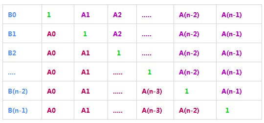

```java
/**
 * 构建乘积数组
 * 给定一个数组 A[0,1,…,n-1]，请构建一个数组 B[0,1,…,n-1]，其中 B 中的元素 B[i]=A[0]×A[1]×…×A[i-1]×A[i+1]×…×A[n-1]。不能使用除法。
 * 解释：B[i]是不包含A[i]的所有元素的乘积
 * 输入: [1,2,3,4,5]
 * 输出: [120,60,40,30,24]
 */
public class ConstuctArray_66 {
    /**
     * B[i]的值可以看作图中的矩阵中每行的乘积。
     * 下三角用连乘可以很容求得，上三角，从下向上也是连乘。
     * 先算下三角中的连乘，即我们先算出B[i]中的一部分，然后倒过来按上三角中的分布规律，把另一部分也乘进去。
     */
    public int[] multiply(int[] a) {
        if (0 == a.length) {
            return new int[0];
        }
        int length = a.length;
        int[] b = new int[length];
        b[0] = 1;
        for (int i = 1; i < length; i++) {
            b[i] = b[i - 1] * a[i - 1];
        }
        int temp = 1;
        for (int j = length - 2; j >= 0; j--) {
            temp *= a[j + 1];
            b[j] *= temp;
        }
        return b;
    }
}
```

# 3. 字符串

## 3.1 替换空格

[替换空格5](https://github.com/haojunsheng/AlgorithmNotes/blob/master/src/com/code/offer/string/ReplaceSpaces_05.java)

**从前向后处理复杂，则我们可以考虑从后向前处理。**这个思想是很重要的，我们需要进行掌握。

```java
// 将字符串中的空格替换为%20
// 在合并两个数组，包括字符串时，如果从前到后进行处理每个数字,需要重复移动数字时(有几个空格，需要重复移动多次)
// 可以考虑从后向前进行处理，这样可以减少移动的次数，从而提高效率
public static String replaceSpace(StringBuffer str) {
        if (str == null || str.length() == 0) {
            return null;
        }
        int len = str.length();
        int count = 0;
        //统计空格的个数
        for (int i = 0; i < len; ++i) {
            if (str.charAt(i) == ' ') {
                count++;
            }
        }
        int newLen = len + count * 2;
        int p1 = len - 1;
        int p2 = newLen - 1;
        // stringBuffer初始化为0
        StringBuffer stringBuffer = new StringBuffer(newLen);
        for (int k = 0; k < newLen; k++) {
            stringBuffer.append('0');
        }
        while (p1 >= 0 && p2 >= p1) {
            // p1遇到空格，p2一次替换为02%
            if (str.charAt(p1) == ' ') {
                stringBuffer.setCharAt(p2--, '0');
                stringBuffer.setCharAt(p2--, '2');
                stringBuffer.setCharAt(p2--, '%');
                // 否则，把p1的值赋值给p2
            } else {
                stringBuffer.setCharAt(p2--, str.charAt(p1));
            }
            p1--;
        }
        return stringBuffer.toString();
    }
```

## 3.2 正则表达式匹配@@@

[正则表达式匹配19](https://github.com/haojunsheng/AlgorithmNotes/blob/master/src/com/code/offer/string/RegularMatch_19.java)

```java
/**
 * 正则表达式匹配
 * 给你一个字符串 str 和一个字符规律 pattern，请你来实现一个支持 '.' 和 '*' 的正则表达式匹配。
 * '.' 匹配任意单个字符,'*' 匹配零个或多个前面的那一个元素，所谓匹配，是要涵盖 整个 字符串 s的，而不是部分字符串。
 * 说明:
 * str 可能为空，且只包含从 a-z 的小写字母。
 * pattern 可能为空，且只包含从 a-z 的小写字母，以及字符 . 和 *。
 * 1. 输入:
 * str = "aa"
 * pattern = "a"
 * 输出: false
 * 解释: "a" 无法匹配 "aa" 整个字符串。
 * 2. 输入:
 * str = "aa"
 * pattern = "a*"
 * 输出: true
 * 解释: 因为 '*' 代表可以匹配零个或多个前面的那一个元素, 在这里前面的元素就是 'a'。因此，字符串 "aa" 可被视为 'a' 重复了一次。
 * 3. 输入:
 * str = "ab"
 * pattern = ".*"
 * 输出: true
 * 解释: ".*" 表示可匹配零个或多个（'*'）任意字符（'.'）。
 */
public class RegularMatch_19 {
    /**
     * 动态规划
     * dp[i][j] 表示 str 的前 i 个是否能被 pattern 的前 j 个匹配
     * 首先想的时候从已经求出了 dp[i-1][j-1] 入手，再加上已知 str[i]、pattern[j]，要想的问题就是怎么去求 dp[i][j]。
     * 已知 dp[i-1][j-1] 意思就是前面子串都匹配上了，不知道新的一位的情况。
     * 那就分情况考虑，所以对于新的一位 pattern[j] str[i] 的值不同，要分情况讨论：
     * 考虑最简单的 pattern[j] == str[i] : dp[i][j] = dp[i-1][j-1]
     * 然后从 pattern[j] 可能的情况来考虑，让 pattern[j]=各种能等于的东西。
     * pattern[j] == "." : dp[i][j] = dp[i-1][j-1]
     * pattern[j] ==" * ":
     */
    public boolean isMatch(String str, String pattern) {
        if (str == null || pattern == null) {
            return false;
        }
        boolean[][] dp = new boolean[str.length() + 1][pattern.length() + 1];
        dp[0][0] = true;
        //dp[i][j] 表示 str 的前 i 个是否能被 pattern 的前 j 个匹配
        for (int i = 0; i < pattern.length(); i++) {
            if (pattern.charAt(i) == '*' && dp[0][i - 1]) {
                dp[0][i + 1] = true;
            }
        }
        for (int i = 0; i < str.length(); i++) {
            for (int j = 0; j < pattern.length(); j++) {
                if (pattern.charAt(j) == '.' || pattern.charAt(j) == str.charAt(i)) {
                    dp[i + 1][j + 1] = dp[i][j];
                }
                if (pattern.charAt(j) == '*') {
                    //如果前一个元素不匹配 且不为任意元素
                    if (pattern.charAt(j - 1) != str.charAt(i) && pattern.charAt(j - 1) != '.') {
                        dp[i + 1][j + 1] = dp[i + 1][j - 1];
                    } else {
                        /*
                        dp[i][j] = dp[i-1][j] // 多个字符匹配的情况
                        or dp[i][j] = dp[i][j-1] // 单个字符匹配的情况
                        or dp[i][j] = dp[i][j-2] // 没有匹配的情况
                         */
                        dp[i + 1][j + 1] = (dp[i + 1][j] || dp[i][j + 1] || dp[i + 1][j - 1]);
                    }
                }
            }
        }
        return dp[str.length()][pattern.length()];
    }

    /**
     * 回溯法
     */
    public boolean match(String str, String pattern) {
        //如果正则串p为空字符串s也为空这匹配成功，如果正则串p为空但是s不是空则说明匹配失败
        if (pattern.isEmpty()) {
            return str.isEmpty();
        }
        // 判断s和p的首字符是否匹配，注意要先判断s不为空,即正常和.的情况
        boolean headMatched = !str.isEmpty() && (str.charAt(0) == pattern.charAt(0) || pattern.charAt(0) == '.');
        // 如果p的第一个元素的下一个元素是*,匹配0个或者多个
        // 匹配0个，例如s：bc、pattern：a*bc，我们就保持s不变，减掉p的"a*"，调用isMatch(str:bc,pattern:bc)。
        // 匹配多个，例如s：aabb、pattern：a*bb，就保持p不变，减掉s的首元素，调用isMatch(str:abb,pattern:a*bb)。
        if (pattern.length() >= 2 && pattern.charAt(1) == '*') {
            return isMatch(str, pattern.substring(2)) ||
                    (headMatched && isMatch(str.substring(1), pattern));
            // 如果s和p的首字符相等
        } else if (headMatched) {
            return isMatch(str.substring(1), pattern.substring(1));
        } else {
            return false;
        }
    }
}
```

## 3.3 表示数值的字符串

[表示数值的字符串20](https://github.com/haojunsheng/AlgorithmNotes/blob/master/src/com/code/offer/string/NumericStrings_20.java)

这个需要总结出规律，数值的规律：`A[.[B]][e|EC]`,然后A和C的特点是整数，允许有正负号，B不能有正负号。然后从前向后扫描即可。

```java
/**
 * 题目描述：
 * 请实现一个函数用来判断字符串是否表示数值（包括整数和小数）。
 * 例如，字符串”+100”,”5e2”,”-123”,”3.1416”和”-1E-16”都表示数值。
 * 但是”12e”,”1a3.14”,”1.2.3”,”+-5”和”12e+4.3”都不是。
 * <p>
 * 分析：
 * 1、在数值之前可能有一个表示正负的’-‘或者’+’。
 * 接下来是若干个0到9的数位表示数值的整数部分（在某些小数里可能没有数值的整数部分）。
 * 如果数值是一个小数，那么在小数点后面可能会有若干个0到9的数位表示数值的小数部分。
 * 如果数值用科学计数法表示，接下来是一个’e’或者‘E’，以及紧跟着的一个整数（可以有正负号）表示指数。
 * 2、判断一个字符串是否符合上述模式时，首先看第一个字符是不是正负号。
 * 如果是，在字符串上移动一个字符，继续扫描剩余的字符串中0到9的数位。
 * 如果是一个小数，则将遇到小数点。
 * 另外，如果是用科学计数法表示的数值，在整数或者小数的后面还有可能遇到’e’或者’E’。
 */
public boolean isNum(char[] str) {
        if (str.length == 0 || str == null) {
            return false;
        }

        //扫描小数点前A
        boolean flag = scanInteger(str);
        //小数点B
        if (index < str.length && str[index] == '.') {
            index++;
            // 原因是因为小数可以没有整数部分
            flag = scanUnsignedInteger(str) || flag;
        }
        
        if (index < str.length && (str[index] == 'e' || str[index] == 'E')) {
            index++;
            //指数部分C
            flag = scanInteger(str) && flag;
        }
        return flag && index == str.length;
    }

    private boolean scanInteger(char[] str) {
        //去除符号位
        if (index < str.length && (str[index] == '+' || str[index] == '-')) {
            index++;
        }
        return scanUnsignedInteger(str);
    }

    private boolean scanUnsignedInteger(char[] str) {
        int start = index;
        while (index < str.length && str[index] >= '0' && str[index] <= '9') {
            index++;
        }
        return start < index;
    }
```

## 3.4 数字序列中某一位的数字@@@

[数字序列中某一位的数字44](https://github.com/haojunsheng/AlgorithmNotes/blob/master/src/com/code/offer/string/DigitAtIndex_44.java)


```java
package com.code.offer.string;

/**
 * 数字序列中某一位的数字，数字以0123456789101112131415…的格式序列化到一个字符序列中。
 * 在这个序列中，第5位（从下标0开始计数）是5，第13位是1，第19位是4，等等。请写一个函数，求任意第n位对应的数字。
 * 输入：n = 3，输出：3
 * 输入：n = 11，输出：0
 */
public class DigitAtIndex_44 {
    /**
     * 对于第 n 位对应的数字，我们令这个数字对应的数为 target，然后分三步进行。
     * 1. 首先找到这个数字对应的数是几位数，用 digits 表示；
     * 2. 然后确定这个对应的数的数值 target；
     * 3. 最后确定返回值是 target 中的哪个数字。
     * 举个栗子：
     * 比如输入的 n 是 365：
     * 经过第一步计算我们可以得到第 365 个数字表示的数是三位数，n=365−9−90×2=176，digtis = 3。这时 n=176 表示目标数字是三位数中的第 176个数字。
     * 我们设目标数字所在的数为 number，计算得到number=100+176/3=158，idx 是目标数字在 number 中的索引，如果 idx = 0，表示目标数字是 number 中的最后一个数字。
     * 根据步骤2，我们可以计算得到 idx = n % digits = 176 % 3 = 2，说明目标数字应该是 number = 158 中的第二个数字，即输出为 5。
     */
    public static int findNthDigit(int n) {
        long base = 9;
        int digits = 1;
        // 1. 首先找到这个数字对应的数是几位数
        while (n > base * digits) {
            n -= base * digits;
            base *= 10;
            digits++;
        }
        // 数字索引，n现在表示digits位数的第n个数字
        // index是目标数字在number中的索引，如果index=0，表示目标数字是number中的最后一个数字。
        int index = n % digits;
        if (index == 0) {
            index = digits;
        }
        // 2. number表示第几个数
        int number = 1;
        for (int i = 1; i < digits; i++) {
            number *= 10;
        }
        number += (index == digits) ? n / digits - 1 : n / digits;
        // 3. number的第几个数
        for (int i = index; i < digits; i++) {
            number /= 10;
        }
        return number % 10;
    }
}
```

## 3.5 第一个只出现一次的字符

[第一个只出现一次的字符50](https://github.com/haojunsheng/AlgorithmNotes/blob/master/src/com/code/offer/string/FirstNotRepeatingChar_50.java)

```java
/**
 * 题目描述：第一个只出现一次的字符
 * 在字符串 s 中找出第一个只出现一次的字符。如果没有，返回一个单空格。
 * s = "abaccdeff"
 * 返回 "b"
 * s = ""
 * 返回 " "
 */
public class FirstNotRepeatingChar_50 {
    // 如果只有英文字符
    public static int FirstNotRepeatingChar(String str) {
        if (str.length() <= 0 || str == null) {
            return -1;
        }
        int[] num = new int[256];
        char[] chars = str.toCharArray();
        for (int i = 0; i < chars.length; ++i) {
            num[chars[i]]++;
        }
        for (int i = 0; i < chars.length; ++i) {
            if (num[chars[i]] == 1) {
                return i;
            }
        }
        return -1;
    }

    public char firstUniqChar(String s) {
        HashMap<Character, Boolean> dic = new HashMap<>();
        char[] sc = s.toCharArray();
        for (char c : sc) {
            dic.put(c, !dic.containsKey(c));
        }
        for (char c : sc) {
            if (dic.get(c)) {
                return c;
            }
        }
        return ' ';
    }

```

相关题目:如果我们要判断多个字符是不是在某个字符串里出现过或者统计多个字符串出现的次数，我们可以基于数组构建一个简单的哈希表，这样可以用很小的空间来换时间。

- 从第一个字符串中删除在第二个字符串中出现的所有字符。比如第一个是"we are students."，第二个是"aeiou",那么结果是"w r stdnts."。思路是：
- 删除字符串中重复出现的字符
- 判断两个单词是不是互为变位词。

[字符流中第一个不重复的字符50](https://github.com/haojunsheng/AlgorithmNotes/blob/master/src/com/code/offer/string/FirstNotRepeatingChar_5002.java)

```java
/**
 * 请实现一个函数用来找出字符流中第一个只出现一次的字符。
 * 例如，当从字符流中只读出前两个字符"go"时，第一个只出现一次的字符是"g"。
 * 当从该字符流中读出前六个字符“google"时，第一个只出现一次的字符是"l"。
 * <p>
 * 输出描述:
 * 如果当前字符流没有存在出现一次的字符，返回#字符。
 */
public class FirstNotRepeatingChar_5002 {
    int[] hashTable = new int[256];
    StringBuffer sb = new StringBuffer();

    //Insert one char from string stream
    public void Insert(char ch) {
        sb.append(ch);
        if (hashTable[ch] == 0) {
            hashTable[ch] = 1;
        } else {
            hashTable[ch]++;
        }
    }

    //return the first appearence once char in current stringstream
    public char FirstAppearingOnce() {
        char[] result = sb.toString().toCharArray();
        for (char ch : result) {
            if (hashTable[ch] == 1) {
                return ch;
            }
        }
        return '#';
    }
}
```

## 3.6 反转字符串

[翻转单词顺序序列58](https://github.com/haojunsheng/AlgorithmNotes/blob/master/src/com/code/offer/string/ReverseWordsInSentence_58.java)

```java
/**
 * 翻转单词顺序列
 * “student. a am I”。后来才意识到，这家伙原来把句子单词的顺序翻转了，正确的句子应该是“I am a student.”
 * <p>
 * 解决思路是二次翻转，即先整体翻转，在对每个单词进行翻转即可得到正确的序列
 */
public class ReverseWordsInSentence_58 {
    public static String ReverseSentence(String str) {
        String strTemp = str.trim();
        if (strTemp.equals("") || str == null) {
            return str;//非法输入
        }
        char[] ch = strTemp.toCharArray();
        Reverse(ch, 0, ch.length - 1);//整体翻转
        int blank = -1;
        for (int i = 0; i < ch.length; ++i) {
            if (ch[i] == ' ') {
                int nextBlank = i;
                Reverse(ch, blank + 1, nextBlank - 1);
                blank = nextBlank;
            }
        }
        //最后一个单词也需要进行翻转
        Reverse(ch, blank + 1, ch.length - 1);
        return new String(ch);
    }

    private static void Reverse(char[] ch, int low, int high) {
        while (low < high) {
            char temp = ch[low];
            ch[low] = ch[high];
            ch[high] = temp;
            low++;
            high--;
        }
    }
```

[左旋转字符串58](https://github.com/haojunsheng/AlgorithmNotes/blob/master/src/com/code/offer/string/LeftRotateString_5802.java)

```java
/**
 * 汇编语言中有一种移位指令叫做循环左移（ROL），现在有个简单的任务，就是用字符串模拟这个指令的运算结果。对于一个给定的字符序列S，请你把其循环左移K位后的序列输出。例如，字符序列S=”abcXYZdef”,要求输出循环左移3位后的结果，即“XYZdefabc”。
 * <p>
 * 思路：三次翻转字符串
 * 前n个翻转，后length-n个翻转，整体在翻转一次即可。
 */
public class LeftRotateString_5802 {
    public String LeftRotateString(String str, int n) {
        if (str == null || str.length() <= 0 || n <= 0 || n >= str.length()) {
            return str;
        }
        char[] ch = str.toCharArray();
        Reverse(ch, 0, n - 1);//前n个字符
        Reverse(ch, n, str.length() - 1);//后length-n个字符
        Reverse(ch, 0, str.length() - 1);//整体翻转
        return new String(ch);
    }

    private void Reverse(char[] ch, int low, int high) {
        while (low < high) {
            char temp = ch[low];
            ch[low] = ch[high];
            ch[high] = temp;
            low++;
            high--;
        }
    }
}
```

## 3.7 字符串转整数

[把字符串转换成整数67](https://github.com/haojunsheng/AlgorithmNotes/blob/master/src/com/code/offer/string/StringToInt_67.java)

```java
/**
 * 请你来实现一个 atoi 函数，使其能将字符串转换成整数。
 * 首先，该函数会根据需要丢弃无用的开头空格字符，直到寻找到第一个非空格的字符为止。接下来的转化规则如下：
 * <p>
 * 如果第一个非空字符为正或者负号时，则将该符号与之后面尽可能多的连续数字字符组合起来，形成一个有符号整数。
 * 假如第一个非空字符是数字，则直接将其与之后连续的数字字符组合起来，形成一个整数。
 * 该字符串在有效的整数部分之后也可能会存在多余的字符，那么这些字符可以被忽略，它们对函数不应该造成影响。
 * 注意：假如该字符串中的第一个非空格字符不是一个有效整数字符、字符串为空或字符串仅包含空白字符时，则你的函数不需要进行转换，即无法进行有效转换。
 * 在任何情况下，若函数不能进行有效的转换时，请返回 0 。
 * 提示：
 * 本题中的空白字符只包括空格字符 ' ' 。
 * 假设我们的环境只能存储 32 位大小的有符号整数，那么其数值范围为 [−2^31,  2^31 − 1]。如果数值超过这个范围，请返回 INT_MAX (231 − 1) 或 INT_MIN (−231) 。
 * <p>
 * 输入: "42"
 * 输出: 42
 * <p>
 * 输入: "   -42"
 * 输出: -42
 * 解释: 第一个非空白字符为 '-', 它是一个负号。
 *      我们尽可能将负号与后面所有连续出现的数字组合起来，最后得到 -42 。
 * <p>
 * 输入: "4193 with words"
 * 输出: 4193
 * 解释: 转换截止于数字 '3' ，因为它的下一个字符不为数字。
 * <p>
 * 输入: "words and 987"
 * 输出: 0
 * 解释: 第一个非空字符是 'w', 但它不是数字或正、负号。
 * 因此无法执行有效的转换。
 * <p>
 * 输入: "-91283472332"
 * 输出: -2147483648
 * 解释: 数字 "-91283472332" 超过 32 位有符号整数范围。
 *      因此返回 INT_MIN (−2^31) 。
 */
public class StringToInt_67 {
    /**
     * 1. 去掉前导空格
     * 2. 再是处理正负号
     * 3. 识别数字，注意越界情况。
     */
    public int myAtoi(String str) {
        char[] chars = str.toCharArray();
        int n = chars.length;
        int idx = 0;
        while (idx < n && chars[idx] == ' ') {
            // 去掉前导空格
            idx++;
        }
        if (idx == n) {
            //去掉前导空格以后到了末尾了
            return 0;
        }
        boolean negative = false;
        if (chars[idx] == '-') {
            //遇到负号
            negative = true;
            idx++;
        } else if (chars[idx] == '+') {
            // 遇到正号
            idx++;
        } else if (!Character.isDigit(chars[idx])) {
            // 其他符号
            return 0;
        }
        int ans = 0;
        while (idx < n && Character.isDigit(chars[idx])) {
            int digit = chars[idx] - '0';
            if (ans > (Integer.MAX_VALUE - digit) / 10) {
                // 本来应该是 ans * 10 + digit > Integer.MAX_VALUE
                // 但是 *10 和 + digit 都有可能越界，所有都移动到右边去就可以了。
                return negative ? Integer.MIN_VALUE : Integer.MAX_VALUE;
            }
            ans = ans * 10 + digit;
            idx++;
        }
        return negative ? -ans : ans;
    }
}
```

# 3 链表

## 3.1 从尾到头打印链表

[从尾到头打印链表6](https://github.com/haojunsheng/AlgorithmNotes/blob/master/src/com/code/offer/linkedList/PrintListInReversedOrder_06.java)

```java
/**
 * 从尾到头打印列表
 * 第一种方法是把链表就地反转，但是这样会修改原来的链表，一般不这样做
 * 第二种：顺序遍历，逆序打印，发现和栈的结构是一样的，所以可以使用栈来实现
 * 第三种：栈的本质就是递归，所以也可以使用递归来实现。
 */
public static void printListReverseByStack(ListNode headNode) {
        // 初始化栈
        Stack<ListNode> stack = new Stack<ListNode>();
        while (headNode != null) {
            stack.add(headNode);
            headNode = headNode.next;
        }
        while (!stack.isEmpty()) {
            System.out.println(stack.pop().value);
        }
    }

    public static void printListReverseByRecursion(ListNode headNode) {
        if (headNode == null) {
            return;
        }
        printListReverseByStack(headNode.next);
        System.out.println(headNode.value);
    }
```

## 3.2 删除链表中的节点

[面试题18：删除链表中的节点](https://github.com/haojunsheng/AlgorithmNotes/blob/master/src/com/code/offer/linkedList/DeleteNodeInList_18.java)
思路：把下一个节点的值保存到该节点，然后删除下一个节点即可，需要考虑只有一个节点和删除尾节点的特殊情况。主要是需要考虑边界情况。

```java
	 /**
		 * 给定单链表的头指针和一个节点指针，定义一个函数在O(1)时间删除该节点。
     * 复制后一个节点的值到当前节点，注意处理只有一个节点和删除尾节点的情况
     */
    public void deleteNode(ListNode head, ListNode toBeDeleted) {
        //参数校验
        if (head == null || toBeDeleted == null) {
            return;
        }

        //链表中只有一个节点，那么待删除的节点既是头结点，又是尾结点
        if (head == toBeDeleted && head.nextNode == null) {
            head = null;
        } else {
            //待删除的节点是尾节点，需要进行遍历
            if (toBeDeleted.nextNode == null) {
                ListNode temp = head;
                while (temp.nextNode != toBeDeleted) {
                    temp = temp.nextNode;
                }
                temp.nextNode = null;
            } else {
                //待删除的节点不是尾节点
                toBeDeleted.nodeValue = toBeDeleted.nextNode.nodeValue;
                toBeDeleted.nextNode = toBeDeleted.nextNode.nextNode;
            }
        }
    }
```

举一反三:[面试题：删除链表中的重复节点](https://github.com/haojunsheng/AlgorithmNotes/blob/master/src/com/code/offer/linkedList/deleteDuplication.java)
思路：需要三个节点，当前节点，要比较节点的前一个节点（防止丢失），最终头结点（因为头部可能被删除）。需要注意：**重复节点的位置**（头部，中间和尾部）。

```java
private ListNode deleteDuplication(ListNode head) {
        if (head == null) {
            return null;
        }
        //保存前一个节点
        ListNode preNode = new ListNode();
        // 最终头结点，因为可能删除头结点
        ListNode lastHead = preNode;
        preNode.nextNode = head;
        // 当前处理节点
        ListNode nowNode = head;
        while (nowNode != null) {
            //删除重复节点
            if (nowNode.nextNode != null && nowNode.nodeValue == nowNode.nextNode.nodeValue) {
                // 相同节点一直删除，更新now
                while (nowNode.nextNode != null && nowNode.nodeValue == nowNode.nextNode.nodeValue) {
                    nowNode = nowNode.nextNode;
                }
                // 更新前一个节点
                preNode.nextNode = nowNode.nextNode;
            } else {
                // 不相等，更新前置节点
                preNode.nextNode = nowNode;
            }
            // 不管相等与否，更新当前节点
            nowNode = nowNode.nextNode;
        }
        return lastHead.nextNode;
    }
```

## 3.3 链表中倒数第k个节点

[面试题22：链表中倒数第k个节点](https://github.com/haojunsheng/AlgorithmNotes/blob/master/src/com/code/offer/linkedList/KthNodeFromEnd_22.java)

当在链表中一个指针不能解决问题的时候，可以尝试使用两个指针来遍历，其中一个指针的速度快点，另外一个指针的速度慢点，或者一个先走，另一个后走。

```java
  /**
     * 题目描述：
     * 输入一个链表，输出该链表中倒数第k个结点。
     * 为了符合大多数人的习惯，本题从1开始计数，即链表的尾结点是倒数第1个结点。
     * 例如一个链表有6个结点，从头结点开始它们的值依次是1，2，3，4，5，6。
     * 这个链表的倒数第3个结点是值为4的结点。
     * 分析:
     * 为了得到第K个结点，很自然的想法是先走到链表的尾端，再从尾端回溯K步。
     * 可是我们从链表结点的定义可以看出本题中的链表是单向链表，单向链表的结点只有从前往后的指针而没有从后往前的指针，因此这种思路行不通。
     * 既然不能从尾节点开始遍历这个链表，我们还是把思路回到头结点上来。
     * 假设整个链表有N个结点，那么倒数第K个结点就是从头结点开始的第n-k+1个结点。
     * 因此我们只能从头结点开始往后走n-k+1步就可以了。如何得到节点数n？
     * 这个不难，只需要从头开始遍历链表，每经过一个结点，计数器加1就行了。
     * 也就是说我们需要遍历链表两次，第一次统计出链表中结点的个数，第二次就能找到倒数第k个结点。
     * 但是当我们把这个思路解释给面试官之后，他会告诉我们他期待的解法只需要遍历链表一次。
     * 为了实现只遍历链表一次就能找到倒数第k个结点，我们可以定义两个指针。
     * 第一个指针从链表的头指针开始遍历向前走k-1。第二个指针保持不动；
     * 从第k步开始，第二个指针也开始从链表的头指针开始遍历。
     * 由于两个指针的距离保持在k-1，当第一个（走在前面的）指针到达链表的尾结点时，第二个指针正好是倒数第k个结点。
     */
private ListNode findKthToTail(ListNode head, int k) {
        if (head == null || k <= 0) {
            return null;
        }

        ListNode temp = head;
        // 第一个走k-1步，同时记得判断k<链表的长度
        for (int i = 1; i < k; i++) {
            if (temp.nextNode == null) {
                return null;
            }
            temp = temp.nextNode;
        }
        while (temp != null) {
            head = head.nextNode;
            temp = temp.nextNode;
        }
        return head;
    }
```

举一反三：求链表的中间节点。我们的思路是：一个指针每次走两步，另一个走一步，快的走到末尾的时候，慢的恰好在中间。

## 3.4 链表中环的入口节点

[面试题23:链表中环的入口节点](https://github.com/haojunsheng/AlgorithmNotes/blob/master/src/com/code/offer/offer/linkedList/EnterNodeInLink_23.java)

```java
/**
 * 题目描述：
 * 如果一个链表中包含环，如何找出环的入口节点？
 * <p>
 * 分析：
 * 可以用两个指针来解决这个问题。先定义两个指针P1和P2指向链表的头结点。
 * 如果链表中环有n个结点，指针P1在链表上向前移动n步，然后两个指针以相同的速度向前移动。
 * 当第二个指针指向环的入口结点时，第一个指针已经围绕着环走了一圈又回到了入口结点。
 * 剩下的问题就是如何得到环中结点的数目。我们可以使用一快一慢的两个指针。
 * 如果两个指针相遇，表明链表中存在环。两个指针相遇的结点一定是在环中。
 * 可以从这个结点出发，一边继续向前移动一边计数，当再次回到这个结点时就可以得到环中结点数了。
 * <p>
 * 思路：
 * 1.判断是否存在环，并找到快慢两个指针相遇的位置
 * 2.根据找到的这个相遇位置，统计环中节点的数目n，先让快指针走n步，然后快慢两个指针一起运动，快慢指针相遇时的节点就是环的入口节点
 */
public ListNode getEnterNode(ListNode head) {
        if (head == null) {
            return null;
        }
        //找到相遇的节点
        ListNode meetNode = meetNode(head);
        if (meetNode == null) {
            return null;
        }
        //寻找环中节点的个数
        int length = 1;
        ListNode temp = meetNode.next;
        while (meetNode != temp) {
            length++;
            temp = temp.next;
        }

        //设置两个指针，其中一个指针先走length步，在同时走，相遇处即入口
        ListNode behind = head;
        ListNode aHead = head;
        while (length > 0) {
            aHead = aHead.next;
            length--;
        }
        while (aHead != behind) {
            aHead = aHead.next;
            behind = behind.next;
        }
        return aHead;
    }

    /**
     * 找到相遇的节点
     *
     * @param head
     * @return
     */
    private ListNode meetNode(ListNode head) {
        ListNode behind = head.next;//在后面的节点
        if (behind == null) {
            return null;//只有一个节点，不存在环
        }
        ListNode aHead = behind.next;//在前面的节点
        while (behind != null && aHead != null) {
            if (aHead == behind) {//相遇
                return aHead;
            }
            behind = behind.next;
            aHead = aHead.next;
            if (aHead != null) {
                aHead = aHead.next;//走两步
            }
        }
        return null;
    }
```

## 3.5 反转链表@@@

[面试题24：反转链表](https://github.com/haojunsheng/AlgorithmNotes/blob/master/src/com/code/offer/linkedList/ReverseList_24.java)

```java
	 /**
     * 定义一个函数，输入一个链表的头结点，反转该链表并输出反转后的链表的头结点。
     * 使用递归的方法
     * reverse(ListNode head)=记录当前节点下一个节点 + 断开 + 递归处理子问题 + 指回来
     */
    public static ListNode reverse(ListNode head) {
        if (head == null || head.next == null) {
            return head;
        }
        ListNode secNode = head.next;
        head.next = null;
        //递归去寻找最后的节点
        ListNode revNode = reverse(secNode);
        secNode.next = head;
        //最后的节点
        return revNode;
    }

// 使用循环的方法
    public ListNode reverseCycle(ListNode head) {
        //判空
        if (head == null || head.next == null) {
            return head;
        }
        //当前结点
        ListNode currentNode = head;
        //翻转后的头结点
        ListNode revHead = null;
        while (currentNode != null) {
            //防止丢失，存放下一个结点
            ListNode nextNode = currentNode.next;
            currentNode.next = revHead;
            revHead = currentNode;
            currentNode = nextNode;
        }
        return revHead;
    }
```

下面实现反转链表的前N个节点：

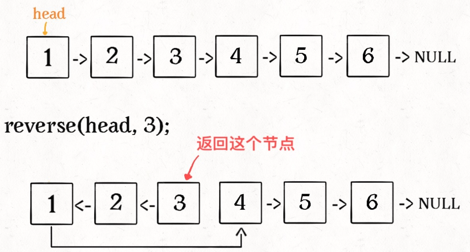

```java
static ListNode successor = null; // 后驱节点
	 /**
     * 反转前n个节点
     *
     * @param head
     * @param n
     * @return
     */
public static ListNode reverseN(ListNode head, int n) {
  if (n == 1) {
    successor = head.next;
    return head;
  }
  ListNode secNode = head.next;
  head.next = successor;
  // 以 head.next 为起点，需要反转前 n - 1 个节点
  ListNode revNode = reverseN(secNode, n - 1);
  secNode.next = head;
  //最后的节点
  return revNode;
}
```

**反转链表的一部分**

```java
   /**
     * 反转链表的一部分
     * @param head
     * @param m
     * @param n
     * @return
     */
    ListNode reverseBetween(ListNode head, int m, int n) {
        // base case,如果 m == 1, 相当于反转链表开头的 n 个元素
        if (m == 1) {
            return reverseN(head, n);
        }
        // 前进到反转的起点触发 base case
        // 如果 m != 1 怎么办?如果我们把 head 的索引视为 1，那么我们是想从第 m 个元素开始反转对吧;
        // 如果把 head.next 的索引视为 1 呢?那么相对于 head.next ，反转的区间应该是从第 m - 1 个元素开始的;
        // 那么对于head.next.next呢
        head.next = reverseBetween(head.next, m - 1, n - 1);
        return head;
    }
```

## 3.6 合并两个排序的链表

[面试题25：合并两个排序链表](https://github.com/haojunsheng/AlgorithmNotes/blob/master/src/com/code/offer/linkedList/MergeList_25.java)

```java
// 输入两个递增排序的链表，合并这两个链表并使新链表中的结点仍然是按照递增排序的。
private ListNode merge(ListNode list1, ListNode list2) {
        if (list1 == null) {
            return list2;
        } else if (list2 == null) {
            return list1;
        }

        ListNode merge = null;
        if (list1.value < list2.value) {
            merge = list1;
            merge.next = merge(list1.next, list2);
        } else {
            merge = list2;
            merge.next = merge(list1, list2.next);
        }
        return merge;
    }
```

## 3.7 复杂链表的复制(字节考过)

[面试题35：复杂链表的复制](https://github.com/haojunsheng/AlgorithmNotes/blob/master/src/com/code/offer/linkedList/CopyList_35.java)
考察把复杂问题分解的能力，用到了空间换时间的思想，能够在O(1)的时间复杂度找到下一个随机节点。

```java
/**
 * 题目：
 * 复杂链表的复制
 * 输入一个复杂链表（每个节点中有节点值，以及两个指针，一个指向下一个节点，另一个特殊指针指向任意一个节点），
 * 返回结果为复制后复杂链表的head。（注意，输出结果中请不要返回参数中的节点引用，否则判题程序会直接返回空）
 * 解题思路：
 * 1、遍历链表，复制每个结点，如复制结点A得到A1，将结点A1插到结点A后面；
 * 2、重新遍历链表，复制老结点的随机指针给新结点，如A1.random = A.random.next;
 * 3、拆分链表，将链表拆分为原链表和复制后的链表
 * <p>
 * 这样做的好处是我们可以避免用O(n^2)的时间复杂度来找复制链表的兄弟节点
 */
public static RandomListNode Clone(RandomListNode pHead) {
        if (pHead == null) {
            return null;
        }
        //在原链表上创建复制后的链表
        cloneNodes(pHead);
        //连接复制节点的兄弟节点
        connectSibling(pHead);
        //将原始节点和复制节点分开
        return reconnectNodes(pHead);
    }

    private static RandomListNode reconnectNodes(RandomListNode pHead) {
        RandomListNode clonedHead = pHead.next;
        RandomListNode currentNode = pHead;
        while (currentNode != null) {
            RandomListNode cloneNode = currentNode.next;
            currentNode.next = cloneNode.next;
            cloneNode.next = cloneNode.next == null ? null : cloneNode.next.next;
            currentNode = currentNode.next;
        }
        return clonedHead;
    }

    private static void connectSibling(RandomListNode pHead) {
        RandomListNode currentNode = pHead;
        while (currentNode != null) {
            RandomListNode cloneNode = currentNode.next;
            if (currentNode.random != null) {
                cloneNode.random = currentNode.random.next;
            }
            currentNode = cloneNode.next;
        }
    }

    private static void cloneNodes(RandomListNode pHead) {
        RandomListNode currentNode = pHead;
        while (currentNode != null) {
            RandomListNode cloneNode = new RandomListNode(currentNode.label);
            cloneNode.next = currentNode.next;
            currentNode.next = cloneNode;
            currentNode = cloneNode.next;
        }
    }
```

## 3.8 二叉搜索树与双向链表@@@

[面试题36：二叉搜索树与双向链表](https://github.com/haojunsheng/AlgorithmNotes/blob/master/src/com/code/offer/tree/BinaryTreeConvert_36.java)


```java
	 /**
	   * 将二叉搜索树转换成排序的双向链表
     * 我们需要记录上一个节点，因为需要给右节点赋值，还需要记录最终的根节点，这个节点一旦找到就不变了
     */
    TreeNode pre = null;
    TreeNode lastLeft = null;
    public TreeNode Convert(TreeNode pRootOfTree) {
        if (pRootOfTree == null) return null;
        dfs(pRootOfTree);
        return lastLeft;
    }
    // 中序遍历
    public void dfs(TreeNode pRootOfTree) {
        if (pRootOfTree == null) {
            return;
        }
        dfs(pRootOfTree.left);
        // 当pre为空时： 代表正在访问链表头节点，记为 lastLeft。
        if (pre == null) {
            lastLeft = pRootOfTree;
        // 当 pre 不为空时，修改双向节点引用，即pre.right=pRootOfTree ，pRootOfTree.left=pre
        } else {
            pre.right = pRootOfTree;
            pRootOfTree.left = pre;
        }
        // 更新pre
        pre = pRootOfTree;
        dfs(pRootOfTree.right);
    }
```

## 3.9 两个链表的第一个公共节点

[面试题52：两个链表的第一个公共节点](https://github.com/haojunsheng/AlgorithmNotes/blob/master/src/com/code/offer/linkedList/FirstCommonNodesInLists_52.java)

```java
/**
 * 找出2个链表的长度，然后让长的先走两个链表的长度差，然后再一起走
 * （因为2个链表用公共的尾部）
 * 最好的思路是一个指针先走，另一个指针后走。
 */
public ListNode FindFirstCommonNode(ListNode pHead1, ListNode pHead2) {
        if (pHead1 == null || pHead2 == null) {
            return null;
        }
        int length1 = 0, length2 = 0;
        ListNode temp1 = pHead1;
        while (temp1 != null) {
            ++length1;
            temp1 = temp1.next;
        }
        ListNode temp2 = pHead2;
        while (temp2 != null) {
            ++length2;
            temp2 = temp2.next;
        }
        int length = length1 - length2;
        ;
        if (length < 0) {
            length = -length;
            while (length > 0) {
                pHead2 = pHead2.next;
                length--;
            }
        }
        while (length > 0) {
            pHead1 = pHead1.next;
            length--;
        }
        while (pHead1 != null && pHead1.val != pHead2.val) {
            pHead1 = pHead1.next;
            pHead2 = pHead2.next;
        }
        return pHead1;
    }
```

## 3.10 圆圈中最后剩余的数字@@@

[面试题62：圆圈中最后剩余的数字](https://github.com/haojunsheng/AlgorithmNotes/blob/master/src/com/code/offer/linkedList/LastRemaining_62.java)

本质上是约瑟夫环问题：

```java
/**
 * 圆圈中最后剩下的数字,著名的约瑟夫环问题
 * 0,1,n-1这n个数字排成一个圆圈，从数字0开始，每次从这个圆圈里删除第m个数字。求出这个圆圈里剩下的最后一个数字。
 * 例如，0、1、2、3、4这5个数字组成一个圆圈，从数字0开始每次删除第3个数字，则删除的前4个数字依次是2、0、4、1，因此最后剩下的数字是3。
 * <p>
 * 输入: n = 5, m = 3
 * 输出: 3
 * 输入: n = 10, m = 17
 * 输出: 2
 */
public class LastRemaining_62 {
    // 使用LinkedList来模拟，时间复杂度O(n^2)
    public int LastRemaining_Solution(int n, int m) {
        LinkedList<Integer> linkList = new LinkedList<Integer>();
        for (int i = 0; i < n; ++i) {
            linkList.add(i);
        }
        int bt = 0;
        while (linkList.size() > 1) {
            bt = (bt + m - 1) % linkList.size();
            linkList.remove(bt);
        }
        return linkList.size() == 1 ? linkList.get(0) : -1;
    }

    /**
     * 数学公式
     * 第一轮是 [0, 1, 2, 3, 4] ，所以是 [0, 1, 2, 3, 4] 这个数组的多个复制。这一轮 2 删除了。
     * 第二轮开始时，从 3 开始，所以是 [3, 4, 0, 1] 这个数组的多个复制。这一轮 0 删除了。
     * 第三轮开始时，从 1 开始，所以是 [1, 3, 4] 这个数组的多个复制。这一轮 4 删除了。
     * 第四轮开始时，还是从 1 开始，所以是 [1, 3] 这个数组的多个复制。这一轮 1 删除了。
     * 最后剩下的数字是 3。
     * 图中的绿色的线指的是新的一轮的开头是怎么指定的，每次都是固定地向前移位 m 个位置。
     * 然后我们从最后剩下的 3 倒着看，我们可以反向推出这个数字在之前每个轮次的位置。
     * 最后剩下的 3 的下标是 0。
     * 第四轮反推，补上 m 个位置，然后模上当时的数组大小 2，位置是(0 + 3) % 2 = 1。
     * 第三轮反推，补上 m 个位置，然后模上当时的数组大小 3，位置是(1 + 3) % 3 = 1。
     * 第二轮反推，补上 m 个位置，然后模上当时的数组大小 4，位置是(1 + 3) % 4 = 0。
     * 第一轮反推，补上 m 个位置，然后模上当时的数组大小 5，位置是(0 + 3) % 5 = 3。
     * 所以最终剩下的数字的下标就是3。因为数组是从0开始的，所以最终的答案就是3。
     * 总结一下反推的过程，就是 (当前index + m) % 上一轮剩余数字的个数。
     */
    public int lastRemaining(int n, int m) {
        int ans = 0;
        // 最后一轮剩下2个人，所以从2开始反推
        for (int i = 2; i <= n; i++) {
            ans = (ans + m) % i;
        }
        return ans;
    }
}
```

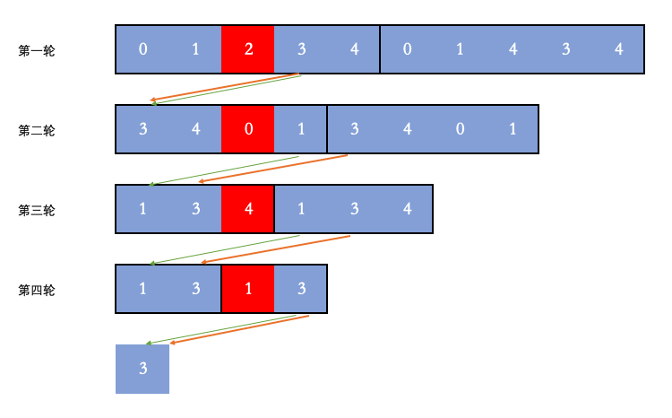

# 4. 二叉树&递归

**递归算法的时间复杂度怎么计算?子问题个数乘以解决一个子问题需要的时间。**


## 4.1 二叉树迭代@@@

[二叉树遍历的迭代解法](https://blog.csdn.net/weixin_42322309/article/details/104177275)：

```java
// 前序
// 首先我们想要打印根节点的数据，此时Stack里面的内容为空，所以我们优先将头结点加入Stack，然后打印。
// 之后我们应该先打印左子树，然后右子树。所以先加入Stack的就是右子树，然后左子树。
public void preOrderIteration(TreeNode head) {
	if (head == null) {
		return;
	}
	Stack<TreeNode> stack = new Stack<>();
	stack.push(head);
	while (!stack.isEmpty()) {
		TreeNode node = stack.pop();
		System.out.print(node.value + " ");
		if (node.right != null) {
			stack.push(node.right);
		}
		if (node.left != null) {
			stack.push(node.left);
		}
	}
}
```

```java
// 中序
public void inOrderIteration(TreeNode head) {
	if (head == null) {
		return;
	}
	TreeNode cur = head;
	Stack<TreeNode> stack = new Stack<>();
	while (!stack.isEmpty() || cur != null) {
		while (cur != null) {
			stack.push(cur);
			cur = cur.left;
		}
		TreeNode node = stack.pop();
		System.out.print(node.value + " ");
		if (node.right != null) {
			cur = node.right;
		}
	}
}
```

```java
// 后序
// 前序遍历的过程 是 中左右。
// 将其转化成 中右左。也就是压栈的过程中优先压入左子树，在压入右子树。
// 然后将这个结果返回来，这里是利用栈的先进后出倒序打印。
public void postOrderIteration(TreeNode head) {
		if (head == null) {
			return;
		}
		Stack<TreeNode> stack1 = new Stack<>();
		Stack<TreeNode> stack2 = new Stack<>();
		stack1.push(head);
		while (!stack1.isEmpty()) {
			TreeNode node = stack1.pop();
			stack2.push(node);
			if (node.left != null) {
				stack1.push(node.left);
			}
			if (node.right != null) {
				stack1.push(node.right);
			}
		}
		while (!stack2.isEmpty()) {
			System.out.print(stack2.pop().value + " ");
		}
	}
```

## 4.2 二叉树遍历类

### 4.2.1 重建二叉树@@@

[重建二叉树7](https://github.com/haojunsheng/AlgorithmNotes/blob/master/src/com/code/offer/tree/ConstructBinaryTree_07.java)

```java
// 输入某二叉树的前序遍历和中序遍历的结果，请重新构造出该二叉树。假设输入的前序遍历和中序遍历的结果中不包含重复的数字。例如输入的前序遍历序列为｛1，2，4，7，3，5，6，8｝和中序遍历为{4,7,2,1,5,3,6,8},则重建出二叉树并输出它的头结点。
// 先找到二叉树的根节点，基于根节点把二叉树的遍历分为左右子树，然后递归的处理左右子树
public static TreeNode reConstructBinaryTree(int[] pre, int[] in) {
        TreeNode root = reConstructBinaryTree(pre, 0, pre.length - 1, in, 0, in.length - 1);
        return root;
    }

    //前序遍历{1,2,4,7,3,5,6,8}和中序遍历序列{4,7,2,1,5,3,8,6}
    private static TreeNode reConstructBinaryTree(int[] pre, int startPre, int endPre, int[] in, int startIn, int endIn) {
        if (startPre > endPre || startIn > endIn) {
            return null;
        }
        //根节点
        TreeNode root = new TreeNode(pre[startPre]);
        // 在中序中找根节点，方便划分左右子树
        for (int i = startIn; i <= endIn; i++) {
            if (in[i] == pre[startPre]) {
                // 重建左子树, 左子树的先序是startPre+1,startPre + i - startIn（循环的次数）,中序是startIn,i-1
                root.left = reConstructBinaryTree(pre, startPre + 1, startPre + i - startIn, in, startIn, i - 1);
                // 重建右子树, 右子树的先序是startPre + i - startIn + 1(左子树endPre+1),endPre,i+1(左子树endIn+2),endIn
                root.right = reConstructBinaryTree(pre, startPre + i - startIn + 1, endPre, in, i + 1, endIn);
            }
        }
        return root;
    }
```

### 4.2.2 二叉搜索树的后序遍历序列

[面试题33：二叉搜索树的后序遍历](https://github.com/haojunsheng/AlgorithmNotes/blob/master/src/com/code/offer/tree/SquenceOfBST_33.java)

```java
	 /**
     * 输入一个整数数组，判断该数组是不是某二叉搜索树的后序遍历的结果。如果是返回true，否则返回false。假设输入的数组的任意两个数字互不相同。
     * 后序序列最后一个值为root；二叉搜索树左子树值都比root小，右子树值都比root大。
     * 1、确定root；
 		 * 2、遍历序列（除去root结点），找到第一个大于root的位置，则该位置左边为左子树，右边为右子树；
 		 * 3、遍历右子树，若发现有小于root的值，则直接返回false；
 		 * 4、分别判断左子树和右子树是否仍是二叉搜索树（即递归步骤1、2、3）。
     */
	public static boolean VerifySquenceOfBST(int[] sequence) {
        if (sequence.length == 0) {
            return false;
        }
        if (sequence.length == 1) {
            return true;
        }
        return judge(sequence, 0, sequence.length - 1);
    }

    private static boolean judge(int[] sequence, int start, int end) {
        if (start >= end) {
            return true;
        }
        //第一个大于根节点的元素作为右子树
        int index = start;
        while (sequence[index] < sequence[end]) {
            index++;
        }
        // 判断右子树是不是全部大于根节点
        // 及时进行剪支
        for (int j = index; j < end; ++j) {
            if (sequence[j] < sequence[end]) {
                return false;
            }
        }
        // 递归处理左右子树
        return judge(sequence, start, index - 1) && judge(sequence, index, end - 1);
    }
```

### 4.2.3 树的子结构

[面试题26：树的子结构](https://github.com/haojunsheng/AlgorithmNotes/blob/master/src/com/code/offer/tree/IsSubTree_26.java) 

```java
	 /**
     * 输入两棵二叉树A和B，判断B是不是A的子结构。
 		 * 分析：二叉树的深度优先遍历,要查找树A中是否存在和树B结构一样的子树，
 		 * 思路：第一步：先在树A中查找与根结点的值一样的结点，这实际就是树的先序遍历，
		 * 当树A和树B为空时，定义相应的输出。如果树A某一结点的值和树B头结点的值相同，则调用doesTree1HaveTree2，做第二步判断。
		 * 第二步是判断树A中以R为根结点的子树是不是和树B具有相同的结构，
 		 * 使用递归的方法考虑：如果结点R和树B的根结点不相同则返回false,如果相同，则递归判断它们的左右结点的值是不是相同。
 		 * 递归终止条件是我们到达树A或者树B的叶结点。
     * 两个先序遍历
     */
    public boolean HasSubtree(TreeNode root1, TreeNode root2) {
        boolean result = false;
        if (root1 == null || root2 == null) {
            return result;
        }
        //根节点相同，去寻找子结构是否相同
        if (root1.val == root2.val) {
            result = isTree1HasTree2(root1, root2);
        }
        if (result == false) {
            result = HasSubtree(root1.left, root2) || HasSubtree(root1.right, root2);
        }
        return result;
    }
     // 同样是递归判断，注意当节点的值是double类型时，不能直接判断相等，要计算差值小于0.000001
    private boolean isTree1HasTree2(TreeNode root1, TreeNode root2) {
        // 子树已判断完毕
        if (root2 == null) {
            return true;
        }
        // 原树遍历完，或者根节点不等
        if (root1 == null || root1.val != root2.val) {
            return false;
        }
        // 递归判断左右子树
        return isTree1HasTree2(root1.left, root2.left) && isTree1HasTree2(root1.right, root2.right);
    }
```

### 4.2.4 二叉树的镜像

 [面试题27：二叉树的镜像](https://github.com/haojunsheng/AlgorithmNotes/blob/master/src/com/code/offer/tree/MirrorTree_27.java)

```java
// 给定一个二叉树，将其变换为源二叉树的镜像。
public void Mirror(TreeNode root) {
        if (root == null) {
            return;
        }
        if (root.left == null && root.right == null) {
            return;
        }
        TreeNode temp = root.left;
        root.left = root.right;
        root.right = temp;
        Mirror(root.left);
        Mirror(root.right);
    }
```

### 4.2.4 对称的二叉树

[面试题28：对称的二叉树](https://github.com/haojunsheng/AlgorithmNotes/blob/master/src/com/code/offer/tree/SymmetricalBinaryTree_28.java)

```java
// 请实现一个函数，用来判断一颗二叉树是不是对称的。
// 如果一个二叉树和它的镜像是一样的，那么它是对称的。
public boolean isSymmetrical(TreeNode root) {
        if (root == null) {
            return true;
        }
        if (root.left == null && root.right == null) {
            return true;
        }
        return isSymmetrical(root, root);
    }

    public boolean isSymmetrical(TreeNode root1, TreeNode root2) {
        if (root1 == null && root2 == null) {
            return true;
        }
        if (root1 == null || root2 == null) {
            return false;
        }
        if (root1.val != root2.val) {
            return false;
        }
        return isSymmetrical(root1.left, root2.right) && isSymmetrical(root1.right, root2.left);
    }

/**
     * 时间复杂度：O(n)，因为我们遍历整个输入树一次，所以总的运行时间为 O(n)，其中 n是树中结点的总数。
     * 空间复杂度：搜索队列需要额外的空间。在最糟糕情况下，我们不得不向队列中插入O(n)个结点。因此，空间复杂度为O(n)。
     */
    public boolean isSymmetric(TreeNode root) {
        Queue<TreeNode> q = new LinkedList<>();
        q.add(root);
        q.add(root);
        while (!q.isEmpty()) {
            TreeNode t1 = q.poll();
            TreeNode t2 = q.poll();
            if (t1 == null && t2 == null) {
                continue;
            }
            if (t1 == null || t2 == null) {
                return false;
            }
            if (t1.val != t2.val) {
                return false;
            }
            q.add(t1.left);
            q.add(t2.right);
            q.add(t1.right);
            q.add(t2.left);
        }
        return true;
    }
```

### 4.2.5 二叉树中和为某值的路径@@@

[面试题34：二叉树中和为某值的路径](https://github.com/haojunsheng/AlgorithmNotes/blob/master/src/com/code/offer/tree/PathInTree_34.java)

考察了二叉树的前序遍历。

```java
/**
* 题目描述：
 * 输入一颗二叉树和一个整数，打印出二叉树中节点值的和为输入整数的所有路径。
 * 路径定义为从树的根节点开始往下一直到叶节点所经过的节点形成一条路径。
 * 回溯算法
 * 分析：
 * 对于树的遍历一般就是深度遍历和广度遍历下四种中的一种，
 * 从根节点往下找到叶节点形成一条路径，若是和为给定的值这个路径便是需要找的路径，从根节点到叶节点边访问边相加判断可以采用先序遍历。
 * （1）若根节点的值大于给定的值或者根节点为空，则清空路径；
 * （1）若根节点的值等于给定的值，需要判断当前节点是否为叶子节点，若为叶子节点，则是需要找的一条路径，若不是，将保存的节点全部清空。
 * （2）若根节点的和小于给定的值，则分别去访问其左右子树。
 */
		private ArrayList<ArrayList<Integer>> lists = new ArrayList<ArrayList<Integer>>();
    private ArrayList<Integer> path = new ArrayList<Integer>();

    public ArrayList<ArrayList<Integer>> FindPath(TreeNode root, int target) {
        if (root == null) {
            return lists;
        }
        path.add(root.val);
        target -= root.val;
        // 合法路径
        if (root.left == null && root.right == null && target == 0) {
            lists.add(new ArrayList<Integer>(path));
        }
        if (root.left != null) {
            FindPath(root.left, target);
        }
        if (root.right != null) {
            FindPath(root.right, target);
        }
        //无论当前路径是否加出了target，必须去掉最后一个，然后返回父节点，去查找另一条路径，最终的path肯定为null
        path.remove(path.size() - 1);
        return lists;
    }
```

## 4.3 二叉树的下一个节点@@

[面试题8:二叉树的下一个节点](https://github.com/haojunsheng/AlgorithmNotes/blob/master/src/com/code/offer/tree/NextNodeInBinaryTrees_08.java)

```java
/**
 * 给定一棵二叉树和其中的一个结点，如何找出中序遍历顺序的下一个结点？ 
 * 树中的结点除了有两个分别指向左右子结点的指针以外，还有一个指向父结点的指针。
 * 仔细观察，可以把中序下一结点归为几种类型：
 * 有右子树，下一结点是右子树中的最左结点，例如 B，下一结点是 H
 * 无右子树，且结点是该结点父结点的左子树，则下一结点是该结点的父结点，例如 H，下一结点是 E
 * 无右子树，且结点是该结点父结点的右子树，则我们一直沿着父结点追朔，直到找到某个结点是其父结点的左子树，
 * 如果存在这样的结点，那么这个结点的父结点就是我们要找的下一结点。
 */
public TreeLinkNode getNextNode(TreeLinkNode pNode) {
        if (pNode == null) {
            return null;
        }
        if (pNode.right != null) {//如果有右子树，则找右子树的最左节点
            pNode = pNode.right;
            while (pNode.left != null) {
                pNode = pNode.left;
            }
            return pNode;
        } else {
            while (pNode.next != null) {//没右子树，则找第一个当前节点是父节点左孩子的节点
                if (pNode.next.left == pNode) {
                    return pNode.next;
                }
                pNode = pNode.next;
            }
        }
        return null;//退到了根节点仍没找到，则返回null
    }
```

## 4.4 从上向下打印二叉树

[从上向下打印二叉树不分行](https://github.com/haojunsheng/AlgorithmNotes/blob/master/src/com/code/offer/tree/PrintTreeFromTopToBottom_3201.java)

```java
// 从上往下打印二叉树的每个节点，同一层的节点按照从左到右的顺序打印。
public static ArrayList<Integer> printFromTopToBottom(TreeNode head) {
        if (head == null) {
            return null;
        }
        //广度优先搜索，队列保存
        Queue<TreeNode> queue = new LinkedList<TreeNode>();
        queue.add(head);
        ArrayList<Integer> arrayList = new ArrayList<Integer>();
        while (!queue.isEmpty()) {
            TreeNode tempNode = queue.poll();
            arrayList.add(tempNode.val);
            if (tempNode.left != null) {
                queue.add(tempNode.left);
            }
            if (tempNode.right != null) {
                queue.add(tempNode.right);
            }
        }
        return arrayList;
    }
```

[分行](https://github.com/haojunsheng/AlgorithmNotes/blob/master/src/com/code/offer/tree/PrintTreeFromTopToBottom_3202.java)

```java
public static void printFromTopToBottom(TreeNode head) {
        ArrayList<ArrayList<Integer>> lists = new ArrayList<ArrayList<Integer>>();
        if (head == null) {
            return;
        }
        //广度优先搜索，队列保存
        Queue<TreeNode> queue = new LinkedList<TreeNode>();
        queue.add(head);
        //下一层需要打印的节点数
        int nextLevel = 0;
        //这一层还需要打印的节点数
        int toBePrint = 1;
        while (!queue.isEmpty()) {
            TreeNode tempNode = queue.poll();
            System.out.print(tempNode.val + " ");
            if (tempNode.left != null) {
                queue.add(tempNode.left);
                nextLevel++;
            }
            if (tempNode.right != null) {
                queue.add(tempNode.right);
                nextLevel++;
            }
            toBePrint--;
            if (toBePrint == 0) {
                System.out.print("\n");
                toBePrint = nextLevel;
                nextLevel = 0;
            }
        }
    }
```

[按之字形顺序打印二叉树](https://github.com/haojunsheng/AlgorithmNotes/blob/master/src/com/code/offer/tree/PrintTreeFromTopToBottom_3203.java)

```java
public static void printFromTopToBottom(TreeNode head) {
        if (head == null) {
            return;
        }
        //从左到右，奇数层节点
        Stack<TreeNode> stack1 = new Stack<TreeNode>();
        //从右向左，偶数层节点
        Stack<TreeNode> stack2 = new Stack<TreeNode>();
        stack1.push(head);
        while (!stack1.isEmpty() || !stack2.isEmpty()) {
            if (!stack1.isEmpty()) {
                while (!stack1.isEmpty()) {
                    TreeNode tempNode = stack1.pop();
                    System.out.print(tempNode.val + " ");
                    if (tempNode.left != null) {
                        stack2.push(tempNode.left);
                    }
                    if (tempNode.right != null) {
                        stack2.add(tempNode.right);
                    }
                }
                System.out.println();
            } else {
                while (!stack2.isEmpty()) {
                    TreeNode tempNode = stack2.pop();
                    System.out.print(tempNode.val + " ");
                    if (tempNode.right != null) {
                        stack1.push(tempNode.right);
                    }
                    if (tempNode.left != null) {
                        stack1.add(tempNode.left);
                    }
                }
                System.out.println();
            }
        }
    }
```

## 4.5 序列化二叉树

[37序列化二叉树](https://github.com/haojunsheng/AlgorithmNotes/blob/master/src/com/code/offer/tree/BinaryTreeSerialize_37.java)

```java
/**
 * 请实现两个函数，分别用来序列化和反序列化二叉树。
 * 根据前序遍历规则完成序列化与反序列化。
 * 所谓序列化指的是遍历二叉树为字符串；所谓反序列化指的是依据字符串重新构造成二叉树。
 * 依据前序遍历序列来序列化二叉树，因为前序遍历序列是从根结点开始的。
 * 当在遍历二叉树时碰到Null指针时，这些Null指针被序列化为一个特殊的字符“#”。另外，结点之间的数值用逗号隔开。
 */ 
    private String Serialize(TreeNode root) {
        StringBuilder buffer = new StringBuilder();
        if (root == null) return buffer.append("#,").toString();
        buffer.append(root.val + ",");
        buffer.append(Serialize(root.left));
        buffer.append(Serialize(root.right));
        return buffer.toString();
    }
    //计数变量
    int index = -1;
    private TreeNode Deserialize(String str) {
        index++;
        String[] strr = str.split(",");
        TreeNode node = null;
        if (!strr[index].equals("#")) {
            node = new TreeNode(Integer.valueOf(strr[index]));
            node.left = Deserialize(str);
            node.right = Deserialize(str);
        }
        return node;
    }
```

## 4.6 数据流中的中位数@@@

[面试题41：数据流中的中位数](https://github.com/haojunsheng/AlgorithmNotes/blob/master/src/com/code/offer/tree/MiddleInDataStream_41.java)

```java
/**
 * 题目：
 * 如何得到一个数据流中的中位数？如果从数据流中读出奇数个数值，那么中位数就是所有数值排序之后位于中间的数值。
 * 如果从数据流中读出偶数个数值，那么中位数就是所有数值排序之后中间两个数的平均值。
 * 先用java集合PriorityQueue来设置一个小顶堆和大顶堆
 * 主要的思想是：因为要求的是中位数，那么这两个堆，大顶堆用来存较小的数，从大到小排列；
 * 小顶堆存较大的数，从小到大的顺序排序，显然中位数就是大顶堆的根节点与小顶堆的根节点和的平均数。
 * 保证：小顶堆中的元素都大于等于大顶堆中的元素，所以每次塞值，并不是直接塞进去，而是从另一个堆中poll出一个最大（最小）的塞值
 * 当数目为偶数的时候，将这个值插入大顶堆中，再将大顶堆中根节点（即最大值）插入到小顶堆中；
 * 当数目为奇数的时候，将这个值插入小顶堆中，再讲小顶堆中根节点（即最小值）插入到大顶堆中；
 * 取中位数的时候，如果当前个数为偶数，显然是取小顶堆和大顶堆根结点的平均值；如果当前个数为奇数，显然是取小顶堆的根节点
 * 我们使用Insert()方法读取数据流，使用GetMedian()方法获取当前读取数据的中位数。
   */
    //小顶堆
    private PriorityQueue<Integer> minHeap = new PriorityQueue<>();
    //大顶堆
    private PriorityQueue<Integer> maxHeap = new PriorityQueue<Integer>(15, new Comparator<Integer>() {
        @Override
        public int compare(Integer o1, Integer o2) {
            return o2 - o1;
        }
    });

    //记录偶数个还是奇数个
    int count = 0;

    //每次插入小顶堆的是当前大顶堆中最大的数
    //每次插入大顶堆的是当前小顶堆中最小的数
    //这样保证小顶堆中的数永远大于等于大顶堆中的数
    //中位数就可以方便地从两者的根结点中获取了
    public void Insert(Integer num) {
        //个数为偶数的话，则先插入到大顶堆，然后将大顶堆中最大的数插入小顶堆中
        if (count % 2 == 0) {
            maxHeap.offer(num);
            int max = maxHeap.poll();
            minHeap.offer(max);
        } else {
            //个数为奇数的话，则先插入到小顶堆，然后将小顶堆中最小的数插入大顶堆中
            minHeap.offer(num);
            int min = minHeap.poll();
            maxHeap.offer(min);
        }
        count++;
    }

    public Double GetMedian() {
        //当前为偶数个，则取小顶堆和大顶堆的堆顶元素求平均
        if (count % 2 == 0) {
            return new Double(minHeap.peek() + maxHeap.peek()) / 2;
        } else {
            //当前为奇数个，则直接从小顶堆中取元素即可
            return new Double(minHeap.peek());
        }
    }
```

## 4.7 二叉搜索树的第k大节点@@@

[面试题54：二叉搜索树的第k大节点](https://github.com/haojunsheng/AlgorithmNotes/blob/master/src/com/code/offer/tree/KthNodeInBST_54.java)

```java
/**
  * 给定一棵二叉搜索树，请找出其中第k大的节点。
  * 输入: root = [3,1,4,null,2], k = 1,输出: 4
  * 输入: root = [5,3,6,2,4,null,null,1], k = 3,输出: 4
  */
    int k = 0;
    TreeNode res = null;
    /**
     * 二叉搜索树的中序遍历为递增序列。
     */
    TreeNode KthNode(TreeNode pRoot, int k) {
        if (pRoot == null || k <= 0) {
            return null;
        }
        this.k = k;
        dfs(pRoot);
        return res;
    }
    void dfs(TreeNode root) {
        if (root == null) {
            return;
        }
        dfs(root.right);
        // 及时剪枝
        if (k == 0) {
            return;
        }
        if (--k == 0) {
            res = root;
        }
        dfs(root.left);
    }
```

## 4.8 二叉树的深度

[面试题55：二叉树的深度](https://github.com/haojunsheng/AlgorithmNotes/blob/master/src/com/code/offer/tree/TreeDepth_5501.java)

```java
/**   
		 * 输入一棵二叉树的根结点，求该树的深度。
 		 * 从根结点到叶结点依次经过的结点（含根、叶结点）形成树的一条路径，最长路径的长度为树的深度。
     * 二叉树的深度，左子树与右子树较大的深度加1即可
     */
    public int TreeDepth(TreeNode root) {
        if (root == null) {
            return 0;
        }
        int left = TreeDepth(root.left);
        int right = TreeDepth(root.right);
        return left > right ? (left + 1) : (right + 1);
    }
```

 [判断是不是平衡二叉树](https://github.com/haojunsheng/AlgorithmNotes/blob/master/src/com/code/offer/tree/TreeDepth_5502.java)

```java
		private boolean isBalanced = true;
    /**
     * 二叉树的深度
     * 左子树与右子树较大的深度加1即可
     */
    public boolean IsBalanced_Solution(TreeNode root) {
        if (root == null) {
            return false;
        }
        getDepth(root);
        return isBalanced;
    }
    //后续遍历即可
    public int getDepth(TreeNode root) {
        if (root == null) {
            return 0;
        }
        int left = getDepth(root.left);
        int right = getDepth(root.right);
        if (Math.abs(left - right) > 1) {
            isBalanced = false;
        }
        return left > right ? (left + 1) : (right + 1);
    }
```

## 4.9 树中两个节点的最低公共祖先@@@

[面试题68：树中两个节点的最低公共祖先](https://github.com/haojunsheng/AlgorithmNotes/blob/master/src/com/code/offer/tree/CommonParentInTree_68.java)

[参考leetcode](https://leetcode-cn.com/problems/lowest-common-ancestor-of-a-binary-tree/solution/er-cha-shu-de-zui-jin-gong-gong-zu-xian-by-leetcod/)


```java
/**
 * 给定一个二叉树, 找到该树中两个指定节点的最近公共祖先。一个节点也可以是它自己的祖先。
 * 输入: root = [3,5,1,6,2,0,8,null,null,7,4], p = 5, q = 1
 * 输出: 3
 * 解释: 节点 5 和节点 1 的最近公共祖先是节点 3。
 * 输入: root = [3,5,1,6,2,0,8,null,null,7,4], p = 5, q = 4
 * 输出: 5
 * 解释: 节点 5 和节点 4 的最近公共祖先是节点 5。因为根据定义最近公共祖先节点可以为节点本身。
 */
class Solution {
   /** 
     * 此题相当于查找以root为根节点的树上是否有p节点或者q节点,
     * 从左右子树分别进行递归，即查找左右子树上是否有p节点或者q节点。
     * 左右子树均无p节点或q节点；-》返回null
     * 左子树找到，右子树没有找到，返回左子树的查找结果；-》left
     * 右子树找到，左子树没有找到，返回右子树的查找结果；-》right
     * 左、右子树均能找到；-》说明此时的p节点和q节点在当前root节点两侧，返回root节点。
     */
    public TreeNode lowestCommonAncestor(TreeNode root, TreeNode p, TreeNode q) {
        if (root == null || root == p || root == q) {
            return root;
        }
        TreeNode left = lowestCommonAncestor(root.left, p, q);
        TreeNode right = lowestCommonAncestor(root.right, p, q);
        if (left != null && right != null) {
            return root;
        }
        return left != null ? left : right;
    }
```

## 4.10 二叉堆实现优先队列

二叉堆(Binary Heap)没什么神秘，性质比二叉搜索树 BST 还简单。其主要操作就两个， sink (下沉)和 swim (上浮)，用以维护二叉堆的性 质。其主要应用有两个，首先是一种排序方法「堆排序」，第二是一种很有用的数据结构「优先级队列」。二叉堆是一颗特殊的二叉树（完全二叉树），存储在数组里。

```java
// 父节点的索引
int parent(int root) {
    return root / 2;
}
// 左孩子的索引
int left(int root) {
    return root * 2;
}
// 右孩子的索引
int right(int root) {
    return root * 2 + 1;
}
```

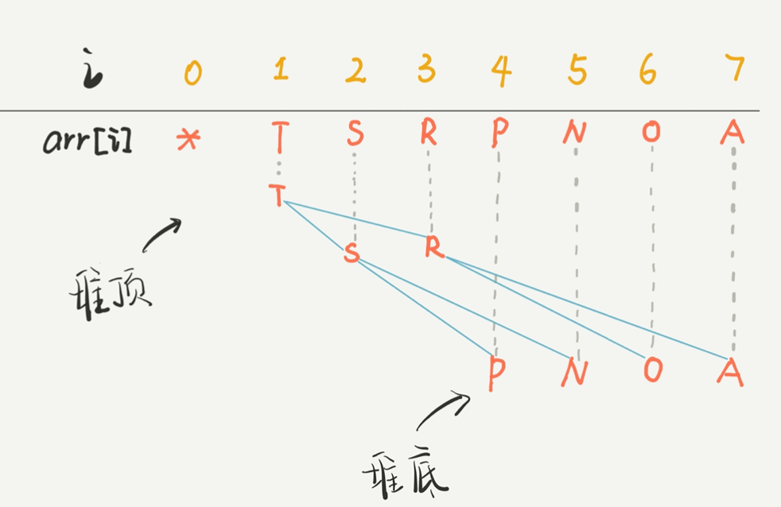

代码框架：

```java
public class MaxPQ
        <Key extends Comparable<Key>> { // 存储元素的数组
    private Key[] pq;

    // 当前 Priority Queue 中的元素个数 private int N = 0;
    public MaxPQ(int cap) {
// 索引 0 不用，所以多分配一个空间
        pq = (Key[]) new Comparable[cap + 1];
    }

    /* 返回当前队列中最大元素 */
    public Key max() {
        return pq[1];
    }

    /* 插入元素 e */
    public void insert(Key e) {...}

    /* 删除并返回当前队列中最大元素 */
    public Key delMax() {...}

    /* 上浮第 k 个元素，以维护最大堆性质 */
    private void swim(int k) {...}

    /* 下沉第 k 个元素，以维护最大堆性质 */
    private void sink(int k) {...}

    /* 交换数组的两个元素 */
    private void exch(int i, int j) {
        Key temp = pq[i];
        pq[i] = pq[j];
        pq[j] = temp;
    }

    /* pq[i] 是否比 pq[j] 小? */
    private boolean less(int i, int j) {
        return pq[i].compareTo(pq[j]) < 0;
    }
    /* 还有 left, right, parent 三个方法 */
}
```

为什么要有上浮 swim 和下沉 sink 的操作呢?为了维护堆结构。

我们要讲的是最大堆，每个节点都比它的两个子节点大，但是在插入元素和删除元素时，难免破坏堆的性质，这就需要通过这两个操作来恢复堆的性质了。对于最大堆，会破坏堆性质的有有两种情况:

1. 如果某个节点 A 比它的子节点(中的一个)小，那么 A 就不配做父节 点，应该下去，下面那个更大的节点上来做父节点，这就是对 A 进行 **下沉**。
2. 如果某个节点 A 比它的父节点大，那么 A 不应该做子节点，应该把父 节点换下来，自己去做父节点，这就是对 A 的**上浮**。

当然，错位的节点 A 可能要上浮(或下沉)很多次，才能到达正确的位 置，恢复堆的性质。所以代码中肯定有一个 while 循环。

```java
private void swim(int k) {
// 如果浮到堆顶，就不能再上浮了
        while (k > 1 && less(parent(k), k)) {
            // 如果第 k 个元素比上层大 
          // 将 k 换上去 
          exch(parent(k), k);
            k = parent(k);
        }
    }
```

**下沉的代码实现:**

下沉比上浮略微复杂一点，因为上浮某个节点 A，只需要 A 和其父节点比 较大小即可;但是下沉某个节点 A，需要 A 和其**两个子节点**比较大小，如 果 A 不是最大的就需要调整位置，要把较大的那个子节点和 A 交换。

```java
private void sink(int k) {
// 如果沉到堆底，就沉不下去了 
  while (left(k) <= N) {
// 先假设左边节点较大
        int older = left(k);
// 如果右边节点存在，比一下大小
        if (right(k) <= N && less(older, right(k)))
            older = right(k);
// 结点 k 比俩孩子都大，就不必下沉了
        if (less(older, k)) break;
// 否则，不符合最大堆的结构，下沉 k 结点 
    exch(k, older);
        k = older;
    }
}
```

**insert** **方法先把要插入的元素添加到堆底的最后，然后让其上浮到正确位**置。

```java
 public void insert(Key e) {
        N++;
// 先把新元素加到最后 
   pq[N] = e;
// 然后让它上浮到正确的位置 
   swim(N);
    }
```

**delMax** **方法先把堆顶元素** **A** **和堆底最后的元素** **B** **对调，然后删除** **A****，最 后让** **B** **下沉到正确位置。**

```java
public Key delMax() {
        // 最大堆的堆顶就是最大元素
        Key max = pq[1];
// 把这个最大元素换到最后，删除之 
  exch(1, N);
        pq[N] = null;
        N--;
// 让 pq[1] 下沉到正确位置 
  sink(1);
        return max;
    }
```

## 4.11 **二叉搜索树操作集锦**

### 4.11.1 **判断** **BST** 的合法性

```java
boolean isValidBST(TreeNode root) {
        return isValidBST(root, null, null);
    }
// BST 的定义，root需要做的不只是和左右子节点比较，而是要整个左子树和右子树所有节点比较。
    boolean isValidBST(TreeNode root, TreeNode min, TreeNode max) {
        if (root == null) return true;
        if (min != null && root.val <= min.val) return false;
        if (max != null && root.val >= max.val) return false;
        return isValidBST(root.left, min, root)
                && isValidBST(root.right, root, max);
    }
```

### 4.11.2 **在** **BST** **中查找一个数是否存在**

```java
boolean isInBST(TreeNode root, int target) {
        if (root == null) return false;
        if (root.val == target)
            return true;
        if (root.val < target)
            return isInBST(root.right, target);
        if (root.val > target)
            return isInBST(root.left, target);
    }
```

于是，我们对原始框架进行改造，抽象出一套**针对** **BST** **的遍历框架**:

```java
void BST(TreeNode root, int target) {
        if (root.val == target)
						// 找到目标，做点什么 
        if (root.val < target)
            BST(root.right, target);
        if (root.val > target)
            BST(root.left, target);
    }
```

### 4.11.3 **在** **BST** 中插入一个数
```java
TreeNode insertIntoBST(TreeNode root, int val) { // 找到空位置插入新节点
        if (root == null) return new TreeNode(val);
        // if (root.val == val)
        // BST 中一般不会插入已存在元素
        if (root.val < val)
            root.right = insertIntoBST(root.right, val);
        if (root.val > val)
            root.left = insertIntoBST(root.left, val);
        return root;
    }
```

### 4.11.4 在BST中删除一个数

```java
// 框架
TreeNode deleteNode(TreeNode root, int key) {
        if (root.val == key) {
					// 找到啦，进行删除
        } else if (root.val > key) {
            root.left = deleteNode(root.left, key);
        } else if (root.val < key) {
            root.right = deleteNode(root.right, key);
        }
        return root;
    }
```

分析：

1. 恰好是叶子节点

   ```java
   if (root.left == null && root.right == null) 
   	return null;
   ```

2. 只有一个孩子

   ```java
   if (root.left == null) return root.right; 
   if (root.right == null) return root.left;
   ```

3. A 有两个子节点，麻烦了，为了不破坏 BST 的性质，A 必须找到 左子树中最大的那个节点，或者右子树中最小的那个节点来接替自己。

```java
if(root.left!=null&&root.right!=null){ // 找到右子树的最小节点
		TreeNode minNode=getMin(root.right);
    // 把 root 改成 minNode
    root.val=minNode.val;
		// 转而去删除 minNode
		root.right=deleteNode(root.right,minNode.val);
}
```

4. 合并代码

```java
TreeNode deleteNode(TreeNode root, int key) {
        if (root == null) return null;
        if (root.val == key) {
// 这两个 if 把情况 1 和 2 都正确处理了
            if (root.left == null) return root.right;
            if (root.right == null) return root.left;
// 处理情况 3
            TreeNode minNode = getMin(root.right);
            root.val = minNode.val;
            root.right = deleteNode(root.right, minNode.val);
        } else if (root.val > key) {
            root.left = deleteNode(root.left, key);
        } else if (root.val < key) {
            root.right = deleteNode(root.right, key);
        }
        return root;
    }

    TreeNode getMin(TreeNode node) {
// BST 最左边的就是最小的
        while (node.left != null) node = node.left;
        return node;
    }
```

### 4.11.5 总结

1. 二叉树算法设计的总路线:把当前节点要做的事做好，其他的交给递归框架，不用当前节点操心。
2. 如果当前节点会对下面的子节点有整体影响，可以通过辅助函数增⻓参 数列表，借助参数传递信息。

n叉树的遍历

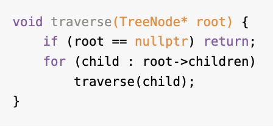

# 5. 栈和队列

```
Stack:
peek()//打印栈顶元素
pop()//出栈
push()//入栈

Queue:
add()//入队
poll()//出队，和remove的区别是对空队列的处理
peek()//队列头部
```

## 5.1 俩个栈实现队列@@

[使用两个栈实现队列9](https://github.com/haojunsheng/AlgorithmNotes/blob/master/src/com/code/offer/stack_queue/QueueWithTwoStacks_09.java)

```java
//在队列尾部插入元素,直接在stack1中插入即可
        public void appendTail(E node) {
            stack1.push(node);
        }
        //从队列头部删除元素
        public E deleteHead() {
            if (stack2.size() == 0) {
                if (stack1.size() == 0) {
                    throw new RuntimeException();
                } else {
                    while (stack1.size() != 0) {
                        stack2.push(stack1.pop());
                    }
                }
            }
            return stack2.pop();
        }
```

[两个队列实现栈](https://github.com/haojunsheng/AlgorithmNotes/blob/master/src/com/code/offer/stack_queue/StackWithTwoQueue_0902.java)

```java
public void push(int num) {
        if (queue1.isEmpty() && queue2.isEmpty()) {
            queue1.push(num);
            // queue1非空，压入queue1
        } else if (!queue1.isEmpty()) {
            queue1.push(num);
        } else {
            queue2.push(num);
        }
    }

public Integer pop() {
        if (queue1.isEmpty() && queue2.isEmpty()) {
            return null;
        }
        int value = 0;
        // queue1中有值，除了最后一个全部移动到q2,然后q1弹出即可
        if (!queue1.isEmpty()) {
            while (queue1.size() > 1) {
                queue2.push(queue1.pop());
            }
            value = queue1.pop();
        } else {
            // 同上
            while (queue2.size() > 1) {
                queue1.push(queue2.pop());
            }
            value = queue2.pop();
        }
        return value;
    }
```

## 5.2 包含min函数的栈

[包含min函数的栈30](https://github.com/haojunsheng/AlgorithmNotes/blob/master/src/com/code/offer/stack_queue/CustomStack_30.java)

```java
/**
 * 定义栈的数据结构，请在该类型中实现一个能够得到栈的最小元素的min函数。
 * 在该栈中，调用min,push及pop的时间复杂度都是O(1).
 * 看到这个问题，我们的第一反应可能是每次压入一个新元素进栈时，将栈里的所有元素排序，
 * 让最小的元素位于栈顶，这样就能在O(1)时间得到最小元素了。
 * 但这种思路不能保证最后压入的元素能够最先出栈，因此这个数据结构已经不是栈了。
 * 我们接着想到在栈里添加一个成员变量存放最小的元素。每次压入一个新元素进栈的时候，如果该元素比当前最小的元素还要小，则更新最小元素。
 * 面试官听到这种思路之后就会问：如果当前最小的元素被弹出栈了，如何得到下一个最小的元素呢？
 * 分析到这里我们发现仅仅添加一个成员变量存放最小元素是不够的，也就是说当最小元素弹出栈的时候，我们希望能够得到次小元素。
 * 因此在压入这个最小元素之前，我们要把次小元素保存起来。
 * 是不是可以把每次的最小元素都保存起来，放在另外一个辅助栈里呢？
 * 我们不妨举几个例子来分析一下把元素压入或者弹出栈的过程。
*/
//进栈
    private void push(int value) {
        dataStack.push(value);
        //栈为空的时候，最小值为当前值
        if (minStack.isEmpty()) {
            minValue = value;
        } else {
            if (minValue > value) {
                minValue = value;
            }
        }
        minStack.push(minValue);
    }

    //出栈
    private void pop() {
        if (!dataStack.isEmpty() && !minStack.isEmpty()) {
            dataStack.pop();
            minStack.pop();
            //更新最小值
            if (!minStack.isEmpty()) {
                minValue = minStack.peek();
            } else {
                minValue = 0;
            }
        }
    }
```

## 5.3 栈的压入、弹出序列@@@

[栈的压入、弹出序列31](https://github.com/haojunsheng/AlgorithmNotes/blob/master/src/com/code/offer/stack_queue/StackSequence_31.java)

```java
/**
 * 输入两个整数序列，第一个序列表示栈的压入顺序，请判断第二个序列是否为该栈的弹出顺序。假设压入栈的所有数字均不相等。
 * 例如序列1，2，3，4，5是某栈的压栈序列，序列4，5，3，2，1是该压栈序列对应的一个弹出序列，
 * 但4，3，5，1，2就不可能是该压栈序列的弹出序列。
 */
public static boolean IsPopOrder(int[] pushA, int[] popA) {
       //处理非法数据
        if (pushA == null || popA == null || pushA.length == 0 || popA.length == 0 || pushA.length != popA.length) {
            return false;
        }
        //辅助栈
        Stack<Integer> tempStack = new Stack<Integer>();
        //弹出数组的索引
        int j = 0;
        for (int i = 0; i < pushA.length; i++) {
            tempStack.push(pushA[i]);
            // 碰见相等，tempStack出栈，索引j后移
            while (!tempStack.isEmpty() && tempStack.peek() == popA[j]) {
                tempStack.pop();
                j++;
            }
        }
        //如果最后数组中没有元素，则符合题意
        if (tempStack.isEmpty()) {
            return true;
        } else {
            return false;
        }
    }
```

## 5.4 队列的最大值@@@

[滑动窗口的最大值5901](https://github.com/haojunsheng/AlgorithmNotes/blob/master/src/com/code/offer/stack_queue/MaxInWindows_5901.java)

```java
/**
 * 给定一个数组 nums，有一个大小为 k 的滑动窗口从数组的最左侧移动到数组的最右侧。
 * 你只可以看到在滑动窗口内的 k 个数字。滑动窗口每次只向右移动一位。返回滑动窗口中的最大值。
 * 输入: nums = [1,3,-1,-3,5,3,6,7], 和 k = 3
 * 输出: [3,3,5,5,6,7]
 * 解释:
 * 滑动窗口的位置                最大值
 * ---------------               -----
 * [1  3  -1] -3  5  3  6  7       3
 * 1 [3  -1  -3] 5  3  6  7       3
 * 1  3 [-1  -3  5] 3  6  7       5
 * 1  3  -1 [-3  5  3] 6  7       5
 * 1  3  -1  -3 [5  3  6] 7       6
 * 1  3  -1  -3  5 [3  6  7]      7
 */
public class MaxInWindows_5901 {
    /**
     * 双端队列和普通队列最大的不同在于，它允许我们在队列的头尾两端都能在 O(1) 的时间内进行数据的查看、添加和删除。
     * 与队列相似，我们可以利用一个双链表实现双端队列。
     * 双端队列最常用的地方就是实现一个长度动态变化的窗口或者连续区间，而动态窗口这种数据结构在很多题目里都有运用。
     * 可以利用一个双端队列来表示这个窗口。这个双端队列保存当前窗口中最大那个数的下标，
     * 双端队列新的头总是当前窗口中最大的那个数。
     * 同时，有了这个下标，我们可以很快地知道新的窗口是否已经不再包含原来那个最大的数，
     * 如果不再包含，我们就把旧的数从双端队列的头删除。
     * 按照这样的操作，不管窗口的长度是多长，
     * 因为数组里的每个数都分别被压入和弹出双端队列一次，所以我们可以在 O(n)的时间里完成任务。
     */
    public int[] maxSlidingWindow(int[] nums, int k) {
        int n = nums.length;
        if (n * k == 0 || k == 1) {
            return nums;
        }
        MonotonicQueue window = new MonotonicQueue();
        int res[] = new int[n - k + 1];
        for (int i = 0; i < n; i++) {
            //先填满窗口的前 k - 1
            if (i < k - 1) {
                window.push(nums[i]);
                // 窗口向前滑动
            } else {
                window.push(nums[i]);
                res[i - k + 1] = window.max();
                window.pop(nums[i - k + 1]);
            }
        }
        return res;
    }

    /**
     * 单调队列,单调递减
     */
    class MonotonicQueue {
        // 双端队列
        ArrayDeque<Integer> data = new ArrayDeque<>();

        // 在队尾添加元素 n,把前面比新元素小的元素都删掉：
        public void push(int n) {
            while (!data.isEmpty() && data.getLast() < n) {
                data.removeLast();
            }
            data.addLast(n);
        }

        // 返回当前队列中的最大值
        public int max() {
            return data.getFirst();
        }

        // 队头元素如果是 n，删除它
        public void pop(int n) {
            if (!data.isEmpty() && data.getFirst() == n) {
                data.removeFirst();
            }
        }
    }
```

[队列的最大值5902](https://github.com/haojunsheng/AlgorithmNotes/blob/master/src/com/code/offer/stack_queue/MaxInQueue_5902.java)


```java
/**
 * 队列的最大值
 * 请定义一个队列并实现函数 max_value 得到队列里的最大值，
 * 要求函数max_value、push_back 和 pop_front 的均摊时间复杂度都是O(1)。
 * 若队列为空，pop_front 和 max_value 需要返回 -1。
 * <p>
 * 输入:
 * ["MaxQueue","push_back","push_back","max_value","pop_front","max_value"]
 * [[],[1],[2],[],[],[]]
 * 输出: [null,null,null,2,1,2]
 * <p>
 * 输入:
 * ["MaxQueue","pop_front","max_value"]
 * [[],[],[]]
 * 输出: [null,-1,-1]
 */
public class MaxInQueue_5902 {
    /**
     * 使用一个双端队列 deque，在每次入队时，
     * 如果 deque 队尾元素小于即将入队的元素 value，
     * 则将小于 value 的元素全部出队后，再将 value 入队；否则直接入队。
     * 辅助队列 deque 队首元素就是队列的最大值。
     */
    Queue<Integer> que;
    Deque<Integer> deq;

    public MaxInQueue_5902() {
        que = new LinkedList<>();  //队列：插入和删除
        deq = new LinkedList<>();  //双端队列：获取最大值
    }

    public int max_value() {
        return deq.size() > 0 ? deq.peek() : -1;  //双端队列的队首为que的最大值
    }

    public void push_back(int value) {
        que.offer(value);  //value入队
        while (deq.size() > 0 && deq.peekLast() < value) {
            deq.pollLast();  //将deq队尾小于value的元素删掉
        }
        deq.offerLast(value);  //将value放在deq队尾
    }

    public int pop_front() {
        int tmp = que.size() > 0 ? que.poll() : -1;  //获得队首元素
        if (deq.size() > 0 && tmp == deq.peek()) {
            deq.poll();  //如果出队的元素是当前最大值，将deq的队首出队
        }
        return tmp;
    }
}
```

# 6. 递归和循环

## 6.1 数值的整数次方

[16-数值的整数次方](https://github.com/haojunsheng/AlgorithmNotes/blob/master/src/com/code/offer/recursive_cycle/Power_16.java)

这个题目需要我们考虑到各种情况，然后还需要掌握**累乘和快速求幂**的方法。

```java
/**
* 题目描述：
 * 实现函数double Power(double base,int exponent),求base的exponent次方。
 * 不得使用库函数，同时不需要考虑大数问题。
 */
		boolean invalidInput = false;

    public double power(double base, int exponent) {
        //异常情况，底数为0且，指数小于等于0
        if (equal(base, 0.0) && exponent <= 0) {
            invalidInput = true;
            return 0.0;
        }

        //定义正指数
        int absExponent = exponent;
        if (exponent < 0) {
            absExponent = -exponent;
        }

        double result = powerWithExponet(base, absExponent);
        if (exponent < 0) {
            result = 1.0 / result;
        }

        return result;
    }
		// 循环
    public double powerWithExponet(double base, int exponent) {
        double result = 1.0;
        for (int i = 1; i <= exponent; i++) {
            result *= base;
        }
        return result;
    }
// 快速求幂
public double powerWithUnsignedExponet(double base, int exponent) {
        if (exponent == 0) {
            return 1.0;
        }
        if (exponent == 1) {
            return base;
        }

        //使用右移运算符，将exponent除以2
        double result = powerWithUnsignedExponet(base, exponent >> 1);
        result *= result;
        //判断是否为奇数
        if ((exponent & 1) == 1) {
            result *= base;
        }
        return result;
    }
```

## 6.3  打印从1到最大的n位数@@@

[17-打印从1到最大的n位数](https://github.com/haojunsheng/AlgorithmNotes/blob/master/src/com/code/offer/recursive_cycle/Print1ToMaxOfNDigits_17.java)

**大数问题**，使用字符串来模拟加法运算，还有减乘除呢。

一种是老老实实的模拟，二是我们发现：**n位所有10进制数其实就是n个从0到9的全排列**。

```java
	 /**
     * 输入数字n，按顺序打印出从1最大的n位十进制数。比如输入3，则打印出1、2、3 一直到最大的3位数即999。
     */
    public static void printOneToNthDigits(int n) {
        // 输入值必须大于0
        if (n < 1) {
            return;
        }
        // 创建一个长度为n的数组
        int[] number = new int[n];
        // 求结果，如果最高位没有进位就一直进行处理，模拟大数加法
        while (addOne(number) == 0) {
            printArray(number);
        }
    }
    /**
     * 对number表示的数组的最低位加1
     * number中的每个数都不能超过9不能小于0，每个位置模拟一个数位
     * @param number 待加数组
     * @return 判断最高位是否有进位，如果有进位就返回1，否则返回0
     */
    public static int addOne(int[] number) {
        // 保存进位值，因为每次最低位加1
        int carry = 1;
        // 最低位的位置的后一位
        int index = number.length;
        do {
            // 指向上一个处理位置
            index--;
            // 处理位置的值加上进位的值
            number[index] += carry;
            // 求处理位置的进位
            carry = number[index] / 10;
            // 求处理位置的值
            number[index] %= 10;
        } while (carry != 0 && index > 0);
        // 如果index=0说明已经 处理了最高位，carry>0说明最高位有进位，返回1
        if (carry > 0 && index == 0) {
            return 1;
        }
        // 无进位返回0
        return 0;
    }
   /**
     * 输入数字n，按顺序打印出从1最大的n位十进制数。
     * 比如输入3，则打印出1、2、3 一直到最大的3位数即999。
     * 核心思想：n位所有10进制数其实就是n个从0到9的全排列。
     * @param n 数字的最大位数
     */
    public static void printOneToNthDigitsRecursely(int n) {
        if (n <= 0) {
            return;
        }
        // 创建一个数组用于打存放值
        int[] number = new int[n];
        printOneToNthDigitsRecursely(0, number);
    }
    /**
     * @param index  当前处理的是第个元素，从0开始计数
     * @param number 存放结果的数组
     */
    public static void printOneToNthDigitsRecursely(int index, int[] number) {
        // 说明所有的数据排列选择已经处理完了
        if (index >= number.length) {
            // 可以输出数组的值
            printArray(number);
            return;
        }
        for (int i = 0; i <= 9; i++) {
            number[index] = i;
            printOneToNthDigitsRecursely(index + 1, number);
        }
    }
   /**
     * 输入数组的元素，从左到右，从第一个非0值到开始输出到最后的元素。
     * @param arr 要输出的数组
     */
    public static void printArray(int[] arr) {
        // 找第一个非0的元素
        int index = 0;
        while (index < arr.length && arr[index] == 0) {
            index++;
        }
        // 从第一个非0值到开始输出到最后的元素。
        for (int i = index; i < arr.length; i++) {
            System.out.print(arr[i]);
        }
        // 条件成立说明数组中有非零元素，所以需要换行
        if (index < arr.length) {
            System.out.println();
        }
    }
```

## 6.4 1-n整数中1出现的次数@@@

[1-n整数中1出现的次数43](https://github.com/haojunsheng/AlgorithmNotes/blob/master/src/com/code/offer/recursive_cycle/Numberof1Between1AndN_43.java)

```java
/**
 * 输入一个整数n，求从1到n这n个整数的十进制表示中1出现的次数。
 * 例如输入12，从1到12这些整数中包含1的数字有1，10，11和12，1一共出现了5次。
 * <p>
 * 首先可以先分类：
 * 个位
 * 我们知道在个位数上，1会每隔10出现一次，例如1、11、21等等，
 * 我们发现以10为一个阶梯的话，每一个完整的阶梯里面都有一个1，例如数字22，
 * 按照10为间隔来分三个阶梯，在完整阶梯0-9，10-19之中都有一个1，但是19之后有一个不完整的阶梯，
 * 我们需要去判断这个阶梯中会不会出现1，易推断知，如果最后这个露出来的部分小于1，则不可能出现1。
 * 我们可以归纳个位上1出现的个数为：
 * n/10 * 1+(n%10!=0 ? 1 : 0)
 * <p>
 * 十位
 * 现在说十位数，十位数上出现1的情况应该是10-19，依然沿用分析个位数时候的阶梯理论，
 * 我们知道10-19这组数，每隔100出现一次，这次我们的阶梯是100，例如数字317，
 * 分析有阶梯0-99，100-199，200-299三段完整阶梯，每一段阶梯里面都会出现10次1（从10-19），
 * 最后分析露出来的那段不完整的阶梯。我们考虑如果露出来的数大于19，那么直接算10个1就行了，
 * 因为10-19肯定会出现；如果小于10，那么肯定不会出现十位数的1；
 * 如果在10-19之间的，我们计算结果应该是k - 10 + 1。
 * 例如我们分析300-317，17个数字，1出现的个数应该是17-10+1=8个。
 * 那么现在可以归纳：十位上1出现的个数为：
 * 设k = n % 100，即为不完整阶梯段的数字
 * 归纳式为：(n / 100) * 10 + (if(k > 19) 10 else if(k < 10) 0 else k - 10 + 1)
 * <p>
 * 百位
 * 现在说百位1，我们知道在百位，100-199都会出现百位1，一共出现100次，阶梯间隔为1000，
 * 100-199这组数，每隔1000就会出现一次。这次假设我们的数为2139。
 * 跟上述思想一致，先算阶梯数 * 完整阶梯中1在百位出现的个数，即n/1000 * 100得到前两个阶梯中1的个数，
 * 那么再算漏出来的部分139，沿用上述思想，不完整阶梯数k199，得到100个百位1，
 * 100<=k<=199则得到k - 100 + 1个百位1。
 * 那么继续归纳百位上出现1的个数：
 * 设k = n % 1000
 * 归纳式为：(n / 1000) * 100 + (if(k >199) 100 else if(k < 100) 0 else k - 100 + 1)
 * 后面的依次类推....
 * <p>
 * 再次回顾个位
 * 我们把个位数上算1的个数的式子也纳入归纳式中
 * k = n % 10
 * 个位数上1的个数为：n / 10 * 1 + (if(k > 1) 1 else if(k < 1) 0 else k - 1 + 1)
 * 完美！归纳式看起来已经很规整了。 来一个更抽象的归纳，设i为计算1所在的位数，i=1表示计算个位数的1的个数，10表示计算十位数的1的个数等等。
 * <p>
 * k = n % (i * 10)
 * count(i) = (n / (i * 10)) * i + (if(k > i * 2 - 1) i else if(k < i) 0 else k - i + 1)
 * 好了，这样从10到10的n次方的归纳就完成了。
 * <p>
 * sum1 = sum(count(i))，i = Math.pow(10, j), 0<=j<=log10(n)
 * 但是有一个地方值得我们注意的，就是代码的简洁性来看，有多个ifelse不太好，能不能进一步简化呢？ 我们可以把后半段简化成这样，我们不去计算i * 2 - 1了，我们只需保证k - i + 1在[0, i]区间内就行了，最后后半段可以写成这样
 * <p>
 * min(max((n mod (i*10))−i+1,0),i)
 */
public class Numberof1Between1AndN_43 {
    public int NumberOf1Between1AndN_Solution(int n) {
        if (n <= 0) {
            return 0;
        }
        int count = 0;
        for (long i = 1; i <= n; i *= 10) {
            long diviver = i * 10;
            count += (n / diviver) * i;
            long k = n % (i * 10);
            if (k > i * 2 - 1) {
                count += i;
            } else if (k < i) {
                count += 0;
            } else {
                count += k - i + 1;
            }
        }
        return count;
    }
}
```

## 6.5 丑数@@@

[丑数49](https://github.com/haojunsheng/AlgorithmNotes/blob/master/src/com/code/offer/recursive_cycle/UglyNumber_49.java)


## 6.6 求1+2+…+n@@@

[求1+2+…+n 64](https://github.com/haojunsheng/AlgorithmNotes/blob/master/src/com/code/offer/recursive_cycle/sumNums_64.java)

```java
/**
 * 求 1+2+...+n ，要求不能使用乘除法、for、while、if、else、switch、case等关键字及条件判断语句（A?B:C）。
 * 输入: n = 3
 * 输出: 6
 * 输入: n = 9
 * 输出: 45
 */
public class sumNums_64 {
    /**
     * 使用递归解法最重要的是指定返回条件，但是本题无法直接使用 if 语句来指定返回条件。
     * <p>
     * 条件与 && 具有短路原则，即在第一个条件语句为 false 的情况下不会去执行第二个条件语句。
     * 利用这一特性，将递归的返回条件取非然后作为 && 的第一个条件语句，递归的主体转换为第二个条件语句，那么当递归的返回条件为 true 的情况下就不会执行递归的主体部分，递归返回。
     * <p>
     * 本题的递归返回条件为 n <= 0，取非后就是 n > 0；
     * 递归的主体部分为 sum += Sum_Solution(n - 1)，转换为条件语句后就是 (sum += Sum_Solution(n - 1)) > 0。
     */
    public int sumNums(int n) {
        int sum = n;
        boolean b = (n > 0) && ((sum += sumNums(n - 1)) > 0);
        return sum;
    }
}
```


# 7. 查找和排序

**如果面试题要求在排序的数组或者部分排序的数组中查找一个数字或者统计某数字出现的次数，可以尝试使用二分查找算法。**

**二分查找的细节：**

1、分析二分查找代码时，不要出现 else，全部展开成 else if 方便理解。

2、注意「搜索区间」和 while 的终止条件，如果存在漏掉的元素，记得在最后检查。

3、如需要搜索左右边界，只要在nums[mid] == target 时做修改即可。搜索 右侧时需要减一。

**partition，即分治算法，十分的重要。可以用在快排算法中，还可以用来实现在长度为n的数组中查找第k大的数字**比如，面试题39，数组中出现次数超过一半的数字和面试题40，最小的k个数。其中，**我们有成熟的算法的时间复杂度为O(n)得到数组中任意第k大的数字，假设你选择的数字p在快排一轮完成后下标是m，那么比p小的数字就有m个，如果k小于m，那么第k大的数字一定在p的左边，否则在右边。**

```java
public void quickSort(int A[],int left,int right){
        //非法输入
        if(A==null||A.length==0||left<0||right>A.length-1||left>=right)
            return;
        int pos=partition(A,left,right);
        quickSort(A,left,pos-1);
        quickSort(A,pos+1,right);
    }

public int partition(int A[],int left,int right){
  int temp=A[left];
  while (left<right){//只要两个数不相遇
    while (left<right&&A[right]>=temp)//从右边找小于temp的值
      right--;
    A[left]=A[right];//找到则交换
    while (left<right&&A[left]<=temp)//从左边找大于temp的值
      left++;
    A[right]=A[left];
  }
  A[left]=temp;
  return left;
}
```

## 7.1 第一个只出现一次的字符

[第一个只出现一次的字符50](https://github.com/haojunsheng/AlgorithmNotes/blob/master/src/com/code/offer/sort_find/FirstNotRepeatingChar_50.java)

```java
/**
 * 在字符串 s 中找出第一个只出现一次的字符。如果没有，返回一个单空格。
 * s = "abaccdeff"
 * 返回 "b"
 * s = ""
 * 返回 " "
 */
public class FirstNotRepeatingChar_50 {
    public char firstUniqChar(String s) {
        HashMap<Character, Boolean> dic = new HashMap<>();
        char[] sc = s.toCharArray();
        for (char c : sc) {
            dic.put(c, !dic.containsKey(c));
        }
        for (char c : sc) {
            if (dic.get(c)) {
                return c;
            }
        }
        return ' ';
    }
}
```

## 7.2 在排序数组中查找数字

[数字在排序数组中出现的次数53](https://github.com/haojunsheng/AlgorithmNotes/blob/master/src/com/code/offer/array/NumberOfK_5301.java)

```java
/**
 * 数字在排序数组中出现的次数
 * 由于数组有序，所以使用二分查找方法定位k的第一次出现位置和最后一次出现位置
 */
    public int GetNumberOfK(int[] array, int k) {
        int num = 0;
        int length = array.length;
        if (array != null && length > 0) {
            int left = getFirstK(array, k, 0, length - 1);
            int right = getLastK(array, k, 0, length - 1);
            if (right > -1 && left > -1) {
                num = right - left + 1;
            }
        }
        return num;
    }

    // 第一个k
    public int getFirstK(int[] array, int k, int left, int right) {
        if (left > right) {
            return -1;
        }
        int middleIndex = (left + right) / 2;
        int middleData = array[middleIndex];
        //中间位置等于k，说明第一个k的位置可能在左边
        if (k == middleData) {
            //中间的元素是第一个k
            if (middleIndex > 0 && (array[middleIndex - 1] != k) || middleIndex == 0) {
                return middleIndex;
            } else {
                //k在左半部分
                right = middleIndex - 1;
            }
        } else if (middleData > k) {
            //k在左半部分
            right = middleIndex - 1;
        } else {
            left = middleIndex + 1;
        }
        return getFirstK(array, k, left, right);
    }

    // 最后一个k的位置
    private int getLastK(int[] array, int k, int left, int right) {
        if (left > right) {
            return -1;
        }
        int middleIndex = (left + right) / 2;
        int middleData = array[middleIndex];
        //中间位置等于k，说明最后一个k的位置可能在右边
        if (k == middleData) {
            //中间的元素是最后一个k
            if (middleIndex < (array.length - 1) && (array[middleIndex + 1] != k) || middleIndex == (array.length - 1)) {
                return middleIndex;
            } else {
                //k在右半部分
                left = middleIndex + 1;
            }
        } else if (middleData > k) {
            right = middleIndex - 1;//k在右半部分
        } else {
            left = middleIndex + 1;
        }
        return getLastK(array, k, left, right);
    }
```

```java
/**
 * 0～n-1中缺失的数字
 * 一个长度为n-1的递增排序数组中的所有数字都是唯一的，并且每个数字都在范围0～n-1之内。
 * 在范围0～n-1内的n个数字中有且只有一个数字不在该数组中，请找出这个数字。
 * 输入: [0,1,2,3,4,5,6,7,9]，输出: 8
 */
public int getMissingNumber(int[] array) {
        int length = array.length;
        if (array == null || length == 0) {
            return -1;
        }
        int left = 0;
        int right = length - 1;
        while (left <= right) {
            int middle = (left + right) / 2;
            if (array[middle] != middle) {
                if (middle == 0 || array[middle - 1] == middle - 1) {
                    return middle;
                }
                right = middle - 1;
            } else {//肯定在右边
                left = middle + 1;
            }
        }
        if (left == length) {
            return length;
        }
        return -1;
    }
```

# 8. 动态规划和贪心算法

动态规划的一般流程就是三步:**暴力的递归解法** **->** **带备忘录的递归解法** **->** **迭代的动态规划解法**。

思考流程来说，就分为一下几步:**找到状态和选择** **->** **明确** **dp** **数组**/**函数的定义** **->** **寻找状态之间的关系**。

**动态规划问题的一般形式就是求最值**。比如说让你求**最长**递增子序列呀，**最小**编辑距离呀等等。既然是要求最值，核心问题是什么呢?**求解动态规划的核心问题是穷举**。因为要求最值，肯定要把所有可行的答案穷举出来，然后在其中找最值呗。

首先，动态规划的穷举有点特别，因为这类问题**存在「重叠子问题」**，如果 暴力穷举的话效率会极其低下，所以需要「备忘录」或者「DP table」来优化穷举过程，避免不必要的计算。

而且，动态规划问题一定会**具备「最优子结构」**，才能通过子问题的最值得到原问题的最值。在操作中，我们可以不必关心。

另外，虽然动态规划的核心思想就是穷举求最值，但是问题可以千变万化， 穷举所有可行解其实并不是一件容易的事，只有列出**正确的「状态转移方程**」才能正确地穷举。

在实际的算法问题中，**写出状态转移方程是最困难的**。

> 明确「状态」 -> 定义 dp 数组/函数的含义 -> 明确「选择」-> 明确 base case。

## 8.0 动态规划

[参考](https://www.zhihu.com/question/23995189)

【如何设计DP算法】

　　下面介绍比较通用的设计DP算法的步骤。

　　首先，把我们面对的**局面**表示为x。这一步称为**设计状态**。
　　对于状态x，记我们要求出的答案(e.g. 最小费用)为f(x).我们的目标是求出f(T).
**找出f(x)与哪些局面有关（记为p）**，写出一个式子（称为**状态转移方程**），通过f(p)来推出f(x).

【DP三连】

　　设计DP算法，往往可以遵循DP三连：

　　我是谁？  ——设计状态，表示局面
　　我从哪里来？
　　我要到哪里去？  ——设计转移

　　设计状态是DP的基础。接下来的设计转移，有两种方式：一种是考虑我从哪里来（本文之前提到的两个例子，都是在考虑“我从哪里来”）；另一种是考虑我到哪里去，这常见于求出f(x)之后，**更新能从x走到的一些解**。这种DP也是不少的，我们以后会遇到。

​       动态问题的分类：

### 8.0.1 线性规划

线性，就是说各个子问题的规模以线性的方式分布，并且子问题的最佳状态或结果可以存储在一维线性的数据结构里，例如一维数组，哈希表等。 

解法中，经常会用 dp[i] 去表示第 i 个位置的结果，或者从 0 开始到第 i 个位置为止的最佳状态或结果。例如，最长上升子序列。dp[i] 表示从数组第 0 个元素开始到第i个元素为止的最长的上升子序列。

求解 dp[i] 的复杂程度取决于题目的要求，但是基本上有两种形式。

#### **求解 dp[i] 形式一**

第一种形式，**当前所求的值仅仅依赖于有限个先前计算好的值（只有一重循环）**，也就是说，dp[i] 仅仅依赖于有限个 dp[j]，其中 j < i。

- 斐波那契数列：dp[i]=dp[i−1] + dp[i−2]，可以看到，当前值只依赖于前面两个计算好的值。
- 给定一个数组，不能选择相邻的数，求如何选才能使总数最大。

解法：这道题需要运用经典的 0-1 思想，简单说就是：“选还是不选”。

假设 dp[i] 表示到第 i 个元素为止我们所能收获到的最大总数。

1. 如果选择了第 i 个数，则不能选它的前一个数，因此，收获的最大总数就是 dp[i−2] + nums[i]。

2. 不选，则直接考虑它的前一个数 dp[i−1]。

因此，可以推导出它的递归公式 dp[i]=max(nums[i] + dp[i−2], dp[i−1])，可以看到，dp[i] 仅仅依赖于有限个 dp[j]，其中 j=i−1，i−2。

```java
public int rob(int[] nums) {
    int n = nums.length;
  
    // 处理当数组为空或者数组只有一个元素的情况
    if(n == 0) return 0;
    if(n == 1) return nums[0];

    // 定义一个 dp 数组，dp[i] 表示到第 i 个元素为止我们所能收获到的最大总数
    int[] dp = new int[n];

    // 初始化 dp[0]，dp[1]
    dp[0] = nums[0];
    dp[1] = Math.max(nums[0], nums[1]);

    // 对于每个 nums[i]，考虑两种情况，选还是不选，然后取最大值
    for (int i = 2; i < n; i++) {
        dp[i] = Math.max(nums[i] + dp[i - 2], dp[i - 1]);
    }
  
    return dp[n - 1];
}
```

- 机器人移动问题。一个机器人位于一个网格的左上角（起始点在下图中标记为“Start”）。机器人每次只能向下或向右移动一步。机器人试图到达网格的右下角（在下图中标记为“Finish”）。问总共有多少条不同的路径？


递推公式为 `dp[i][j]=dp[i−1][j] + dp[i][j−1]`。

 虽然利用一个二维数组去保存计算的结果，但是 `dp[i][j]` 所表达的意思仍然是线性的，`dp[i][j]` 表示从起点到 (i, j) 的总走法。本题不再讨论具体实现。可以看到，`dp[i][j]` 仅仅依赖于两个先前的状态。

#### 求解 dp[i] 形式二

第二种求解 dp[i] 的形式，**当前所求的值依赖于所有先前计算好的值**（所以需要二重循环），也就是说，dp[i] 是各个 dp[j] 的某种组合，其中 j 由 0 遍历到 i−1。

举例：求解最长上升子序列。

解法：dp[i]=max(dp[j]) + 1，0 <= j < i。可以看到，当前值依赖于前面所有计算好的值。

### 8.0.2 区间规划

区间规划，就是说各个子问题的规模由不同的区间来定义，一般子问题的最佳状态或结果存储在二维数组里。一般用 `dp[i][j]` 代表从第 i 个位置到第 j 个位置之间的最佳状态或结果。

 解这类问题的时间复杂度一般为多项式时间，对于一个大小为 n 的问题，时间复杂度不会超过 n 的多项式倍数。例如，O(n)=n^k，k 是一个常数，根据题目的不同而定。

- LeetCode 第 516 题，在一个字符串 S 中求最长的回文子序列。例如给定字符串为 dccac，最长回文就是 ccc

对于回文来说，必须保证两头的字符都相同。用 `dp[i][j]` 表示从字符串第 i 个字符到第 j 个字符之间的最长回文，比较这段区间外的两个字符，如果发现它们相等，它们就肯定能构成新的最长回文。而最长的回文长度会保存在 `dp[0][n−1]` 里。因此，可以推导出如下的递推公式。

当首尾的两个字符相等的时候 `dp[0][n−1]=dp[1][n−2] + 2`，

否则，`dp[0][n−1]=max(dp[1][n−1], dp[0][n−2])`。

```java
public static int LPS(String s) {
    int n = s.length();
    // 定义 dp 矩阵，dp[i][j] 表示从字符串第 i 个字符到第 j 个字符之间的最长回文
    int[][] dp = new int[n][n];
  
    // 初始化 dp 矩阵，将对角线元素设为 1，即单个字符的回文长度为 1
    for (int i = 0; i < n; i++) dp[i][i] = 1;
  
    // 从长度为 2 开始，尝试将区间扩大，一直扩大到 n
    for (int len = 2; len <= n; len++) {
        // 在扩大的过程中，每次都得出区间的其实位置i和结束位置j
        for (int i = 0; i < n - len + 1; i++) {
            int j = i + len - 1;
      
            // 比较一下区间首尾的字符是否相等，如果相等，就加2；如果不等，从规模更小的字符串中得出最长的回文长度
            if (s.charAt(i) == s.charAt(j)) {
                dp[i][j] = 2 + (len == 2 ? 0: dp[i + 1][j - 1]);
              } else {
                dp[i][j] = Math.max(dp[i + 1][j], dp[i][j - 1]);
              }
        }
    } 
    return dp[0][n - 1];
}
```

### 8.0.3 约束规划

在普通的线性规划和区间规划里，一般题目有两种需求：统计和最优解。

这些题目不会对输出结果中的元素有什么限制，只要满足最终的一个条件就好了。但是在很多情况下，题目会对输出结果的元素添加一定的限制或约束条件，增加了解题的难度。

- 0-1 背包问题。给定 n 个物品，每个物品都有各自的价值 vi 和重量 wi，现在给你一个背包，背包所能承受的最大重量是 W，那么往这个背包里装物品，问怎么装能使被带走的物品的价值总和最大。

```java
// F(i,C)=max(F(i−1,C),v(i)+F(i−1,C−w(i)))
public class KnapSack01 {
     // c是背包容量
    public static int knapSack(int[] w, int[] v, int C) {
        int size = w.length;
        if (size == 0) {
            return 0;
        }

        int[][] dp = new int[size][C + 1];
        //初始化第一行
        //仅考虑容量为C的背包放第0个物品的情况
        for (int i = 0; i <= C; i++) {
            dp[0][i] = w[0] <= i ? v[0] : 0;
        }
		//填充其他行和列
        for (int i = 1; i < size; i++) {
            for (int j = 0; j <= C; j++) {
                if (w[i] <= j) {
                    dp[i][j] = Math.max(dp[i-1][j], v[i] + dp[i - 1][j - w[i]]);
                }
            }
        }
        return dp[size - 1][C];
    }

    public static void main(String[] args) {
        int[] w = {2, 1, 3, 2};
        int[] v = {12, 10, 20, 15};
        System.out.println(knapSack(w, v, 5));
    }
}
```

## 8.1 **斐波那契数列**

这个题目不是动态规划类的，但是可以体现动态规范的特性。

暴力求解的问题是大量的重复计算，时间复杂度极高。

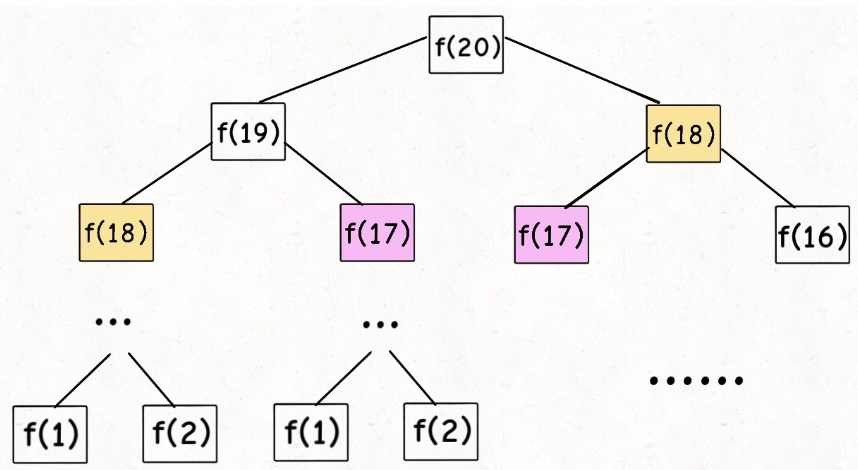

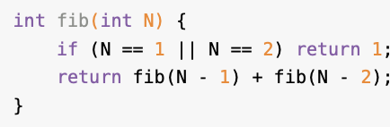

递归算法的时间复杂度怎么计算?

> 子问题个数乘以解决一个子问题需要的时间。

其时间复杂度为：

子问题个数，即递归树中节点的总数。显然二叉树节点总数为指数级别，所 以子问题个数为 O(2^n)。

解决一个子问题的时间，在本算法中，没有循环，只有 f(n - 1) + f(n - 2) 一 个加法操作，时间为 O(1)。

所以，这个算法的时间复杂度为 O(2^n)，指数级别，爆炸。

原因在于存在着大量的重叠子问题，所以我们可以记录中间结果，即备忘录解法,一般使用一个数组充当这个「备忘录」。我们通过剪枝来大大降低了时间复杂度。本算法的时间复杂度是 O(n)。


感觉这个属于过度阶段的解法，我们可以直接使用下面的解法。

> 区分自顶向下和自底向上。

当我们使用自底向上的时候，就把题目修改为了循环解法，而不是递归解法。

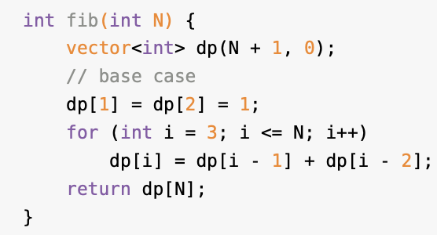

这里我们需要引出十分重要的状态转移方程。把 f(n) 想做一个状态 n，这 个状态 n 是由状态 n - 1 和状态 n - 2 相加转移而来，这就叫状态转移。

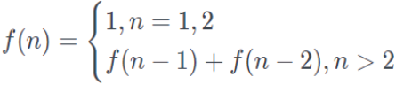

事实上，我们使用两个中间变量就可以：

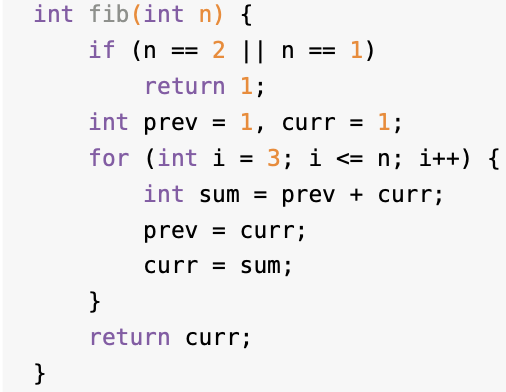

## 8.2 凑零钱问题

给你 k 种面值的硬币，面值分别为 c1, c2 ... ck ，每种硬币的数量无限，再给一个总金额 amount ，问你**最少**需要几枚硬币凑出这个金额，如果不可能凑出，算法返回 -1 。

```
/ coins 中是可选硬币面值，amount 是目标金额 
int coinChange(int[] coins, int amount);
```

如说 k = 3 ，面值分别为 1，2，5，总金额 amount = 11 。那么最少需 要 3 枚硬币凑出，即 11 = 5 + 5 + 1。

1. 先来暴力递归。核心是如何写出状态转移方程？

   **先确定「状态」**，也就是原问题和子问题中变化的变量。由于硬币数量无限，所以唯一的状态就是目标金额 amount 。一定是有限的量。

   **然后确定** **dp** **函数的定义**:当前的目标金额是 n ，至少需要 dp(n) 个硬币凑出该金额。

   **然后确定「选择」并择优**，也就是对于每个状态，可以做出什么选择改变当前状态。具体到这个问题，无论当的目标金额是多少，选择就是从面额列表coins 中选择一个硬币，然后目标金额就会减少:

   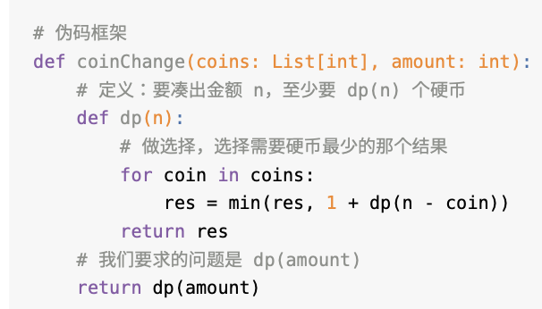

   **最后明确** **base case**，显然目标金额为 0 时，所需硬币数量为 0;当目标金额 小于 0 时，无解，返回 -1:

   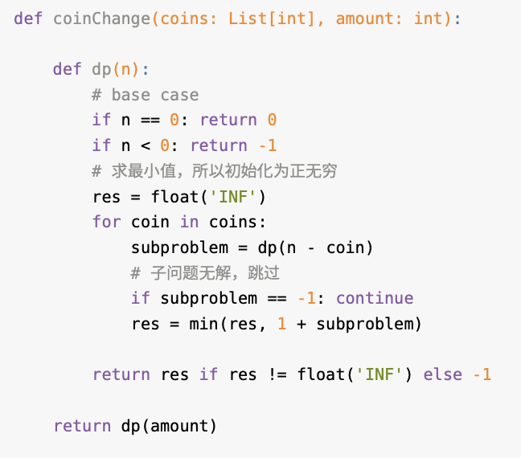

   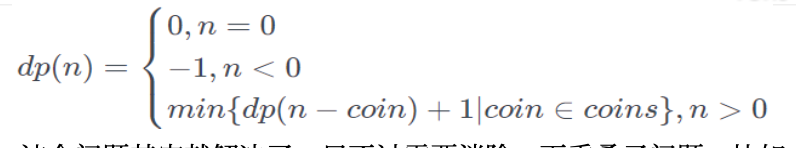

   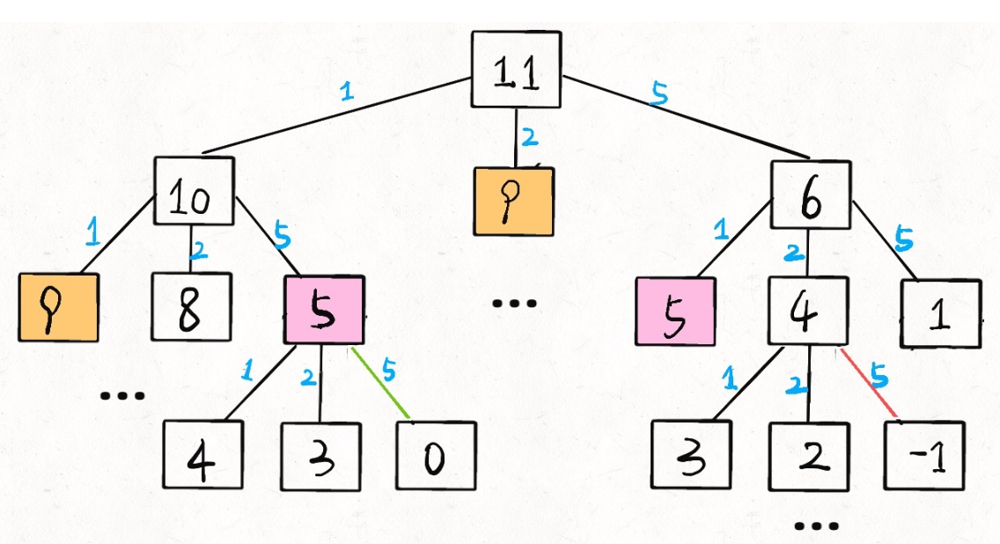

2. 通过备忘录来消解子问题

   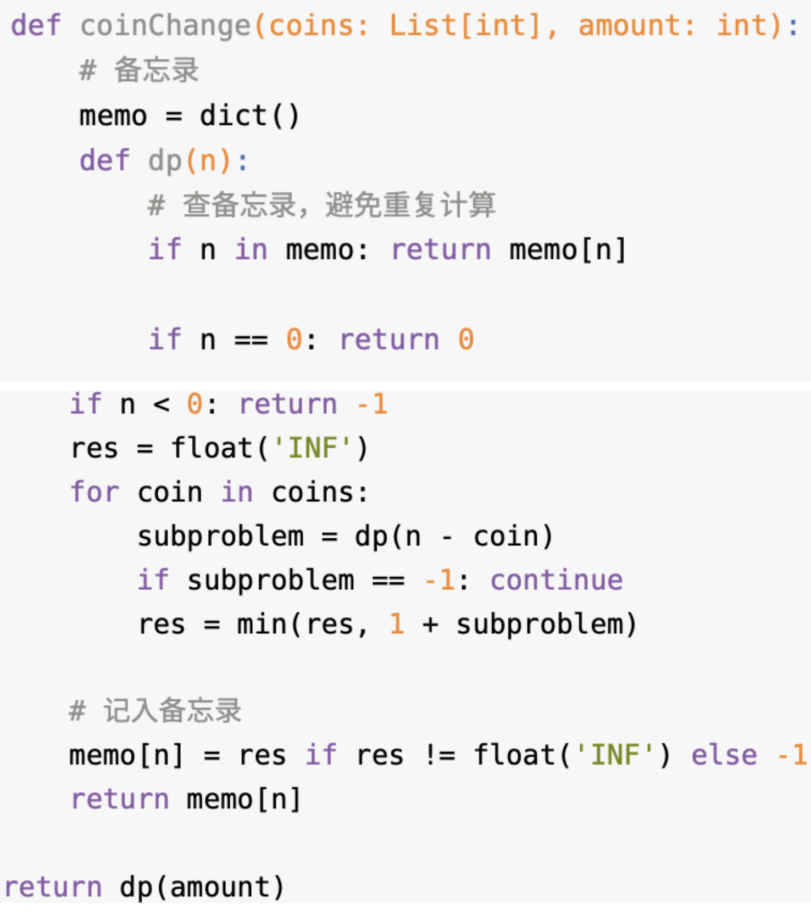

3. **dp**数组的迭代解法

**dp[i] = x** **表示，当目标金额为** **i** **时，至少需要** **x** **枚硬币**。

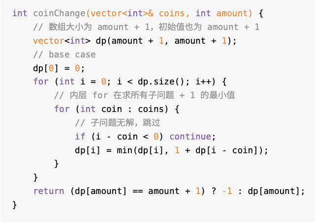

> dp数组的初始化问题，找最小值，初始化为大一点的数，找最大值，初始化为较小的值。
>
> 因为dp[i]依赖于前面已经算出的所有值，所以是双重循环。

下面看一个核心的问题，dp数组的遍历方向，有时候正向，有时候反向，有时候斜着。

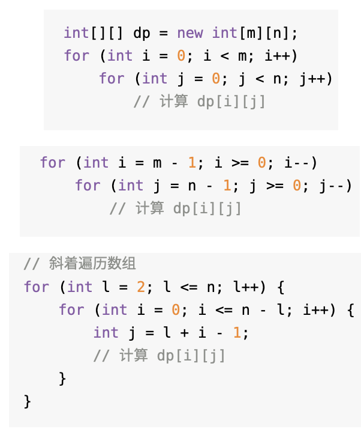

两个核心原则：

**1**、遍历的过程中，所需的**状态必须是已经计算出来的**。

2**、遍历的终点必须是存储结果的那个位置**。

## 8.3 最长增长子序列（LIS）

设计动态规划的通用技巧:数学归纳思想。

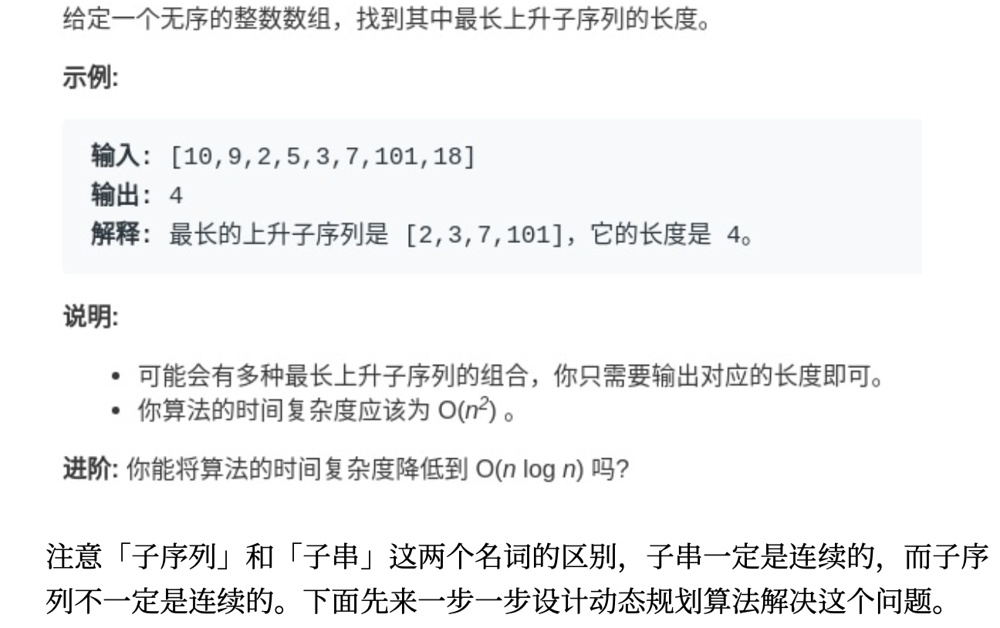

**我们的定义是这样的：dp[i] 表示以 nums[i] 这个数结尾的最长递增子序列的长度。**

算法演进的过程是这样的，：

下面我们将使用数学归纳法的思想，来推导状态转移。根据刚才我们对 dp 数组的定义，现在想求 dp[5] 的值，也就是想求以 nums[5] 为结尾的最长递增子序列。nums[5] = 3，既然是递增子序列，我们只要**找到前面那些结尾比 3 小的子序列，然后把 3 接到最后**，就可以形成一个新的递增子序列，而且这个新的子序列长度加一。

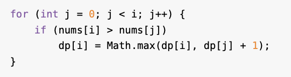

下面是自底向上：

```java
public int lengthOfLIS(int[] nums) {
    int[] dp = new int[nums.length];
    // dp 数组全都初始化为 1，因为子序列最少也要包含自己，所以⻓度最小为 1
    Arrays.fill(dp, 1);
    // 因为dp[i]依赖于前面算出的每个值，所以是双重循环
    for (int i = 0; i < dp.length; i++) {
      // 算dp[i]
        for (int j = 0; j < i; j++) {
            if (nums[i] > nums[j]) 
                dp[i] = Math.max(dp[i], dp[j] + 1);
        }
    }
  	// 遍历数组找最大值
    int res = 0;
    for (int i = 0; i < dp.length; i++) {
        res = Math.max(res, dp[i]);
    }
    return res;
}
```

至此，这道题就解决了，时间复杂度 O(N^2)。总结一下动态规划的设计流程：

首先明确 dp 数组所存数据的含义。这步很重要，如果不得当或者不够清晰，会阻碍之后的步骤。

然后根据 dp 数组的定义，运用数学归纳法的思想，假设 $dp[0...i-1]$ 都已知，想办法求出 $dp[i]$，一旦这一步完成，整个题目基本就解决了。

但如果无法完成这一步，很可能就是 dp 数组的定义不够恰当，需要重新定义 dp 数组的含义；或者可能是 dp 数组存储的信息还不够，不足以推出下一步的答案，需要把 dp 数组扩大成二维数组甚至三维数组。

最后想一想问题的 base case 是什么，以此来初始化 dp 数组，以保证算法正确运行。

### 8.3.1 子序列问题解题模板

既然要用动态规划，那就要定义 dp 数组，找状态转移关系。我们说的两种 思路模板，就是 dp 数组的定义思路。不同的问题可能需要不同的 dp 数组定 义来解决。

1. **一个一维的** **dp** **数组**

   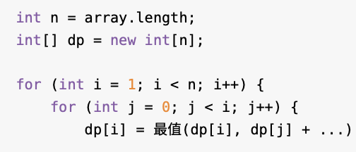

   举个我们写过的例子「最⻓递增子序列」，在这个思路中 dp 数组的定义 是:

   **在子数组** **array[0..i]** **中，我们要求的子序列(最⻓递增子序列)的⻓度 是** **dp[i]** 。

2. **一个二维的** **dp** **数组**

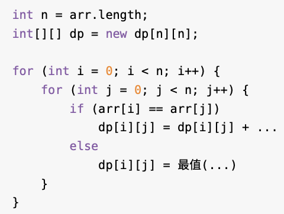

这种思路运用相对更多一些，尤其是涉及**两个字符串/数组的子序列**，比如 前文讲的「最⻓公共子序列」。本思路中 dp 数组含义又分为「只涉及一个 字符串」和「涉及两个字符串」两种情况。

**2.1** 涉及两个字符/数组时(比如最⻓公共子序列)，dp 数组的含义如 下:

**在子数组** **arr1[0..i]** **和子数组** **arr2[0..j]** **中，我们要求的子序列(最⻓ 公共子序列)⻓度为** `dp[i][j]` 。

**2.2** **只涉及一个字符串**/数组时(比如本文要讲的最⻓回文子序列)，dp 数组的含义如下:

**在子数组** **array[i..j]** **中，我们要求的子序列(最⻓回文子序列)的⻓度 为** `dp[i][j]` 。

第一种情况可以参考这两篇旧文:「编辑距离」「公共子序列」

下面就借最⻓回文子序列这个问题，详解一下第二种情况下如何使用动态规划。

### 8.3.2 **最⻓回文子序列**

这个问题对 dp 数组的定义是:**在子串** **s[i..j]** **中，最⻓回文子序列的⻓度为** `dp[i][j]` 


如果s[i]和s[j]相等，那么s[i+1..j-1] 中的最⻓回文子序列就是 s[i..j] 的最⻓回文子序列。

**如果它俩不相等**，说明它俩**不可能同时**出现在 s[i..j] 的最⻓回文子序列 中，那么把它俩**分别**加入 s[i+1..j-1] 中，看看哪个子串产生的回文子序列更⻓即可:

首先明确一下 base case，如果只有一个字符，显然最⻓回文子序列⻓度是 1，也就是 `dp[i][j] = 1 ，(i == j)` 。

因为 i 肯定小于等于 j ，所以对于那些 i > j 的位置，根本不存在什 么子序列，应该初始化为 0。

另外，看看刚才写的状态转移方程，想求 `dp[i][j]` 需要知道 `dp[i+1][j- 1]` ， `dp[i+1][j]` ， `dp[i][j-1]` 这三个位置;再看看我们确定的 base case，填入 dp 数组之后是这样:

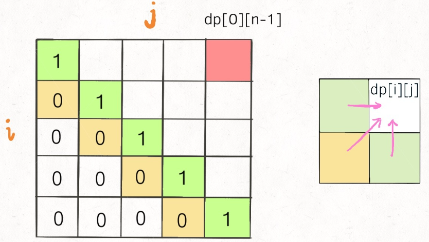

```java
int longestPalindromeSubseq(string s) {
        int n = s.size();
// dp 数组全部初始化为 0
        vector<vector<int>> dp (n, vector < int>(n, 0)); // base case
        for (int i = 0; i < n; i++)
            dp[i][i] = 1;
// 反着遍历保证正确的状态转移
        for (int i = n - 1; i >= 0; i--) {
            for (int j = i + 1; j < n; j++) { // 状态转移方程
                if (s[i] == s[j])
                    dp[i][j] = dp[i + 1][j - 1] + 2;
                else
                    dp[i][j] = max(dp[i + 1][j], dp[i][j - 1]);
            }
        }
// 整个 s 的最⻓回文子串⻓度
        return dp[0][n - 1];
    }
```


### 8.3.3 **最⻓公共子序列**

[最⻓公共子序列](https://github.com/haojunsheng/AlgorithmNotes/blob/master/src/com/code/offer/dp_greedy/LCS.java)

**第一步，一定要明确** **dp** **数组的含义**。对于两个字符串的动态规划问题，

套路是通用的。
 比如说对于字符串 s1 和 s2 ，一般来说都要构造一个这样的 DP table:

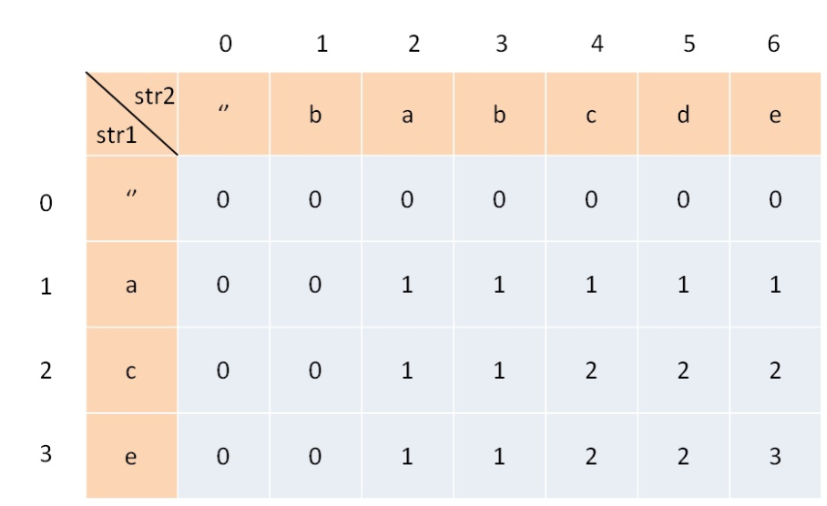

为了方便理解此表，我们暂时认为索引是从 1 开始的，待会的代码中只要稍 作调整即可。其中， dp[i][j] 的含义是:对于 s1[1..i] 和 s2[1..j] ， 它们的LCS⻓度是 dp[i][j] 。

比如上图的例子，`d[2][4]` 的含义就是:对于 "ac" 和 "babc" ，它们的 LCS⻓度是2。我们最终想得到的答案应该是 `dp[3][6]` 。

**第二步，定义** **base case**。
我们专门让索引为 0 的行和列表示空串， `dp[0][..] 和 dp[..][0]` 都应该初始化为 0，这就是 base case。

比如说，按照刚才 dp 数组的定义， `dp[0][3]`=0 的含义是:对于字符串"" 和 "bab" ，其 LCS 的⻓度为 0。因为有一个字符串是空串，它们的最⻓公共子序列的⻓度显然应该是 0。

第三步，找状态转移方程。

这是动态规划最难的一步，不过好在这种字符串问题的套路都差不多，权且 借这道题来聊聊处理这类问题的思路。定义一个二维数组 dp 用来存储最长公共子序列的长度，其中 dp[i][j] 表示 S1 的前 i 个字符与 S2 的前 j 个字符最长公共子序列的长度。考虑 S1i 与 S2j 值是否相等，分为两种情况：

1. 当 S1i==S2j 时，那么就能在 S1 的前 i-1 个字符与 S2 的前 j-1 个字符最长公共子序列的基础上再加上 S1i 这个值，最长公共子序列长度加 1，即 `dp[i][j] = dp[i-1][j-1] + 1`。
2. 当 S1i != S2j 时，此时最长公共子序列为 S1 的前 i-1 个和 S2 的前 j 个字符最长公共子序列，或者 S1 的前 i 个和 S2 的前 j-1 个字符最长公共子序列，它们最大者，即 `dp[i][j] = max{ dp[i-1][j], dp[i][j-1] }`。

综上，最长公共子序列的状态转移方程为：


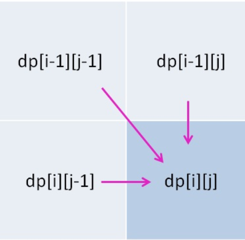

```java
package com.code.offer.dp_greedy;

import java.util.Arrays;

// 求两个字符串的 LCS ⻓度
// 输入: str1 = "abcde", str2 = "ace" 输出: 3
//解释: 最⻓公共子序列是 "ace"，它的⻓度是 3
public class LCS {
    public int longestCommonSubsequence(String s1, String s2) {
        if (s1 == null || s1.length() <= 0 || s2 == null || s2.length() <= 0) {
            return -1;
        }
        int length1 = s1.length();
        int length2 = s2.length();
        // dp[i][j]:对于 s1[1..i] 和 s2[1..j] ， 它们的LCS⻓度是 dp[i][j] 。
        int dp[][] = new int[length1 + 1][length2 + 1];
        Arrays.fill(dp, 0);
        //定义一个二维数组 dp 用来存储最长公共子序列的长度，其中 dp[i][j] 表示 S1 的前 i 个字符与 S2 的前 j 个字符最长公共子序列的长度。考虑 S1i 与 S2j 值是否相等，分为两种情况：
        //当 S1i==S2j 时，那么就能在 S1 的前 i-1 个字符与 S2 的前 j-1 个字符最长公共子序列的基础上再加上 S1i 这个值，最长公共子序列长度加 1，即 dp[i][j] = dp[i-1][j-1] + 1。
        //当 S1i != S2j 时，此时最长公共子序列为 S1 的前 i-1 个字符和 S2 的前 j 个字符最长公共子序列，或者 S1 的前 i 个字符和 S2 的前 j-1 个字符最长公共子序列，取它们的最大者，即 dp[i][j] = max{ dp[i-1][j], dp[i][j-1] }。
        for (int i = 1; i <= length1; ++i) {
            for (int j = 1; j <= length2; ++j) {
                if (s1.charAt(i - 1) == s2.charAt(j - 1)) {
                    dp[i][j] = dp[i - 1][j - 1] + 1;
                } else {
                    dp[i][j] = Math.max(dp[i - 1][j], dp[i][j - 1]);
                }
            }
        }
        return dp[length1][length2];
    }
}
```

## 8.4 编辑距离

[原题](https://github.com/labuladong/fucking-algorithm/blob/master/%E5%8A%A8%E6%80%81%E8%A7%84%E5%88%92%E7%B3%BB%E5%88%97/%E7%BC%96%E8%BE%91%E8%B7%9D%E7%A6%BB.md)

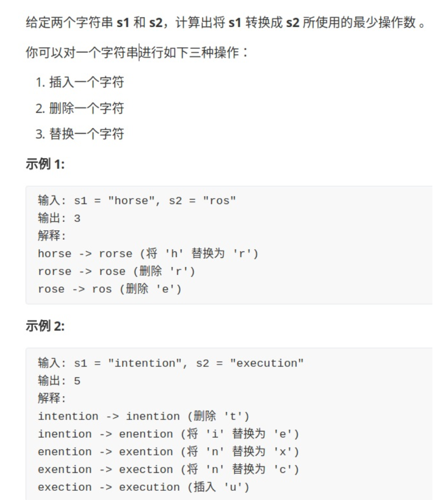

前文「最⻓公共子序列」说过，**解决两个字符串的动态规划问题，一般都是 用两个指针** **i,j** **分别指向两个字符串的最后，然后一步步往前走，缩小问 题的规模**。

设两个字符串分别为 "rad" 和 "apple"，为了把 `s1` 变成 `s2`，算法会这样进行：


动态规划用于求某个问题的**最优解**(通常是最大值和最小值)，并且该问题可以分解为多个子问题。
需要符合几个特点：1.求最优解，即求最值。2.整体的最优解依赖于各个子问题的最优解。3.子问题之间有相互重叠的更小的子问题。4.根据第三点，子问题之间有重叠，所以从上向下分析问题，从下向上求解问题。

贪婪算法和动态规划是不同的，需要用数学的方法来证明我们是正确的。

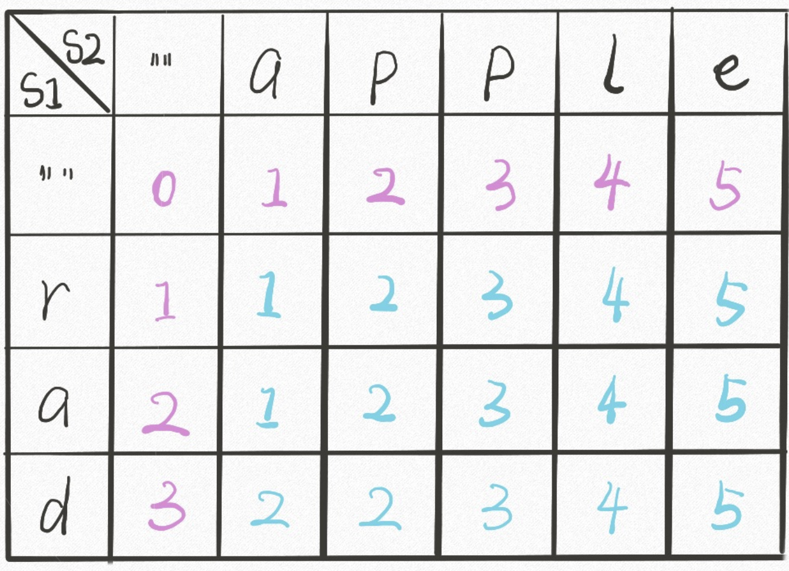

```java
package com.code.offer.dp_greedy;

import java.util.Scanner;

/**
 * 给2个字符串s1和s2，将s1转成s2最少的转换次数，可以插入，删除，替换，跳过
 */
public class EditDistance {

    // 动态规划，自顶向下
    public int minDistanceTop(String s1, String s2) {
        int length1 = s1.length();
        int length2 = s2.length();
        if (length1 <= 0 || s1 == null || length2 <= 0 || s2 == null) {
            return -1;
        }
        return dp(s1, s2, length1 - 1, length2 - 1);
    }

    public int dp(String s1, String s2, int i, int j) {
        if (i == -1) {
            return j + 1;
        }
        if (j == -1) {
            return i + 1;
        }
        if (s1.charAt(i) == s2.charAt(j)) {
            return dp(s1, s2, i - 1, j - 1);
        } else {
            return 1 + min(dp(s1, s2, i - 1, j - 1), dp(s1, s2, i, j - 1), dp(s1, s2, i - 1, j));
        }
    }

    // 动态规划+自顶向下+备忘录
    int memo[][];

    public int minDistanceTopMemo(String s1, String s2) {
        int length1 = s1.length();
        int length2 = s2.length();
        if (length1 <= 0 || s1 == null || length2 <= 0 || s2 == null) {
            return -1;
        }
        memo = new int[length1][length2];
        return dpMemo(s1, s2, length1 - 1, length2 - 1);
    }

    public int dpMemo(String s1, String s2, int i, int j) {
        if (i == -1) {
            return j + 1;
        }
        if (j == -1) {
            return i + 1;
        }
        if (memo[i][j] != Interger.Max_Value) {
            return memo[i][j];
        }
        if (s1.charAt(i) == s2.charAt(j)) {
            memo[i][j] = dp(s1, s2, i - 1, j - 1);
        } else {
            memo[i][j] = 1 + min(dp(s1, s2, i - 1, j - 1), dp(s1, s2, i, j - 1), dp(s1, s2, i - 1, j));
        }
        return memo[i][j];
    }

    // 动态规划，自底向上
    public int minDistance(String s1, String s2) {
        int length1 = s1.length();
        int length2 = s2.length();
        if (length1 <= 0 || s1 == null || length2 <= 0 || s2 == null) {
            return -1;
        }
        // dp[i][j]表示s1[i]和s2[j]之间的最小编辑距离
        // 找状态转移
        int dp[][] = new int[length1 + 1][length2 + 1];
        for (int i = 1; i <= length1; ++i) {
            dp[i][0] = i;
        }
        for (int j = 1; j <= length2; ++j) {
            dp[0][j] = j;
        }
        for (int i = 1; i <= length1; ++i) {
            for (int j = 1; j <= length2; ++j) {
                if (s1.charAt(i - 1) == s2.charAt(j - 1)) {
                    dp[i][j] = dp[i - 1][j - 1];
                } else {
                    dp[i][j] = 1 + min(dp[i - 1][j], dp[i][j - 1], dp[i - 1][j - 1]);
                }
            }
        }
        // 储存着整个 s1 和 s2 的最小编辑距离
        return dp[length1][length2];
    }

    private int min(int a, int b, int c) {
        return Math.min(a, Math.min(b, c));
    }

    public static void main(String[] args) {
        EditDistance editDistance = new EditDistance();
        Scanner scanner = new Scanner(System.in);
        String s1 = scanner.nextLine();
        String s2 = scanner.nextLine();
        System.out.println(editDistance.minDistanceTopMemo(s1, s2));
    }
}
```

扩展：

一般来说，处理两个字符串的动态规划问题，都是按本文的思路处理，建立 DP table。为什么呢，因为易于找出状态转移的关系，比如编辑距离的 DP table：

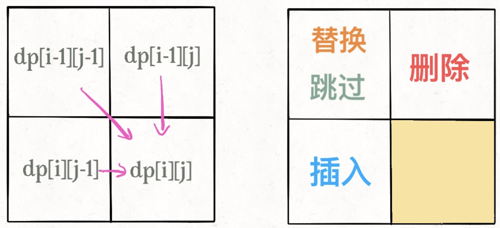

你可能还会问，**这里只求出了最小的编辑距离，那具体的操作是什么**？你之前举的修改公众号文章的例子，只有一个最小编辑距离肯定不够，还得知道具体怎么修改才行。

这个其实很简单，代码稍加修改，给 dp 数组增加额外的信息即可：

```java
// int[][] dp;
Node[][] dp;

class Node {
    int val;
    int choice;
    // 0 代表啥都不做
    // 1 代表插入
    // 2 代表删除
    // 3 代表替换
}
```

## 8.5 剪绳子

[14-剪绳子](https://github.com/haojunsheng/AlgorithmNotes/blob/master/src/com/code/offer/dp_greedy/CuttingRope_14.java)

可以采用动态规划和贪婪算法来求解，其中贪婪算法较为常规，贪婪算法基本需要提前做过，面试的时候想是想不到的。

动态规划：
1、定义函数**f(n)表示为把长度为n的绳子剪成若干段后各段长度乘积的最大值**。绳子的长度n是确定的，所以是状态。
2、对于第一刀，我们有n-1种可能的选择，可推导出f(n)=max{f(i)* f(n-i)};
3、很明显这是一个从上至下的递归，但是这个递归存在很多重复的计算，所以使用至下而上的动态规划，将子问题的最优解保存。
4、注意绳子剪成ix(n-i)和(n-i)xi是相同的；
5、注意不符合切割条件的输入n，以及输入为2、3长度时的结果，因为题中规定m>1。

```java
public static int dynamicPlan(int length) {
        if (length <= 1) {
            return 0;
        }
        if (length == 2) {
            return 1;
        }
        if (length == 3) {
            return 2;
        }

        // products数组存放的是每个子问题的最优解,注意保存的是子问题，比如products[3]保存的是f(4)的最大值
        // products[i]表示长度为i的绳子剪为若干段后各段长度乘积的最大值
        // 为了求解f(i)，我们需要求出所有的f(j)*f(i-j)
        // products的长度为length+1，因为存放的是0~length
        int[] products = new int[length + 1];
  // products[0]其实没价值
        products[0] = 0;
        products[1] = 1;
        products[2] = 2;
        products[3] = 3;

        int max = 0;
        for (int i = 4; i <= length; i++) {
            max = 0;
            for (int j = 1; j <= i / 2; j++) {
                if (products[j] * products[i - j] > max) {
                    max = products[j] * products[i - j];
                }
            }
            products[i] = max;
        }
        return products[length];
    }
```

## 8.6 连续子数组的最大和

[连续子数组的最大和42](https://github.com/haojunsheng/AlgorithmNotes/blob/master/src/com/code/offer/dp_greedy/GreatestSumOfSubarrays_42.java)

```java
/**
 * 面试题42：连续子数组的最大和
 * 题目：输入一个整型数组，数组里有正数也有负数。数组中一个或连续的多个整
 * 数组成一个子数组。求所有子数组的和的最大值。要求时间复杂度为O(n)。
 */

//找规律
public int FindGreatestSumOfSubArray(int[] array) {
        if (array.length == 0 || array == null) {
            return 0;
        }
        int max = array[0];
        int total = array[0];
        for (int i = 1; i < array.length; ++i) {
            //加上当前元素比之前结果大
            if (total >= 0) {
                total += array[i];
            } else {//如果前几项累计值负数，则认为有害于总和，total记录当前值。
                total = array[i];
            }
            if (total > max) {
                max = total;
            }
        }
        return max;
    }

/**
     * 使用动态规划
     * F（i）：以array[i]为末尾元素的子数组的和的最大值，子数组的元素的相对位置不变
     * F（i）=max（F（i-1）+array[i] ， array[i]）
     * res：所有子数组的和的最大值
     * res=max（res，F（i））
     *
     * 如数组[6, -3, -2, 7, -15, 1, 2, 2]
     * 初始状态：
     *     F（0）=6
     *     res=6
     * i=1：
     *     F（1）=max（F（0）-3，-3）=max（6-3，3）=3
     *     res=max（F（1），res）=max（3，6）=6
     * i=2：
     *     F（2）=max（F（1）-2，-2）=max（3-2，-2）=1
     *     res=max（F（2），res）=max（1，6）=6
     * i=3：
     *     F（3）=max（F（2）+7，7）=max（1+7，7）=8
     *     res=max（F（2），res）=max（8，6）=8
     * i=4：
     *     F（4）=max（F（3）-15，-15）=max（8-15，-15）=-7
     *     res=max（F（4），res）=max（-7，8）=8
     * 以此类推
     * 最终res的值为8
     * @param array
     * @return
     */
    public int FindGreatestSumOfSubArrayDp(int[] array) {
        int res = array[0]; //记录当前所有子数组的和的最大值
        int max = array[0];   //包含array[i]的连续数组最大值
        for (int i = 1; i < array.length; i++) {
            max = Math.max(max + array[i], array[i]);
            res = Math.max(max, res);
        }
        return res;
    }
```

## 8.7 数字翻译为字符串

和斐波那契数列差不多，f(i)表示长度为i时，翻译的方法数，f(i)=f(i-1)+gf(i-2)，只是添加了一些条件，当两位表示的字符大于26时,或者前面的字符为0时，g为0。

[数字翻译为字符串46](https://github.com/haojunsheng/AlgorithmNotes/blob/master/src/com/code/offer/dp_greedy/TransactionCount_46.java)

```java

public int translateNum(int num) {
        String str = String.valueOf(num);
        int len = str.length();
        int[] dp = new int[len + 1];
        dp[0] = 1;
        dp[1] = 1;
        for (int i = 1; i < len; ++i) {
            if (str.charAt(i - 1) == '0' || str.substring(i - 1, i + 1).compareTo("25") > 0) {
                //beginIndex -- 起始索引（包括）, 索引从 0 开始。 endIndex -- 结束索引（不包括）
                dp[i + 1] = dp[i];
            } else {
                dp[i + 1] = dp[i] + dp[i - 1];
            }
        }
        return dp[len];
    }
```

## 8.8 礼物的最大价值

[礼物的最大价值47](https://github.com/haojunsheng/AlgorithmNotes/blob/master/src/com/code/offer/array/MaxValue_47.java)

```java
 /**
 * 礼物的最大价值
 * 在一个 m*n 的棋盘的每一格都放有一个礼物，每个礼物都有一定的价值（价值大于 0）。
 * 你可以从棋盘的左上角开始拿格子里的礼物，并每次向右或者向下移动一格、直到到达棋盘的右下角。
 * 给定一个棋盘及其上面的礼物的价值，请计算你最多能拿到多少价值的礼物？
 * f(i,j)表示到达(i,j)时能拿到礼物总和的最大值
 * 递推公式f(i,j)=max{f(i-1,j),f(i,j-1)}+gift(i,j)
 */
 public int maxValue(int[][] grid) {
        if (grid.length == 0) {
            return 0;
        }
        int rows = grid.length;
        int cols = grid[0].length;
        int[][] dp = new int[rows][cols];
        dp[0][0] = grid[0][0];
        // 处理边界
        for (int i = 1; i < rows; i++) {
            dp[i][0] = grid[i][0] + dp[i - 1][0];
        }
        for (int j = 1; j < grid[0].length; j++) {
            dp[0][j] = grid[0][j] + dp[0][j - 1];
        }
        // 处理其他值
        for (int i = 1; i < rows; i++) {
            for (int j = 1; j < cols; j++) {
                dp[i][j] = Math.max(dp[i - 1][j], dp[i][j - 1]) + grid[i][j];
            }
        }
        return dp[rows - 1][cols - 1];
    }
```

## 8.9 最长不包含重复字符的子字符串

[最长不包含重复字符的子字符串48](https://github.com/haojunsheng/AlgorithmNotes/blob/master/src/com/code/offer/array/MaxValue_47.java)

```java
public int lengthOfLongestSubstring(String s) {
        //边界情况
        int length = s.length();
        if (length < 2) {
            return length;
        }
        int result = 1;
        //记录最长无重复字串的起始位置
        int[] dp = new int[length + 1];
        for (int i = 1; i <= length; i++) {
            dp[i] = i - 1;
        }
        for (int i = 2; i <= length; i++) {
            //当前要判断的字符
            String currentChar = String.valueOf(s.charAt(i - 1));
            //前一个最长无重复子串
            String sub = s.substring(dp[i - 1], i - 1);
            //如果前一个子串不包含当前字符，就将起始位置赋值给当前位置
            if (!sub.contains(currentChar)) {
                dp[i] = dp[i - 1];
            } else {
                //如果包含的话，就将起始位置设置为重复字符的下一个
                dp[i] = dp[i - 1] + sub.indexOf(currentChar) + 1;
            }
            result = Math.max(result, i - dp[i]);
        }
        return result;
    }
```

## 8.10 *KMP*字符匹配算法

[kmp](https://github.com/haojunsheng/AlgorithmNotes/blob/master/src/com/code/offer/dp_greedy/KMP.java)

**KMP** **算法永不回退** **txt** **的指针** **i** **，不走回头路(不会重复扫描txt** **)，而是借助** **dp** **数组中储存的信息把** **pat** **移到正确的位置继续匹**配，时间复杂度只需 O(N)，用空间换时间，所以我认为它是一种动态规划算法。

**先在开头约定，本文用** **pat** **表示模式串，⻓度为** **M** **，** **txt** **表示文本串， ⻓度为** **N** **。KMP **算法是在txt** **中查找子串** **pat** **，如果存在，返回这个 子串的起始索引，否则返回** **-1**。

```java
package com.code.offer.dp_greedy;

public class KMP {
    private int[][] dp;
    private String pat;

    public KMP(String pat) {
        this.pat = pat;
        int M = pat.length();
        // dp[状态][字符] = 下个状态
        dp = new int[M][256];
        // base case
        dp[0][pat.charAt(0)] = 1;
        // 影子状态 X 初始为 0
        int X = 0;
        // 构建状态转移图(稍改的更紧凑了)
        for (int j = 1; j < M; j++) {
            for (int c = 0; c < 256; c++) {
                dp[j][c] = dp[X][c];
            }
            dp[j][pat.charAt(j)] = j + 1;
            // 更新影子状态
            X = dp[X][pat.charAt(j)];
        }
    }

    public int search(String txt) {
        int M = pat.length();
        int N = txt.length();
        // pat 的初始态为 0
        int j = 0;
        for (int i = 0; i < N; i++) {
            // 计算 pat 的下一个状态
            j = dp[j][txt.charAt(i)];
            // 到达终止态，返回结果
            if (j == M) {
                return i - M + 1;
            }
        }
        // 没到达终止态，匹配失败
        return -1;
    }
}
```


## 8.11 高楼扔鸡蛋

你面前有一栋从 1 到 N 共 N 层的楼，然后给你 K 个鸡蛋 ( K 至少为 1)。现在确定这栋楼存在楼层 0 <= F <= N ，在这层楼将鸡 蛋扔下去，鸡蛋**恰好没摔碎**(高于 F 的楼层都会碎，低于 F 的楼层都不 会碎)。现在问你，**最坏**情况下，你**至少**要扔几次鸡蛋，才能**确定**这个楼层F 呢?

对动态规划问题，直接套我们以前多次强调的框架即可:这个问题有什么「状态」，有什么「选择」，然后穷举。

**「状态」很明显，就是当前拥有的鸡蛋数** **K** **和需要测试的楼层数** **N** 。随 着测试的进行，鸡蛋个数可能减少，楼层的搜索范围会减小，这就是状态的 变化。

**「选择」其实就是去选择哪层楼扔鸡蛋**。回顾刚才的线性扫描和二分思路， 二分查找每次选择到楼层区间的中间去扔鸡蛋，而线性扫描选择一层层向上 测试。不同的选择会造成状态的转移。

现在明确了「状态」和「选择」，**动态规划的基本思路就形成了**:肯定是个 二维的 dp 数组或者带有两个状态参数的 dp 函数来表示状态转移;外加 一个 for 循环来遍历所有选择，择最优的选择更新状态:

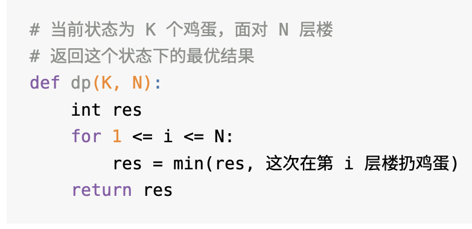

我们选择在第 i 层楼扔了鸡蛋之后，可能出现两种情况:鸡蛋碎了，鸡蛋 没碎。**注意，这时候状态转移就来了**:

**如果鸡蛋碎了**，那么鸡蛋的个数 K 应该减一，搜索的楼层区间应该从 [1..N] 变为 [1..i-1] 共 i-1 层楼;

**如果鸡蛋没碎**，那么鸡蛋的个数 K 不变，搜索的楼层区间应该从 [1..N] 变为 [i+1..N] 共 N-i 层楼。

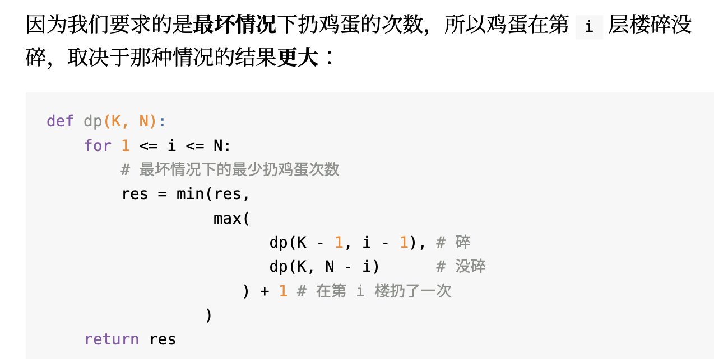


```java
package com.code.offer.dp_greedy;

import java.util.Scanner;

public class ThrowEgg {

    public int dp(int egg, int floor) {
        // 当鸡蛋数K为1时，显然只能线性扫描所有楼层
        if (egg == 1) {
            return n;
        }
        // 当楼层数 N 等于 0 时，显然不需要扔鸡蛋
        if (floor == 0) {
            return 0;
        }
        int res = 65535;//给res一个很大的值
        for (int i = 1; i <= floor; ++i) {
            res = Math.min(res, 1 + Math.max(
                    dp(egg, floor - i),
                    dp(egg - 1, i - 1)));
        }
        return res;
    }

    // 动态规划+自顶向下+备忘录
    int memo[][];

    public int superEggDrop(int egg, int floor) {
        memo = new int[egg + 1][floor + 1];
        //把备忘录每个元素初始化成最大的尝试次数
      for(int i = 1;i<=egg;i++){
          for (int j = 1; j <= floor; j++)
              cache[i][j] = j;
          }
      }
        return dpMemo(egg, floor);
    }

    private int dpMemo(int egg, int floor) {
        // 当鸡蛋数K为1时，显然只能线性扫描所有楼层
        if (egg == 1) {
            return floor;
        }
        // 当楼层数 N 等于 0 时，显然不需要扔鸡蛋
        if (floor == 0) {
            return 0;
        }
        if (memo[egg][floor] != 0) {
            return memo[egg][floor];
        }
        int res = 65535;
        for (int i = 1; i <= n; ++i) {
            res = Math.min(res, Math.max(dpMemo(k, n - i), dpMemo(k - 1, i - 1)) + 1);
        }
        memo[k][n] = res;
        return res;
    }

    /**
     * @param k 鸡蛋数
     * @param n 楼层数
     * @return
     */
    public int throwEgg(int egg, int floor) {
        if (egg <= 0 || floor <= 0) {
            return -1;
        }
        int dp[][] = new int[egg + 1][floor + 1];
        for (int i = 1; i <= egg; ++i) {
            for (int j = 1; j <= floor; ++j) {
                dp[i][j] = j;
            }
        }

        for (int i = 2; i <= egg; ++i) {
            for (int m = 1; m <= floor; ++m) {
                for (int j = 1; j < m; ++j) {
                    //扔鸡蛋的楼层从1到m枚举一遍，如果当前算出的尝试次数小于上一次算出的尝试次数，则取代上一次的尝试次数。
                    dp[i][m] = Math.min(dp[i][m], 1 + Math.max(dp[i][m - j], dp[i - 1][j - 1]));
                }
            }
        }
        return dp[egg][floor];
    }

    public static void main(String[] args) {
        Scanner scanner = new Scanner(System.in);
        int k = scanner.nextInt();
        int n = scanner.nextInt();
        ThrowEgg throwEgg = new ThrowEgg();
        System.out.println(throwEgg.throwEgg(k, n));
    }
}

// 优化版本
public int getMinSteps(int eggNum, int floorNum) {
        if (eggNum < 1 || floorNum < 1) {
            return 0;
        }
        //上一层备忘录，存储鸡蛋数量-1的floorNum层楼条件下的最优化尝试次数
        int[] preCache = new int[floorNum + 1];
        //当前备忘录，存储当前鸡蛋数量的floorNum层楼条件下的最优化尝试次数
        int[] currentCache = new int[floorNum + 1];
        //把备忘录每个元素初始化成最大的尝试次数
        for (int i = 1; i <= floorNum; i++) {
            currentCache[i] = i;
        }
        for (int n = 2; n <= eggNum; n++) {
            //当前备忘录拷贝给上一次备忘录，并重新初始化当前备忘录
            preCache = currentCache.clone();
            for (int i = 1; i <= floorNum; i++) {
                currentCache[i] = i;
            }
            for (int m = 1; m <= floorNum; m++) {
                for (int k = 1; k < m; k++) {
                    //扔鸡蛋的楼层从1到m枚举一遍，如果当前算出的尝试次数小于上一次算出的尝试次数，则取代上一次的尝试次数。
                    //这里可以打印k的值，从而知道第一个鸡蛋是从第几次扔的。
                    currentCache[m] = Math.min(currentCache[m],
                            1 + Math.max(preCache[k - 1], currentCache[m - k]));
                }
            }
        }
        return currentCache[floorNum];
    }
```

## 8.12 n个骰子的点数

[n个骰子的点数60](https://github.com/haojunsheng/AlgorithmNotes/blob/master/src/com/code/offer/dp_greedy/PrintProbability_60.java)

```java
/**
 * n个骰子的点数
 * 把n个骰子扔在地上，所有骰子朝上一面的点数之和为s。输入n，打印出s的所有可能的值出现的概率。
 * 你需要用一个浮点数数组返回答案，其中第 i 个元素代表这 n 个骰子所能掷出的点数集合中第 i 小的那个的概率。
 * 输入: 1
 * 输出: [0.16667,0.16667,0.16667,0.16667,0.16667,0.16667]
 * 输入: 2
 * 输出: [0.02778,0.05556,0.08333,0.11111,0.13889,0.16667,0.13889,0.11111,0.08333,0.05556,0.02778]
 */
public class PrintProbability_60 {
    /**
     * 状态：二维表 dp[n][6*n]。dp[i][j] ，表示投掷完 i 枚骰子后，点数 j 的出现次数。
     * 转移方程：dp[n][j]=dp[n][j-1]+dp[n][j-2]+...+dp[n][j-6]
     */
    public double[] twoSum(int n) {
        int[][] dp = new int[n][6 * n];
        //初始状态
        for (int j = 0; j < 6; ++j) {
            dp[0][j] = 1;
        }

        for (int i = 1; i < n; ++i) {
            for (int j = i; j < (i + 1) * 6; ++j) {
                for (int dice = 1; dice <= 6; ++dice) {
                    if (j - dice < 0) {
                        break;
                    }
                    dp[i][j] += dp[i - 1][j - dice];
                }
            }
        }
        double[] res = new double[5 * n + 1];
        int j = n - 1;
        for (int i = 0; i < res.length; ++i) {
            res[i] = dp[n - 1][j++] / Math.pow(6, n);
        }
        return res;
    }
}
```

## 8.13 正则表达式匹配

[正则表达式匹配19](https://github.com/haojunsheng/AlgorithmNotes/blob/master/src/com/code/offer/string/RegularMatch_19.java)

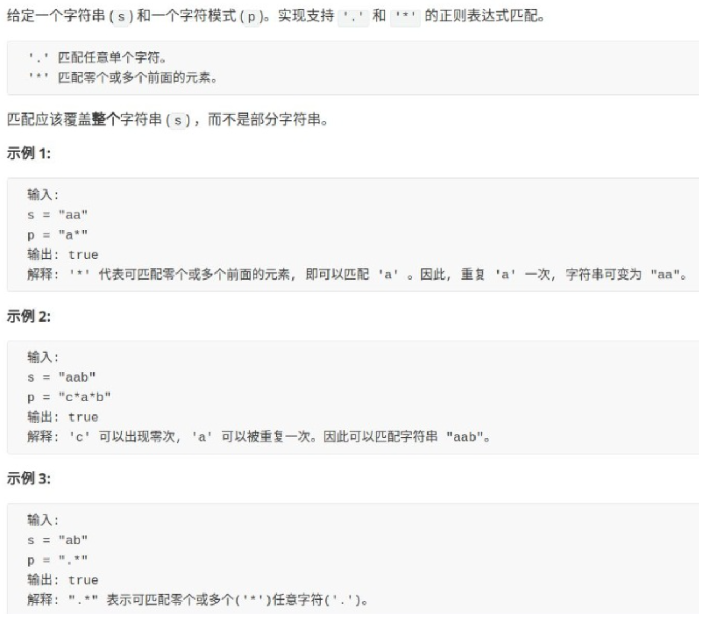

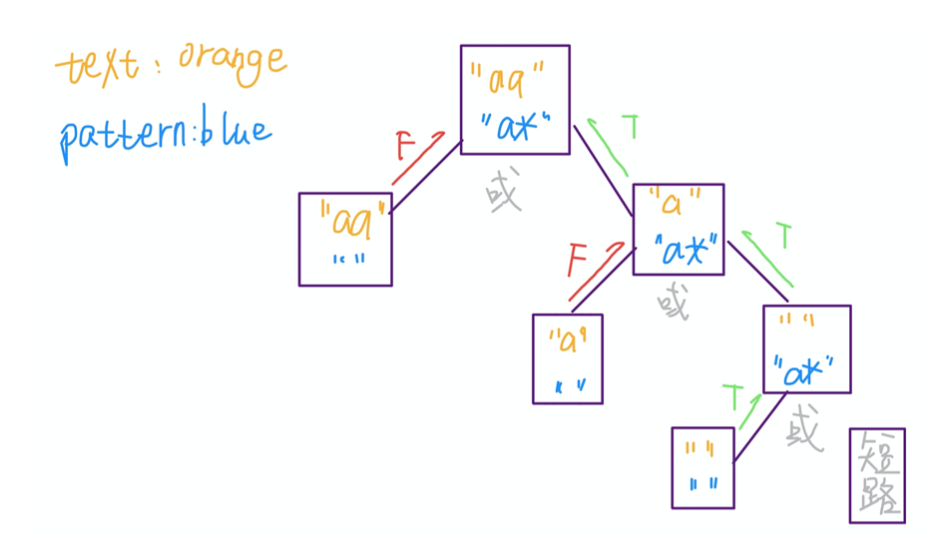


```java
// 题目：请实现一个函数用来匹配包含'.'和'*'的正则表达式。模式中的字符'.'
// 表示任意一个字符，而'*'表示它前面的字符可以出现任意次（含0次）。在本题
// 中，匹配是指字符串的所有字符匹配整个模式。例如，字符串"aaa"与模式"a.a"
// 和"ab*ac*a"匹配，但与"aa.a"及"ab*a"均不匹配。
public boolean match(char[] str, char[] pattern) {
        if (str == null || pattern == null) {
            return false;
        }
        int strIndex = 0;
        int patternIndex = 0;
        return matchCore(str, strIndex, pattern, patternIndex);
    }

    public boolean matchCore(char[] str, int strIndex, char[] pattern, int patternIndex) {
        //str到尾，pattern到尾，匹配成功
        if (strIndex == str.length && patternIndex == pattern.length) {
            return true;
        }
        //str未到尾，pattern到尾，匹配失败
        if (strIndex != str.length && patternIndex == pattern.length) {
            return false;
        }
        //str到尾，pattern未到尾(不一定匹配失败，因为a*可以匹配0个字符)
        if (strIndex == str.length && patternIndex != pattern.length) {
            //只有pattern剩下的部分类似a*b*c*的形式，才匹配成功
            if (patternIndex + 1 < pattern.length && pattern[patternIndex + 1] == '*') {
                return matchCore(str, strIndex, pattern, patternIndex + 2);
            }
            return false;
        }

        //str未到尾，pattern未到尾
        if (patternIndex + 1 < pattern.length && pattern[patternIndex + 1] == '*') {
            if (pattern[patternIndex] == str[strIndex] || (pattern[patternIndex] == '.' && strIndex != str.length)) {
                return matchCore(str, strIndex, pattern, patternIndex + 2)//*匹配0个，跳过
                        || matchCore(str, strIndex + 1, pattern, patternIndex + 2)//*匹配1个，跳过
                        || matchCore(str, strIndex + 1, pattern, patternIndex);//*匹配1个，再匹配str中的下一个
            } else {
                //直接跳过*（*匹配到0个）
                return matchCore(str, strIndex, pattern, patternIndex + 2);
            }
        }
        // 处理.的情况
        if (pattern[patternIndex] == str[strIndex] || (pattern[patternIndex] == '.' && strIndex != str.length)) {
            return matchCore(str, strIndex + 1, pattern, patternIndex + 1);
        }

        return false;
    }
```

我们如何来寻找重叠子问题呢？

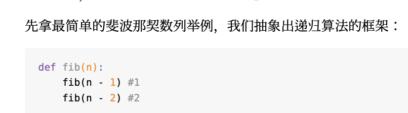

看着这个框架，请问原问题 f(n) 如何触达子问题 f(n - 2) ?有两种路径，一 是 f(n) -> #1 -> #1, 二是 f(n) -> #2。前者经过两次递归，后者进过一次递归 而已。两条不同的计算路径都到达了同一个问题，这就是「重叠子问题」， 而且可以肯定的是，**只要你发现一条重复路径，这样的重复路径一定存在千 万条，意味着巨量子问题重叠。**


## 8.14 打家劫舍问题


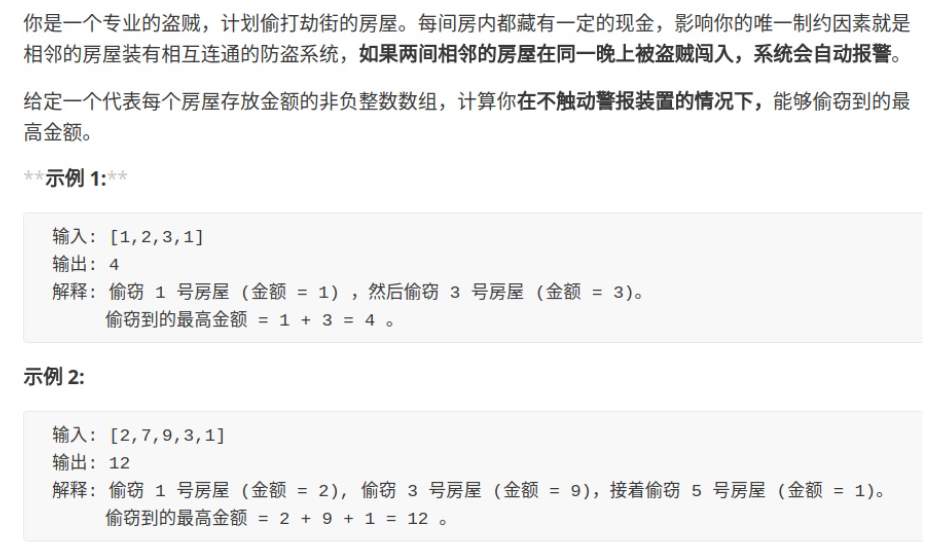

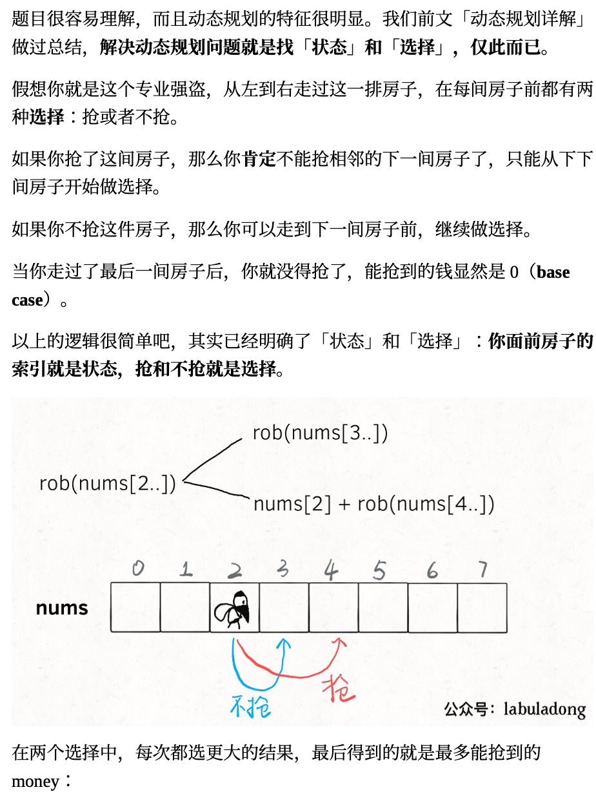

```java
public int rob(int[] nums) {
    return dp(nums, 0);
}

// 返回 nums[start..] 能抢到的最大值
// 你面前房子的索引就是状态，抢和不抢就是选择。
private int dp(int[] nums, int start) {
    if (start >= nums.length) {
        return 0;
    }
    // 分别是不抢去下家，和抢了去下下家
    int res = Math.max(dp(nums, start + 1), nums[start] + dp(nums, start + 2));
    return res;
}
```

这个玩意和斐波那切数列很相似，存在重叠子问题，需要进行优化。

```java
private int[] memo;

public int rob(int[] nums) {
    memo = new int[nums.length];
    Arrays.fill(memo, -1);
    return dp(nums, 0);
}

// 返回 dp[start..] 能抢到的最大值
private int dp(int[] nums, int start) {
    if (start >= nums.length) {
        return 0;
    }
    if (memo[start] != -1) {
        return memo[start];
    }
    int res = Math.max(dp(nums, start + 1), nums[start] + dp(nums, start + 2));
    // 记入入备忘录
    memo[start] = res;
    return res;
}
```

自底向上的解法：

```java
int rob(int[] nums) {
        int n = nums.length;
        // dp[i] = x 表示:
        // 从第 i 间房子开始抢劫，最多能抢到的钱为 x
        // base case: dp[n] = 0
        int[] dp = new int[n + 2];
        for (int i = n - 1; i >= 0; i--) {
            dp[i] = Math.max(dp[i + 1], nums[i] + dp[i + 2]);
        }
        return dp[0];
    }
```

### 8.14.1 打家劫舍问题2

**这些房子不是一排，而是围成了一个圈**

也就是说，现在第一间房子和最后一间房子也相当于是相邻的，不能同时 抢。比如说输入数组 nums=[2,3,2] ，算法返回的结果应该是3而不是4， 因为开头和结尾不能同时被抢。这个约束条件看起来应该不难解决，我们前文「单调栈解决 Next Greater Number」说过一种解决环形数组的方案，那么在这个问题上怎么处理呢?

首先，首尾房间不能同时被抢，那么只可能有三种不同情况:要么都不被 抢;要么第一间房子被抢最后一间不抢;要么最后一间房子被抢第一间不抢。

```java
public int rob(int[] nums) {
        int n = nums.length;
        if (n == 1) return nums[0];
        return Math.max(robRange(nums, 0, n - 2),
                robRange(nums, 1, n - 1));
    }

    // 仅计算闭区间 [start,end] 的最优结果
    int robRange(int[] nums, int start, int end) {
        int n = nums.length;
        int dp_i_1 = 0, dp_i_2 = 0;
        int dp_i = 0;
        for (int i = end; i >= start; i--) {
            dp_i = Math.max(dp_i_1, nums[i] + dp_i_2);
            dp_i_2 = dp_i_1;
            dp_i_1 = dp_i;
        }
        return dp_i;
    }
```

## 8.15 股票买卖问题

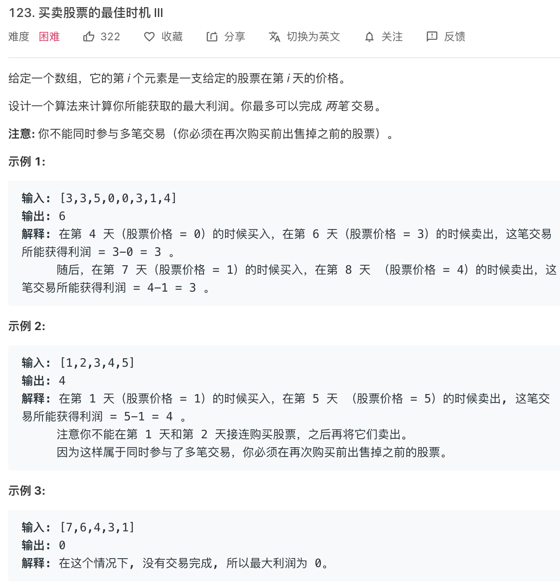

1. **穷举框架**

而这里，我们不用递归思想进行穷举，而是利用「状态」进行穷举。我们具 体到每一天，看看总共有几种可能的「状态」，再找出每个「状态」对应的 「选择」。我们要穷举所有「状态」，穷举的目的是根据对应的「选择」更 新状态。听起来抽象，你只要记住「状态」和「选择」两个词就行，下面实 操一下就很容易明白了。

```
for 状态1 in 状态1的所有取值：
    for 状态2 in 状态2的所有取值：
        for ...
            dp[状态1][状态2][...] = 择优(选择1，选择2...)
```

比如说这个问题，**每天都有三种「选择」**:买入、卖出、无操作，我们用 buy, sell, rest 表示这三种选择。但问题是，并不是每天都可以任意选择这三 种选择的，因为 sell 必须在 buy 之后，buy 必须在 sell 之后。那么 rest 操作 还应该分两种状态，一种是 buy 之后的 rest(持有了股票)，一种是 sell 之 后的 rest(没有持有股票)。而且别忘了，我们还有交易次数 k 的限制，就 是说你 buy 还只能在 k > 0 的前提下操作。

很复杂对吧，不要怕，我们现在的目的只是穷举，你有再多的状态，老夫要做的就是一把梭全部列举出来。这个问题的「状态」有三个，第一个是天数，第二个是允许交易的最大次数，第三个是当前的持有状态（即之前说的 rest 的状态，我们不妨用 1 表示持有，0 表示没有持有）。然后我们用一个三维数组就可以装下这几种状态的全部组合：

```
dp[i][k][0 or 1]
0 <= i <= n-1, 1 <= k <= K
n 为天数，大 K 为最多交易数
此问题共 n × K × 2 种状态，全部穷举就能搞定。

for 0 <= i < n:
    for 1 <= k <= K:
        for s in {0, 1}:
            dp[i][k][s] = max(buy, sell, rest)
```

而且我们可以用自然语言描述出每一个状态的含义，比如说 `dp[3][2][1]` 的含义就是:今天是第三天，我现在手上持有着股票，至今最多进行 2 次交 易。再比如 `dp[2][3][0]` 的含义:今天是第二天，我现在手上没有持有股 票，至今最多进行 3 次交易。

我们想求的最终答案是 `dp[n - 1][K][0]`，即最后一天，最多允许 K 次交易， 最多获得多少利润。读者可能问为什么不是 `dp[n - 1][K][1]`?因为 [1] 代表手 上还持有股票，[0] 表示手上的股票已经卖出去了，很显然后者得到的利润 一定大于前者。

2. 状态转移

现在，我们完成了「状态」的穷举，我们开始思考每种「状态」有哪些「选择」，应该如何更新「状态」。只看「持有状态」，可以画个状态转移图。

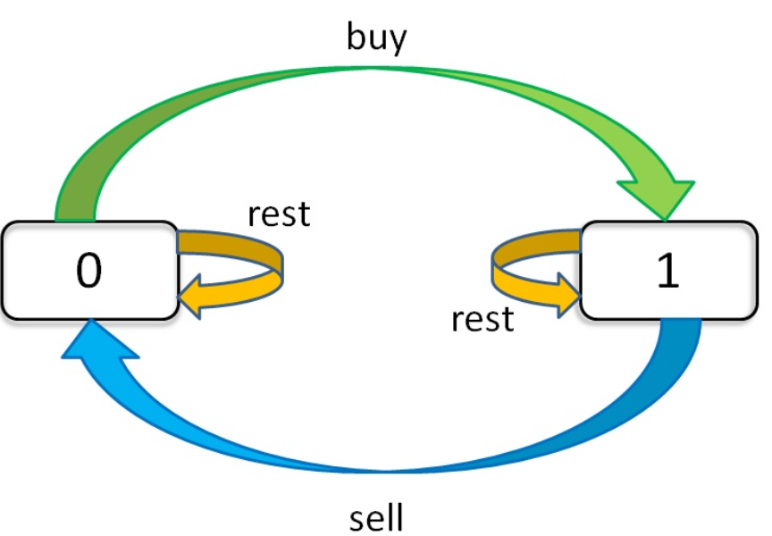

通过这个图可以很清楚地看到，每种状态（0 和 1）是如何转移而来的。根据这个图，我们来写一下状态转移方程：

```
dp[i][k][0] = max(dp[i-1][k][0], dp[i-1][k][1] + prices[i])
              max(   选择 rest  ,           选择 sell      )

解释：今天我没有持有股票，有两种可能：
要么是我昨天就没有持有，然后今天选择 rest，所以我今天还是没有持有；
要么是我昨天持有股票，但是今天我 sell 了，所以我今天没有持有股票了。

dp[i][k][1] = max(dp[i-1][k][1], dp[i-1][k-1][0] - prices[i])
              max(   选择 rest  ,           选择 buy         )

解释：今天我持有着股票，有两种可能：
要么我昨天就持有着股票，然后今天选择 rest，所以我今天还持有着股票；
要么我昨天本没有持有，但今天我选择 buy，所以今天我就持有股票了。
```

这个解释应该很清楚了，如果 buy，就要从利润中减去 prices[i]，如果 sell，就要给利润增加 prices[i]。今天的最大利润就是这两种可能选择中较大的那个。而且注意 k 的限制，我们在选择 buy 的时候，把 k 减小了 1，很好理解吧，当然你也可以在 sell 的时候减 1，一样的。

现在，我们已经完成了动态规划中最困难的一步：状态转移方程。如果之前的内容你都可以理解，那么你已经可以秒杀所有问题了，只要套这个框架就行了。不过还差最后一点点，就是定义 base case，即最简单的情况。

```
dp[-1][k][0] = 0
解释：因为 i 是从 0 开始的，所以 i = -1 意味着还没有开始，这时候的利润当然是 0 。
dp[-1][k][1] = -infinity
解释：还没开始的时候，是不可能持有股票的，用负无穷表示这种不可能。
dp[i][0][0] = 0
解释：因为 k 是从 1 开始的，所以 k = 0 意味着根本不允许交易，这时候利润当然是 0 。
dp[i][0][1] = -infinity
解释：不允许交易的情况下，是不可能持有股票的，用负无穷表示这种不可能。
```

总结：

```
base case：
dp[-1][k][0] = dp[i][0][0] = 0
dp[-1][k][1] = dp[i][0][1] = -infinity

状态转移方程：
dp[i][k][0] = max(dp[i-1][k][0], dp[i-1][k][1] + prices[i])
dp[i][k][1] = max(dp[i-1][k][1], dp[i-1][k-1][0] - prices[i])
```

读者可能会问，这个数组索引是 -1 怎么编程表示出来呢，负无穷怎么表示呢？这都是细节问题，有很多方法实现。现在完整的框架已经完成，下面开始具体化。

开始做题：

1. k=1,直接套状态转移方程，根据 base case，可以做一些化简：

   ```
   dp[i][1][0] = max(dp[i-1][1][0], dp[i-1][1][1] + prices[i])
   dp[i][1][1] = max(dp[i-1][1][1], dp[i-1][0][0] - prices[i]) 
               = max(dp[i-1][1][1], -prices[i])
   解释：k = 0 的 base case，所以 dp[i-1][0][0] = 0。
   
   现在发现 k 都是 1，不会改变，即 k 对状态转移已经没有影响了。
   可以进行进一步化简去掉所有 k：
   dp[i][0] = max(dp[i-1][0], dp[i-1][1] + prices[i])
   dp[i][1] = max(dp[i-1][1], -prices[i])
   ```

```java
int n = prices.length;
int[][] dp = new int[n][2];
for (int i = 0; i < n; i++) {
    dp[i][0] = Math.max(dp[i-1][0], dp[i-1][1] + prices[i]);
    dp[i][1] = Math.max(dp[i-1][1], -prices[i]);
}
return dp[n - 1][0];
```

显然 `i = 0` 时 `dp[i-1]` 是不合法的。这是因为我们没有对 `i` 的 base case 进行处理。可以这样处理：

```java
for (int i = 0; i < n; i++) {
    if (i - 1 == -1) {
        dp[i][0] = 0;
        // 解释：
        //   dp[i][0] 
        // = max(dp[-1][0], dp[-1][1] + prices[i])
        // = max(0, -infinity + prices[i]) = 0
        dp[i][1] = -prices[i];
        //解释：
        //   dp[i][1] 
        // = max(dp[-1][1], dp[-1][0] - prices[i])
        // = max(-infinity, 0 - prices[i]) 
        // = -prices[i]
        continue;
    }
    dp[i][0] = Math.max(dp[i-1][0], dp[i-1][1] + prices[i]);
    dp[i][1] = Math.max(dp[i-1][1], -prices[i]);
}
return dp[n - 1][0];
```

第一题就解决了，但是这样处理 base case 很麻烦，而且注意一下状态转移方程，新状态只和相邻的一个状态有关，其实不用整个 dp 数组，只需要一个变量储存相邻的那个状态就足够了，这样可以把空间复杂度降到 O(1):

```java
// k == 1
int maxProfit_k_1(int[] prices) {
    int n = prices.length;
    // base case: dp[-1][0] = 0, dp[-1][1] = -infinity
    int dp_i_0 = 0, dp_i_1 = Integer.MIN_VALUE;
    for (int i = 0; i < n; i++) {
        // dp[i][0] = max(dp[i-1][0], dp[i-1][1] + prices[i])
        dp_i_0 = Math.max(dp_i_0, dp_i_1 + prices[i]);
        // dp[i][1] = max(dp[i-1][1], -prices[i])
        dp_i_1 = Math.max(dp_i_1, -prices[i]);
    }
    return dp_i_0;
}
```

2. **k = +infinity**，如果 k 为正无穷，那么就可以认为 k 和 k - 1 是一样的。可以这样改写框架：

   ```java
   dp[i][k][0] = max(dp[i-1][k][0], dp[i-1][k][1] + prices[i])
   dp[i][k][1] = max(dp[i-1][k][1], dp[i-1][k-1][0] - prices[i])
               = max(dp[i-1][k][1], dp[i-1][k][0] - prices[i])
   
   我们发现数组中的 k 已经不会改变了，也就是说不需要记录 k 这个状态了：
   dp[i][0] = max(dp[i-1][0], dp[i-1][1] + prices[i])
   dp[i][1] = max(dp[i-1][1], dp[i-1][0] - prices[i])
   直接翻译成代码：
   int maxProfit_k_inf(int[] prices) {
       int n = prices.length;
       int dp_i_0 = 0, dp_i_1 = Integer.MIN_VALUE;
       for (int i = 0; i < n; i++) {
           int temp = dp_i_0;
           dp_i_0 = Math.max(dp_i_0, dp_i_1 + prices[i]);
           dp_i_1 = Math.max(dp_i_1, temp - prices[i]);
       }
       return dp_i_0;
   }
   ```

3. **k = +infinity with cooldown**，每次 sell 之后要等一天才能继续交易。只要把这个特点融入上一题的状态转移方程即可：

```java
dp[i][0] = max(dp[i-1][0], dp[i-1][1] + prices[i])
dp[i][1] = max(dp[i-1][1], dp[i-2][0] - prices[i])
解释：第 i 天选择 buy 的时候，要从 i-2 的状态转移，而不是 i-1 。
翻译成代码：
int maxProfit_with_cool(int[] prices) {
    int n = prices.length;
    int dp_i_0 = 0, dp_i_1 = Integer.MIN_VALUE;
    int dp_pre_0 = 0; // 代表 dp[i-2][0]
    for (int i = 0; i < n; i++) {
        int temp = dp_i_0;
        dp_i_0 = Math.max(dp_i_0, dp_i_1 + prices[i]);
        dp_i_1 = Math.max(dp_i_1, dp_pre_0 - prices[i]);
        dp_pre_0 = temp;
    }
    return dp_i_0;
}
```

4. **k = +infinity with fee**，每次交易要支付手续费，只要把手续费从利润中减去即可。改写方程：

```java
dp[i][0] = max(dp[i-1][0], dp[i-1][1] + prices[i])
dp[i][1] = max(dp[i-1][1], dp[i-1][0] - prices[i] - fee)
解释：相当于买入股票的价格升高了。
在第一个式子里减也是一样的，相当于卖出股票的价格减小了。

int maxProfit_with_fee(int[] prices, int fee) {
    int n = prices.length;
    int dp_i_0 = 0, dp_i_1 = Integer.MIN_VALUE;
    for (int i = 0; i < n; i++) {
        int temp = dp_i_0;
        dp_i_0 = Math.max(dp_i_0, dp_i_1 + prices[i]);
        dp_i_1 = Math.max(dp_i_1, temp - prices[i] - fee);
    }
    return dp_i_0;
}
```

5. k=2,k = 2 和前面题目的情况稍微不同，因为上面的情况都和 k 的关系不太大。要么 k 是正无穷，状态转移和 k 没关系了；要么 k = 1，跟 k = 0 这个 base case 挨得近，最后也没有存在感。

这道题 k = 2 和后面要讲的 k 是任意正整数的情况中，对 k 的处理就凸显出来了。我们直接写代码，边写边分析原因。

```
int max_k = 2;
int[][][] dp = new int[n][max_k + 1][2];
for (int i = 0; i < n; i++) {
    for (int k = max_k; k >= 1; k--) {
        if (i - 1 == -1) { /*处理 base case */ }
        dp[i][k][0] = max(dp[i-1][k][0], dp[i-1][k][1] + prices[i]);
        dp[i][k][1] = max(dp[i-1][k][1], dp[i-1][k-1][0] - prices[i]);
    }
}
// 穷举了 n × max_k × 2 个状态，正确。
return dp[n - 1][max_k][0];
```

6. **k = any integer**

有了上一题 k = 2 的铺垫，这题应该和上一题的第一个解法没啥区别。但是出现了一个超内存的错误，原来是传入的 k 值会非常大，dp 数组太大了。现在想想，交易次数 k 最多有多大呢？

一次交易由买入和卖出构成，至少需要两天。所以说有效的限制 k 应该不超过 n/2，如果超过，就没有约束作用了，相当于 k = +infinity。这种情况是之前解决过的。

直接把之前的代码重用：

```java
int maxProfit_k_any(int max_k, int[] prices) {
    int n = prices.length;
    if (max_k > n / 2) 
        return maxProfit_k_inf(prices);

    int[][][] dp = new int[n][max_k + 1][2];
    for (int i = 0; i < n; i++) 
        for (int k = max_k; k >= 1; k--) {
            if (i - 1 == -1) { /* 处理 base case */ }
            dp[i][k][0] = max(dp[i-1][k][0], dp[i-1][k][1] + prices[i]);
            dp[i][k][1] = max(dp[i-1][k][1], dp[i-1][k-1][0] - prices[i]);     
        }
    return dp[n - 1][max_k][0];
}
```


## 8.16 **博弈问题**

### 8.16.1 石头游戏

你和你的朋友面前有一排石头堆，用一个数组 piles 表示，piles[i] 表示第 i 堆石子有多少个。你们轮流拿石头，一次拿一堆，但是只能拿走最左边或者 最右边的石头堆。所有石头被拿完后，谁拥有的石头多，谁获胜。

石头的堆数可以是任意正整数，石头的总数也可以是任意正整数，这样就能 打破先手必胜的局面了。比如有三堆石头 piles = [1, 100, 3] ，先手不管 拿 1 还是 3，能够决定胜负的 100 都会被后手拿走，后手会获胜。

**假设两人都很聪明**，请你设计一个算法，返回先手和后手的最后得分(石头 总数)之差。比如上面那个例子，先手能获得 4 分，后手会获得 100 分，你 的算法应该返回 -96。

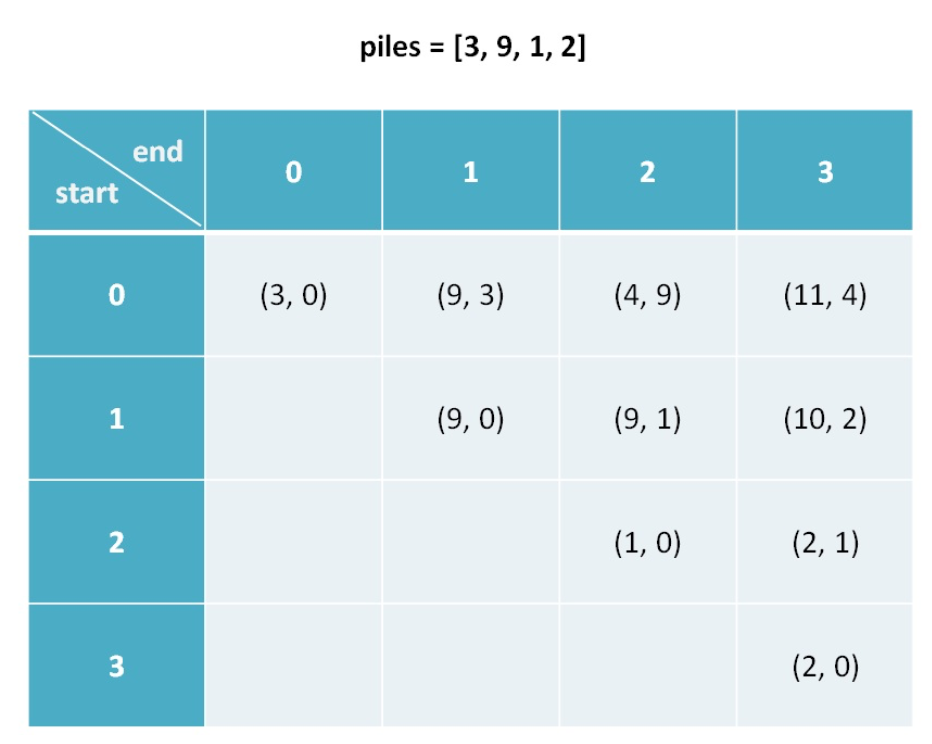

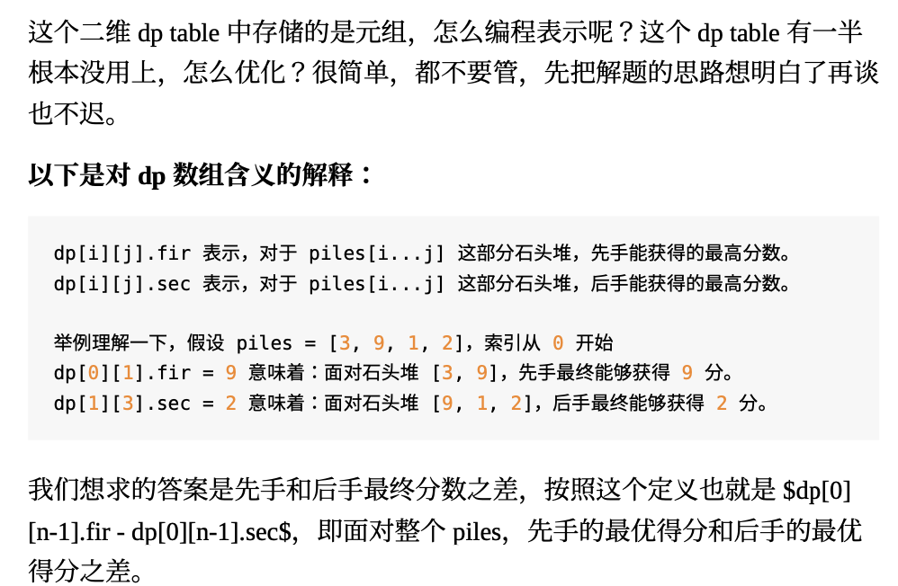

下面来定义状态转移方程：

根据前面对 dp 数组的定义，**状态显然有三个:开始的索引** i，结束的索引 **j**，当前轮到的人。

```
dp[i][j][fir or sec] 其中:
0 <= i < piles.length 
i <= j < piles.length
```

对于这个问题的每个状态，可以做的**选择有两个:选择最左边的那堆石头， 或者选择最右边的那堆石头。** 我们可以这样穷举所有状态:

```java
n=piles.length
        for 0<=i<n:
            for j<=i<n:
                for who in{fir,sec}:
                    dp[i][j][who]=max(left,right)
```

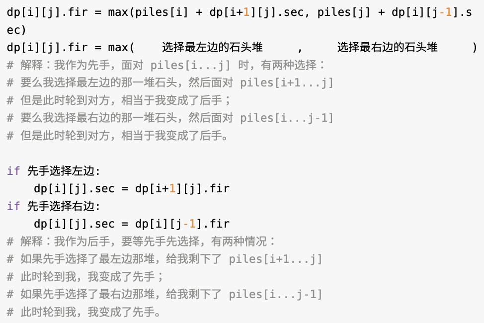

```java
class Pair {
        int fir, sec;
        Pair(int fir, int sec) {
            this.fir = fir;
            this.sec = sec;
        }
    }

    /* 返回游戏最后先手和后手的得分之差 */
    int stoneGame(int[] piles) {
        int n = piles.length;
// 初始化 dp 数组
        Pair[][] dp = new Pair[n][n];
        for (int i = 0; i < n; i++)
            for (int j = i; j < n; j++)
                dp[i][j] = new Pair(0, 0);
// 填入 base case
        for (int i = 0; i < n; i++) {
            dp[i][i].fir = piles[i];
            dp[i][i].sec = 0;
        }
// 斜着遍历数组
        for (int l = 2; l <= n; l++) {
            for (int i = 0; i <= n - l; i++) {
                int j = l + i - 1;
// 先手选择最左边或最右边的分数
                int left = piles[i] + dp[i + 1][j].sec;
                int right = piles[j] + dp[i][j - 1].sec; // 套用状态转移方程
                if (left > right) {
                    dp[i][j].fir = left;
                    dp[i][j].sec = dp[i + 1][j].fir;
                } else {
                    dp[i][j].fir = right;
                    dp[i][j].sec = dp[i][j - 1].fir;
                }
            }
        }
        Pair res = dp[0][n - 1];
        return res.fir - res.sec;
    }
```

## 8.17 **四键键盘**

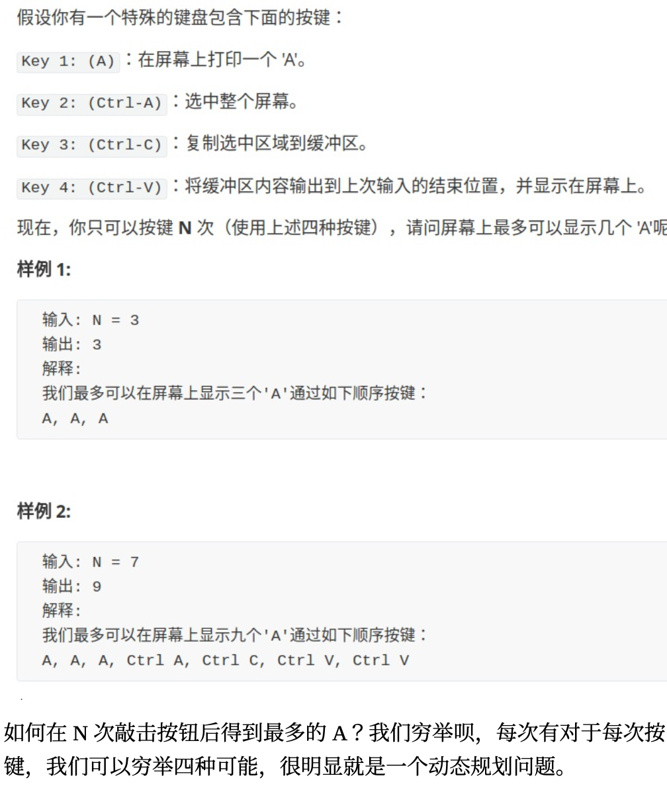

如何在 N 次敲击按钮后得到最多的 A?我们穷举呗，每次有对于每次按 键，我们可以穷举四种可能，很明显就是一个动态规划问题。

具体到这个问题，对于每次敲击按键，有哪些「选择」是很明显的:4 种， 就是题目中提到的四个按键，分别是 A 、 C-A 、 C-C 、 C-V ( Ctrl 简 写为 C )。

接下来，思考一下对于这个问题有哪些「状态」?**或者换句话说，我们需要 知道什么信息，才能将原问题分解为规模更小的子问题**?你看我这样定义三个状态行不行:第一个状态是剩余的按键次数，用 n 表 示;第二个状态是当前屏幕上字符 A 的数量，用 a_num 表示;第三个状态是剪切板中字符 A 的数量，用 copy 表示。

如此定义「状态」，就可以知道 base case:当剩余次数 n 为 0 时， a_num 就是我们想要的答案。

结合刚才说的 4 种「选择」，我们可以把这几种选择通过状态转移表示出 来:

```
dp(n - 1, a_num + 1, copy), # A 解释:按下 A 键，屏幕上加一个字符 同时消耗 1 个操作数
dp(n - 1, a_num + copy, copy), # C-V 解释:按下 C-V 粘贴，剪切板中的字符加入屏幕 同时消耗 1 个操作数
dp(n - 2, a_num, a_num) # C-A C-C 解释:全选和复制必然是联合使用的，
剪切板中 A 的数量变为屏幕上 A 的数量
同时消耗 2 个操作数
```

```python
def maxA(N: int) -> int:
  # 备忘录
	memo = dict()	
# 对于 (n, a_num, copy) 这个状态，
# 屏幕上能最终最多能有 dp(n, a_num, copy) 个 A 
	def dp(n, a_num, copy):
    # base case
    if n <= 0: return a_num;
    # 避免计算重叠子问题
		if (n, a_num, copy) in memo:
         return memo[(n, a_num, copy)]

    # 几种选择全试一遍，选择最大的结果 
    memo[(n, a_num, copy)]= max(
    dp(n - 1, a_num + 1, copy),
    dp(n - 1, a_num + copy, copy), # C-V 
    dp(n - 2, a_num, a_num) # C-A C-C
    )
    return memo[(n, a_num, copy)]
    # 可以按 N 次按键，屏幕和剪切板里都还没有 A 
  return dp(N, 0, 0)
```

# 9. 回溯

**解决一个回溯问题，实际上就是一个决策树的遍历过程**。你只需要思考 3 个问题:

> 1、路径:也就是已经做出的选择。 
>
> 2、选择列表:也就是你当前可以做的选择。
>
>  3、结束条件:也就是到达决策树底层，无法再做选择的条件。

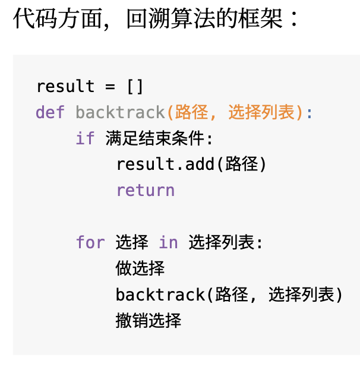

**其核心就是** **for** **循环里面的递归，在递归调用之前「做选择」，在递归调用 之后「撤销选择」**，特别简单。

我们在写backtrack函数的时候，需要**维护走过的「路径」和当前可以做的「选择列表」，当触发「结束条件」时，将「路径」记入结果集**。

回溯实际上是一种试探算法，这种算法跟暴力搜索最大的不同在于，在回溯算法里，是一步一步地小心翼翼地进行向前试探，会对每一步探测到的情况进行评估，如果当前的情况已经无法满足要求，那么就没有必要继续进行下去，也就是说，它可以帮助我们避免走很多的弯路。

回溯算法的特点在于，当出现非法的情况时，算法可以回退到之前的情景，可以是返回一步，有时候甚至可以返回多步，然后再去尝试别的路径和办法。这也就意味着，想要采用回溯算法，就必须保证，每次都有多种尝试的可能。

**解题步骤**

1. 判断当前情况是否非法，如果非法就立即返回；
2. 当前情况是否已经满足递归结束条件，如果是就将当前结果保存起来并返回；
3. 当前情况下，遍历所有可能出现的情况并进行下一步的尝试；
4. 递归完毕后，立即回溯，回溯的方法就是取消前一步进行的尝试。

```java
function fn(n) {
        // 第一步：判断输入或者状态是否非法？
        if (input/state is invalid){
            return;
        }
        // 第二步：判读递归是否应当结束?
        if (match condition){
            return some value;
        }
        // 遍历所有可能出现的情况
        for (all possible cases) {
            // 第三步: 尝试下一步的可能性
            solution.push(case)
            // 递归
            result = fn(m)
            // 第四步：回溯到上一步
            solution.pop(case)
        }
    }
```

## 9.1 全排列问题

n 个不重复的数，全排列共有 n! 个。

**回溯算法的决策树模型。**

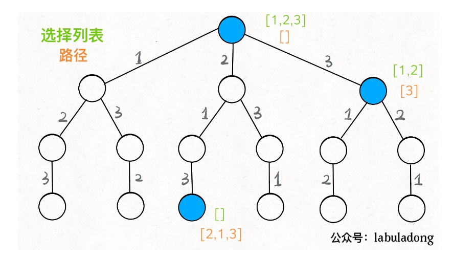

这个玩意就是n叉树的遍历。模板如下。

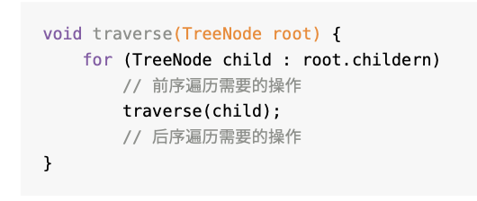

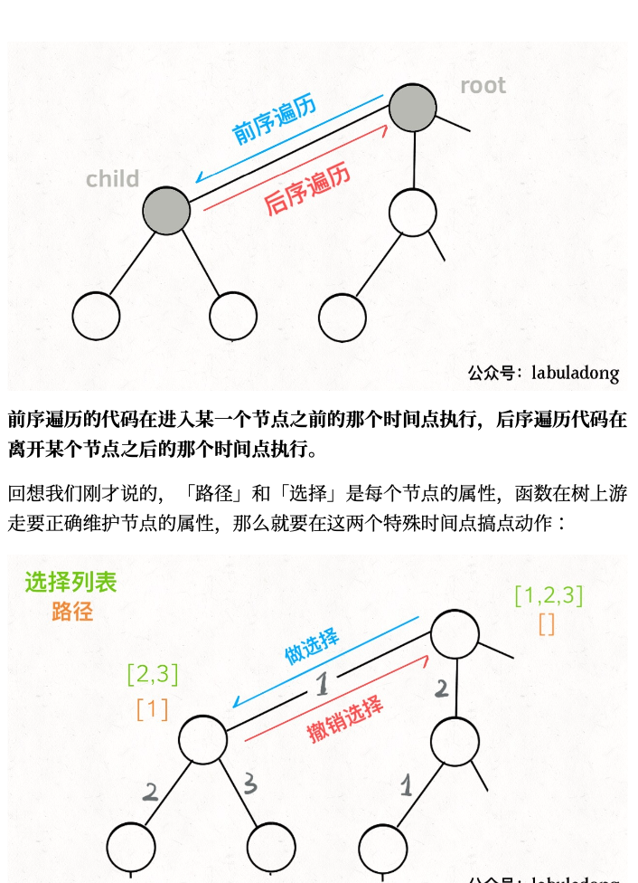

```
for 选择 in 选择列表:
	# 做选择 
	将该选择从选择列表移除 
	路径.add(选择) 
	backtrack(路径, 选择列表) 
	# 撤销选择 
	路径.remove(选择) 
	将该选择再加入选择列表
```

**我们只要在递归之前做出选择，在递归之后撤销刚才的选择**，就能正确得到 每个节点的选择列表和路径。

路径记录在track里，通过nums和track来推导选择列表。

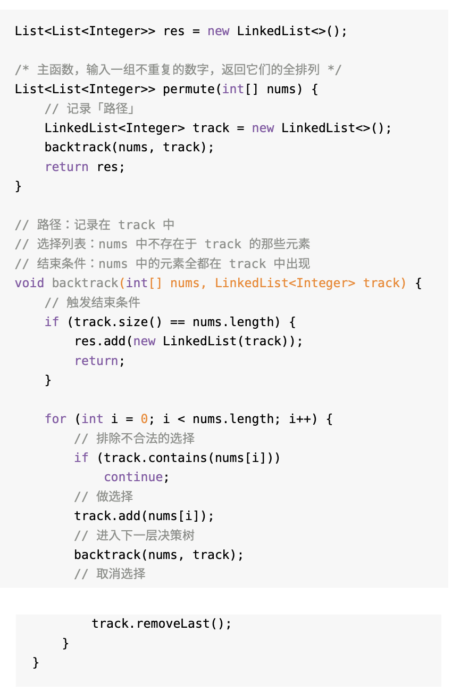

回溯法是升级版的暴力法，解决迷宫类似的问题，从解决问题的每一步的所有可能选项选出一项，然后进入下一步，进行重复选择，直到最终状态。（在到达递归边界前的某层，由于一些事实不需要向任何一个子问题进行递归，直接返回上一层，这种做法称为回溯法）。

## 9.2 矩阵中的路径

[12-矩阵中的路径](https://github.com/haojunsheng/AlgorithmNotes/blob/master/src/com/code/offer/goback/StringPathInMatrix_12.java)

```java
/**
 * 题目：请设计一个函数，用来判断在一个矩阵中是否存在一条包含某字符串所有字符的路径。
 * 路径可以从矩阵中的任意一个格子开始，每一步可以在矩阵中向左，向右，向上，向下移动一个格子。
 * 如果一条路径经过了矩阵中的某一个格子，则该路径不能再进入该格子。
 * 例如 a b c e s f c s a d e e 矩阵中包含一条字符串"bcced"的路径，但是矩阵中不包含"abcb"路径，
 * 因为字符串的第一个字符b占据了矩阵中的第一行第二个格子之后，路径不能再次进入该格子。
 *
 * 基本思想（递归）：
 * 0.根据给定数组，初始化一个标志位数组，初始化为false，表示未走过，true表示已经走过，不能走第二次
 * 1.根据行数和列数，遍历数组，先找到一个与str字符串的第一个元素相匹配的矩阵元素，进入judge
 * 2.根据i和j先确定一维数组的位置，因为给定的matrix是一个一维数组
 * 3.确定递归终止条件：越界，当前找到的矩阵值不等于数组对应位置的值，已经走过的，这三类情况，都直接false，说明这条路不通
 * 4.若k，就是待判定的字符串str的索引已经判断到了最后一位，此时说明是匹配成功的
 * 5.下面就是本题的精髓，递归不断地寻找周围四个格子是否符合条件，只要有一个格子符合条件，就继续再找这个符合条件的格子的四周是否存在符合条件的格子，直到k到达末尾或者不满足递归条件就停止。
 * 6.走到这一步，说明本次是不成功的，我们要还原一下标志位数组index处的标志位，进入下一轮的判断。
 */
    public boolean hasPath(char[] matrix, int rows, int cols, char[] str) {
        //标志位，初始化为false
        boolean[] flag = new boolean[matrix.length];
        for (int i = 0; i < rows; i++) {
            for (int j = 0; j < cols; j++) {
                //循环遍历二维数组，找到起点等于str第一个元素的值，再递归判断四周是否有符合条件的----回溯法
                if (judge(matrix, i, j, rows, cols, flag, str, 0)) {
                    return true;
                }
            }
        }
        return false;
    }

    //judge(初始矩阵，索引行坐标i，索引纵坐标j，矩阵行数，矩阵列数，标志位，待判断的字符串，字符串索引初始为0即先判断字符串的第一位)
    private boolean judge(char[] matrix, int i, int j, int rows, int cols, boolean[] flag, char[] str, int k) {
        //先根据i和j计算匹配的第一个元素转为一维数组的位置
        int index = i * cols + j;
        //递归终止条件
        if (i < 0 || j < 0 || i >= rows || j >= cols || matrix[index] != str[k] || flag[index] == true) {
            return false;
        }
        //若k已经到达str末尾了，说明之前的都已经匹配成功了，直接返回true即可，及时进行剪支
        if (k == str.length - 1) {
            return true;
        }
        //要走的第一个位置置为true，表示已经走过了，加入选择，路径
        flag[index] = true;

        //回溯，递归寻找(上下左右)，每次找到了就给k加一，找不到，还原，i,j,k这些维护选择列表
        if (judge(matrix, i - 1, j, rows, cols, flag, str, k + 1) ||
                judge(matrix, i + 1, j, rows, cols, flag, str, k + 1) ||
                judge(matrix, i, j - 1, rows, cols, flag, str, k + 1) ||
                judge(matrix, i, j + 1, rows, cols, flag, str, k + 1)) {
            return true;
        }
        //走到这，说明这一条路不通，还原，再试其他的路径，撤销选择
        flag[index] = false;
        return false;
    }
```

## 9.3 机器人的运动范围

[13-机器人的运动范围](https://github.com/haojunsheng/AlgorithmNotes/blob/master/src/com/code/offer/goback/RobotMove_13.java)

```java
/**
 * 机器人运动范围
 * 地上有一个m行和n列的方格。
 * 一个机器人从坐标0,0的格子开始移动，每一次只能向左，右，上，下四个方向移动一格，
 * 但是不能进入行坐标和列坐标的数位之和大于k的格子。 
 * 例如，当k为18时，机器人能够进入方格（35,37），因为3+5+3+7 = 18。但是，它不能进入方格（35,38），因为3+5+3+8 = 19。
 * 请问该机器人能够达到多少个格子？
 */
    public int movingCount(int threshold, int rows, int cols) {
        //参数校验
        if (threshold < 0 || rows <= 0 || cols <= 0) {
            return 0;
        }

        //初始化访问标识数组
        boolean[] visited = new boolean[rows * cols];
        for (int i = 0; i < rows * cols; i++) {
            visited[i] = false;
        }

        int count = movingCountCore(threshold, rows, cols, 0, 0, visited);
        return count;
    }


    // 判断从第row行、第col列出发可以到达的格子数为 1+ 四个方向
    public int movingCountCore(int threshold, int rows, int cols, int row, int col, boolean[] visited) {
        int count = 0;
        if (check(threshold, rows, cols, row, col, visited)) {
            // 做选择
            visited[row * cols + col] = true;
            // 加入路径
            count = 1 + movingCountCore(threshold, rows, cols, row - 1, col, visited)
                    + movingCountCore(threshold, rows, cols, row, col - 1, visited)
                    + movingCountCore(threshold, rows, cols, row + 1, col, visited)
                    + movingCountCore(threshold, rows, cols, row, col + 1, visited);
        }
        return count;
    }

    // 检查机器人能否到达该格子
    public boolean check(int threshold, int rows, int cols, int row, int col, boolean[] visited) {
        if (row >= 0 && row < rows && col >= 0 && col < cols
                && getDigitSum(row) + getDigitSum(col) <= threshold
                && !visited[row * cols + col]) {
            return true;
        }
        return false;
    }

    // 求一个数的各位数和
    public int getDigitSum(int num) {
        int sum = 0;
        while (num > 0) {
            sum += num % 10;
            num /= 10;
        }
        return sum;
    }
```

## 9.4 字符串的排列

[字符串的排列38](https://github.com/haojunsheng/AlgorithmNotes/blob/master/src/com/code/offer/goback/StringPermutation_38.java)

```java
/**
 * 输入一个字符串,按字典序打印出该字符串中字符的所有排列。
 * 例如输入字符串abc,则打印出由字符a,b,c所能排列出来的所有字符串abc,acb,bac,bca,cab和cba。
 */
public ArrayList<String> Permutation(String str) {
        List<String> resultList = new ArrayList<String>();
        if (str.length() == 0) {
            return (ArrayList) resultList;
        }
        //递归的初始值为（str数组，空的list，初始下标0）
        PermutationHelper(str.toCharArray(), resultList, 0);
        Collections.sort(resultList);
        return (ArrayList) resultList;
    }
		// ch是路径
    private void PermutationHelper(char[] ch, List<String> list, int index) {
        //这是递归的终止条件，就是i下标已经移到char数组的末尾的时候，考虑添加这一组字符串进入结果集中
        if (index == ch.length - 1) {
            //判断一下是否重复
            if (!list.contains(new String(ch))) {
                list.add(new String(ch));
                return;
            }
        } else {
            // index和ch一起来维护选择列表
            for (int j = index; j < ch.length; j++) {
                // 做选择
                swap(ch, index, j);
                // 下一层决策树
                PermutationHelper(ch, list, index + 1);
                // 取消选择
                swap(ch, index, j);
            }
        }
    }

    //交换数组的两个下标的元素
    private void swap(char[] str, int i, int j) {
        if (i != j) {
            char t = str[i];
            str[i] = str[j];
            str[j] = t;
        }
    }
```

好好体会这两个题目。

## 9.5 N皇后问题


本题深度遍历回溯方法的骨架：

```java
void dfs(棋盘board,当前行row,n){
	if(终止条件){
		保存当前序列;
		return;
	}
	for(int i=0;i<n;i++){
    	if(board[row][i]可以填写){
    		当前格子board[row][i]=1;
    		填写下一行dfs(board,row+1,n);
    		擦除填写，验证下一个序列board[row][i]=0;
    	}
    }
}
```

终止条件是什么：棋盘的0~n-1行都填写完毕，即row==n。

如何保存当前序列：棋盘使用int[][]数组表示，0为'.'，1为'Q'。遍历每一行转换为字符串存入list，最后list存入结果。

如何判断当前格子是否可以：遍历当前列上是否已经有皇后；遍历当前左上至右下对角线上是否已经有皇后；遍历当前右上至左下对角线上是否已经有皇后。这些遍历只需要检测小于当前的行，因为大于当前的行还没有填写到一定没有皇后。

```java
package com.code.offer.goback;

import java.util.ArrayList;

/**
 * 给你一个 N×N 的棋盘，让你放置 N 个 皇后，使得它们不能互相攻击。
 * 每一种解法包含一个明确的 n 皇后问题的棋子放置方案，该方案中 'Q' 和 '.' 分别代表了皇后和空位。
 * <p>
 * 皇后可以攻击同一行、同一列、左上左下右上右下四个方向的任意单位。
 * 这个问题本质上跟全排列问题差不多，决策树的每一层表示棋盘上的每一行;
 * 每个节点可以做出的选择是，在该行的任意一列放置一个皇后。
 */

public class NQueen {
    ArrayList<ArrayList<String>> res = new ArrayList<>();

    // 输入棋盘边⻓ n，返回所有合法的放置
    ArrayList<ArrayList<String>> solveNQueens(int n) {
        // 默认0表示空，1表示皇后
        int[][] board = new int[n][n];
        goBack(board, 0);
        return res;
    }

    // 路径:board 中小于 row 的那些行都已经成功放置了皇后
    // 选择列表:第 row 行的所有列都是放置皇后的选择
    // 结束条件:row 超过 board 的最后一行
    private void goBack(int[][] board, int row) {
        if (row == board.length) {
            res.add(transfer(board, board.length));
            return;
        }
        int cols = board.length;
        for (int col = 0; col < cols; ++col) {
            if (isValid(board, row, col)) {
                //做选择
                board[row][col] = 1;
                //递归
                goBack(board, row + 1);
                // 撤销选择
                board[row][col] = 0;
            }
        }
    }

    // 遍历当前列上是否已经有皇后；
    // 遍历当前左上至右下对角线上是否已经有皇后；
    // 遍历当前右上至左下对角线上是否已经有皇后。
    // 这些遍历只需要检测小于当前的行，因为大于当前的行还没有填写到一定没有皇后。
    private boolean isValid(int[][] board, int row, int col) {
        // 检查列上是否有皇后
        for (int i = 0; i < row; ++i) {
            if (board[i][col] == 1) {
                return false;
            }
        }
        //检查左上至右下对角线有无皇后
        for (int i = col - 1; i >= 0; i--) {
            if (i + row - col < 0) {
                break;
            }
            if (board[i + row - col][i] == 1) {
                return false;
            }
        }
        //检查右上至左下对角线有无皇后
        for (int i = col + 1; i < board.length; i++) {
            if (row + col - i < 0) {
                break;
            }
            if (board[row + col - i][i] == 1) {
                return false;
            }
        }
        return true;
    }

    //将int类型棋盘转换成输出格式
    private ArrayList<String> transfer(int[][] board, int n) {
        ArrayList<String> list = new ArrayList<>();
        for (int i = 0; i < n; i++) {
            StringBuilder temp = new StringBuilder();
            for (int j = 0; j < n; j++) {
                if (board[i][j] == 0) {
                    temp.append('.');
                } else {
                    temp.append('Q');
                }
            }
            list.add(temp.toString());
        }
        return list;
    }
}
```

**有的时候，我们并不想得到所有合法的答案，只想要一个答案，怎么办呢**? 比如解数独的算法，找所有解法复杂度太高，只要找到一种解法就可以。

```java
// 函数找到一个答案后就返回 true
    bool backtrack(vector<string>&board, int row) {
// 触发结束条件
        if (row == board.size()) {
            res.push_back(board);
            return true;
        }
...
        for (int col = 0; col < n; col++) {
...
            board[row][col] = 'Q';
            if (backtrack(board, row + 1))
                return true;
            board[row][col] = '.';
        }
        return false;
    }
```

## 9.6 数组中所有目标和为target

给定一个无重复元素的数组 candidates 和一个目标数 target ，找出 candidates 中所有可以使数字和为 target 的组合。candidates 中的数字可以无限制重复被选取。

说明：所有数字（包括 target）都是正整数。解集不能包含重复的组合。 

1. 从一个空的集合开始，小心翼翼地往里面添加元素。
2. 每次添加，检查一下当前的总和是否等于给定的目标。
3. 如果总和已经超出了目标，说明没有必要再尝试其他的元素了，返回并尝试其他的元素；
4. 如果总和等于目标，就把当前的组合添加到结果当中，表明我们找到了一种满足要求的组合，同时返回，并试图寻找其他的集合。

```java
int[][] combinationSum(int[] candidates, int target) {
        int[][] results;
        backtracking(candidates, target, 0, [], results);
        return results;
    }

    void backtracking = (int[] candidates, int target, int start, int[] solution, int[][] results) {
        if (target < 0) {
            return;
        }

        if (target === 0) {
            results.push(solution);
            return;
        }

        for (int i = start; i < candidates.length; i++) {
            solution.push(candidates[i]);
            backtracking(candidates, target - candidates[i], i, solution, results);
            solution.pop();
        }
    }
```

在主函数里：

- 定义一个 results 数组用来保存最终的结果；
- 调用函数 backtracking，并将初始的情况以及 results 传递进去，这里的初始情况就是从第一个元素开始尝试，而且初始的子集为空。

在 backtracking 函数里：

- 检查当前的元素总和是否已经超出了目标给定的值，每添加进一个新的元素时，就将它从目标总和中减去；
- 如果总和已经超出了目标给定值，就立即返回，去尝试其他的数值；
- 如果总和刚好等于目标值，就把当前的子集添加到结果中。

在循环体内：

- 每次添加了一个新的元素，立即递归调用 backtracking，看是否找到了合适的子集
- 递归完毕后，要把上次尝试的元素从子集里删除，这是最重要的。

# 10. 位运算

位运算：与，或，异或，左移和右移。
需要关注的是**右移**，分为有符号和无符号两种，如果是无符号，则直接用0填补左边的n位，如果是有符号的负数，如10001010 >> 3= 11110001

## 10.1 n&(n-1)

**把一个整数减去1，再和原整数做与运算，会把该整数最右边的一个1变成0**。也是很多二进制问题的解决思路。

- [15-二进制中1的个数](https://github.com/haojunsheng/AlgorithmNotes/blob/master/src/com/code/offer/bit/NumberOf1InBinary_15.java)

这个题目看上去很好解答，与1做与运算可验证最后一位是否为1，然后右移一位，在此和1进行与运算，直到为0。但这样是存在问题的，因为存在负数的右移的情况，负数右移是很难去处理的，我们要尽量避免。尽量转化为左移运算，所以我们的解决方案应运而生，我们把1每次左移就可以了。

然而，还有更加牛逼的方法，我们需要通过这个题目来进行掌握，我们知道，**把一个整数减去1，再和原整数做与运算，会把该整数最右边的一个1变成0**。我们一直这么操作，当n为0时，即得到了1的个数，这个思想是很重要的，我们需要进行掌握。

```java
public static int numberOf1Simple(int num) {
        int count = 0;
        while (num != 0) {
            count++;
            num = (num - 1) & num;
        }
        return count;
    }
```

我们来看相关的题目：判断一个整数是不是2的整数次方。根据上面的方法，我们知道如果1个数如果是2的整数次方，那么该数的二进制只有1位为1，那么我们使用上面的方法，一步就可以判断出来。即n=(n-1)&n;

- 相关题目2：给定两个证书m和n，需要改变m的二进制的多少位才能和n一样。第一步求这两个数的异或（把不相同的数变为1），第二步统计异或结果中1的位数。比如10的二进制为1010，13的二进制为1101，我们需要改变三个数才可以。
- 判断一个数是不是2的指数(意思是二进制的表示中只有1位为1)

## 10.2 不用加减乘除做加法

[面试题65：不用加减乘除做加法](https://github.com/haojunsheng/AlgorithmNotes/blob/master/src/com/code/offer/bit/NumberOf1InBinary_15.java)

```java
/**
 * 不用加减乘除做加法
 * 写一个函数，求两个整数之和，要求在函数体内不得使用 “+”、“-”、“*”、“/” 四则运算符号。
 * 输入: a = 1, b = 1
 * 输出: 2
 * 一、 十进制计算，计算十进制13+9
 * 1.计算不进位的和。十位1不变，个位3加9等于2，结果为12；
 * 2.计算进位。十位没进位，个位进位为1，结果为10。
 * 再计算十进制12+10：
 * 1.计算不进位的和。十位1加1等于2，个位2加0等于2，结果为22；
 * 2.计算进位。十位没进位，个位也没进位，结果为0。
 * 因此结果13+9=22。
 * 二、二进制计算，13二进制为：1101，9二进制为：1001。
 * 十进制是遇到大于等于10就保留余数，然后进位1。
 * 那对应到二进制，就是遇到2就保留余数0，然后进位1。（二进制位之和不可能大于2）
 * 计算二进制1101+1001：
 * 1.计算不进位的和。从左到右，第1位为0，第2位为1，第3位为0，第4位为0，结果为0100；
 * 2.计算进位。从左到右，第1位进位1，第2、3位没有进位，第4位进位1，结果为1001。不对，进位右边要补0，正确结果是10010。
 * 计算二进制0100+10010：
 * 1.计算不进位的和：10110；
 * 2.计算进位：无。
 * 因此结果为10110=22。
 * 三.二进制加法公式
 * 1）分析上面对二进制的计算过程，不难发现：
 * 1.计算不进位的和，相当于对两个数进制异或：1101^1001=0100；
 * 2.计算进位，第1位相当于对两个数求与：1101&1001=1001，然后再对其进行左移1位：1001<<1=10010。
 * 然后再重复以上两个步骤。这里再异或一次就得到结果了，没进位：0100^10010=10110=22。
 * 2）计算a+b，等价于(a^b)+((a&b)<<1)。
 * 由于公式中又出现了+号，因此要再重复2）这个等价的计算过程。
 * 结束条件是：没有进位了。
 */
public class AddWithBit_65 {
    public int add(int a, int b) {
        while (b != 0) {
            // 求和（不计进位）. 相同位置0，相反位置1
            int plus = (a ^ b);
            // 计算进位. 先保留同为1的位，都为1的位要向左进位，因此左移1位
            b = ((a & b) << 1);
            a = plus;
        }
        return a;
    }

    // 递归解法
    public int addRecursive(int a, int b) {
        if (b == 0) {
            return a;
        }
        if (a == 0) {
            return b;
        }
        // 求和（不计进位）. 相同位置0，相反位置1
        int plus1 = (a ^ b);
        // 计算进位. 先保留同为1的位，都为1的位要向左进位，因此左移1位
        int plus2 = ((a & b) << 1);
        return addRecursive(plus1, plus2);
    }
}
```

# 11. 常见算法思维

## 11.1 双指针

### 11.1.1 快慢指针法

解决链表中的问题。

 **1. 判定链表中是否含有环**

```java
boolean hasCycle(ListNode head) {
        ListNode fast, slow;
        fast = slow = head;
        while (fast != null && fast.next != null) {
            fast = fast.next.next;
            slow = slow.next;
            if (fast == slow) return true;
        }
        return false;
    }
```

**2. 寻找链表的中点**

```java
while (fast != null && fast.next != null) {
            fast = fast.next.next;
            slow = slow.next;
        }
        // slow 就在中间位置 
        return slow;
```

3. 寻找链表的倒数第 **k** 个元素

```java
ListNode slow, fast;
slow = fast = head;
while (k-- > 0)
  fast = fast.next;
while (fast != null) {
  slow = slow.next;
  fast = fast.next;
}
return slow;
```

### 11.1.2 左右指针法

解决数组，字符串的问题。

左右指针在数组中实际是指两个索引值，一般初始化为 left = 0, right = nums.length - 1 。

 1. 二分查找

```java
int binarySearch(int[] nums, int target) {
        int left = 0;
        int right = nums.length - 1;
        while (left <= right) {
            int mid = (right + left) / 2;
            if (nums[mid] == target)
                return mid;
            else if (nums[mid] < target)
                left = mid + 1;
            else if (nums[mid] > target)
                right = mid - 1;
        }
        return -1;
    }
```

2. 两数和(Two-sum)


```java
// 两数和，无序
public int[] twoSum(int[] nums, int target) {
        HashMap<Integer,Integer> map = new HashMap<>();
        int[] res = new int[2];
        for (int i = 0; i < nums.length; i++) {
            int dif = target - nums[i];
            if (map.get(dif) != null) {
                res[0] = map.get(dif);
                res[1] = i;
                return res;
            }
            map.put(nums[i],i);
        }
        return res;
    }
```

3. 反转数组

```java
void reverse(int[] nums) {
        int left = 0;
        int right = nums.length - 1;
        while (left < right) {
            // swap(nums[left], nums[right])
            int temp = nums[left];
            nums[left] = nums[right];
            nums[right] = temp;
            left++;
            right--;
        }
    }
```

### 11.1.3 滑动窗口算法

滑动窗口算法的思路是这样:

1、我们在字符串 S 中使用双指针中的左右指针技巧，初始化 left = right = 0，把索引闭区间 [left, right] 称为一个「窗口」。

2、我们先不断地增加 right 指针扩大窗口 [left, right]，直到窗口中的字符串 符合要求(包含了 T 中的所有字符)。

3、此时，我们停止增加 right，转而不断增加 left 指针缩小窗口 [left, right]，直到窗口中的字符串不再符合要求(不包含 T 中的所有字符了)。 同时，每次增加 left，我们都要更新一轮结果。

4、重复第 2 和第 3 步，直到 right 到达字符串 S 的尽头。

**第** **2** **步相当于在寻找一个「可行解」，然后第** **3** **步在 优化这个「可行解」，最终找到最优解。**左右指针轮流前进，窗口大小增增 减减，窗口不断向右滑动。

#### 11.1.3.1 **最小覆盖子串**

[最小覆盖子串](https://github.com/haojunsheng/AlgorithmNotes/blob/master/src/com/code/offer/newcoder/MinOverSubString.java)

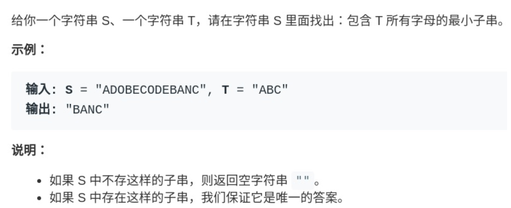

needs 和 window 相当于计数器，分别记录 T 中字符出现次数和窗口中的相应字符的出现次数。

```java
string s, t;
int left = 0, right = 0;
string res = s;
	while (right < s.size()) { 
    window.add(s[right]); 
    right++;
		while (valid) { 
      window.remove(s[left]); 
      left++;
} }
```

如何判断 window 即子串 s[left...right] 是否符合要求，是否包含t的所有字符呢?

可以用两个哈希表当作计数器解决。用一个哈希表 needs 记录字符串 t 中包 含的字符及出现次数，用另一个哈希表 window 记录当前「窗口」中包含的 字符及出现的次数，如果 window 包含所有 needs 中的键，且这些键对应的 值都大于等于 needs 中的值，那么就可以知道当前「窗口」符合要求了，可 以开始移动 left 指针了。

```java
public String minWindow(String s, String t) {
        // 记录最短子串的开始位置和⻓度
        int start = 0, minLen = Integer.MAX_VALUE;
        int left = 0, right = 0;
        HashMap<Character, Integer> window = new HashMap<>();
        HashMap<Character, Integer> needs = new HashMap<>();
        for (int i = 0; i < t.length(); ++i) {
            needs.put(t.charAt(i), needs.get(t.charAt(i)) + 1);
        }
        // 记录window中已经有多少字符符合要求了
        int match = 0;
        while (right < s.length()) {
            char c1 = s.charAt(right);
            // needs包含c1
            if (needs.get(c1) != 0) {
                window.put(c1, window.get(c1) + 1);
                // 字符 c1 的出现次数符合要求了
                if (window.get(c1).equals(needs.get(c1))) {
                    match++;
                }
            }
            right++;
            // 如果符合要求，移动left缩小窗口,window中的字符串已符合needs的要求了
            while (match == needs.size()) {
                if (right - left < minLen) {
                    // 更新最小子串的位置和⻓度
                    start = left;
                    minLen = right - left;
                }
                char c2 = s.charAt(left);
                if (needs.get(c2) != 0) {
                    // 移除window
                    window.put(c2, window.get(c2) - 1);
                    if (!window.get(c1).equals(needs.get(c1))) {
                        // 字符 c2 出现次数不再符合要求
                        match--;
                    }
                }
                left++;
            }
        }
        return minLen == Integer.MAX_VALUE ? "" : s.substring(start, minLen);
    }
```

#### 11.1.3.2 找到字符串中所有字母异位词

[最小覆盖子串](https://github.com/haojunsheng/AlgorithmNotes/blob/master/src/com/code/offer/newcoder/HeterotopicInString.java)

给定一个字符串 s 和一个非空字符串 p，找到 s 中所有是 p 的字母异位词的子串，返回这些子串的起始索引。

字符串只包含小写英文字母，并且字符串 s 和 p 的长度都不超过20100。

说明：

字母异位词指字母相同，但排列不同的字符串。
不考虑答案输出的顺序。
示例 1:

输入:
s: "cbaebabacd" p: "abc"

输出:
[0, 6]

解释:
起始索引等于 0 的子串是 "cba", 它是 "abc" 的字母异位词。
起始索引等于 6 的子串是 "bac", 它是 "abc" 的字母异位词。

```java
public List<Integer> findAnagrams(String s, String p) {
        List<Integer> res = new ArrayList<>();
        int left = 0, right = 0;
        HashMap<Character, Integer> window = new HashMap<>();
        HashMap<Character, Integer> needs = new HashMap<>();
        for (int i = 0; i < p.length(); ++i) {
            needs.put(p.charAt(i), needs.get(p.charAt(i)) + 1);
        }
        // 记录window中已经有多少字符符合要求了
        int match = 0;
        while (right < s.length()) {
            char c1 = s.charAt(right);
            // needs包含c1
            if (needs.get(c1) != 0) {
                window.put(c1, window.get(c1) + 1);
                // 字符 c1 的出现次数符合要求了
                if (window.get(c1).equals(needs.get(c1))) {
                    match++;
                }
            }
            right++;
            // 如果 window 的大小合适
            // 就把起始索引 left 加入结果
            while (match == needs.size()) {
                if (right - left < p.length()) {
                    res.add(left);
                }
                char c2 = s.charAt(left);
                if (needs.get(c2) != 0) {
                    // 移除window
                    window.put(c2, window.get(c2) - 1);
                    if (!window.get(c1).equals(needs.get(c1))) {
                        // 字符 c2 出现次数不再符合要求
                        match--;
                    }
                }
                left++;
            }
        }
        return res;
    }
```

#### 11.1.3.3 无重复字符的最⻓子串

给定一个字符串，请你找出其中不含有重复字符的 最长子串 的长度。

示例 1:

输入: "abcabcbb"
输出: 3 
解释: 因为无重复字符的最长子串是 "abc"，所以其长度为 3。
示例 2:

输入: "bbbbb"
输出: 1
解释: 因为无重复字符的最长子串是 "b"，所以其长度为 1。
示例 3:

输入: "pwwkew"
输出: 3
解释: 因为无重复字符的最长子串是 "wke"，所以其长度为 3。
     请注意，你的答案必须是 子串 的长度，"pwke" 是一个子序列，不是子串。


**遇到子串问题，首先想到的就是滑动窗口技巧。**

类似之前的思路，使用 window 作为计数器记录窗口中的字符出现次数，然 后先向右移动 right，当 window 中出现重复字符时，开始移动 left 缩小窗 口，如此往复:

```java
public int minWindow(String s) {
        int left = 0, right = 0;
        HashMap<Character, Integer> window = new HashMap<>();
        int res = 0;
        while (right < s.length()) {
            char c1 = s.charAt(right);
            window.put(c1, window.get(c1) + 1);
            right++;
            // 如果 window 中出现重复字符
            // 开始移动 left 缩小窗口
            while (window.get(c1) > 1) {
                char c2 = s.charAt(left);
                // 移除window
                window.put(c2, window.get(c2) - 1);
                left++;
            }
            // 需要注意的是，因为我们要求的是最⻓子串，
            // 所以需要在每次移动right增大窗口时更新res，
            // 而不是像之前的题目在移动left缩小窗口时更新res。
            res = Math.max(res, right - left);
        }
        return res;
    }
```

需要注意的是，因为我们要求的是最⻓子串，所以需要在每次移动 right 增 大窗口时更新 res，而不是像之前的题目在移动 left 缩小窗口时更新 res。

#### 11.1.3.4 总结

通过上面三道题，我们可以总结出滑动窗口算法的抽象思想：

```java
int left = 0, right = 0;

while (right < s.size()) {
    window.add(s[right]);
    right++;
    
    while (valid) {
        window.remove(s[left]);
        left++;
    }
}
```

其中 window 的数据类型可以视具体情况而定，比如上述题目都使用哈希表充当计数器，当然你也可以用一个数组实现同样效果，因为我们只处理英文字母。

稍微麻烦的地方就是这个 valid 条件，为了实现这个条件的实时更新，我们可能会写很多代码。比如前两道题，看起来解法篇幅那么长，实际上思想还是很简单，只是大多数代码都在处理这个问题而已。

## 11.2 两数和问题

1. **TwoSum I**

```java
/**
 * 给你一个数组和一个整数target，可以保证数组中存在两个数的和为target，请你返回这两个数的索引。
 * 输入nums = [3,1,3,6], target = 6 ，算法应该返回数组[0,2] ，因为 3 + 3 = 6。
 */
public class TwoSum {
    // 哈希表的查询时间为 O(1)，算法的时间复杂度降低到 O(N)，但 是需要 O(N) 的空间复杂度来存储哈希表
    int[] twoSum(int[] nums, int target) {
        int n = nums.length;
        // 构造一个哈希表:元素映射到相应的索引
        HashMap<Integer, Integer> index = new HashMap<>();
        for (int i = 0; i < n; i++) {
            index.put(nums[i], i);
        }
        for (int i = 0; i < n; i++) {
            int other = target - nums[i];
            // 如果 other 存在且不是 nums[i] 本身
            if (index.containsKey(other) && index.get(other) != i) {
                return new int[]{i, index.get(other)};
            }
        }
        return new int[]{-1, -1};
    }
}
```

## 11.3 常用位操作

1. 利用或操作 | 和空格将英文字符转换为小写

   ```
   ('a' | ' ') = 'a'
   ('A' | ' ') = 'a'
   ```

2. 利用与操作 & 和下划线将英文字符转换为大写

```
('b' & '_') = 'B'
('B' & '_') = 'B'
```

3. 利用异或操作 ^ 和空格进行英文字符大小写互换

```
('d' ^ ' ') = 'D'
('D' ^ ' ') = 'd'
```

4. **n&(n-1)**，消除数字 n 的二进制表示中的最后一个 1。

1）可以用来计算汉明权重：二进制中1的个数：

2）判断一个数是不是 2 的指数。如果是，那么二进制中只有一个1。

## 11.4 实现计算器

```java
/**
 * https://leetcode-cn.com/problems/basic-calculator/
 * 实现一个基本的计算器来计算一个简单的字符串表达式的值。
 *
 * 字符串表达式可以包含左括号 ( ，右括号 )，加号 + ，减号 -，非负整数和空格  。
 *
 * 示例 1:
 *
 * 输入: "1 + 1"
 * 输出: 2
 * 示例 2:
 *
 * 输入: " 2-1 + 2 "
 * 输出: 3
 * 示例 3:
 *
 * 输入: "(1+(4+5+2)-3)+(6+8)"
 * 输出: 23
 */
public class Calculate {
    public int calculate(String s) {
        LinkedList<Boolean> stack = new LinkedList<>();
        int result = 0, opr = 0; //result: 当前的结果值; opr: 当前的被加/被减数
        Character op = null; //当前要执行的运算符
        for (char c : s.toCharArray()) {
            if (c == '+' || c == '-') {
                if (op == null) {
                    //遇到第一个运算符时，将result置为opr（即第一个运算符左边的数字）
                    result = opr;
                } else {
                    //result = result +/- opr;
                    result = cal(op, result, opr);
                }
                //根据栈顶元素决定是否反转运算符
                op = swap(stack.peek() == null ? false : stack.peek(), c);
                opr = 0;
            } else if (c == '(') {
                stack.push(op != null && op == '-');
            } else if (c == ')') {
                stack.pop();
            } else if (c != ' ') {
                opr = opr * 10 + c - '0';
            }
        }
        if (op == null) {
            //算式中没有运算符时，opr就是最终结果
            return opr;
        } else {
            //否则将result与opr（即算式中最右边的数字）执行一次运算
            return cal(op, result, opr);
        }
    }

    char swap(boolean swap, char c) {
        if (swap) {
            return c == '+' ? '-' : '+';
        } else {
            return c;
        }
    }

    private int cal(char op, int opr1, int opr2) {
        switch (op) {
            case '+':
                return opr1 + opr2;
            case '-':
                return opr1 - opr2;
            default:
                return 0;
        }
    }
}
```

## 11.5 **前缀和技巧**

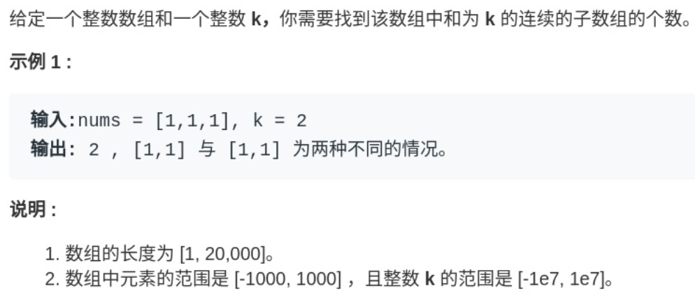

1. 什么是前缀和

```
// 前缀和数组
        // preSum[i] 就是 nums[0..i- 1] 的和。
        // 那么如果我们想求 nums[i..j] 的和，只需要一步操作,preSum[j+1]-preSum[i] 即可，而不需要重新去遍历数组了。
        int[] preSum = new int[n + 1];
        preSum[0] = 0;
        for (int i = 0; i < n; ++i) {
            preSum[i + 1] = preSum[i] + nums[i];
        }
```

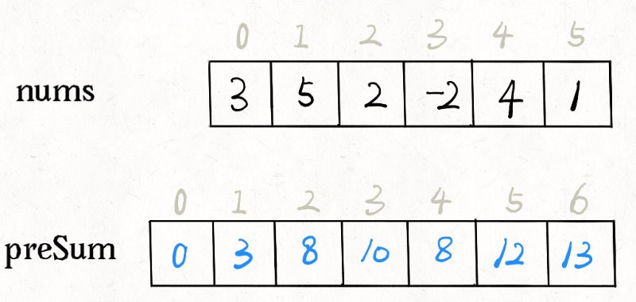

```java
/**
 * 算出一共有几个和为k的连续子数组
 */
public class PreSum {
    // 时间复杂度过高
    int subarraySum(int[] nums, int k) {
        int n = nums.length;
        // 前缀和数组
        // preSum[i] 就是 nums[0..i- 1] 的和。
        // 那么如果我们想求 nums[i..j] 的和，只需要一步操作,preSum[j+1]-preSum[i] 即可，而不需要重新去遍历数组了。
        int[] preSum = new int[n + 1];
        preSum[0] = 0;
        for (int i = 0; i < n; ++i) {
            preSum[i + 1] = preSum[i] + nums[i];
        }
        int ans = 0;
        // 穷举所有子数组
        for (int i = 1; i <= n; ++i) {
            //在计算，有几个 j 能够使得 sum[i] 和 sum[j] 的差为 k。毎找到一个这样的 j ，就把结果加一。
            for (int j = 0; j < i; ++j) {
                // sum of nums[j..i-1]
                if (preSum[i] - preSum[j] == k) {
                    ans++;
                }
            }
        }
        return ans;
    }

    /**
     * hashmap版本,我直接记录下有几个sum[j]和sum[i]-k相等，直接更新结果，
     * 就避免了内层的for循环。我们可以用哈希表，在记录前缀和的同时记录该前缀和出现的次数。
     *
     * @param nums
     * @param k
     * @return
     */
    int subarraySumHashMap(int[] nums, int k) {
        int n = nums.length;
        HashMap<Integer, Integer> preSum = new HashMap<>();
        preSum.put(0, 1);
        int ans = 0, sum0_i = 0;
        for (int i = 0; i < n; ++i) {
            sum0_i += nums[i];
            // 这是我们想找的前缀和 nums[0..j]
            int sum0_j = sum0_i - k;
            if (preSum.containsKey(sum0_j)) {
                ans += preSum.get(sum0_j);
            }
            // 把前缀和nums[0..i]加入并记录出现次数
            preSum.put(sum0_i, preSum.getOrDefault(sum0_i, 0) + 1);
        }
        return ans;
    }
}
```

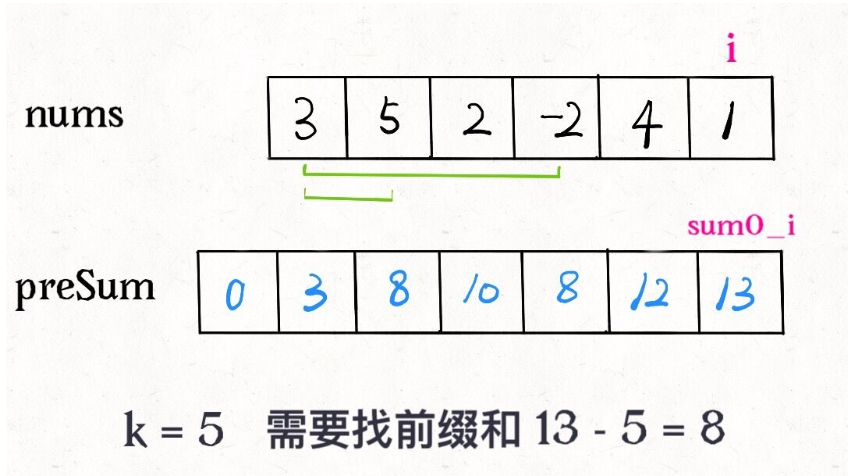

前缀和不难，却很有用，主要用于处理数组区间的问题。

## 11.6 大数运算

### 11.6.1 大数加法


### 11.6.2 大数乘法

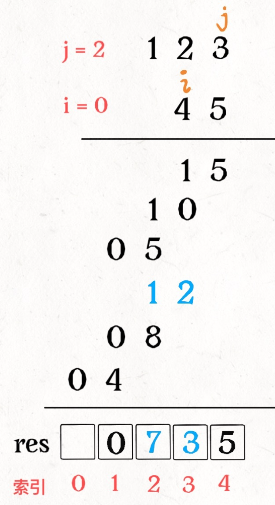

```java
   /**
     * 给定两个以字符串形式表示的非负整数 num1 和 num2，返回 num1 和 num2 的乘积，它们的乘积也表示为字符串形式。
     * <p>
     * 示例 1:
     * <p>
     * 输入: num1 = "2", num2 = "3"
     * 输出: "6"
     * 示例 2:
     * <p>
     * 输入: num1 = "123", num2 = "456"
     * 输出: "56088"
     * 说明：
     * <p>
     * num1 和 num2 的长度小于110。
     * num1 和 num2 只包含数字 0-9。
     * num1 和 num2 均不以零开头，除非是数字 0 本身。
     * 不能使用任何标准库的大数类型（比如 BigInteger）或直接将输入转换为整数来处理。
     */
    public static String multiply(String num1, String num2) {
        int m = num1.length(), n = num2.length();
        int res[] = new int[m + n];
        Arrays.fill(res, 0);
        // 从个位数开始逐位相乘
        // 如何将乘积叠加到res的正确位置，或者说，如何通过i，j计算res的对应索引呢?
        // num1[i]和num2[j]的乘积对应的就是res[i+j]和res[i+j+1]这两个位置
        for (int i = m - 1; i >= 0; --i) {
            for (int j = n - 1; j >= 0; --j) {
                int mul = (num1.charAt(i) - '0') * (num2.charAt(j) - '0');
                // 乘积在 res 对应的索引位置
                int p1 = i + j, p2 = i + j + 1;
                // 叠加到 res 上
                int sum = mul + res[p2];
                res[p2] = sum % 10;
                res[p1] += sum / 10;
            }
        }
        // 结果前缀可能存的 0(未使用的位)
        int i = 0;
        while (i < res.length && res[i] == 0) {
            ++i;
        }
        // 将计算结果转化成字符串
        char[] strChar = new char[res.length - i];
        int j = 0;
        for (; i < res.length; ++i) {
            strChar[j++] = (char) (res[i] + '0');
        }
        return strChar.length == 0 ? "0" : String.valueOf(strChar);
    }
}
```

## 11.7 **FloodFill**算法详解


# 12. DFS vs BFS

## 12.1 DFS

深度优先搜索，从起点出发，从规定的方向中选择其中一个不断地向前走，直到无法继续为止，然后尝试另外一种方向，直到最后走到终点。就像走迷宫一样，尽量往深处走。

DFS 解决的是连通性的问题，即，给定两个点，一个是起始点，一个是终点，判断是不是有一条路径能从起点连接到终点。起点和终点，也可以指的是某种起始状态和最终的状态。问题的要求并不在乎路径是长还是短，只在乎有还是没有。有时候题目也会要求把找到的路径完整的打印出来。

### 12.1.1 走迷宫

给定一个二维矩阵代表一个迷宫，迷宫里面有通道，也有墙壁，通道由数字 0 表示，而墙壁由 -1 表示，有墙壁的地方不能通过，那么，能不能从 A 点走到 B 点。


```java
int dx[] = {-1, 0, 1, 0};   //通过px 和 py数组来实现左下右上的移动顺序
int dy[] = {0, -1, 0, 1};
// x表示横坐标，y表示纵坐标
boolean dfs(int maze[][], int x, int y) {
        // 第一步：判断是否找到了B（B[0]是B的横坐标，B[1]是纵坐标）
        if (x == B[0] && y == B[1]) {
            return true;
        }

        // 第二步：标记当前的点已经被访问过
        maze[x][y] = -1;

        // 第三步：在四个方向上尝试
        for (int d = 0; d < 4; d++) {
            int i = x + dx[d], j = y + dy[d];

            // 第四步：如果有一条路径被找到了，返回true
            if (isSafe(maze, i, j) && dfs(maze, i, j)) {
                return true;
            }
        }
        // 付出了所有的努力还是没能找到B，返回false
        return false;
    }
boolean isSafe(int maze[][], int i, int j){
  if(i>=0 && i< maze.length() && j>=0 && j<maze[0].length() && maze[i][j]!=-1)
    return true;
  return false;
}
```

非递归实现。

```java
boolean dfs(int maze[][], int x, int y) {
        // 创建一个Stack
        Stack<Integer[]> stack = new Stack<>();

        // 将起始点压入栈，标记它访问过
        stack.push(new Integer[]{x, y});
        maze[x][y] = -1;

        while (!stack.isEmpty()) {
            // 取出当前点
            Integer[] pos = stack.pop();
            x = pos[0];
            y = pos[1];

            // 判断是否找到了目的地
            if (x == B[0] && y == B[1]) {
                return true;
            }

            // 在四个方向上尝试  
            for (int d = 0; d < 4; d++) {
                int i = x + dx[d], j = y + dy[d];

                if (isSafe(maze, i, j)) {
                    stack.push(new Integer[]{i, j});
                    maze[i][j] = -1;
                }
            }
        }
        return false;
    }
```

DFS 是图论里的算法，分析利用 DFS 解题的复杂度时，应当借用图论的思想。图有两种表示方式：**邻接表**、**邻接矩阵**。假设图里有 V 个顶点，E 条边。

邻接表
**访问所有顶点的时间为 O(V)，而查找所有顶点的邻居一共需要 O(E) 的时间，所以总的时间复杂度是 O(V + E)。**


邻接矩阵
**查找每个顶点的邻居需要 O(V) 的时间，所以查找整个矩阵的时候需要 O(V2) 的时间。**

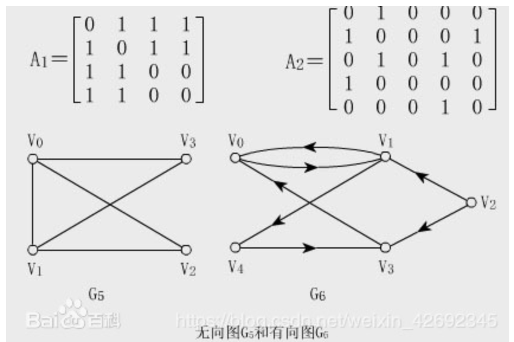

### 12.1.2 利用 DFS 去寻找最短的路径

**解题思路**

思路 1：暴力法。

寻找出所有的路径，然后比较它们的长短，找出最短的那个。此时必须尝试所有的可能。因为 DFS 解决的只是连通性问题，不是用来求解最短路径问题的。

思路 2：优化法。

一边寻找目的地，一边记录它和起始点的距离（也就是步数）。

从某方向到达该点所需要的步数更少，则更新。


从各方向到达该点所需要的步数都更多，则不再尝试。


```java
void solve(int maze[][]) {
        // 第一步. 除了A之外，将其他等于0的地方用MAX_VALUE替换
        for (int i = 0; i < maze.length; i++) {
            for (int j = 0; j < maze[0].length; j++) {
                if (maze[i][j] == 0 && !(i == A[0] && j == A[1])) {
                    maze[i][j] = Integer.MAX_VALUE;
                }
            }
        }

        // 第二步. 进行优化的DFS操作
        dfs(maze, A[0], A[1]);

        // 第三步. 看看是否找到了目的地
        if (maze[B[0]][B[1]] < Integer.MAX_VALUE) {
            print("Shortest path count is: " + maze[B[0]][B[1]]);
        } else {
            print("Cannot find B!");
        }
    }

    void dfs(int maze[][], int x, int y) {
        // 第一步. 判断是否找到了B
        if (x == B[0] && y == B[1]) return;

        // 第二步. 在四个方向上尝试
        for (int d = 0; d < 4; d++) {
            int i = x + dx[d], j = y + dy[d];

            // 判断下一个点的步数是否比目前的步数+1还要大
            if (isSafe(maze, i, j) && maze[i][j] > maze[x][y] + 1) {
                // 如果是，就更新下一个点的步数，并继续DFS下去
                maze[i][j] = maze[x][y] + 1;
                dfs(maze, i, j);
            }
        }
    }
```

注意：之前的题目只要找到了一个路径就返回，这里我们必须尽可能多的去尝试，直到找到最短路径。

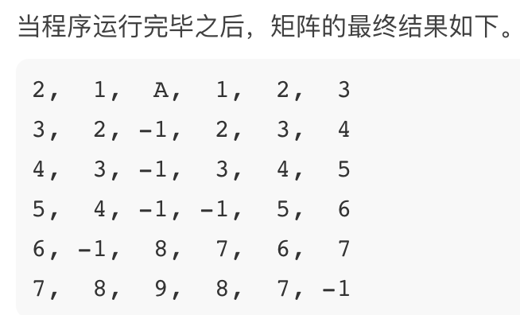

## 12.2 BFS

BFS 相对 DFS 的最主要的区别是：**BFS 找到的路径一定是最短的，但代价就是空间复杂度比 DFS 大很多**，至于为什么，我们后面介绍了框架就很容易看出来了。

BFS**问题的本质就是让你在一幅「图」中找到从起点`start`到终点`target`的最近距离，这个例子听起来很枯燥，但是 BFS 算法问题其实都是在干这个事儿。**

这个广义的描述可以有各种变体，比如走迷宫，有的格子是围墙不能走，从起点到终点的最短距离是多少？如果这个迷宫带「传送门」可以瞬间传送呢？

再比如说两个单词，要求你通过某些替换，把其中一个变成另一个，每次只能替换一个字符，最少要替换几次？

这个广义的描述可以有各种变体，比如走迷宫，有的格子是围墙不能走，从起点到终点的最短距离是多少？如果这个迷宫带「传送门」可以瞬间传送呢？

再比如说两个单词，要求你通过某些替换，把其中一个变成另一个，每次只能替换一个字符，最少要替换几次？

这些问题都没啥奇技淫巧，本质上就是一幅「图」，让你从一个起点，走到终点，问最短路径。这就是 BFS 的本质，框架搞清楚了直接默写就好。

```java
// 计算从起点 start 到终点 target 的最近距离
int BFS(Node start, Node target) {
    Queue<Node> q; // 核心数据结构
    Set<Node> visited; // 避免走回头路

    q.offer(start); // 将起点加入队列
    visited.add(start);
    int step = 0; // 记录扩散的步数

    while (q not empty) {
        int sz = q.size();
        /* 将当前队列中的所有节点向四周扩散 */
        for (int i = 0; i < sz; i++) {
            Node cur = q.poll();
            /* 划重点：这里判断是否到达终点 */
            if (cur is target)
                return step;
            /* 将 cur 的相邻节点加入队列 */
            for (Node x : cur.adj())
                if (x not in visited) {
                    q.offer(x);
                    visited.add(x);
                }
        }
        /* 划重点：更新步数在这里 */
        step++;
    }
}
```

队列`q`就不说了，BFS 的核心数据结构；`cur.adj()`泛指`cur`相邻的节点，比如说二维数组中，`cur`上下左右四面的位置就是相邻节点；`visited`的主要作用是防止走回头路，大部分时候都是必须的，但是像一般的二叉树结构，没有子节点到父节点的指针，不会走回头路就不需要`visited`。


- 层级遍历
- 由点到面遍历图
- 拓扑排序
- 求最短路径

我们一个一个来讲解，首先是层级遍历，前面讲过，每个节点只会找到其周围的节点，你可以想象成当前层的节点只可能找到下一层的节点（前一层遍历过不考虑），因此我们可以把一层找到的东西放在一起，这也就是用层这个概念对找到的所有节点进行归类。

第二点是**遍历图**，其实就是上面中的例子“给定连通图上面的一个节点，需要找到这个图中的所有节点”，你可能会问，遍历整个图有什么用呢？如果我们知道来所有节点的数量，**其实通过遍历整个图我们还可以判断一个图的连通性**，如果从一个点出发找不到某些点，那么说明其实这不是一个连通的图，有些节点不在图上，被分开了。

第三点是**拓扑排序**，这里可以参考我之前写的一篇文章 [拓扑排序原理和习题分析。](http://mp.weixin.qq.com/s?__biz=MzUyNjQxNjYyMg==&mid=2247485673&idx=2&sn=d5925b12028f122910b6637fb0c05a30&chksm=fa0e6768cd79ee7e0e9e161dc774e7b0d14f4a5cb90c4787eeba16eaeff7493173ab63f2d686&scene=21#wechat_redirect)

第四点，也是比较常用的就是**找出图上两点的最短路径**，当然这里是有条件的，就是这个图必须是简单的连通图，什么是简单图，就是边没有权重，或者说权重都为固定的值。从一个点出发，找到下一层的所有点，从下一层的点出发，找到下下层的所有点，每到一层就算走一步，当我们找到我们要找的点，此时的步数就是最后的答案。

对于广度优先搜索的时间和空间复杂度的分析也是比较简单，一般问题都需要遍历整个图，因此时间复杂度是 **O(N + M)**，空间复杂度是 **O(N)**，这里的 N 表示的是节点的总数量，M 表示的是边的数量，有些图中，比如说全连通图(M = N^2)，我们遍历的时候，会尝试去走所有的边，对于空间来说的话，一般只会记录访问过的节点和当前层的节点，不会去考虑边的情况，因此时间复杂度和空间复杂度在这里还是不太一样的。

### 12.2.1 二叉树的最小高度

[二叉树的最小高度111](https://github.com/haojunsheng/AlgorithmNotes/blob/master/src/com/code/leetcode/bfs/MinDepth_111.java)

```java
package com.code.leetcode.bfs;

import java.util.LinkedList;
import java.util.Queue;

/**
 * 二叉树的最小深度
 * 给定一个二叉树，找出其最小深度。
 * 最小深度是从根节点到最近叶子节点的最短路径上的节点数量。
 * 说明: 叶子节点是指没有子节点的节点。
 * 给定二叉树 [3,9,20,null,null,15,7],返回它的最小深度2.
 */
public class MinDepth {
    public class TreeNode {
        int val;
        TreeNode left;
        TreeNode right;

        TreeNode(int x) {
            val = x;
        }
    }

    int minDepth(TreeNode root) {
        if (root == null) {
            return 0;
        }
        Queue<TreeNode> q = new LinkedList<>();
        q.offer(root);
        // root 本身就是一层，depth 初始化为 1
        int depth = 1;

        while (!q.isEmpty()) {
            int sz = q.size();
            /* 将当前队列中的所有节点向四周扩散 */
            for (int i = 0; i < sz; i++) {
                TreeNode cur = q.poll();
                /**
                 * 首先明确一下起点start和终点target是什么，怎么判断到达了终点？
                 * 显然起点就是root根节点，终点就是最靠近根节点的那个「叶子节点」嘛，叶子节点就是两个子节点都是null的节点：
                 */
                if (cur.left == null && cur.right == null) {
                    return depth;
                }
                /* 将 cur 的相邻节点加入队列 */
                if (cur.left != null) {
                    q.offer(cur.left);
                }
                if (cur.right != null) {
                    q.offer(cur.right);
                }
            }
            /* 这里增加步数 */
            depth++;
        }
        return depth;
    }
}
```

### 12.2.2 解开密码锁的最少次数

[解开密码锁的最少次数](https://github.com/haojunsheng/AlgorithmNotes/blob/master/src/com/code/leetcode/bfs/MinDepth_111.java)

```java
/**
 * 打开转盘锁
 * 你有一个带有四个圆形拨轮的转盘锁。每个拨轮都有10个数字： '0', '1', '2', '3', '4', '5', '6', '7', '8', '9' 。
 * 每个拨轮可以自由旋转：例如把 '9' 变为  '0'，'0' 变为 '9' 。每次旋转都只能旋转一个拨轮的一位数字。
 * 锁的初始数字为 '0000' ，一个代表四个拨轮的数字的字符串。
 * 列表 deadends 包含了一组死亡数字，一旦拨轮的数字和列表里的任何一个元素相同，这个锁将会被永久锁定，无法再被旋转。
 * 字符串 target 代表可以解锁的数字，你需要给出最小的旋转次数，如果无论如何不能解锁，返回 -1。
 * <p>
 * 1. 输入：deadends = ["0201","0101","0102","1212","2002"], target = "0202"
 * 输出：6
 * 解释：
 * 可能的移动序列为 "0000" -> "1000" -> "1100" -> "1200" -> "1201" -> "1202" -> "0202"。
 * 注意 "0000" -> "0001" -> "0002" -> "0102" -> "0202" 这样的序列是不能解锁的，
 * 因为当拨动到 "0102" 时这个锁就会被锁定。
 * 2. 输入: deadends = ["8888"], target = "0009"
 * 输出：1
 * 解释：
 * 把最后一位反向旋转一次即可 "0000" -> "0009"。
 * 3. 输入: deadends = ["8887","8889","8878","8898","8788","8988","7888","9888"], target = "8888"
 * 输出：-1
 * 解释：无法旋转到目标数字且不被锁定。
 * 4. 输入: deadends = ["0000"], target = "8888"
 * 输出：-1
 */
public class OpenLock_752 {
    /**
     * 第一步，我们不管所有的限制条件，不管deadends和target的限制，
     * 就思考一个问题：如果让你设计一个算法，穷举所有可能的密码组合，你怎么做？
     * 穷举呗，再简单一点，如果你只转一下锁，有几种可能？总共有 4 个位置，每个位置可以向上转，也可以向下转，也就是有 8 种可能对吧。
     * 比如说从"0000"开始，转一次，可以穷举出"1000", "9000", "0100", "0900"...共 8 种密码。
     * 然后，再以这 8 种密码作为基础，对每个密码再转一下，穷举出所有可能…
     * 仔细想想，这就可以抽象成一幅图，每个节点有 8 个相邻的节点，又让你求最短距离，这不就是典型的BFS嘛。
     * 我们还需要解决下面的问题：
     * 1、会走回头路。比如说我们从"0000"拨到"1000"，但是等从队列拿出"1000"时，还会拨出一个"0000"，这样的话会产生死循环。
     * 2、没有终止条件，按照题目要求，我们找到target就应该结束并返回拨动的次数。
     * 3、没有对deadends的处理，按道理这些「死亡密码」是不能出现的，也就是说你遇到这些密码的时候需要跳过。
     */
    public int openLock(String[] deadends, String target) {
        // 记录需要跳过的死亡密码
        Set<String> deads = new HashSet<>();
        for (String s : deadends) {
            deads.add(s);
        }
        // 记录已经穷举过的密码，防止走回头路
        Set<String> visited = new HashSet<>();
        Queue<String> q = new LinkedList<>();
        // 从起点开始启动广度优先搜索
        int step = 0;
        q.offer("0000");
        visited.add("0000");

        while (!q.isEmpty()) {
            int sz = q.size();
            /* 将当前队列中的所有节点向周围扩散 */
            for (int i = 0; i < sz; i++) {
                String cur = q.poll();

                /* 判断是否到达终点 */
                if (deads.contains(cur)) {
                    continue;
                }
                if (cur.equals(target)) {
                    return step;
                }

                /* 将一个节点的未遍历相邻节点加入队列 */
                for (int j = 0; j < 4; j++) {
                    String up = plusOne(cur, j);
                    if (!visited.contains(up)) {
                        q.offer(up);
                        visited.add(up);
                    }
                    String down = minusOne(cur, j);
                    if (!visited.contains(down)) {
                        q.offer(down);
                        visited.add(down);
                    }
                }
            }
            /* 在这里增加步数 */
            step++;
        }
        // 如果穷举完都没找到目标密码，那就是找不到了
        return -1;
    }

    /**
     * 双向 BFS 优化
     * 传统的 BFS 框架就是从起点开始向四周扩散，遇到终点时停止；
     * 而双向 BFS 则是从起点和终点同时开始扩散，当两边有交集的时候停止。
     * 双向 BFS 也有局限，因为你必须知道终点在哪里。
     */
    int openLockDouble(String[] deadends, String target) {
        Set<String> deads = new HashSet<>();
        for (String s : deadends) {
            deads.add(s);
        }
        // 用集合不用队列，可以快速判断元素是否存在
        Set<String> q1 = new HashSet<>();
        Set<String> q2 = new HashSet<>();
        Set<String> visited = new HashSet<>();

        int step = 0;
        q1.add("0000");
        q2.add(target);

        while (!q1.isEmpty() && !q2.isEmpty()) {
            // 哈希集合在遍历的过程中不能修改，用 temp 存储扩散结果
            Set<String> temp = new HashSet<>();
            /* 将 q1 中的所有节点向周围扩散 */
            for (String cur : q1) {
                /* 判断是否到达终点 */
                if (deads.contains(cur)) {
                    continue;
                }
                if (q2.contains(cur)) {
                    return step;
                }
                visited.add(cur);

                /* 将一个节点的未遍历相邻节点加入集合 */
                for (int j = 0; j < 4; j++) {
                    String up = plusOne(cur, j);
                    if (!visited.contains(up)) {
                        temp.add(up);
                    }
                    String down = minusOne(cur, j);
                    if (!visited.contains(down)) {
                        temp.add(down);
                    }
                }
            }
            /* 在这里增加步数 */
            step++;
            // temp 相当于 q1
            // 这里交换 q1 q2，下一轮 while 就是扩散 q2
            q1 = q2;
            q2 = temp;
        }
        return -1;
    }

    // 将 s[j] 向上拨动一次
    String plusOne(String s, int j) {
        char[] ch = s.toCharArray();
        if (ch[j] == '9') {
            ch[j] = '0';
        } else {
            ch[j] += 1;
        }
        return new String(ch);
    }

    // 将 s[i] 向下拨动一次
    String minusOne(String s, int j) {
        char[] ch = s.toCharArray();
        if (ch[j] == '0') {
            ch[j] = '9';
        } else {
            ch[j] -= 1;
        }
        return new String(ch);
    }
}
```


### 12.2.1 二叉树的锯齿形层次遍历

```java
/**
 * 二叉树的锯齿形层次遍历
 * 给定一个二叉树，返回其节点值的锯齿形层次遍历。（即先从左往右，再从右往左进行下一层遍历，以此类推，层与层之间交替进行）。
 * 给定二叉树 [3,9,20,null,null,15,7],返回锯齿形层次遍历如下：
 * [
 * [3],
 * [20,9],
 * [15,7]
 * ]
 */
public class ZigzagLevelOrder_103 {
    public List<List<Integer>> zigzagLevelOrder(TreeNode root) {
        List<List<Integer>> ans = new ArrayList<>();
        if (root == null) {
            return ans;
        }
        Queue<TreeNode> q = new LinkedList<>();
        q.add(root);
        // 记录层数的奇偶性
        int cnt = 0;
        while (!q.isEmpty()) {
            List<Integer> tmp = new ArrayList<>();
            int len = q.size();
            for (int i = 0; i < len; i++) {
                TreeNode node = q.poll();
                // 这里将层数的奇偶性做下判断
                // 如果是偶数层就正向存储（以 0 为起始层）
                if (cnt % 2 == 0) {
                    tmp.add(node.val);
                } else {
                    // 奇数层则反向存储
                    tmp.add(0, node.val);
                }

                if (node.left != null) {
                    q.add(node.left);
                }
                if (node.right != null) {
                    q.add(node.right);
                }
            }
            cnt++;
            ans.add(tmp);
        }
        return ans;
    }
}
```


### 12.2.1 BFS找最短路径


从起始点 A 出发，类似于涟漪，一层一层地扫描，避开墙壁，同时把每个点与 A 的距离或者步数标记上。当找到目的地的时候返回步数，这个步数保证是最短的。

```java
void bfs(int[][] maze, int x, int y) {
    // 创建一个队列queue，将起始点A加入队列中
    Queue<Integer[]> queue = new LinkedList<>();
    queue.add(new Integer[] {x, y});
  
    // 只要队列不为空就一直循环下去  
    while (!queue.isEmpty()) {
        // 从队列的头取出当前点
        Integer[] pos = queue.poll();
        x = pos[0]; y = pos[1];
      
        // 从四个方向进行BFS
        for (int d = 0; d < 4; d++) {
            int i = x + dx[d], j = y + dy[d];
        
            if (isSafe(maze, i, j)) {
                // 记录步数（标记访问过）
                maze[i][j] = maze[x][y] + 1;
                // 然后添加到队列中  
                queue.add(new Integer[] {i, j});
                // 如果发现了目的地就返回  
                if (i == B[0] && j == B[1]) return;
            }
        }
    }
}
```

### 12.2.2 最多允许打通 3 堵墙

假设从起始点 A 走到目的地 B 的过程中，最多允许打通 3 堵墙，求最短的路径的步数。


# 13. 常见

## 13.1 LRU算法

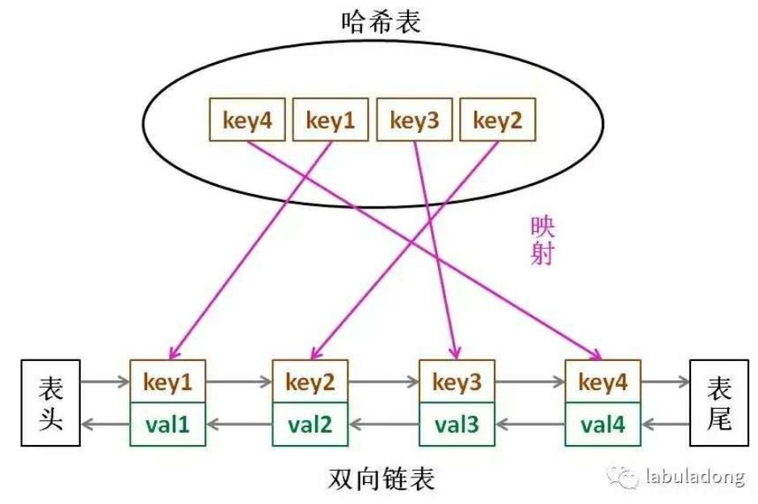

```java
/**
 * LRU 算法实际上是让你设计数据结构: 最近最少使用
 * 首先要接收一个capacity参数作为缓存的最大容量，
 * 然后实现两个API，一个是put(key, val)方法存入键值对，
 * 另一个是get(key)方法获取key对应的val，如果key不存在则返回-1
 */
public class LRUCache {
    /**
     * Node类用于抽象链表的节点
     * key、value存储键、值，
     * before、after分别指向当前节点的前后Node节点；
     */
    class Node {
        int key;
        int value;
        Node before;
        Node after;
    }

    /**
     * 使用HashMap缓存Node节点
     */
    private HashMap<Integer, Node> cache = new HashMap<Integer, Node>();
    /**
     * 最大容量，超过capacity时继续插入会触发删除最老未被使用的节点
     */
    private int capacity;
    /**
     * 头节点、尾节点（注意这两个节点不存储实际的数据）
     */
    private Node head, tail;

    public LRUCache(int capacity) {
        this.capacity = capacity;

        head = new Node();
        head.before = null;

        tail = new Node();
        tail.after = null;

        head.after = tail;
        tail.before = head;
    }

    /**
     * 将节点插入队列头部
     *
     * @param node
     */
    private void addToHead(Node node) {
        node.before = head;
        node.after = head.after;
        head.after.before = node;
        head.after = node;
    }

    /**
     * 删除队列中的一个节点
     *
     * @param node
     */
    private void removeNode(Node node) {
        Node before = node.before;
        Node after = node.after;
        before.after = after;
        after.before = before;
    }

    /**
     * 将节点移动到有效数据头部
     *
     * @param node
     */
    private void moveToHead(Node node) {
        removeNode(node);
        addToHead(node);
    }

    /**
     * 删除有效数据尾节点
     *
     * @return 尾节点
     */
    private Node popTail() {
        Node res = tail.before;
        this.removeNode(res);
        return res;
    }

    public int get(int key) {
        Node node = cache.get(key);
        if (node == null) {
            return -1; // should raise exception here.
        }
        // 如果获取到数据，则将获取到的节点移动到队列头部;
        moveToHead(node);
        return node.value;
    }

    public void put(int key, int value) {
        Node node = cache.get(key);
        if (node == null) {
            Node newNode = new Node();
            newNode.key = key;
            newNode.value = value;
            cache.put(key, newNode);
            addToHead(newNode);
            if (cache.size() > capacity) {
                // 删除队尾有效数据节点
                Node tail = this.popTail();
                this.cache.remove(tail.key);
            }
        } else {
            node.value = value;
            // 在使用get方法获取值之后，需要将当前获取的节点移动到队列头部
            moveToHead(node);
        }
    }
}

// 或者使用LinkedHashMap来实现
//class LRUCache extends LinkedHashMap<Integer,Integer>  {
//    private int capacity;
//
//    public LRUCache(int capacity) {
//        super(capacity, 0.75F,true);
//        this.capacity = capacity;
//    }
//
//    public int get(int key) {
//        return super.getOrDefault(key,-1);
//    }
//
//    public void put(int key, int value) {
//        super.put(key,value);
//    }
//
//    @Override
//    public boolean removeEldestEntry(Map.Entry<Integer, Integer> eldest){
//        return size() > capacity;
//    }
//}
```

为什么要在链表中同时存储 key 和 val，而不是 只存储val？

当缓存容量已满，我们不仅仅要删除最后一个 Node 节点，还要把 map 中映 射到该节点的 key 同时删除，而这个 key 只能由 Node 得到。如果Node结构中只存储 val，那么我们就无法得知 key 是什么，就无法删除 map 中的 键，造成错误。

