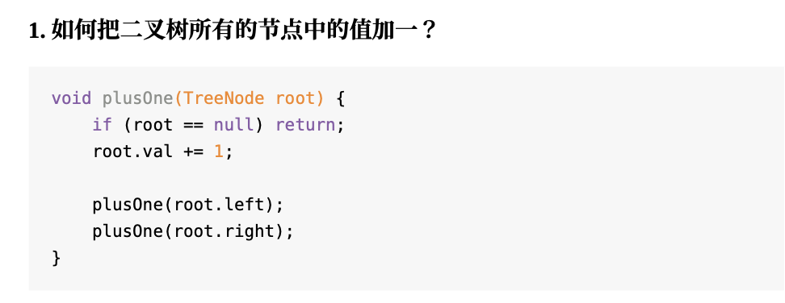
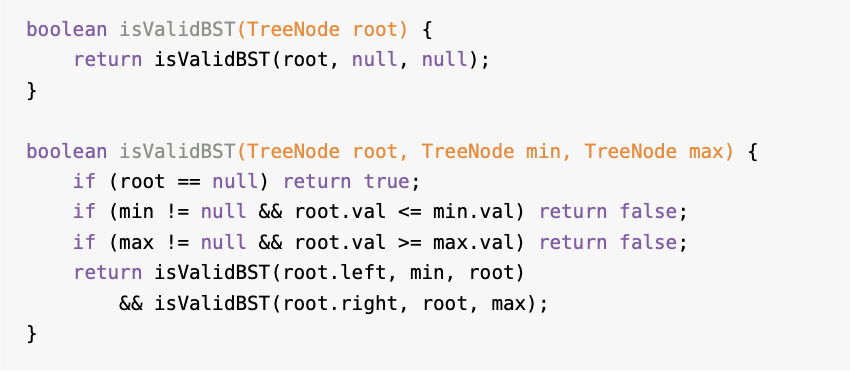
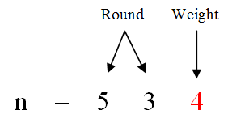
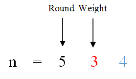
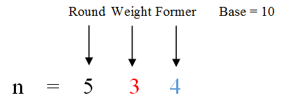

<!--ts-->
   * [1.概述](#1概述)
   * [2.数组](#2数组)
      * [2.1 数组中的重复数字](#21-数组中的重复数字)
      * [2.2 二维数组中的查找](#22-二维数组中的查找)
      * [2.3 旋转数组旋转数组的最小数字](#23-旋转数组旋转数组的最小数字)
      * [2.4 调整数组顺序使奇数位于偶数前面](#24-调整数组顺序使奇数位于偶数前面)
      * [2.5 顺时针打印矩阵](#25-顺时针打印矩阵)
      * [2.6 数组中出现次数超过一半的数字](#26-数组中出现次数超过一半的数字)
      * [2.7 最小的k个数](#27-最小的k个数)
      * [2.8 连续子数组的最大和](#28-连续子数组的最大和)
      * [2.9 数组排成最小的数](#29-数组排成最小的数)
   * [3 链表](#3-链表)
      * [3.1 从尾到头打印链表](#31-从尾到头打印链表)
      * [3.2 删除链表中的节点](#32-删除链表中的节点)
      * [3.3 链表中倒数第k个节点](#33-链表中倒数第k个节点)
      * [3.4 链表中环的入口节点](#34-链表中环的入口节点)
      * [3.5 反转链表](#35-反转链表)
      * [3.6 合并两个排序的链表](#36-合并两个排序的链表)
      * [3.7 复杂链表的复制](#37-复杂链表的复制)
      * [3.8 二叉搜索树与双向链表](#38-二叉搜索树与双向链表)
   * [4. 二叉树&amp;递归](#4-二叉树递归)
      * [4.1 二叉搜索树BST](#41-二叉搜索树bst)
      * [4.2 二叉树遍历类](#42-二叉树遍历类)
         * [4.2.1 重建二叉树](#421-重建二叉树)
         * [4.2.2 二叉搜索树的后序遍历序列](#422-二叉搜索树的后序遍历序列)
         * [4.2.3 树的子结构](#423-树的子结构)
         * [4.2.4 二叉树的镜像](#424-二叉树的镜像)
         * [4.2.4 对称的二叉树](#424-对称的二叉树)
         * [4.2.5 二叉树中和为某值的路径](#425-二叉树中和为某值的路径)
      * [4.3 二叉树的下一个节点](#43-二叉树的下一个节点)
      * [4.4 从上向下打印二叉树](#44-从上向下打印二叉树)
      * [4.5 序列化二叉树](#45-序列化二叉树)
      * [4.6 数据流中的中位数](#46-数据流中的中位数)
   * [5. 栈和队列](#5-栈和队列)
      * [5.1 俩个栈实现队列](#51-俩个栈实现队列)
      * [5.2 包含min函数的栈](#52-包含min函数的栈)
      * [5.3 栈的压入、弹出序列](#53-栈的压入弹出序列)
   * [6. 字符串](#6-字符串)
      * [6.1 替换空格](#61-替换空格)
      * [6.2 正则表达式匹配](#62-正则表达式匹配)
      * [6.3 表示数值的字符串](#63-表示数值的字符串)
      * [6.4 数字序列中某一位的数字](#64-数字序列中某一位的数字)
   * [6. 递归和循环](#6-递归和循环)
      * [6.2 数值的整数次方](#62-数值的整数次方)
      * [6.3  打印从1到最大的n位数](#63--打印从1到最大的n位数)
      * [6.4 1-n整数中1出现的次数](#64-1-n整数中1出现的次数)
   * [7. 查找和排序](#7-查找和排序)
   * [8. 动态规划和贪心算法](#8-动态规划和贪心算法)
      * [8.1 <strong>斐波那契数列</strong>](#81-斐波那契数列)
      * [8.2 凑零钱问题](#82-凑零钱问题)
      * [8.3 最长增长子序列](#83-最长增长子序列)
      * [8.4 编辑距离](#84-编辑距离)
      * [8.5 剪绳子](#85-剪绳子)
      * [8.6 连续子数组的最大和](#86-连续子数组的最大和)
      * [8.7 数字翻译为字符串](#87-数字翻译为字符串)
      * [8.8 礼物的最大价值](#88-礼物的最大价值)
      * [8.9 最长不包含重复字符的子字符串](#89-最长不包含重复字符的子字符串)
   * [9. 回溯](#9-回溯)
      * [9.1 全排列问题](#91-全排列问题)
      * [9.2 矩阵中的路径](#92-矩阵中的路径)
      * [9.3 机器人的运动范围](#93-机器人的运动范围)
      * [9.4 字符串的排列](#94-字符串的排列)
   * [10. 位运算](#10-位运算)
      * [10.1 n&amp;(n-1)](#101-nn-1)
   * [11. 双指针法](#11-双指针法)
      * [11.1 快慢指针法](#111-快慢指针法)
         * [11.1.1 <strong>判定链表中是否含有环</strong>](#1111-判定链表中是否含有环)
         * [11.1.2 <strong>寻找链表的中点</strong>](#1112-寻找链表的中点)
         * [11.1.3 <strong>寻找链表的倒数第</strong> <strong>k</strong> <strong>个元素</strong>](#1113-寻找链表的倒数第-k-个元素)
      * [11.2 左右指针法](#112-左右指针法)
         * [11.2.1 二分查找](#1121-二分查找)
         * [11.2.2 两数和](#1122-两数和)
         * [11.2.3 反转数组](#1123-反转数组)
         * [11.2.4 滑动窗口算法](#1124-滑动窗口算法)
   * [参考书籍](#参考书籍)

<!-- Added by: anapodoton, at: Sun Mar 15 18:52:28 CST 2020 -->

<!--te-->

# 1.概述

https://www.cxyxiaowu.com/7072.html

思考为什么他可以写出这么好的代码，把每道题的思路理解后用笔记本记录下来，争取刷到融会贯通，即看见有个题能自动归类到某个方面，这样有一定好处。面试最重要的是让面试官日后能愿意与你以后一起工作，因此沟通交流非常重要。比如有时候面试需要交流，看着像是一道排序的题做不出来，就可以跟面试官交流：“我有几个不成熟的想法，一排序，二动态规划，三是直接搜索算法”，面试官可能就给个提示：“你先用排序试试吧“。

**各种时间复杂度和空间复杂度**
 [complexity.md](complexity.md) 

**常用的数据结构：**
数组，链表，二叉树，栈和队列。

**常用的算法：大多数是基于查找和排序。**
递归的核心思想是如果要求f(n),那么我只需要知道f(n-1)即可。循环的核心思想是要求f(n),我可以从f(1)一直求到f(n)。

我们应该重点掌握**二分查找，归并排序和快速排序**。这三种必须可以手撕代码。
如果面试题要求在排序的数组或者部分排序的数组中查找一个数字或者统计某数字出现的次数，可以尝试使用二分查找算法。

在查找中，哈希表和二叉排序树的考察重点在数据结构上，而不是算法上。哈希表的时间复杂度为O(1)，原理是空间换时间，题目代表50“第一个只出现一次的字符”，可以关注布隆过滤器的实现。

在排序中，需要掌握各种排序算法的平均时间复杂度，最差时间复杂度，空间复杂度，另快排是十分重要的。
快排的核心是随机选择一个数字，比这个数字大的移动到左边，比这个数字小的移动到右边。可以用递归和循环来实现。

当题目要求在二维数组上（迷宫或者棋盘）上搜索路径，我们可以尝试使用回溯法，很适合采用递归的手段来实现。
如果明确指出不可以使用递归的话，可以使用栈来模拟递归。

回溯法是升级版的暴力法，从解决问题的每一步的所有可能选项选出一项，然后进入下一步，进行重复选择，直到最终状态。（在到达递归边界前的某层，由于一些事实不需要向任何一个子问题进行递归，直接返回上一层，这种做法称为回溯法）。

动态规划和贪心算法。
动态规划用于求某个问题的最优解(通常是最大值和最小值)，并且该问题可以分解为多个子问题。
需要符合两个特点：1.求最优解，即求最值。2.整体的最优解依赖于各个子问题的最优解。3.子问题之间有相互重叠的更小的子问题。4.根据第三点，子问题之间有重叠，所以从上向下分析问题，从下向上求解问题。

位运算：与，或，异或，左移和右移。
需要关注的是右移，分为有符号和无符号两种，如果是无符号，则直接用0填补左边的n位，如果是有符号的负数，如10001010 >> 3= 11110001
把一个整数减去1，再和原整数做与运算，会把该整数最右边的一个1变成0。也是很多二进制问题的解决思路。

自上而下的分析问题，自下而上的解决问题。

**数据结构类题目**

# 2.数组
这种题目的关键在于找出规律

## 2.1 数组中的重复数字

[数组中重复的数字(3)](https://github.com/haojunsheng/AlgorithmNotes/blob/master/src/com/code/array/DuplicationInArray_0301.java)
【核心】核心是数字i出现在下标为i的位置上

```java
public static boolean duplicate(int[] arr) {
        // 1. 首先判断数组是否为空或者长度是否为0
        if (arr == null || arr.length == 0) {
            return false;
        }
        // 2. 判断数据的值是否符合要求
        for (int i = 0; i < arr.length; i++) {
            if (arr[i] < 0 || arr[i] >= arr.length) {
                return false;
            }
        }
        for (int i = 0; i < arr.length; i++) {
            while (arr[i] != i) {
                if (arr[i] == arr[arr[i]]) {
                    duplication = arr[i];
                    System.out.println(arr[i]);
                    return true;
                }

                int temp = arr[i];
                arr[i] = arr[temp];
                arr[temp] = temp;
            }
        }
        return false;
    }
```

变形题目：**不修改数组找出重复的数字**。

```java
// 题目：在一个长度为n+1的数组里的所有数字都在1到n的范围内，所以数组中至
// 少有一个数字是重复的。请找出数组中任意一个重复的数字，但不能修改输入的
// 数组。例如，如果输入长度为8的数组{2, 3, 5, 4, 3, 2, 6, 7}，那么对应的
// 输出是重复的数字2或者3。

// 二分查找算法

/**
 * 如果数组中有重复的数，那么n+1个1~n范围内的数中，一定有几个数的个数大于1。那么，我们可以利用这个思路解决该问题。
 * 我们把从1~n的数字从中间的数字m分为两部分，前面一半为1~m，后面一半为m+1~n。
 * 如果1~m的数字的数目等于m，则不能直接判断这一半区间是否包含重复的数字，反之，如果大于m，那么这一半的区间一定包含重复的数字；
 * 如果小于m，另一半m+1~n的区间里一定包含重复的数字。
 * 接下来，我们可以继续把包含重复的数字的区间一分为二，直到找到一个重复的数字。
 */
public static int getDuplication(int[] arr) {
        // 判断数组的合法性
        if (arr == null || arr.length == 0) {
            return -1;
        }
        for (int i = 0; i < arr.length; i++) {
            if (arr[i] < 1 || arr[i] >= arr.length) {
                return -1;
            }
        }

        int start = 1;
        int end = arr.length - 1;
        int mid = 0;
        int count = 0;
        //
        while (start <= end) {
            mid = (end - start) / 2 + start;
            count = countRange(arr, start, mid);
            // 找到重复的元素
            if (start == end) {
                if (count > 1) {
                    return start;
                } else {
                    break;
                }
            }
            // // count大于mid左边元素的个数，则重复元素在左边
            if (count > (mid - start + 1)) {
                end = mid;
            // 在右边
            } else {
                start = mid + 1;
            }
        }
        return -1;
    }

    // 计算在某范围的数的个数，该数要大于等于start，小于等于end
    public static int countRange(int[] arr, int start, int end) {
        if (arr == null) {
            return 0;
        }
        int count = 0;
        for (int i = 0; i < arr.length; i++) {
            if (arr[i] >= start && arr[i] <= end) {
                count++;
            }
        }
        return count;
    }

```

## 2.2 二维数组中的查找

[二维数组中的查找(4)](https://github.com/haojunsheng/AlgorithmNotes/blob/master/src/com/code/array/FindInPartiallySortedMatrix_04.java)
本题的规律在于矩阵右上角和左下角比较特殊，比该行所有元素大，比该列所有元素小。而左上角没有这样的规律。

```java
/**
 * 总结规律如下：首先选取矩阵右上角的数字。如果等于要查找的数字，查找过程结束；
 * 如果大于要查找的数字，则剔除这个数字所在的列，如果小于要查找的数字，则剔除这个数字所在的行。
 * 这样每一步都可以缩减查找范围，直到找到要查找的数字，或者查找失败。
 */
public static boolean Find(int target, int[][] arr) {
        if (arr == null || arr.length == 0) {
            return false;
        }
        int rows = arr.length;
        int columns = arr[0].length;
        // 初始化行列
        int row = 0;
        int column = columns - 1;
        while (row < rows && column >= 0) {
            // 找到元素
            if (arr[row][column] == target) {
                return true;
                // 该值大于target，排除所在列
            } else if (arr[row][column] > target) {
                column--;
                // 否则排除所在行
            } else {
                row++;
            }
        }
        return false;
    }
```

## 2.3 旋转数组旋转数组的最小数字

[旋转数组旋转数组的最小数字（11）](https://github.com/haojunsheng/AlgorithmNotes/blob/master/src/com/code/sort_find/MinNumberInRotatedArray_11.java)
本题还属于二分查找算法。因为某种程度上是有序的。

```java
/**
 * 把一个数组最开始的若干个元素搬到数组的末尾，我们称之为数组的旋转。
 * 输入一个递增排序的数组的一个旋转，输出旋转数组的最小元素。
 * 例如数组{3,4,5,1,2}为{1,2,3,4,5}的一个旋转，该数组的最小值为1。
*/ 
// 二分查找，这里的数组可以看成两个有序的子数组
public static Integer minNumberInRotateArray(int[] array) {
        //处理非法输入
        if (array == null || array.length == 0) {
            return null;
        }
        int low = 0;
        int high = array.length - 1;
        //处理并没有发生旋转的情况
        int mid = 0;
        while (array[low] >= array[high]) {
            // index1会指向前一个子数组的最后一个元素，index2会指向后一个子数组的第一个元素，两者之间的距离为1。而index2指向的就是最小的元素。
            if (high - low == 1) {
                mid = high;
                break;
            }
            mid = (low + high) / 2;
            //特殊情况，顺序比较
            if ((array[low] == array[mid]) && (array[mid] == array[high])) {
                return minInOrder(array);
            }
            // 在右边的子数组
            if (array[mid] >= array[low]) {
                low = mid;
                //在左边的子数组
            } else if (array[mid] <= array[high]) {
                high = mid;
            }
        }
        return array[mid];
    }

    private static Integer minInOrder(int[] array) {
        int min = array[0];
        for (int i = 1; i < array.length; i++) {
            if (array[i] < min) {
                min = array[i];
            }
        }
        return min;
    }
```

## 2.4 调整数组顺序使奇数位于偶数前面

[调整数组顺序使奇数位于偶数前面(21)](https://github.com/haojunsheng/AlgorithmNotes/blob/master/src/com/code/array/ReorderArray_21.java)
双指针法，一般就是找规律和空间换时间。

**延伸**：判断一个数是不是偶数的方法：(a & 0x1) == 0

```java
// 双指针法
    private static void recorderOddEven(int a[]) {
        if (a.length == 0 || a == null) {
            return;
        }
        int i = 0, j = a.length - 1;
        while (i < j) {
            //直到碰见偶数，判断偶数的方法
            while (i < j && (a[i] & 0x1) != 0) {
                i++;
            }
            //直到碰见奇数
            while (i < j && (a[j] & 0x1) == 0) {
                j--;
            }
            if (i < j) {
                int temp = a[i];
                a[i] = a[j];
                a[j] = temp;
            }
        }
    }
```

## 2.5 顺时针打印矩阵

[顺时针打印矩阵29](https://github.com/haojunsheng/AlgorithmNotes/blob/master/src/com/code/array/PrintMatrix_29.java)

解决思路：循环次数 + 每一圈(左到右，上到下，右到左，下到上)

```java
private static ArrayList<Integer> printMatrixClockwisely(int nums[][], int rows, int columns) {
        ArrayList<Integer> result = new ArrayList<Integer>();
        if (nums == null || rows <= 0 || columns <= 0) {
            return result;
        }
        int start = 0;

        //结束条件，左上角的横纵坐标相等
        while (start * 2 < rows && start * 2 < columns) {
            //打印每一圈
            printMatrixInCircle(nums, rows, columns, start, result);
            start++;
        }
        return result;
    }

    private static void printMatrixInCircle(int[][] nums, int rows, int columns, int start, ArrayList<Integer> result) {
        int endx = columns - 1 - start;
        int endy = rows - 1 - start;
        //从左到右打印
        for (int i = start; i <= endx; ++i) {
            result.add(nums[start][i]);
        }
        //从上向下打印
        if (endy > start) {
            for (int i = start + 1; i <= endy; ++i) {
                result.add(nums[i][endx]);
            }
        }
        //从右向左打印
        if (endy > start && endx > start) {
            for (int i = endx - 1; i >= start; --i) {
                result.add(nums[endy][i]);
            }
        }
        //从下向上打印
        if (endy - 1 > start && endx > start) {
            for (int i = endy - 1; i >= start + 1; --i) {
                result.add(nums[i][start]);
            }
        }
    }
```

举一反三：

输入n，输出n*n矩阵。

输入3，输出：

123

894

765

```java
public static void printMatrixN(int n) {
        if (n <= 0) {
            return;
        }
        int result[][] = new int[n][n];
        int start = 0;
        int cnt = 1;
        while (start * 2 < n) {
            printMatrixInNCircle(n, start, cnt, result);
            start++;
        }
    }

    private static void printMatrixInNCircle(int n, int start, int cnt, int[][] result) {
        int end = n - 1 - start;
        //从左到右
        for (int i = start; i <= end; ++i) {
            result[start][i] = cnt++;
        }
        //从上到下
        if (end > start) {
            for (int i = start + 1; i <= end; ++i) {
                result[i][end] = cnt++;
            }
        }
        //从右到左
        if (end > start) {
            for (int i = end - 1; end >= start; --i) {
                result[end][i] = cnt++;
            }
        }
        //从下向上
        if (end - 1 > start) {
            for (int i = end - 1; i >= start + 1; --i) {
                result[i][start] = cnt++;
            }
        }
    }
```

## 2.6 数组中出现次数超过一半的数字

[数组中出现次数超过一半的数字(39)](https://github.com/haojunsheng/AlgorithmNotes/blob/master/src/com/code/array/OverHalfInArray_39.java)

```java
/**
 * 数组中有一个数字出现的次数超过数组长度的一半，请找出这个数字。
 * 例如输入一个长度为9的数组{1,2,3,2,2,2,5,4,2}。
 * 由于数字2在数组中出现了5次，超过数组长度的一半，因此输出2。如果不存在则输出0。
 */

// 数组的特点
    public int MoreThanHalfNum_Solution(int[] array) {
        if (array.length == 0) {
            return 0;
        }
        if (array.length == 1) {
            return array[0];
        }
        int count = 1;
        int result = array[0];
        for (int i = 1; i < array.length; ++i) {
            if (result != array[i]) {
                count--;
                if (count == 0) {
                    result = array[i];
                    count = 1;
                }
            } else {
                count++;
            }
        }
        // 在此确认是不是真的超过一半
        count = 0;
        for (int i = 0; i < array.length; ++i) {
            if (array[i] == result) {
                count++;
            }
        }
        if (count > array.length / 2) {
            return result;
        } else {
            return 0;
        }
    }

    /**
     * 出现次数超过一半-》如果排序则该数字出现在中间，即n/2，我们把问题转化为求n/2大的数字，即第k大数字
     * 快排的思想
     * 假设你选择的数字p在快排一轮完成后下标是m，那么比p小的数字就有m个，
     * 如果k小于m，那么第k大的数字一定在p的左边，否则在右边
     */
    public int MoreThanHalfNum(int[] array) {
        if (array.length == 0) {
            return 0;
        }
        if (array.length == 1) {
            return array[0];
        }
        int middle = array.length / 2;
        int index = partition(array, 0, array.length - 1);
        while (index != middle) {
            if (index > middle) {
                index = partition(array, 0, index - 1);
            } else {
                index = partition(array, index + 1, array.length - 1);
            }
        }
        int result = array[index];
        int count = 0;
        for (int i = 0; i < array.length; ++i) {
            if (array[i] == result) {
                count++;
            }
        }
        if (count > array.length / 2) {
            return result;
        } else {
            return 0;
        }
    }

    //快排的时候需要用到，双指针法
    public int partition(int A[], int left, int right) {
        int temp = A[left];
        //只要两个数不相遇
        while (left < right) {
            //从右边找小于temp的值
            while (left < right && A[right] > temp) {
                right--;
            }
            //找到则交换
            A[left] = A[right];
            //从左边找大于temp的值
            while (left < right && A[left] <= temp) {
                left++;
            }
            A[right] = A[left];
        }
        A[left] = temp;
        return left;
    }
```

## 2.7 最小的k个数

[最小的k个数（40）](https://github.com/haojunsheng/AlgorithmNotes/blob/master/src/com/code/array/KLeastNumbers_40.java)
**partition，即分治算法，十分的重要。可以用在快排算法中，还可以用来实现在长度为n的数组中查找第k大的数字**比如，面试题39，数组中出现次数超过一半的数字和面试题40，最小的k个数。其中，**我们有成熟的算法的时间复杂度为O(n)得到数组中任意第k大的数字，假设你选择的数字p在快排一轮完成后下标是m，那么比p小的数字就有m个，如果k小于m，那么第k大的数字一定在p的左边，否则在右边。**

```java
/**
 * 面试题40：最小的k个数
 * 题目：输入n个整数，找出其中最小的k个数。例如输入4、5、1、6、2、7、3、8
 * 这8个数字，则最小的4个数字是1、2、3、4。
 */
public ArrayList<Integer> GetLeastNumbers_Solution(int[] input, int k) {
        ArrayList<Integer> list = new ArrayList<Integer>();
        if (input == null || input.length == 0 || k <= 0 || k > input.length) {
            return list;
        }
        int right = input.length - 1;
        int index = partition(input, 0, right);
        while (index != k - 1) {
            if (index > k - 1) {
                index = partition(input, 0, index - 1);
            } else {
                index = partition(input, index + 1, right);
            }
        }
        for (int i = 0; i < k; ++i) {
            list.add(input[i]);
        }
        return list;
    }

    public int partition(int A[], int left, int right) {
        int temp = A[left];
        while (left < right) {//只要两个数不相遇
            while (left < right && A[right] > temp) {
                right--;
            }
            A[left] = A[right];//找到则交换
            while (left < right && A[left] <= temp) {
                left++;
            }
            A[right] = A[left];
        }
        A[left] = temp;
        return left;
    }
```

## 2.8 连续子数组的最大和

[连续子数组的最大和42](https://github.com/haojunsheng/AlgorithmNotes/blob/master/src/com/code/array/GreatestSumOfSubarrays_42.java)

```java
	 /**
     * 面试题42：连续子数组的最大和
     * 题目：输入一个整型数组，数组里有正数也有负数。数组中一个或连续的多个整
     * 数组成一个子数组。求所有子数组的和的最大值。要求时间复杂度为O(n)。
     * 算法时间复杂度O（n）
     * 用total记录累计值，maxSum记录和最大
     * 基于思想：对于一个数A，若是A的左边累计数非负，那么加上A能使得值不小于A，认为累计值对
     * 整体和是有贡献的。如果前几项累计值负数，则认为有害于总和，total记录当前值。
     * 此时 若和大于maxSum 则用maxSum记录下来
     */
    public int FindGreatestSumOfSubArray(int[] array) {
        if (array.length == 0 || array == null) {
            return 0;
        }
        int max = array[0];
        int total = array[0];
        for (int i = 1; i < array.length; ++i) {
            //加上当前元素比之前结果大
            if (total >= 0) {
                total += array[i];
            } else {//如果前几项累计值负数，则认为有害于总和，total记录当前值。
                total = array[i];
            }
            if (total > max) {
                max = total;
            }
        }
        return max;
    }
```

```java
/**
     * 使用动态规划
     * F（i）：以array[i]为末尾元素的子数组的和的最大值，子数组的元素的相对位置不变
     * F（i）=max（F（i-1）+array[i] ， array[i]）
     * res：所有子数组的和的最大值
     * res=max（res，F（i））
     *
     * 如数组[6, -3, -2, 7, -15, 1, 2, 2]
     * 初始状态：
     *     F（0）=6
     *     res=6
     * i=1：
     *     F（1）=max（F（0）-3，-3）=max（6-3，3）=3
     *     res=max（F（1），res）=max（3，6）=6
     * i=2：
     *     F（2）=max（F（1）-2，-2）=max（3-2，-2）=1
     *     res=max（F（2），res）=max（1，6）=6
     * i=3：
     *     F（3）=max（F（2）+7，7）=max（1+7，7）=8
     *     res=max（F（2），res）=max（8，6）=8
     * i=4：
     *     F（4）=max（F（3）-15，-15）=max（8-15，-15）=-7
     *     res=max（F（4），res）=max（-7，8）=8
     * 以此类推
     * 最终res的值为8
     * @param array
     * @return
     */
    public int FindGreatestSumOfSubArrayDp(int[] array) {
        int res = array[0]; //记录当前所有子数组的和的最大值
        int max = array[0];   //包含array[i]的连续数组最大值
        for (int i = 1; i < array.length; i++) {
            max = Math.max(max + array[i], array[i]);
            res = Math.max(max, res);
        }
        return res;
    }
```

## 2.9 数组排成最小的数

[把数组排成最小的数45](https://github.com/haojunsheng/AlgorithmNotes/blob/master/src/com/code/array/SortArrayForMinNumber_45.java)
考察了大数问题，以及自定义排序规则

```java
/**
 * 考察了大数问题
 * 解题思路：
 * * 先将整型数组转换成String数组，然后将String数组排序，最后将排好序的字符串数组拼接出来。关键就是制定排序规则。
 * * 排序规则如下：
 * * 若ab > ba 则 a > b，
 * * 若ab < ba 则 a < b，
 * * 若ab = ba 则 a = b；
 * * 解释说明：
 * * 比如 "3" < "31"但是 "331" > "313"，所以要将二者拼接起来进行比较
 */
    public String PrintMinNumber(int[] numbers) {
        if (numbers == null || numbers.length == 0) {
            return "";
        }
        int length = numbers.length;
        String[] strings = new String[length];
        StringBuffer buffer = new StringBuffer();
        for (int i = 0; i < length; ++i) {
            strings[i] = String.valueOf(numbers[i]);
        }
        //自定义排序规则
        Arrays.sort(strings, new Comparator<String>() {
            @Override
            public int compare(String o1, String o2) {
                String c1 = o1 + o2;
                String c2 = o2 + o1;
                return c1.compareTo(c2);
            }
        });
        for (int i = 0; i < length; ++i) {
            buffer.append(strings[i]);
        }
        return buffer.toString();
    }
```


[数字在排序数组中出现的次数53](https://github.com/haojunsheng/AlgorithmNotes/blob/master/src/com/code/array/NumberOfK_5301.java)
**看见有序，肯定就是二分查找了。** 二分查找十分的重要。

[数组中只出现一次的数字56](https://github.com/haojunsheng/AlgorithmNotes/blob/master/src/com/code/array/NumbersAppearOnce_5601.java)
这个类型的题目还是比较有意思的，可以借助于位运算优化时间复杂度和空间复杂度，用来解决其他数字出N（N>=2）次，而一个数字出现1次都可以用这种解法来推导出这个出现1次的数字。

需要注意的是，数组中只出现一次的两个数字，其他的数字都出现了两次。这个题目要把数组分成两部分来解决。


[构建乘积数组66](https://github.com/haojunsheng/AlgorithmNotes/blob/master/src/com/code/array/ConstuctArray_66.java)


# 3 链表

简单题目：
递归和栈的知识。

## 3.1 从尾到头打印链表

[从尾到头打印链表6](https://github.com/haojunsheng/AlgorithmNotes/blob/master/src/com/code/linkedList/PrintListInReversedOrder_06.java)
思路：
  从尾到头打印列表
  第一种方法是把链表就地反转，但是这样会修改原来的链表，一般不这样做
  第二种：顺序遍历，逆序打印，发现和栈的结构是一样的，所以可以使用栈来实现
  第三种：栈的本质就是递归，所以也可以使用递归来实现。

```java
public static void printListReverseByStack(ListNode headNode) {
        // 初始化栈
        Stack<ListNode> stack = new Stack<ListNode>();
        while (headNode != null) {
            stack.add(headNode);
            headNode = headNode.next;
        }
        while (!stack.isEmpty()) {
            System.out.println(stack.pop().value);
        }
    }

    public static void printListReverseByRecursion(ListNode headNode) {
        if (headNode == null) {
            return;
        }
        printListReverseByStack(headNode.next);
        System.out.println(headNode.value);
    }
```

## 3.2 删除链表中的节点

[面试题18：删除链表中的节点](https://github.com/haojunsheng/AlgorithmNotes/blob/master/src/com/code/linkedList/DeleteNodeInList_18.java)
思路：把下一个节点的值保存到该节点，然后删除下一个节点即可，需要考虑只有一个节点和删除尾节点的特殊情况。主要是需要考虑边界情况。

```java
/**
     * 复制后一个节点的值到当前节点，注意处理只有一个节点和删除尾节点的情况
     *
     * @param head        链表的头结点
     * @param toBeDeleted 待删除的节点
     */
    public void deleteNode(ListNode head, ListNode toBeDeleted) {
        //参数校验
        if (head == null || toBeDeleted == null) {
            return;
        }

        //链表中只有一个节点，那么待删除的节点既是头结点，又是尾结点
        if (head == toBeDeleted && head.nextNode == null) {
            head = null;
        } else {
            //待删除的节点是尾节点，需要进行遍历
            if (toBeDeleted.nextNode == null) {
                ListNode temp = head;
                while (temp.nextNode != toBeDeleted) {
                    temp = temp.nextNode;
                }
                temp.nextNode = null;
            } else {
                //待删除的节点不是尾节点
                toBeDeleted.nodeValue = toBeDeleted.nextNode.nodeValue;
                toBeDeleted.nextNode = toBeDeleted.nextNode.nextNode;
            }
        }
    }
```

举一反三:[面试题：删除链表中的重复节点](https://github.com/haojunsheng/AlgorithmNotes/blob/master/src/com/code/linkedList/deleteDuplication.java)
思路：需要三个节点，当前节点，要比较节点的前一个节点（防止丢失），最终头结点（因为头部可能被删除）。需要注意：**重复节点的位置**（头部，中间和尾部）。

```java
private ListNode deleteDuplication(ListNode head) {
        if (head == null) {
            return null;
        }
        //保存前一个节点
        ListNode preNode = new ListNode();
        // 最终头结点，因为可能删除头结点
        ListNode lastHead = preNode;
        preNode.nextNode = head;
        // 当前处理节点
        ListNode nowNode = head;
        while (nowNode != null) {
            //删除重复节点
            if (nowNode.nextNode != null && nowNode.nodeValue == nowNode.nextNode.nodeValue) {
                // 相同节点一直删除，更新now
                while (nowNode.nextNode != null && nowNode.nodeValue == nowNode.nextNode.nodeValue) {
                    nowNode = nowNode.nextNode;
                }
                // 更新前一个节点
                preNode.nextNode = nowNode.nextNode;
            } else {
                // 不相等，更新前置节点
                preNode.nextNode = nowNode;
            }
            // 不管相等与否，更新当前节点
            nowNode = nowNode.nextNode;
        }
        return lastHead.nextNode;
    }
```

## 3.3 链表中倒数第k个节点

[面试题22：链表中倒数第k个节点](https://github.com/haojunsheng/AlgorithmNotes/blob/master/src/com/code/linkedList/KthNodeFromEnd_22.java)

当在链表中一个指针不能解决问题的时候，可以尝试使用两个指针来遍历，其中一个指针的速度快点，另外一个指针的速度慢点，或者一个先走，另一个后走。

```java
private ListNode findKthToTail(ListNode head, int k) {
        if (head == null || k <= 0) {
            return null;
        }

        ListNode temp = head;
        // 第一个走k-1步，同时记得判断k<链表的长度
        for (int i = 1; i < k; i++) {
            if (temp.nextNode == null) {
                return null;
            }
            temp = temp.nextNode;
        }
        while (temp != null) {
            head = head.nextNode;
            temp = temp.nextNode;
        }
        return head;
    }
```

举一反三：求链表的中间节点。我们的思路是：一个指针每次走两步，另一个走一步，快的走到末尾的时候，慢的恰好在中间。

## 3.4 链表中环的入口节点

[面试题23:链表中环的入口节点](https://github.com/haojunsheng/AlgorithmNotes/blob/master/src/com/code/linkedList/EnterNodeInLink_23.java)

```java
public ListNode getEnterNode(ListNode head) {
        if (head == null) {
            return null;
        }
        //找到相遇的节点
        ListNode meetNode = meetNode(head);
        if (meetNode == null) {
            return null;
        }
        //寻找环中节点的个数
        int length = 1;
        ListNode temp = meetNode.next;
        while (meetNode != temp) {
            length++;
            temp = temp.next;
        }

        //设置两个指针，其中一个指针先走length步，在同时走，相遇处即入口
        ListNode behind = head;
        ListNode aHead = head;
        while (length > 0) {
            aHead = aHead.next;
            length--;
        }
        while (aHead != behind) {
            aHead = aHead.next;
            behind = behind.next;
        }
        return aHead;
    }

    /**
     * 找到相遇的节点
     *
     * @param head
     * @return
     */
    private ListNode meetNode(ListNode head) {
        ListNode behind = head.next;//在后面的节点
        if (behind == null) {
            return null;//只有一个节点，不存在环
        }
        ListNode aHead = behind.next;//在前面的节点
        while (behind != null && aHead != null) {
            if (aHead == behind) {//相遇
                return aHead;
            }
            behind = behind.next;
            aHead = aHead.next;
            if (aHead != null) {
                aHead = aHead.next;//走两步
            }
        }
        return null;
    }
```

## 3.5 反转链表

[面试题24：反转链表](https://github.com/haojunsheng/AlgorithmNotes/blob/master/src/com/code/linkedList/ReverseList_24.java)
循环和递归两种方法都要会。

reverse(ListNode head)=记录当前节点下一个节点 + 断开 + 递归处理子问题 + 指回来

```java
/**
     * 使用递归的方法
     * reverse(ListNode head)=记录当前节点下一个节点 + 断开 + 递归处理子问题 + 指回来
     *
     * @param head
     * @return realHead
     */
    public static ListNode reverse(ListNode head) {
        if (head == null || head.next == null) {
            return head;
        }
        ListNode secNode = head.next;
        head.next = null;
        //递归去寻找最后的节点
        ListNode revNode = reverse(secNode);
        secNode.next = head;
        //最后的节点
        return revNode;
    }
```

## 3.6 合并两个排序的链表

[面试题25：合并两个排序链表](https://github.com/haojunsheng/AlgorithmNotes/blob/master/src/com/code/linkedList/MergeList_25.java)
循环和递归两种方法都要会。

```java
private ListNode merge(ListNode list1, ListNode list2) {
        if (list1 == null) {
            return list2;
        } else if (list2 == null) {
            return list1;
        }

        ListNode merge = null;
        if (list1.value < list2.value) {
            merge = list1;
            merge.next = merge(list1.next, list2);
        } else {
            merge = list2;
            merge.next = merge(list1, list2.next);
        }
        return merge;
    }
```

## 3.7 复杂链表的复制

[面试题35：复杂链表的复制](https://github.com/haojunsheng/AlgorithmNotes/blob/master/src/com/code/linkedList/CopyList_35.java)
考察把复杂问题分解的能力，用到了空间换时间的思想，能够在O(1)的时间复杂度找到下一个随机节点。

```java
/**
 * 题目：
 * 复杂链表的复制
 * 输入一个复杂链表（每个节点中有节点值，以及两个指针，一个指向下一个节点，另一个特殊指针指向任意一个节点），
 * 返回结果为复制后复杂链表的head。（注意，输出结果中请不要返回参数中的节点引用，否则判题程序会直接返回空）
 *
 * <p>
 * 解题思路：
 * 1、遍历链表，复制每个结点，如复制结点A得到A1，将结点A1插到结点A后面；
 * 2、重新遍历链表，复制老结点的随机指针给新结点，如A1.random = A.random.next;
 * 3、拆分链表，将链表拆分为原链表和复制后的链表
 * <p>
 * 这样做的好处是我们可以避免用O(n^2)的时间复杂度来找复制链表的兄弟节点
 */
public static RandomListNode Clone(RandomListNode pHead) {
        if (pHead == null) {
            return null;
        }
        //在原链表上创建复制后的链表
        cloneNodes(pHead);
        //连接复制节点的兄弟节点
        connectSibling(pHead);
        //将原始节点和复制节点分开
        return reconnectNodes(pHead);
    }

    private static RandomListNode reconnectNodes(RandomListNode pHead) {
        RandomListNode clonedHead = pHead.next;
        RandomListNode currentNode = pHead;
        while (currentNode != null) {
            RandomListNode cloneNode = currentNode.next;
            currentNode.next = cloneNode.next;
            cloneNode.next = cloneNode.next == null ? null : cloneNode.next.next;
            currentNode = currentNode.next;
        }
        return clonedHead;
    }

    private static void connectSibling(RandomListNode pHead) {
        RandomListNode currentNode = pHead;
        while (currentNode != null) {
            RandomListNode cloneNode = currentNode.next;
            if (currentNode.random != null) {
                cloneNode.random = currentNode.random.next;
            }
            currentNode = cloneNode.next;
        }
    }

    private static void cloneNodes(RandomListNode pHead) {
        RandomListNode currentNode = pHead;
        while (currentNode != null) {
            RandomListNode cloneNode = new RandomListNode(currentNode.label);
            cloneNode.next = currentNode.next;
            currentNode.next = cloneNode;
            currentNode = cloneNode.next;
        }
    }
```

## 3.8 二叉搜索树与双向链表

[面试题36：二叉搜索树与双向链表](https://github.com/haojunsheng/AlgorithmNotes/blob/master/src/com/code/tree/BinaryTreeConvert_36.java)
把二叉树和双向链表进行了结合。

```java
/**
     * 我们需要记录上一个节点，因为需要给右节点赋值
     * 还需要记录最终的根节点，这个节点一旦找到就不变了
     */
    TreeNode pre = null;
    TreeNode lastLeft = null;

    // 中序遍历
    public TreeNode Convert(TreeNode pRootOfTree) {
        if (pRootOfTree == null) {
            return null;
        }
        Convert(pRootOfTree.left);
        pRootOfTree.left = pre;
        if (pre != null) {
            pre.right = pRootOfTree;
        }
        pre = pRootOfTree;
        //头结点，中序遍历最先访问到的是最左边的节点
        lastLeft = (lastLeft == null ? pRootOfTree : lastLeft);
        Convert(pRootOfTree.right);
        return lastLeft;
    }
```

[面试题52：两个链表的第一个公共节点](https://github.com/haojunsheng/AlgorithmNotes/blob/master/src/com/code/linkedList/FirstCommonNodesInLists_52.java)
可以暴力去解，需要时间复杂度为O(mn)
还可以使用栈的特性，思路是倒着找，因为如果有相同的，最后一个肯定是相同的。
最好的思路是一个指针先走，另一个指针后走。

[面试题62：圆圈中最后剩余的数字](https://github.com/haojunsheng/AlgorithmNotes/blob/master/src/com/code/linkedList/LastRemaining_62.java)

本质上是约瑟夫环问题,解决思路：
 1. 用环形链表去模拟
 2. 找出相应的数学规律
     f[1]=0;
     f[i]=(f[i-1]+m)%i;  (i>1)


# 4. 二叉树&递归

二叉树算法的设计的总路线:明确一个节点要做的事情，然后剩下的事抛给 框架。

```java
void traverse(TreeNode root) {
	// root 需要做什么?在这做。
	// 其他的不用 root 操心，抛给框架 
	traverse(root.left); 
	traverse(root.right);
}
```



## 4.1 二叉搜索树BST

**判断** **BST** **的合法性**




二叉查找树（也叫二叉搜索树，BST），平衡二叉树（AVL树），并查集，堆，哈夫曼树。

**二叉树的深度优先遍历**

## 4.2 二叉树遍历类

二叉树遍历序列题目：

- 解题思路：先找到二叉树的根节点，基于根节点把二叉树的遍历分为左右子树，然后递归的处理左右子树

### 4.2.1 重建二叉树

[重建二叉树7](https://github.com/haojunsheng/AlgorithmNotes/blob/master/src/com/code/tree/ConstructBinaryTree_07.java)
用到了递归的知识。

```java
public static TreeNode reConstructBinaryTree(int[] pre, int[] in) {
        TreeNode root = reConstructBinaryTree(pre, 0, pre.length - 1, in, 0, in.length - 1);
        return root;
    }

    //前序遍历{1,2,4,7,3,5,6,8}和中序遍历序列{4,7,2,1,5,3,8,6}
    private static TreeNode reConstructBinaryTree(int[] pre, int startPre, int endPre, int[] in, int startIn, int endIn) {
        if (startPre > endPre || startIn > endIn) {
            return null;
        }
        //根节点
        TreeNode root = new TreeNode(pre[startPre]);
        // 在中序中找根节点，方便划分左右子树
        for (int i = startIn; i <= endIn; i++) {
            if (in[i] == pre[startPre]) {
                // 重建左子树, 左子树的先序是startPre+1,startPre + i - startIn（循环的次数）,中序是startIn,i-1
                root.left = reConstructBinaryTree(pre, startPre + 1, startPre + i - startIn, in, startIn, i - 1);
                // 重建右子树, 右子树的先序是startPre + i - startIn + 1(左子树endPre+1),endPre,i+1(左子树endIn+2),endIn
                root.right = reConstructBinaryTree(pre, startPre + i - startIn + 1, endPre, in, i + 1, endIn);
            }
        }
        return root;
    }
```

### 4.2.2 二叉搜索树的后序遍历序列

[面试题33：二叉搜索树的后序遍历](https://github.com/haojunsheng/AlgorithmNotes/blob/master/src/com/code/tree/SquenceOfBST_33.java)

- 考察了二叉搜索树的概念，考察了后序遍历的特点，以及递归编程的能力。

```java
/**
     * 后序序列最后一个值为root；二叉搜索树左子树值都比root小，右子树值都比root大。
     *
     * @param sequence
     * @param start
     * @param end
     * @return
     */
    private static boolean judge(int[] sequence, int start, int end) {
        if (start >= end) {
            return true;
        }
        //第一个大于根节点的元素作为右子树
        int index = start;
        while (sequence[index] < sequence[end]) {
            index++;
        }
        // 判断右子树是不是全部大于根节点
        // 及时进行剪支
        for (int j = index; j < end; ++j) {
            if (sequence[j] < sequence[end]) {
                return false;
            }
        }
        // 递归处理左右子树
        return judge(sequence, start, index - 1) && judge(sequence, index, end - 1);
    }
```


### 4.2.3 树的子结构

[面试题26：树的子结构](https://github.com/haojunsheng/AlgorithmNotes/blob/master/src/com/code/tree/IsSubTree_26.java) 

这个题目很牛逼的，使用了两层递归，这个题目循环很难去处理的。

```java
/**
     * 两个先序遍历
     *
     * @param root1
     * @param root2
     * @return
     */
    public boolean HasSubtree(TreeNode root1, TreeNode root2) {
        boolean result = false;
        if (root1 == null || root2 == null) {
            return result;
        }
        //根节点相同，去寻找子结构是否相同
        if (root1.val == root2.val) {
            result = isTree1HasTree2(root1, root2);
        }

        if (result == false) {
            result = HasSubtree(root1.left, root2) || HasSubtree(root1.right, root2);
        }
        return result;
    }

    /**
     * 同样是递归判断，注意当节点的值是double类型时，不能直接判断相等，要计算差值小于0.000001
     *
     * @param root1
     * @param root2
     * @return
     */
    private boolean isTree1HasTree2(TreeNode root1, TreeNode root2) {
        // 子树已判断完毕
        if (root2 == null) {
            return true;
        }
        // 原树遍历完
        if (root1 == null) {
            return false;
        }
        // 根节点不等
        if (root1.val != root2.val) {
            return false;
        }
        // 递归判断左右子树
        return isTree1HasTree2(root1.left, root2.left) && isTree1HasTree2(root1.right, root2.right);
    }
```

### 4.2.4 二叉树的镜像

 [面试题27：二叉树的镜像](https://github.com/haojunsheng/AlgorithmNotes/blob/master/src/com/code/tree/MirrorTree_27.java)

```java
public void Mirror(TreeNode root) {
        if (root == null) {
            return;
        }
        if (root.left == null && root.right == null) {
            return;
        }
        TreeNode temp = root.left;
        root.left = root.right;
        root.right = temp;
        Mirror(root.left);
        Mirror(root.right);
    }
```

### 4.2.4 对称的二叉树

[面试题28：对称的二叉树](https://github.com/haojunsheng/AlgorithmNotes/blob/master/src/com/code/tree/SymmetricalBinaryTree_28.java)

```java
public boolean isSymmetrical(TreeNode root) {
        if (root == null) {
            return true;
        }
        if (root.left == null && root.right == null) {
            return true;
        }
        return isSymmetrical(root, root);
    }

    public boolean isSymmetrical(TreeNode root1, TreeNode root2) {
        if (root1 == null && root2 == null) {
            return true;
        }
        if (root1 == null || root2 == null) {
            return false;
        }
        if (root1.val != root2.val) {
            return false;
        }
        return isSymmetrical(root1.left, root2.right) && isSymmetrical(root1.right, root2.left);
    }
```

### 4.2.5 二叉树中和为某值的路径

[面试题34：二叉树中和为某值的路径](https://github.com/haojunsheng/AlgorithmNotes/blob/master/src/com/code/tree/PathInTree_34.java)

考察了二叉树的前序遍历。

```java
/**
* 题目描述：
 * 输入一颗二叉树和一个整数，打印出二叉树中节点值的和为输入整数的所有路径。
 * 路径定义为从树的根节点开始往下一直到叶节点所经过的节点形成一条路径。
 */
private ArrayList<ArrayList<Integer>> lists = new ArrayList<ArrayList<Integer>>();
    private ArrayList<Integer> path = new ArrayList<Integer>();

    public ArrayList<ArrayList<Integer>> FindPath(TreeNode root, int target) {
        if (root == null) {
            return lists;
        }
        path.add(root.val);
        target -= root.val;
        // 合法路径
        if (root.left == null && root.right == null && target == 0) {
            lists.add(new ArrayList<Integer>(path));
        }
        if (root.left != null) {
            FindPath(root.left, target);
        }
        if (root.right != null) {
            FindPath(root.right, target);
        }
        //无论当前路径是否加出了target，必须去掉最后一个，然后返回父节点，去查找另一条路径，最终的path肯定为null
        path.remove(path.size() - 1);
        return lists;
    }
```

## 4.3 二叉树的下一个节点

[面试题8:二叉树的下一个节点](https://github.com/haojunsheng/AlgorithmNotes/blob/master/src/com/code/tree/NextNodeInBinaryTrees_08.java)
需要进行归纳总结出相应的规律。

```java
public TreeLinkNode getNextNode(TreeLinkNode pNode) {

        if (pNode == null) {
            return null;
        }
        if (pNode.right != null) {//如果有右子树，则找右子树的最左节点
            pNode = pNode.right;
            while (pNode.left != null) {
                pNode = pNode.left;
            }
            return pNode;
        } else {
            while (pNode.next != null) {//没右子树，则找第一个当前节点是父节点左孩子的节点
                if (pNode.next.left == pNode) {
                    return pNode.next;
                }
                pNode = pNode.next;
            }
        }
        return null;//退到了根节点仍没找到，则返回null
    }

```

## 4.4 从上向下打印二叉树

面试题32：从上向下打印二叉树,[分行](https://github.com/haojunsheng/AlgorithmNotes/blob/master/src/com/code/tree/PrintTreeFromTopToBottom_3202.java)

```java
public static ArrayList<Integer> printFromTopToBottom(TreeNode head) {
        if (head == null) {
            return null;
        }
        //广度优先搜索，队列保存
        Queue<TreeNode> queue = new LinkedList<TreeNode>();
        queue.add(head);
        ArrayList<Integer> arrayList = new ArrayList<Integer>();
        while (!queue.isEmpty()) {
            TreeNode tempNode = queue.poll();
            arrayList.add(tempNode.val);
            if (tempNode.left != null) {
                queue.add(tempNode.left);
            }
            if (tempNode.right != null) {
                queue.add(tempNode.right);
            }
        }
        return arrayList;
    }
```

[不分行](https://github.com/haojunsheng/AlgorithmNotes/blob/master/src/com/code/tree/PrintTreeFromTopToBottom_3201.java)

```java
public static void printFromTopToBottom(TreeNode head) {
        ArrayList<ArrayList<Integer>> lists = new ArrayList<ArrayList<Integer>>();

        if (head == null) {
            return;
        }
        //广度优先搜索，队列保存
        Queue<TreeNode> queue = new LinkedList<TreeNode>();
        queue.add(head);
        //下一层需要打印的节点数
        int nextLevel = 0;
        //这一层还需要打印的节点数
        int toBePrint = 1;
        while (!queue.isEmpty()) {
            TreeNode tempNode = queue.poll();
            System.out.print(tempNode.val + " ");
            if (tempNode.left != null) {
                queue.add(tempNode.left);
                nextLevel++;
            }
            if (tempNode.right != null) {
                queue.add(tempNode.right);
                nextLevel++;
            }
            toBePrint--;
            if (toBePrint == 0) {
                System.out.print("\n");
                toBePrint = nextLevel;
                nextLevel = 0;
            }
        }
    }
```

[按之字形顺序打印二叉树](https://github.com/haojunsheng/AlgorithmNotes/blob/master/src/com/code/tree/PrintTreeFromTopToBottom_3203.java)

```java
public static void printFromTopToBottom(TreeNode head) {
        if (head == null) {
            return;
        }
        //从左到右，奇数层节点
        Stack<TreeNode> stack1 = new Stack<TreeNode>();
        //从右向左，偶数层节点
        Stack<TreeNode> stack2 = new Stack<TreeNode>();
        stack1.push(head);
        while (!stack1.isEmpty() || !stack2.isEmpty()) {
            if (!stack1.isEmpty()) {
                while (!stack1.isEmpty()) {
                    TreeNode tempNode = stack1.pop();
                    System.out.print(tempNode.val + " ");
                    if (tempNode.left != null) {
                        stack2.push(tempNode.left);
                    }
                    if (tempNode.right != null) {
                        stack2.add(tempNode.right);
                    }
                }
                System.out.println();
            } else {
                while (!stack2.isEmpty()) {
                    TreeNode tempNode = stack2.pop();
                    System.out.print(tempNode.val + " ");
                    if (tempNode.right != null) {
                        stack1.push(tempNode.right);
                    }
                    if (tempNode.left != null) {
                        stack1.add(tempNode.left);
                    }
                }
                System.out.println();
            }
        }
    }
```

## 4.5 序列化二叉树

[37序列化二叉树](https://github.com/haojunsheng/AlgorithmNotes/blob/master/src/com/code/tree/BinaryTreeSerialize_37.java)

```java
/**
 * 根据前序遍历规则完成序列化与反序列化。
 * 所谓序列化指的是遍历二叉树为字符串；所谓反序列化指的是依据字符串重新构造成二叉树。
 * 依据前序遍历序列来序列化二叉树，因为前序遍历序列是从根结点开始的。
 * 当在遍历二叉树时碰到Null指针时，这些Null指针被序列化为一个特殊的字符“#”。
 * 另外，结点之间的数值用逗号隔开。
 */ 
//计数变量
    int index = -1;

    private String Serialize(TreeNode root) {
        StringBuilder buffer = new StringBuilder();
        if (root == null) {
            return buffer.append("#,").toString();
        }
        buffer.append(root.val + ",");
        buffer.append(Serialize(root.left));
        buffer.append(Serialize(root.right));
        return buffer.toString();
    }

    private TreeNode Deserialize(String str) {
        index++;
        String[] strr = str.split(",");
        TreeNode node = null;
        if (!strr[index].equals("#")) {
            node = new TreeNode(Integer.valueOf(strr[index]));
            node.left = Deserialize(str);
            node.right = Deserialize(str);
        }
        return node;
    }
```

## 4.6 数据流中的中位数

[面试题41：数据流中的中位数](https://github.com/haojunsheng/AlgorithmNotes/blob/master/src/com/code/tree/MiddleInDataStream_41.java)

```java
//小顶堆
    private PriorityQueue<Integer> minHeap = new PriorityQueue<>();
    //大顶堆
    private PriorityQueue<Integer> maxHeap = new PriorityQueue<Integer>(15, new Comparator<Integer>() {
        @Override
        public int compare(Integer o1, Integer o2) {
            return o2 - o1;
        }
    });

    //记录偶数个还是奇数个
    int count = 0;

    //每次插入小顶堆的是当前大顶堆中最大的数
    //每次插入大顶堆的是当前小顶堆中最小的数
    //这样保证小顶堆中的数永远大于等于大顶堆中的数
    //中位数就可以方便地从两者的根结点中获取了
    public void Insert(Integer num) {
        //个数为偶数的话，则先插入到大顶堆，然后将大顶堆中最大的数插入小顶堆中
        if (count % 2 == 0) {
            maxHeap.offer(num);
            int max = maxHeap.poll();
            minHeap.offer(max);
        } else {
            //个数为奇数的话，则先插入到小顶堆，然后将小顶堆中最小的数插入大顶堆中
            minHeap.offer(num);
            int min = minHeap.poll();
            maxHeap.offer(min);
        }
        count++;
    }

    public Double GetMedian() {
        //当前为偶数个，则取小顶堆和大顶堆的堆顶元素求平均
        if (count % 2 == 0) {
            return new Double(minHeap.peek() + maxHeap.peek()) / 2;
        } else {
            //当前为奇数个，则直接从小顶堆中取元素即可
            return new Double(minHeap.peek());
        }
    }
```

[面试题55：二叉树的深度,平衡二叉树](https://github.com/haojunsheng/AlgorithmNotes/blob/master/src/com/code/tree/TreeDepth_5501.java)
在遍历二叉树的时候，优化的算法一般是每个节点尽量只遍历一次，不要进行重复遍历，而且在遍历的时候，要及时进行剪枝，如果结果已经出现，要及时的进行返回。


[面试题68：树中两个节点的最低公共祖先](https://github.com/haojunsheng/AlgorithmNotes/blob/master/src/com/code/tree/ConstructBinaryTree_07.java)

二叉树的特例：堆分为最大堆和最小堆。

二叉树的特例：红黑树

**看到这里**
[面试题40：最小的k个数](https://github.com/haojunsheng/AlgorithmNotes/blob/master/src/com/code/tree/KLeastNumbers_40.java)。

[面试题54：二叉搜索树的第k大节点](https://github.com/haojunsheng/AlgorithmNotes/blob/master/src/com/code/tree/KthNodeInBST_54.java)


# 5. 栈和队列
## 5.1 俩个栈实现队列

[使用两个栈实现队列9](https://github.com/haojunsheng/AlgorithmNotes/blob/master/src/com/code/stack_queue/QueueWithTwoStacks_09.java)

```java
//在队列尾部插入元素,直接在stack1中插入即可，不用考虑过多
        public void appendTail(E node) {
            stack1.push(node);
        }

        //从队列头部删除元素
        public E deleteHead() {
            if (stack2.size() == 0) {
                if (stack1.size() == 0) {
                    throw new RuntimeException();
                } else {
                    while (stack1.size() != 0) {
                        stack2.push(stack1.pop());
                    }
                }
            }
            return stack2.pop();
        }
```

[两个队列实现栈](https://github.com/haojunsheng/AlgorithmNotes/blob/master/src/com/code/stack_queue/StackWithTwoQueue_0902.java)

```java
public void push(int num) {
        if (queue1.isEmpty() && queue2.isEmpty()) {
            queue1.push(num);
            // queue1非空，压入queue1
        } else if (!queue1.isEmpty()) {
            queue1.push(num);
        } else {
            queue2.push(num);
        }
    }

public Integer pop() {
        if (queue1.isEmpty() && queue2.isEmpty()) {
            return null;
        }
        int value = 0;
        // queue1中有值，除了最后一个全部移动到q2,然后q2弹出即可
        if (!queue1.isEmpty()) {
            while (queue1.size() > 1) {
                queue2.push(queue1.pop());
            }
            value = queue1.pop();
        } else {
            // 同上
            while (queue2.size() > 1) {
                queue1.push(queue2.pop());
            }
            value = queue2.pop();
        }
        return value;
    }
```

## 5.2 包含min函数的栈

[包含min函数的栈30](https://github.com/haojunsheng/AlgorithmNotes/blob/master/src/com/code/stack/CustomStack_30.java)

这个题目是很新颖的，我们需要借助一个辅助栈来完成任务。因为一个变量来保存最小元素，存在最小元素被弹出栈的情况，剩下的情况就无法处理了。

```java
//进栈
    private void push(int value) {
        dataStack.push(value);
        //栈为空的时候，最小值为当前值
        if (minStack.isEmpty()) {
            minValue = value;
        } else {
            if (minValue > value) {
                minValue = value;
            }
        }
        minStack.push(minValue);
    }

    //出栈
    private void pop() {
        if (!dataStack.isEmpty() && !minStack.isEmpty()) {
            dataStack.pop();
            minStack.pop();
            //更新最小值
            if (!minStack.isEmpty()) {
                minValue = minStack.peek();
            } else {
                minValue = 0;
            }
        }
    }
```

## 5.3 栈的压入、弹出序列

[栈的压入、弹出序列31](https://github.com/haojunsheng/AlgorithmNotes/blob/master/src/com/code/stack/StackSequence_31.java)

需要辅助栈。

```java
/**
* 题目描述：
 * 输入两个整数序列，第一个序列表示栈的压入顺序，请判断第二个序列是否为该栈的弹出顺序。
 * 假设压入栈的所有数字均不相等。
 * 例如序列1，2，3，4，5是某栈的压栈序列，序列4，5，3，2，1是该压栈序列对应的一个弹出序列，
 * 但4，3，5，1，2就不可能是该压栈序列的弹出序列。
 */
public static boolean IsPopOrder(int[] pushA, int[] popA) {
        //处理非法数据
        if (pushA == null || popA == null || pushA.length == 0 || popA.length == 0) {
            return false;
        }

        if (pushA.length != popA.length) {
            return false;
        }

        //辅助栈
        Stack<Integer> tempStack = new Stack<Integer>();
        //弹出数组的索引
        int j = 0;
        for (int i = 0; i < pushA.length; i++) {
            tempStack.push(pushA[i]);
            // 碰见相等，tempStack出栈，索引j后移
            while (!tempStack.isEmpty() && tempStack.peek() == popA[j]) {
                tempStack.pop();
                j++;
            }
        }
        //如果最后数组中没有元素，则符合题意
        if (tempStack.isEmpty()) {
            return true;
        } else {
            return false;
        }
    }
```

总结：考察栈类的题目，一般不会直接考察，一般需要构建一个辅助栈。

**区分栈和队列的函数**

```java
Stack:
peek()//打印栈顶元素
pop()//出栈
push()//入栈

Queue:
add()//入队
poll()//出队，和remove的区别是对空队列的处理
peek()//队列头部
```


# 6. 字符串
## 6.1 替换空格

[替换空格5](https://github.com/haojunsheng/AlgorithmNotes/blob/master/src/com/code/string/ReplaceSpaces_05.java)

**从前向后处理复杂，则我们可以考虑从后向前处理。**这个思想是很重要的，我们需要进行掌握。

```java
// 将字符串中的空格替换为%20
// 在合并两个数组，包括字符串时，如果从前到后进行处理每个数字,需要重复移动数字时(有几个空格，需要重复移动多次)
// 可以考虑从后向前进行处理，这样可以减少移动的次数，从而提高效率
public static String replaceSpace(StringBuffer str) {
        if (str == null || str.length() == 0) {
            return null;
        }
        int len = str.length();
        int count = 0;
        //统计空格的个数
        for (int i = 0; i < len; ++i) {
            if (str.charAt(i) == ' ') {
                count++;
            }
        }
        int newLen = len + count * 2;
        int p1 = len - 1;
        int p2 = newLen - 1;
        // stringBuffer初始化为0
        StringBuffer stringBuffer = new StringBuffer(newLen);
        for (int k = 0; k < newLen; k++) {
            stringBuffer.append('0');
        }
        while (p1 >= 0 && p2 >= p1) {
            // p1遇到空格，p2一次替换为02%
            if (str.charAt(p1) == ' ') {
                stringBuffer.setCharAt(p2--, '0');
                stringBuffer.setCharAt(p2--, '2');
                stringBuffer.setCharAt(p2--, '%');
                // 否则，把p1的值赋值给p2
            } else {
                stringBuffer.setCharAt(p2--, str.charAt(p1));
            }
            p1--;
        }
        return stringBuffer.toString();
    }
```

举一反三：

1. 有两个排序的数组A1和A2，把A2插入A1，所有的数字都是排好序的。

解答：这个题目也是从前向后复杂，从后向前简单。

## 6.2 正则表达式匹配

[正则表达式匹配19](https://github.com/haojunsheng/AlgorithmNotes/blob/master/src/com/code/string/RegularMatch_19.java)

```java
// 题目：请实现一个函数用来匹配包含'.'和'*'的正则表达式。模式中的字符'.'
// 表示任意一个字符，而'*'表示它前面的字符可以出现任意次（含0次）。在本题
// 中，匹配是指字符串的所有字符匹配整个模式。例如，字符串"aaa"与模式"a.a"
// 和"ab*ac*a"匹配，但与"aa.a"及"ab*a"均不匹配。
public boolean match(char[] str, char[] pattern) {
        if (str == null || pattern == null) {
            return false;
        }
        int strIndex = 0;
        int patternIndex = 0;
        return matchCore(str, strIndex, pattern, patternIndex);
    }

    public boolean matchCore(char[] str, int strIndex, char[] pattern, int patternIndex) {
        //str到尾，pattern到尾，匹配成功
        if (strIndex == str.length && patternIndex == pattern.length) {
            return true;
        }
        //str未到尾，pattern到尾，匹配失败
        if (strIndex != str.length && patternIndex == pattern.length) {
            return false;
        }
        //str到尾，pattern未到尾(不一定匹配失败，因为a*可以匹配0个字符)
        if (strIndex == str.length && patternIndex != pattern.length) {
            //只有pattern剩下的部分类似a*b*c*的形式，才匹配成功
            if (patternIndex + 1 < pattern.length && pattern[patternIndex + 1] == '*') {
                return matchCore(str, strIndex, pattern, patternIndex + 2);
            }
            return false;
        }

        //str未到尾，pattern未到尾
        if (patternIndex + 1 < pattern.length && pattern[patternIndex + 1] == '*') {
            if (pattern[patternIndex] == str[strIndex] || (pattern[patternIndex] == '.' && strIndex != str.length)) {
                return matchCore(str, strIndex, pattern, patternIndex + 2)//*匹配0个，跳过
                        || matchCore(str, strIndex + 1, pattern, patternIndex + 2)//*匹配1个，跳过
                        || matchCore(str, strIndex + 1, pattern, patternIndex);//*匹配1个，再匹配str中的下一个
            } else {
                //直接跳过*（*匹配到0个）
                return matchCore(str, strIndex, pattern, patternIndex + 2);
            }
        }
        // 处理.的情况
        if (pattern[patternIndex] == str[strIndex] || (pattern[patternIndex] == '.' && strIndex != str.length)) {
            return matchCore(str, strIndex + 1, pattern, patternIndex + 1);
        }

        return false;
    }
```

## 6.3 表示数值的字符串

[表示数值的字符串20](https://github.com/haojunsheng/AlgorithmNotes/blob/master/src/com/code/string/NumericStrings_20.java)

这个需要总结出规律，数值的规律：`A[.[B]][e|EC]`,然后A和C的特点是整数，允许有正负号，B不能有正负号。然后从前向后扫描即可。

```java
public boolean isNum(char[] str) {
        if (str.length == 0 || str == null) {
            return false;
        }

        //扫描小数点前A
        boolean flag = scanInteger(str);
        //小数点B
        if (index < str.length && str[index] == '.') {
            index++;
            // 原因是因为小数可以没有整数部分
            flag = scanUnsignedInteger(str) || flag;
        }
        
        if (index < str.length && (str[index] == 'e' || str[index] == 'E')) {
            index++;
            //指数部分C
            flag = scanInteger(str) && flag;
        }
        return flag && index == str.length;

    }

    private boolean scanInteger(char[] str) {
        //去除符号位
        if (index < str.length && (str[index] == '+' || str[index] == '-')) {
            index++;
        }
        return scanUnsignedInteger(str);
    }

    private boolean scanUnsignedInteger(char[] str) {
        int start = index;
        while (index < str.length && str[index] >= '0' && str[index] <= '9') {
            index++;
        }
        return start < index;
    }
```

## 6.4 数字序列中某一位的数字

[数字序列中某一位的数字44](https://github.com/haojunsheng/AlgorithmNotes/blob/master/src/com/code/string/DigitAtIndex_44.java)

```java
public static int findNthDigit(int n) {
        //base digits
        long base = 9;
        int digits = 1;

        while (n > base * digits) {
            n -= base * digits;
            base *= 10;
            digits++;
        }
        //数字索引
        int index = n % digits;
        if (index == 0) {
            index = digits;
        }
        int number = 1;
        for (int i = 1; i < digits; i++) {
            number *= 10;
        }
        number += index == digits ? n / 3 - 1 : n / 3;
        for (int i = index; i < digits; i++) {
            number /= 10;
        }
        return number % 10;
    }
```

[第一个只出现一次的字符50](https://github.com/haojunsheng/AlgorithmNotes/blob/master/src/com/code/string/FirstNotRepeatingChar_50.java)

[左旋转字符串58](https://github.com/haojunsheng/AlgorithmNotes/blob/master/src/com/code/string/LeftRotateString_5802.java)

[翻转单词顺序序列46 ，58](https://github.com/haojunsheng/AlgorithmNotes/blob/master/src/com/code/string/ReverseWordsInSentence_58.java)

[把字符串转换成整数67](https://github.com/haojunsheng/AlgorithmNotes/blob/master/src/com/code/string/StringToInt_67.java)


**算法类**

**斐波那契数列（牛客网顺序）**

[斐波拉契数列10](https://github.com/haojunsheng/AlgorithmNotes/blob/master/src/com/code/recursive_cycle/Fibonacci_10.java)
008-跳台阶，本质上属于斐波那契数列。
009-变态跳台阶
010-矩形覆盖

**搜索算法**
001-二维数组查找
[二维数组中的查找(4)](https://github.com/haojunsheng/AlgorithmNotes/blob/master/src/com/code/array/FindInPartiallySortedMatrix_04.java)
本题的规律在于矩阵右上角和左下角比较特殊，比该行所有元素大，比该列所有元素小。而左上角没有这样的规律。

[旋转数组旋转数组的最小数字（11）](https://github.com/haojunsheng/AlgorithmNotes/blob/master/src/com/code/sort_find/MinNumberInRotatedArray_11.java)

[数字在排序数组中出现的次数53](https://github.com/haojunsheng/AlgorithmNotes/blob/master/src/com/code/array/NumberOfK_5301.java)
**看见有序，肯定就是二分查找了。** 二分查找十分的重要。


# 6. 递归和循环
- 递归的关键是递归边界和递归式。

- 当递归调用是函数体中最后执行的语句并且它的返回值不属于表达式一部分时， 这个递归就是**尾递归**。并且编辑器会对尾递归进行优化，可以复用栈帧。

- 那么是不是所有的递归都可以转成尾递归呢？答案是否定的。不过尾递归可以和循环相互转化，在现在的面试题目中，面试官经常让我们不要用递归，那么尾递归直接改成循环。
- 非尾递归咋办呢？我们可以使用栈来模拟吧。

下面几个本质上属于斐波那契数列：
[斐波拉契数列10](https://github.com/haojunsheng/AlgorithmNotes/blob/master/src/com/code/recursive_cycle/Fibonacci_10.java)
跳台阶
变态跳台阶（这个不是斐波那契）
矩形覆盖

## 6.2 数值的整数次方

[16-数值的整数次方](https://github.com/haojunsheng/AlgorithmNotes/blob/master/src/com/code/recursive_cycle/Power_16.java)

这个题目需要我们考虑到各种情况，然后还需要掌握**累乘和快速求幂**的方法。我们需要注意的是，小数最好不要使用==判断，因为是不准确的，需要判断其差的绝对值是不是小于一个很小的数即可。

```java
boolean invalidInput = false;

    public double power(double base, int exponent) {
        //异常情况，底数为0且，指数小于等于0
        if (equal(base, 0.0) && exponent <= 0) {
            invalidInput = true;
            return 0.0;
        }

        //定义正指数
        int absExponent = exponent;
        if (exponent < 0) {
            absExponent = -exponent;
        }

        double result = powerWithExponet(base, absExponent);
        if (exponent < 0) {
            result = 1.0 / result;
        }

        return result;
    }

    public double powerWithExponet(double base, int exponent) {
        double result = 1.0;
        for (int i = 1; i <= exponent; i++) {
            result *= base;
        }
        return result;
    }
```

## 6.3  打印从1到最大的n位数

[17-打印从1到最大的n位数](https://github.com/haojunsheng/AlgorithmNotes/blob/master/src/com/code/recursive_cycle/Print1ToMaxOfNDigits_17.java)

**大数问题**，使用字符串来模拟加法运算，还有减乘除呢，头大。

一种是老老实实的模拟，二是我们发现：**n位所有10进制数其实就是n个从0到9的全排列**。

```java
	 
   /**
     * 输入数字n，按顺序打印出从1最大的n位十进制数。
     * 比如输入3，则打印出1、2、3 一直到最大的3位数即999。
     * 核心思想：n位所有10进制数其实就是n个从0到9的全排列。
     *
     * @param n 数字的最大位数
     */
    public static void printOneToNthDigitsRecursely(int n) {
        if (n <= 0) {
            return;
        }

        // 创建一个数组用于打存放值
        int[] number = new int[n];
        printOneToNthDigitsRecursely(0, number);
    }

    /**
     * @param index  当前处理的是第个元素，从0开始计数
     * @param number 存放结果的数组
     */
    public static void printOneToNthDigitsRecursely(int index, int[] number) {
        // 说明所有的数据排列选择已经处理完了
        if (index >= number.length) {
            // 可以输出数组的值
            printArray(number);
            return;
        }
        for (int i = 0; i <= 9; i++) {
            number[index] = i;
            printOneToNthDigitsRecursely(index + 1, number);
        }
    }

   /**
     * 输入数组的元素，从左到右，从第一个非0值到开始输出到最后的元素。
     *
     * @param arr 要输出的数组
     */
    public static void printArray(int[] arr) {
        // 找第一个非0的元素
        int index = 0;
        while (index < arr.length && arr[index] == 0) {
            index++;
        }
        // 从第一个非0值到开始输出到最后的元素。
        for (int i = index; i < arr.length; i++) {
            System.out.print(arr[i]);
        }
        // 条件成立说明数组中有非零元素，所以需要换行
        if (index < arr.length) {
            System.out.println();
        }
    }
```

## 6.4 1-n整数中1出现的次数

[1-n整数中1出现的次数](https://github.com/haojunsheng/AlgorithmNotes/blob/master/src/com/code/recursive_cycle/Numberof1Between1AndN_43.java)

考虑将n的十进制的每一位单独拿出讨论，每一位的值记为weight。

1) 个位
从1到n，每增加1，weight就会加1，当weight加到9时，再加1又会回到0重新开始。那么weight从0-9的这种周期会出现多少次呢？这取决于n的高位是多少，看图：



以534为例，在从1增长到n的过程中，534的个位从0-9变化了53次，记为round。每一轮变化中，1在个位出现一次，所以一共出现了53次。
再来看weight的值。weight为4，大于0，说明第54轮变化是从0-4，1又出现了1次。我们记1出现的次数为count，所以：
count = round+1 = 53 + 1 = 54

如果此时weight为0（n=530），说明第54轮到0就停止了，那么：
count = round = 53
2) 十位
对于10位来说，其0-9周期的出现次数与个位的统计方式是相同的，见图：



不同点在于：从1到n，每增加10，十位的weight才会增加1，所以，一轮0-9周期内，1会出现10次。即rount*10。
再来看weight的值。当此时weight为3，大于1，说明第6轮出现了10次1，则：
count = round*10+10 = 5*10+10 = 60

如果此时weight的值等于0（n=504），说明第6轮到0就停止了，所以：
count = round*10+10 = 5*10 = 50

如果此时weight的值等于1（n=514），那么第6轮中1出现了多少次呢？很明显，这与个位数的值有关，个位数为k，第6轮中1就出现了k+1次(0-k)。我们记个位数为former，则：
count = round*10+former +1= 5*10+4 = 55
3) 更高位
更高位的计算方式其实与十位是一致的，不再阐述。

4) 总结
将n的各个位分为两类：个位与其它位。
对个位来说：

若个位大于0，1出现的次数为round*1+1
若个位等于0，1出现的次数为round*1
对其它位来说，记每一位的权值为base，位值为weight，该位之前的数是former，举例如图：



```
则：若weight为0，则1出现次数为round*base
若weight为1，则1出现次数为round*base+former+1
若weight大于1，则1出现次数为rount*base+base
比如：
534 = （个位1出现次数）+（十位1出现次数）+（百位1出现次数）=（53*1+1）+（5*10+10）+（0*100+100）= 214
530 = （53*1）+（5*10+10）+（0*100+100） = 213
504 = （50*1+1）+（5*10）+（0*100+100） = 201
514 = （51*1+1）+（5*10+4+1）+（0*100+100） = 207
10 = (1*1)+(0*10+0+1) = 2
```

```java
/**
 * 输入一个整数n，求从1到n这n个整数的十进制表示中1出现的次数。
 * 例如输入12，从1到12这些整数中包含1的数字有1，10，11和12，1一共出现了5次。
 */
    public int NumberOf1Between1AndN_Solution(int n) {
        if (n < 1) {
            return 0;
        }
        int count = 0;
        // base means 1,10,100,即个位数，十位数和百位数上的1
        int base = 1;
        // base位上的1出现的轮数
        int round = n;
        while (round > 0) {
            // 10进制中的每一位
            int weight = round % 10;
            round /= 10;
            count += round * base;
            // weight=1,
            if (weight == 1) {
                count += (n % base) + 1;
            } else if (weight > 1) {
                // 
                count += base;
            }
            base *= 10;
        }
        return count;
    }
```


# 7. 查找和排序

**如果面试题要求在排序的数组或者部分排序的数组中查找一个数字或者统计某数字出现的次数，可以尝试使用二分查找算法。**

**二分查找的细节：**

1、分析二分查找代码时，不要出现 else，全部展开成 else if 方便理解。

2、注意「搜索区间」和 while 的终止条件，如果存在漏掉的元素，记得在 最后检查。

3、如需要搜索左右边界，只要在 nums[mid] == target 时做修改即可。搜索 右侧时需要减一。


查找常用的有：二分查找，顺序查找，二叉排序树查找和哈希表查找。

在查找中，哈希表和二叉排序树的考察重点在数据结构上，而不是算法上。哈希表的时间复杂度为O(1)，原理是空间换时间，题目代表50“第一个只出现一次的字符”，可以关注布隆过滤器的实现。

在排序中，需要掌握各种排序算法的平均时间复杂度，最差时间复杂度，空间复杂度，另快排是十分重要的。
快排的核心是随机选择一个数字，比这个数字大的移动到左边，比这个数字小的移动到右边。可以用递归和循环来实现。

**partition，即分治算法，十分的重要。可以用在快排算法中，还可以用来实现在长度为n的数组中查找第k大的数字**比如，面试题39，数组中出现次数超过一半的数字和面试题40，最小的k个数。其中，**我们有成熟的算法的时间复杂度为O(n)得到数组中任意第k大的数字，假设你选择的数字p在快排一轮完成后下标是m，那么比p小的数字就有m个，如果k小于m，那么第k大的数字一定在p的左边，否则在右边。**

```java
public void quickSort(int A[],int left,int right){
        //非法输入
        if(A==null||A.length==0||left<0||right>A.length-1||left>=right)
            return;
        int pos=partition(A,left,right);
        quickSort(A,left,pos-1);
        quickSort(A,pos+1,right);
    }

public int partition(int A[],int left,int right){
  int temp=A[left];
  while (left<right){//只要两个数不相遇
    while (left<right&&A[right]>=temp)//从右边找小于temp的值
      right--;
    A[left]=A[right];//找到则交换
    while (left<right&&A[left]<=temp)//从左边找大于temp的值
      left++;
    A[right]=A[left];
  }
  A[left]=temp;
  return left;
}
```

排序

# 8. 动态规划和贪心算法

动态规划的一般流程就是三步:**暴力的递归解法** **->** **带备忘录的 递归解法** **->** **迭代的动态规划解法**。

思考流程来说，就分为一下几步:**找到状态和选择** **->** **明确** **dp** **数组**/**函数 的定义** **->** **寻找状态之间的关系**。

**动态规划问题的一般形式就是求最值**。比如说让你求**最长**递增子序列呀，**最小**编辑距离呀等等。既然是要求最值，核心问题是什么呢?**求解动态规划的核心问题是穷举**。因 为要求最值，肯定要把所有可行的答案穷举出来，然后在其中找最值呗。

首先，动态规划的穷举有点特别，因为这类问题**存在「重叠子问题」**，如果 暴力穷举的话效率会极其低下，所以需要「备忘录」或者「DP table」来优 化穷举过程，避免不必要的计算。

而且，动态规划问题一定会**具备「最优子结构」**，才能通过子问题的最值得 到原问题的最值。在操作中，我们可以不必关心。

另外，虽然动态规划的核心思想就是穷举求最值，但是问题可以千变万化， 穷举所有可行解其实并不是一件容易的事，只有列出**正确的「状态转移方 程**」才能正确地穷举。

在实际的算法问题中，**写出状态转移方程是最困难的**。

> 明确「状态」 -> 定义 dp 数组/函数的含义 -> 明确「选择」-> 明确 base case。

## 8.1 **斐波那契数列**

这个题目不是动态规划类的，但是可以体现动态规范的特性。

暴力求解的问题是大量的重复计算，时间复杂度极高。


递归算法的时间复杂度怎么计算?

> 子问题个数乘以解决一个子问题需要的时间。

其时间复杂度为：

子问题个数，即递归树中节点的总数。显然二叉树节点总数为指数级别，所 以子问题个数为 O(2^n)。

解决一个子问题的时间，在本算法中，没有循环，只有 f(n - 1) + f(n - 2) 一 个加法操作，时间为 O(1)。

所以，这个算法的时间复杂度为 O(2^n)，指数级别，爆炸。

原因在于存在着大量的重叠子问题，所以我们可以记录中间结果，即备忘录解法。我们通过剪枝来大大降低了时间复杂度。本算法的时间复杂度是 O(n)。


感觉这个属于过度阶段的解法，我们可以直接使用下面的解法。

> 区分自顶向下和自底向上。

当我们使用自底向上的时候，就把题目修改为了循环解法，而不是递归解法。


这里我们需要引出十分重要的状态转移方程。


事实上，我们使用两个中间变量就可以：


## 8.2 凑零钱问题

给你 k 种面值的硬币，面值分别为 c1, c2 ... ck ，每种硬 币的数量无限，再给一个总金额 amount ，问你**最少**需要几枚硬币凑出这个 金额，如果不可能凑出，算法返回 -1 。

```
/ coins 中是可选硬币面值，amount 是目标金额 
int coinChange(int[] coins, int amount);
```

如说 k = 3 ，面值分别为 1，2，5，总金额 amount = 11 。那么最少需 要 3 枚硬币凑出，即 11 = 5 + 5 + 1。

1. 先来暴力递归。核心是如何写出状态转移方程？

   **先确定「状态」**，也就是原问题和子问题中变化的变量。由于硬币数量无限，所以唯一的状态就是目标金额 amount 。

   **然后确定** **dp** **函数的定义**:当前的目标金额是 n ，至少需要 dp(n) 个硬 币凑出该金额。

   **然后确定「选择」并择优**，也就是对于每个状态，可以做出什么选择改变当 前状态。具体到这个问题，无论当的目标金额是多少，选择就是从面额列表coins 中选择一个硬币，然后目标金额就会减少:

   

   **最后明确** **base case**，显然目标金额为 0 时，所需硬币数量为 0;当目标金额 小于 0 时，无解，返回 -1:

   

   

   

2. 通过备忘录来消解子问题

   

3. **dp**数组的迭代解法

**dp[i] = x** **表示，当目标金额为** **i** **时，至少需要** **x** **枚硬币**。


下面看一个核心的问题，dp数组的遍历方向，有时候正向，有时候反向，有时候斜着。


两个核心原则：

**1**、遍历的过程中，所需的状态必须是已经计算出来的**。 **

2**、遍历的终点必须是存储结果的那个位置**。

## 8.3 最长增长子序列

设计动态规划的通用技巧:数学归纳思想。


**我们的定义是这样的：dp[i] 表示以 nums[i] 这个数结尾的最长递增子序列的长度。**

算法演进的过程是这样的，：


下面我们将使用数学归纳法的思想，来推导状态转移。根据刚才我们对 dp 数组的定义，现在想求 dp[5] 的值，也就是想求以 nums[5] 为结尾的最长递增子序列。nums[5] = 3，既然是递增子序列，我们只要找到前面那些结尾比 3 小的子序列，然后把 3 接到最后，就可以形成一个新的递增子序列，而且这个新的子序列长度加一。


```java
public int lengthOfLIS(int[] nums) {
    int[] dp = new int[nums.length];
    // dp 数组全都初始化为 1
    Arrays.fill(dp, 1);
    for (int i = 0; i < nums.length; i++) {
      // 算dp[i]
        for (int j = 0; j < i; j++) {
            if (nums[i] > nums[j]) 
                dp[i] = Math.max(dp[i], dp[j] + 1);
        }
    }
  	// 遍历数组找最大值
    int res = 0;
    for (int i = 0; i < dp.length; i++) {
        res = Math.max(res, dp[i]);
    }
    return res;
}
```

至此，这道题就解决了，时间复杂度 O(N^2)。总结一下动态规划的设计流程：

首先明确 dp 数组所存数据的含义。这步很重要，如果不得当或者不够清晰，会阻碍之后的步骤。

然后根据 dp 数组的定义，运用数学归纳法的思想，假设 $dp[0...i-1]$ 都已知，想办法求出 $dp[i]$，一旦这一步完成，整个题目基本就解决了。

但如果无法完成这一步，很可能就是 dp 数组的定义不够恰当，需要重新定义 dp 数组的含义；或者可能是 dp 数组存储的信息还不够，不足以推出下一步的答案，需要把 dp 数组扩大成二维数组甚至三维数组。

最后想一想问题的 base case 是什么，以此来初始化 dp 数组，以保证算法正确运行。

## 8.4 编辑距离


动态规划用于求某个问题的**最优解**(通常是最大值和最小值)，并且该问题可以分解为多个子问题。
需要符合几个特点：1.求最优解，即求最值。2.整体的最优解依赖于各个子问题的最优解。3.子问题之间有相互重叠的更小的子问题。4.根据第三点，子问题之间有重叠，所以从上向下分析问题，从下向上求解问题。

贪婪算法和动态规划是不同的，需要用数学的方法来证明我们是正确的。

## 8.5 剪绳子

[14-剪绳子](https://github.com/haojunsheng/AlgorithmNotes/blob/master/src/com/code/dp_greedy/CuttingRope_14.java)

可以采用动态规划和贪婪算法来求解，其中贪婪算法较为常规，贪婪算法基本需要提前做过，面试的时候想是想不到的。

动态规划：
1、定义函数f(n)表示为把长度为n的绳子剪成若干段后各段长度乘积的最大值。
2、对于第一刀，我们有n-1种可能的选择，可推导出f(n)=max{f(i)* f(n-i)};
3、很明显这是一个从上至下的递归，但是这个递归存在很多重复的计算，所以使用至下而上的动态规划，将子问题的最优解保存。
4、注意绳子剪成ix(n-i)和(n-i)xi是相同的；
5、注意不符合切割条件的输入n，以及输入为2、3长度时的结果，因为题中规定m>1。

```java
public static int dynamicPlan(int length) {
        if (length <= 1) {
            return 0;
        }
        if (length == 2) {
            return 1;
        }
        if (length == 3) {
            return 2;
        }

        // products数组存放的是每个子问题的最优解,注意保存的是子问题，比如products[3]保存的是f(4)的最大值
        // products[i]表示长度为i的绳子剪为若干段后各段长度乘积的最大值
        // 为了求解f(i)，我们需要求出所有的f(j)*f(i-j)
        // products的长度为length+1，因为存放的是0~length
        int[] products = new int[length + 1];
  // products[0]其实没价值
        products[0] = 0;
        products[1] = 1;
        products[2] = 2;
        products[3] = 3;

        int max = 0;
        for (int i = 4; i <= length; i++) {
            max = 0;
            for (int j = 1; j <= i / 2; j++) {
                if (products[j] * products[i - j] > max) {
                    max = products[j] * products[i - j];
                }
            }
            products[i] = max;
        }
        return products[length];
    }
```

## 8.6 连续子数组的最大和

[连续子数组的最大和42](https://github.com/haojunsheng/AlgorithmNotes/blob/master/src/com/code/array/GreatestSumOfSubarrays_42.java)

```java
/**
     * 使用动态规划
     * F（i）：以array[i]为末尾元素的子数组的和的最大值，子数组的元素的相对位置不变
     * F（i）=max（F（i-1）+array[i] ， array[i]）
     * res：所有子数组的和的最大值
     * res=max（res，F（i））
     *
     * 如数组[6, -3, -2, 7, -15, 1, 2, 2]
     * 初始状态：
     *     F（0）=6
     *     res=6
     * i=1：
     *     F（1）=max（F（0）-3，-3）=max（6-3，3）=3
     *     res=max（F（1），res）=max（3，6）=6
     * i=2：
     *     F（2）=max（F（1）-2，-2）=max（3-2，-2）=1
     *     res=max（F（2），res）=max（1，6）=6
     * i=3：
     *     F（3）=max（F（2）+7，7）=max（1+7，7）=8
     *     res=max（F（2），res）=max（8，6）=8
     * i=4：
     *     F（4）=max（F（3）-15，-15）=max（8-15，-15）=-7
     *     res=max（F（4），res）=max（-7，8）=8
     * 以此类推
     * 最终res的值为8
     * @param array
     * @return
     */
    public int FindGreatestSumOfSubArrayDp(int[] array) {
        int res = array[0]; //记录当前所有子数组的和的最大值
        int max = array[0];   //包含array[i]的连续数组最大值
        for (int i = 1; i < array.length; i++) {
            max = Math.max(max + array[i], array[i]);
            res = Math.max(max, res);
        }
        return res;
    }
```

## 8.7 数字翻译为字符串

[数字翻译为字符串46](https://github.com/haojunsheng/AlgorithmNotes/blob/master/src/com/code/array/TransactionCount_46.java)

```java
public int translateNum(int num) {
        String str = String.valueOf(num);
        int len = str.length();
        int[] dp = new int[len + 1];
        dp[0] = 1;
        dp[1] = 1;
        for (int i = 1; i < len; ++i) {
            if (str.charAt(i - 1) == '0' || str.substring(i - 1, i + 1).compareTo("25") > 0) {
                //beginIndex -- 起始索引（包括）, 索引从 0 开始。 endIndex -- 结束索引（不包括）
                dp[i + 1] = dp[i];
            } else {
                dp[i + 1] = dp[i] + dp[i - 1];
            }
        }
        return dp[len];
    }
```

## 8.8 礼物的最大价值

[礼物的最大价值47](https://github.com/haojunsheng/AlgorithmNotes/blob/master/src/com/code/array/MaxValue_47.java)

```
 public int maxValue(int[][] grid) {
        if (grid.length == 0 )
            return 0 ;
        int[][] dp = new int[grid.length][grid[0].length] ;
        dp[0][0] = grid[0][0] ;
        for (int i=1 ; i<grid.length ; i++) {
            dp[i][0] = grid[i][0]+ dp[i-1][0] ;
        }
        for (int j=1 ; j<grid[0].length ; j++) {
            dp[0][j] = grid[0][j] + dp[0][j-1] ;
        }
        for (int i=1 ; i< grid.length ; i++) {
            for (int j=1 ; j < grid[0].length ; j++) {
                dp[i][j] = Math.max(dp[i-1][j],dp[i][j-1]) + grid[i][j] ;
            }
        }
        return dp[grid.length-1][grid[0].length-1] ;
    }
```

## 8.9 最长不包含重复字符的子字符串

[最长不包含重复字符的子字符串48](https://github.com/haojunsheng/AlgorithmNotes/blob/master/src/com/code/array/MaxValue_47.java)


# 9. 回溯

**解决一个回溯问题，实际上就是一个决策树的遍历过程**。你只需要思考 3 个问题:

> 1、路径:也就是已经做出的选择。 
>
> 2、选择列表:也就是你当前可以做的选择。
>
>  3、结束条件:也就是到达决策树底层，无法再做选择的条件。


**其核心就是** **for** **循环里面的递归，在递归调用之前「做选择」，在递归调用 之后「撤销选择」**，特别简单。

我们在写backtrack函数的时候，需要**维护走过的「路径」和当前可以做的「选择列 表」，当触发「结束条件」时，将「路径」记入结果集**。

## 9.1 全排列问题

n 个不重复的 数，全排列共有 n! 个。

**回溯算法的决策树模型。**


这个玩意就是n叉树的遍历。模板如下。


```
for 选择 in 选择列表:
	# 做选择 
	将该选择从选择列表移除 
	路径.add(选择) 
	backtrack(路径, 选择列表) 
	# 撤销选择 
	路径.remove(选择) 
	将该选择再加入选择列表
```

**我们只要在递归之前做出选择，在递归之后撤销刚才的选择**，就能正确得到 每个节点的选择列表和路径。


回溯法是升级版的暴力法，解决迷宫类似的问题，从解决问题的每一步的所有可能选项选出一项，然后进入下一步，进行重复选择，直到最终状态。（在到达递归边界前的某层，由于一些事实不需要向任何一个子问题进行递归，直接返回上一层，这种做法称为回溯法）。

和图的遍历算法很像。

回溯

## 9.2 矩阵中的路径

[12-矩阵中的路径](https://github.com/haojunsheng/AlgorithmNotes/blob/master/src/com/code/goback/StringPathInMatrix_12.java)

```java
/**
 * 题目：请设计一个函数，用来判断在一个矩阵中是否存在一条包含某字符串所有字符的路径。
 * 路径可以从矩阵中的任意一个格子开始，每一步可以在矩阵中向左，向右，向上，向下移动一个格子。
 * 如果一条路径经过了矩阵中的某一个格子，则该路径不能再进入该格子。
 * 例如 a b c e s f c s a d e e 矩阵中包含一条字符串"bcced"的路径，但是矩阵中不包含"abcb"路径，
 * 因为字符串的第一个字符b占据了矩阵中的第一行第二个格子之后，路径不能再次进入该格子。
 *
 * 基本思想（递归）：
 * 0.根据给定数组，初始化一个标志位数组，初始化为false，表示未走过，true表示已经走过，不能走第二次
 * 1.根据行数和列数，遍历数组，先找到一个与str字符串的第一个元素相匹配的矩阵元素，进入judge
 * 2.根据i和j先确定一维数组的位置，因为给定的matrix是一个一维数组
 * 3.确定递归终止条件：越界，当前找到的矩阵值不等于数组对应位置的值，已经走过的，这三类情况，都直接false，说明这条路不通
 * 4.若k，就是待判定的字符串str的索引已经判断到了最后一位，此时说明是匹配成功的
 * 5.下面就是本题的精髓，递归不断地寻找周围四个格子是否符合条件，只要有一个格子符合条件，就继续再找这个符合条件的格子的四周是否存在符合条件的格子，直到k到达末尾或者不满足递归条件就停止。
 * 6.走到这一步，说明本次是不成功的，我们要还原一下标志位数组index处的标志位，进入下一轮的判断。
 */
    public boolean hasPath(char[] matrix, int rows, int cols, char[] str) {
        //标志位，初始化为false
        boolean[] flag = new boolean[matrix.length];
        for (int i = 0; i < rows; i++) {
            for (int j = 0; j < cols; j++) {
                //循环遍历二维数组，找到起点等于str第一个元素的值，再递归判断四周是否有符合条件的----回溯法
                if (judge(matrix, i, j, rows, cols, flag, str, 0)) {
                    return true;
                }
            }
        }
        return false;
    }

    //judge(初始矩阵，索引行坐标i，索引纵坐标j，矩阵行数，矩阵列数，标志位，待判断的字符串，字符串索引初始为0即先判断字符串的第一位)
    private boolean judge(char[] matrix, int i, int j, int rows, int cols, boolean[] flag, char[] str, int k) {
        //先根据i和j计算匹配的第一个元素转为一维数组的位置
        int index = i * cols + j;
        //递归终止条件
        if (i < 0 || j < 0 || i >= rows || j >= cols || matrix[index] != str[k] || flag[index] == true) {
            return false;
        }
        //若k已经到达str末尾了，说明之前的都已经匹配成功了，直接返回true即可，及时进行剪支
        if (k == str.length - 1) {
            return true;
        }
        //要走的第一个位置置为true，表示已经走过了，加入选择
        flag[index] = true;

        //回溯，递归寻找(上下左右)，每次找到了就给k加一，找不到，还原
        if (judge(matrix, i - 1, j, rows, cols, flag, str, k + 1) ||
                judge(matrix, i + 1, j, rows, cols, flag, str, k + 1) ||
                judge(matrix, i, j - 1, rows, cols, flag, str, k + 1) ||
                judge(matrix, i, j + 1, rows, cols, flag, str, k + 1)) {
            return true;
        }
        //走到这，说明这一条路不通，还原，再试其他的路径，撤销选择
        flag[index] = false;
        return false;
    }
```

## 9.3 机器人的运动范围

[13-机器人的运动范围](https://github.com/haojunsheng/AlgorithmNotes/blob/master/src/com/code/goback/RobotMove_13.java)

```java
/**
     * 回溯算法
     * 返回机器人能到达的格子数
     *
     * @param threshold 阈值
     * @param rows      矩阵行数
     * @param cols      矩阵列数
     * @return
     */
    public int movingCount(int threshold, int rows, int cols) {
        //参数校验
        if (threshold < 0 || rows <= 0 || cols <= 0) {
            return 0;
        }

        //初始化访问标识数组
        boolean[] visited = new boolean[rows * cols];
        for (int i = 0; i < rows * cols; i++) {
            visited[i] = false;
        }

        int count = movingCountCore(threshold, rows, cols, 0, 0, visited);
        return count;
    }


    // 判断从第row行、第col列出发可以到达的格子数为 1+ 四个方向
    public int movingCountCore(int threshold, int rows, int cols, int row, int col, boolean[] visited) {
        int count = 0;
        if (check(threshold, rows, cols, row, col, visited)) {
            // 做选择
            visited[row * cols + col] = true;
            // 加入路径
            count = 1 + movingCountCore(threshold, rows, cols, row - 1, col, visited)
                    + movingCountCore(threshold, rows, cols, row, col - 1, visited)
                    + movingCountCore(threshold, rows, cols, row + 1, col, visited)
                    + movingCountCore(threshold, rows, cols, row, col + 1, visited);
        }
        return count;
    }

    // 检查机器人能否到达该格子
    public boolean check(int threshold, int rows, int cols, int row, int col, boolean[] visited) {
        if (row >= 0 && row < rows && col >= 0 && col < cols
                && getDigitSum(row) + getDigitSum(col) <= threshold
                && !visited[row * cols + col]) {
            return true;
        }
        return false;
    }

    // 求一个数的各位数和
    public int getDigitSum(int num) {
        int sum = 0;
        while (num > 0) {
            sum += num % 10;
            num /= 10;
        }
        return sum;
    }
```

## 9.4 字符串的排列

[字符串的排列38](https://github.com/haojunsheng/AlgorithmNotes/blob/master/src/com/code/goback/StringPermutation_38.java)

```java
/**
 * 输入一个字符串,按字典序打印出该字符串中字符的所有排列。
 * 例如输入字符串abc,则打印出由字符a,b,c所能排列出来的所有字符串abc,acb,bac,bca,cab和cba。
 */
public ArrayList<String> Permutation(String str) {
        List<String> resultList = new ArrayList<String>();
        if (str.length() == 0) {
            return (ArrayList) resultList;
        }
        //递归的初始值为（str数组，空的list，初始下标0）
        PermutationHelper(str.toCharArray(), resultList, 0);
        Collections.sort(resultList);
        return (ArrayList) resultList;
    }

    private void PermutationHelper(char[] ch, List<String> list, int index) {
        //这是递归的终止条件，就是i下标已经移到char数组的末尾的时候，考虑添加这一组字符串进入结果集中
        if (index == ch.length - 1) {
            //判断一下是否重复
            if (!list.contains(new String(ch))) {
                list.add(new String(ch));
                return;
            }
        } else {
            for (int j = index; j < ch.length; j++) {
                // 做选择
                swap(ch, index, j);
                // 下一层决策树
                PermutationHelper(ch, list, index + 1);
                // 取消选择
                swap(ch, index, j);
            }
        }
    }

    //交换数组的两个下标的元素
    private void swap(char[] str, int i, int j) {
        if (i != j) {
            char t = str[i];
            str[i] = str[j];
            str[j] = t;
        }
    }
```

好好体会这两个题目。

# 10. 位运算

位运算：与，或，异或，左移和右移。
需要关注的是**右移**，分为有符号和无符号两种，如果是无符号，则直接用0填补左边的n位，如果是有符号的负数，如10001010 >> 3= 11110001

## 10.1 n&(n-1)

**把一个整数减去1，再和原整数做与运算，会把该整数最右边的一个1变成0**。也是很多二进制问题的解决思路。

- [15-二进制中1的个数](https://github.com/haojunsheng/AlgorithmNotes/blob/master/src/com/code/bit/NumberOf1InBinary_15.java)

这个题目看上去很好解答，与1做与运算可验证最后一位是否为1，然后右移一位，在此和1进行与运算，直到为0。但这样是存在问题的，因为存在负数的右移的情况，负数右移是很难去处理的，我们要尽量避免。尽量转化为左移运算，所以我们的解决方案应运而生，我们把1每次左移就可以了。

然而，还有更加牛逼的方法，我们需要通过这个题目来进行掌握，我们知道，**把一个整数减去1，再和原整数做与运算，会把该整数最右边的一个1变成0**。我们一直这么操作，当n为0时，即得到了1的个数，这个思想是很重要的，我们需要进行掌握。

```java
public static int numberOf1Simple(int num) {
        int count = 0;
        while (num != 0) {
            count++;
            num = (num - 1) & num;
        }
        return count;
    }
```

我们来看相关的题目：判断一个整数是不是2的整数次方。根据上面的方法，我们知道如果1个数如果是2的整数次方，那么该数的二进制只有1位为1，那么我们使用上面的方法，一步就可以判断出来。即n=(n-1)&n;

- 相关题目2：给定两个证书m和n，需要改变m的二进制的多少位才能和n一样。第一步求这两个数的异或（把不相同的数变为1），第二步统计异或结果中1的位数。比如10的二进制为1010，13的二进制为1101，我们需要改变三个数才可以。
- 判断一个数是不是2的指数(意思是二进制的表示中只有1位为1)

面试题56：数组中数字出现的次数（不会）
面试题65：不用加减乘除做加法

# 11. 双指针法

## 11.1 快慢指针法

解决链表中的问题。

### 11.1.1 **判定链表中是否含有环**

### 11.1.2 **寻找链表的中点**

### 11.1.3 **寻找链表的倒数第** **k** **个元素**

## 11.2 左右指针法

解决数组，字符串的问题。

### 11.2.1 二分查找


### 11.2.2 两数和

### 11.2.3 反转数组

### 11.2.4 滑动窗口算法

滑动窗口算法的思路是这样:

1、我们在字符串 S 中使用双指针中的左右指针技巧，初始化 left = right = 0，把索引闭区间 [left, right] 称为一个「窗口」。

2、我们先不断地增加 right 指针扩大窗口 [left, right]，直到窗口中的字符串 符合要求(包含了 T 中的所有字符)。

3、此时，我们停止增加 right，转而不断增加 left 指针缩小窗口 [left, right]，直到窗口中的字符串不再符合要求(不包含 T 中的所有字符了)。 同时，每次增加 left，我们都要更新一轮结果。

4、重复第 2 和第 3 步，直到 right 到达字符串 S 的尽头。

**第** **2** **步相当于在寻找一个「可行解」，然后第** **3** **步在 优化这个「可行解」，最终找到最优解。**左右指针轮流前进，窗口大小增增 减减，窗口不断向右滑动。

needs 和 window 相当于计数器，分别记录 T 中字符出 现次数和窗口中的相应字符的出现次数。

```java
int left = 0, right = 0;
	while (right < s.size()) { 
    window.add(s[right]); 
    right++;
		while (valid) { 
      window.remove(s[left]); 
      left++;
} }
```


# 参考书籍
算法图解：https://book.douban.com/subject/26979890/
编程珠玑

算法可视化：https://www.cs.usfca.edu/~galles/visualization/Algorithms.html

做题，分类：
- 基础算法题。其中有大量的算法题，解这些题都是有套路的，不是用递归(深度优先 DFS， 广度优先 BFS)，就是要用动态规划(Dynamic Programming)，或是折半查找(Binary Search)，或是回溯(Back tracing)，或是分治法(Divide and Conquer)，还有大量的 对树、数组、链表、字符串和 hash 表的操作。通过做这些题能让你对这些最基础的算法的 思路有非常扎实的了解和训练。对我而言，Dynamic Programming 是我的短板，尤其是一 些比较复杂的问题，在推导递推公式上总是有思维的缺陷(数学是我的硬伤)。做了这些题 后，我能感到我在动态编程的思路上受到了很大的启发。
- 编程题。比如:atoi，strstr，add two nums，括号匹配，字符串乘法，通配符匹配，文件 路径简化，Text Justification，反转单词等，这些题的 Edge Case 和 Corner Case 有很 多。这些题需要你想清楚了再干，只要你稍有疏忽，就会有几个 case 让你痛不欲生，而且一 不小心就会让你的代码写得又臭又长，无法阅读。通过做这些题，可以非常好地训练你对各 种情况的考虑，以及你对程序代码组织的掌控(其实就是其中的状态变量)。qi
