# 1. 寻找素数

# 2. 如何运用二分查找算法

当搜索空间有序的时候，就可以通过二分搜索「剪枝」，大幅提升效率。

## 2.1 吃香蕉问题

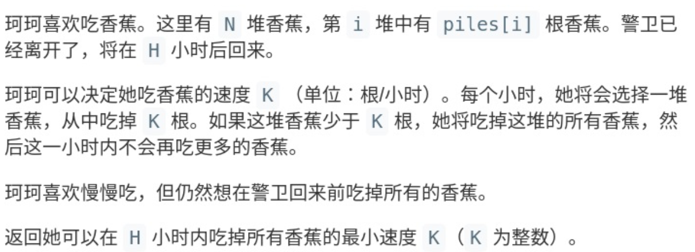

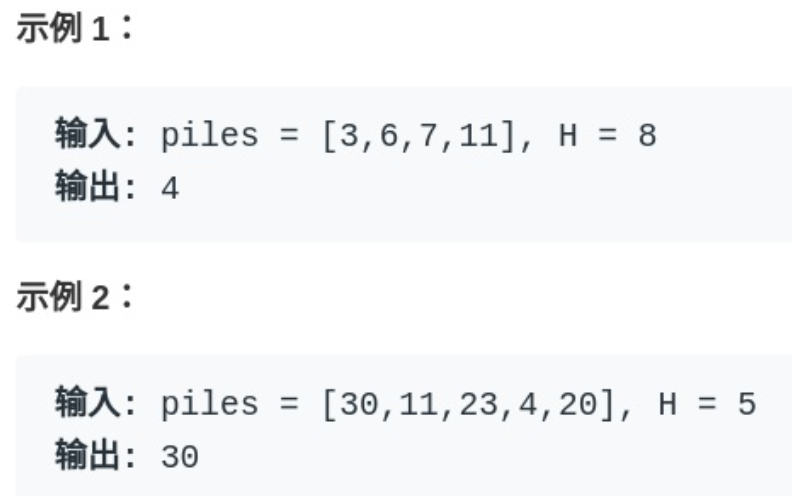

先暴力来解决，算法要求的是「 H 小时内吃完香蕉的最小速度」，我们不妨称为speed ，请问 speed 最大可能为多少，最少可能为多少呢?显然最少为1，最大为 max(piles) ，因为一小时最多只能吃一堆香蕉。那 么暴力解法就很简单了，只要从1开始穷举到 max(piles) ，一旦发现发现 某个值可以在 H 小时内吃完所有香蕉，这个值就是最小速度:

```java
int minEatingSpeed(int[] piles, int H) {
// piles 数组的最大值
int max = getMax(piles);
for (int speed = 1; speed < max; speed++) {
// 以 speed 是否能在 H 小时内吃完香蕉 
if (canFinish(piles, speed, H))
            return speed;
    return max;
} }
```

注意这个 for 循环，就是在**连续的空间线性搜索，这就是二分查找可以发挥 作用的标志**。由于我们要求的是最小速度，所以可以用一个**搜索左侧边界的 二分查找**来代替线性搜索，提升效率:

```java
int minEatingSpeed(int[] piles, int H) {
// 套用搜索左侧边界的算法框架
int left = 1, right = getMax(piles) + 1; 
  while (left < right) {
// 防止溢出
int mid = left + (right - left) / 2; 
    if (canFinish(piles, mid, H)) {
            right = mid;
        } else {
            left = mid + 1;
        }
}
    return left;
}

// 时间复杂度 O(N)
boolean canFinish(int[] piles, int speed, int H) {
    int time = 0;
    for (int n : piles) {
      time += timeOf(n, speed);
    }
    return time <= H;
}
int timeOf(int n, int speed) {
    return (n / speed) + ((n % speed > 0) ? 1 : 0);
}
int getMax(int[] piles) {
    int max = 0;
for (int n : piles)
max = Math.max(n, max);
return max; }
```

## 2.2 运输问题

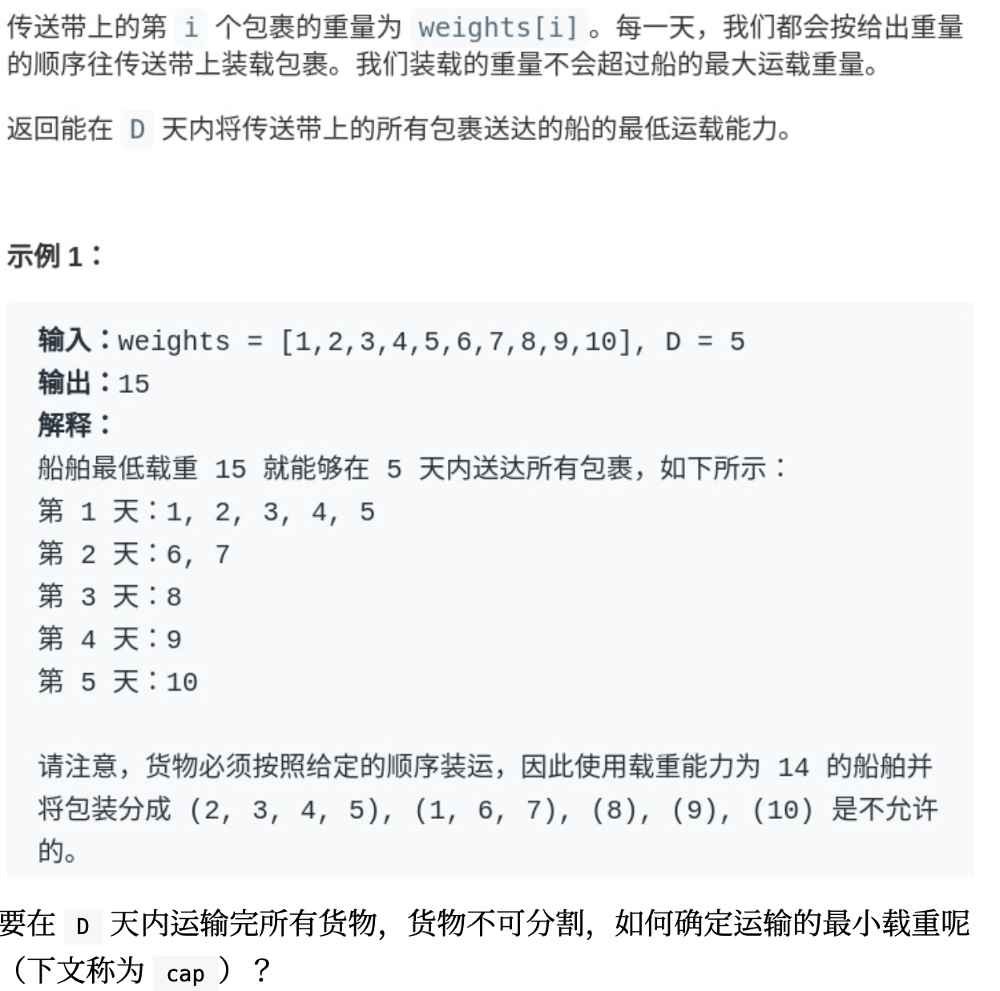

要在 D 天内运输完所有货物，货物不可分割，如何确定运输的最小载重呢 (下文称为 cap )?

其实本质上和 Koko 吃香蕉的问题一样的，首先确定 cap 的最小值和最大 值分别为 max(weights) 和 sum(weights) 。我们要求**最小载重**，所以可以用搜索左侧边界的二分查找算法优化线性搜 索:

```java
 // 寻找左侧边界的二分查找
    int shipWithinDays(int[] weights, int D) {
// 载重可能的最小值
        int left = getMax(weights);
// 载重可能的最大值 + 1
        int right = getSum(weights) + 1;
        while (left < right) {
            int mid = left + (right - left) / 2;
            if (canFinish(weights, D, mid)) {
                right = mid;
            } else {
                left = mid + 1;
            }
        }
        return left;
    }

    // 如果载重为 cap，是否能在 D 天内运完货物? boolean canFinish(int[] w, int D, int cap) {
    int i = 0;
    for(
    int day = 0;
    day<D;day++)

    {
        int maxCap = cap;
        while ((maxCap -= w[i]) >= 0) {
            i++;
            if (i == w.length)
                return true;
        }
    }
        return false;
}
```

# 3. 接雨水问题

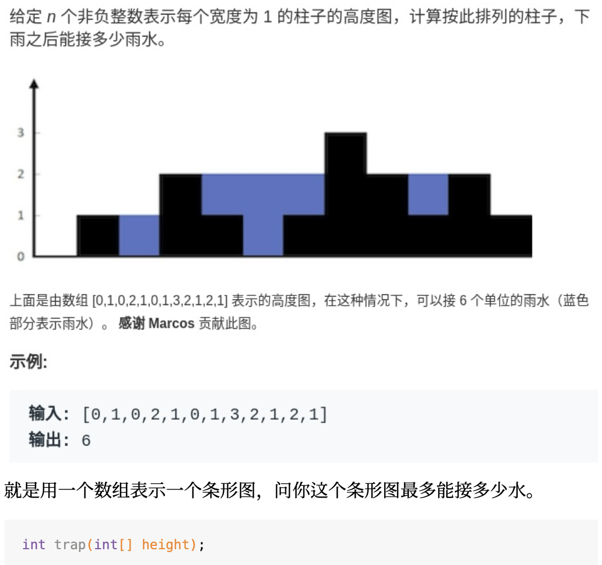

我第一次看到这个问题，无计可施，完全没有思路，相信很多朋友跟我一 样。所以对于这种问题，我们不要想整体，而应该去想局部;就像之前的文 章处理字符串问题，不要考虑如何处理整个字符串，而是去思考应该如何处 理每一个字符。这么一想，可以发现这道题的思路其实很简单。具体来说，仅仅对于位置 i，能装下多少水呢?对于第i个位置，可以装的水是：

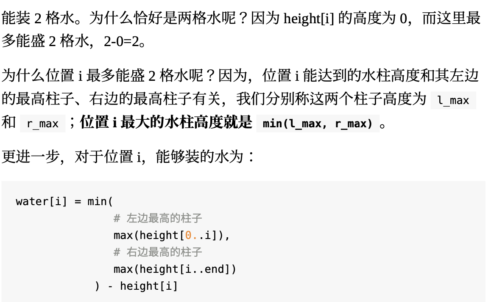

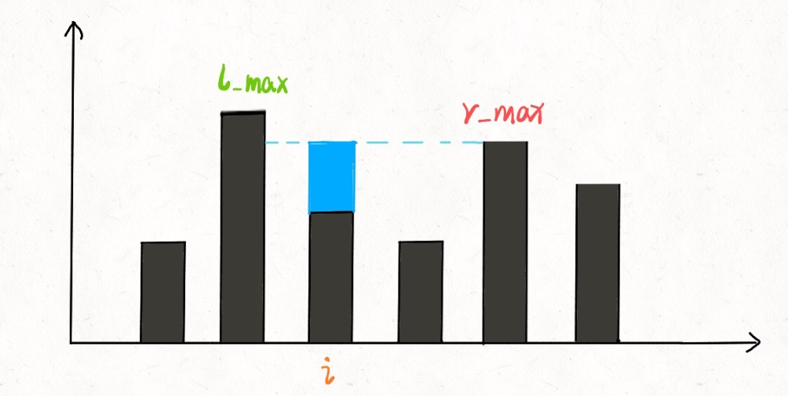

## 3.1 暴力解法

```java
int trap(vector<int>&height) {
        int n = height.size();
        int ans = 0;
        for (int i = 1; i < n - 1; i++) {
            int l_max = 0, r_max = 0; // 找右边最高的柱子
            for (int j = i; j < n; j++)
                r_max = max(r_max, height[j]);
// 找左边最高的柱子
            for (int j = i; j >= 0; j--)
                l_max = max(l_max, height[j]);
// 如果自己就是最高的话，
// l_max == r_max == height[i]
            ans += min(l_max, r_max) - height[i];
        }
        return ans;
    }
```

## 3.2 备忘录优化

之前的暴力解法，不是在每个位置 i 都要计算 r_max 和 l_max 吗?我们直 接把结果都缓存下来，别傻不拉几的每次都遍历，这时间复杂度不就降下来 了嘛。

我们开两个**数组** r_max 和 l_max 充当备忘录， l_max[i] 表示位置 i 左边 最高的柱子高度， r_max[i] 表示位置 i 右边最高的柱子高度。预先把这两 个数组计算好，避免重复计算：

```java
int trap(vector<int>&height) {
        if (height.empty()) return 0;
        int n = height.size();
        int ans = 0;
        // 数组充当备忘录
        vector<int> l_max (n), r_max(n); // 初始化 base case
        l_max[0] = height[0];
        r_max[n - 1] = height[n - 1]; // 从左向右计算 l_max
        for (int i = 1; i < n; i++)
            l_max[i] = max(height[i], l_max[i - 1]); // 从右向左计算 r_max
        for (int i = n - 2; i >= 0; i--)
            r_max[i] = max(height[i], r_max[i + 1]); // 计算答案
        for (int i = 1; i < n - 1; i++)
            ans += min(l_max[i], r_max[i]) - height[i];
        return ans;
    }
```

## 3.3 **双指针解法**

```c++
int trap(vector<int> &height) {
        if (height.empty()) return 0;
        int n = height.size();
        int left = 0, right = n - 1;
        int ans = 0;
        int l_max = height[0];
        int r_max = height[n - 1];
        while (left <= right) {
            l_max = max(l_max, height[left]);
            r_max = max(r_max, height[right]);
// ans += min(l_max, r_max) - height[i]
            if (l_max < r_max) {
                ans += l_max - height[left];
                left++;
            } else {
                ans += r_max - height[right];
                right--;
            }
        }
        return ans;
    }
```

 **l_max** **是** **height[0..left]** **中最高柱子的高度，** **r_max** **是height[right..end]** **的最高柱子的高度**。

之前的备忘录解法， l_max[i] 和 r_max[i] 代表的是 height[0..i] 和 height[i..end] 的最高柱子高度。

# 4. 有序数组去重

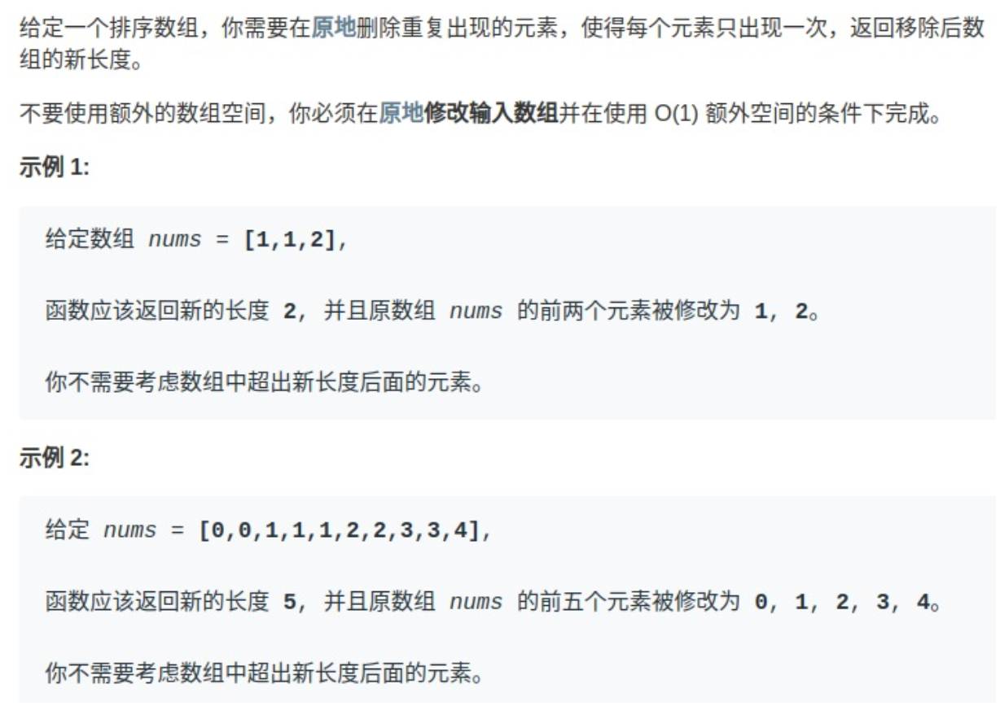

其实，**对于数组相关的算法问题，有一个通用的技巧:要尽量避免在中间删 除元素，那我就想先办法把这个元素换到最后去**。这样的话，最终待删除的 元素都拖在数组尾部，一个一个 pop 掉就行了，每次操作的时间复杂度也就 降低到 O(1) 了。

我们让慢指针 slow 走左后面，快指针 fast 走在前面探路，找到一个不 重复的元素就告诉 slow 并让 slow 前进一步。这样当 fast 指针遍历完 整个数组 nums 后， **nums[0..slow]** **就是不重复元素，之后的所有元素都 是重复元素**。

```java
 int removeDuplicates(int[] nums) {
        int n = nums.length;
        if (n == 0) return 0;
        int slow = 0, fast = 1;
        while (fast < n) {
            if (nums[fast] != nums[slow]) {
                slow++;
// 维护 nums[0..slow] 无重复
                nums[slow] = nums[fast];
            }
            fast++;
        }
// ⻓度为索引 + 1
        return slow + 1;
    }
```

有序链表去重？

```java
ListNode deleteDuplicates(ListNode head) {
        if (head == null) return null;
        ListNode slow = head, fast = head.next;
        while (fast != null) {
            if (fast.val != slow.val) {
// nums[slow] = nums[fast]; slow.next = fast;
// slow++;
                slow = slow.next;
            }
// fast++
            fast = fast.next;
        }
// 断开与后面重复元素的连接 slow.next = null; return head;
    }
```

# 5. 最长回文字符串

**回文串就是正着读和反着读都一样的字符串**。

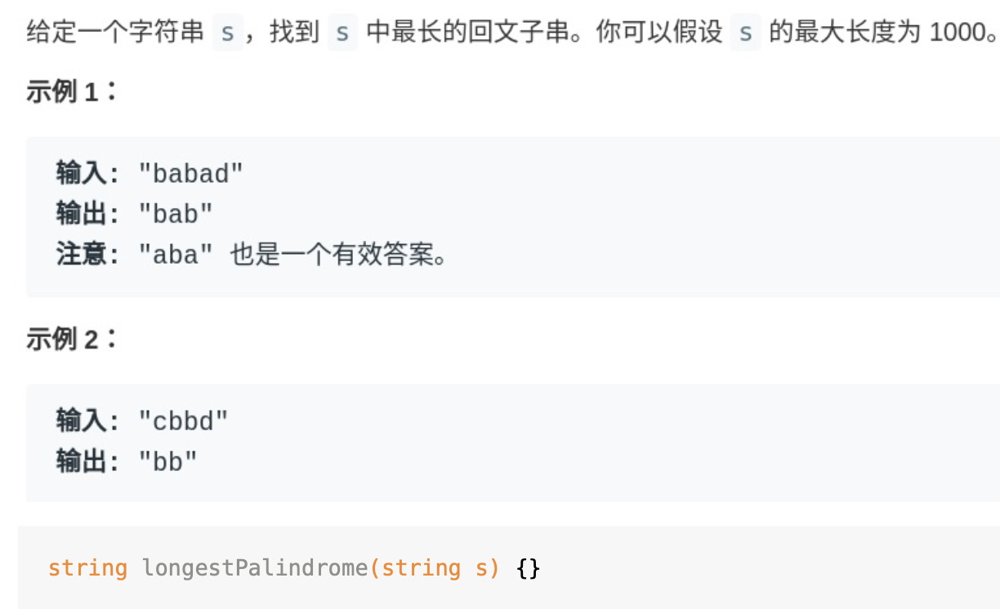

**寻找回文串的问题核心思想是:从中间开始向两边扩散来判断回文串**。对于 最⻓回文子串，就是这个意思:

```java
for 0 <= i < len(s):
  找到以 s[i] 为中心的回文串
  更新答案
```

但是呢，我们刚才也说了，回文串的⻓度可能是奇数也可能是偶数，如果是 abba 这种情况，没有一个中心字符，上面的算法就没辙了。所以我们可以修改一下:

```java
for 0 <= i < len(s):
  找到以 s[i] 为中心的回文串
  找到以 s[i] 和 s[i+1] 为中心的回文串 
  更新答案
```


```java
string longestPalindrome(string s) {
        string res;
        for (int i = 0; i < s.size(); i++) {
						// 以 s[i] 为中心的最⻓回文子串
            string s1 = palindrome(s, i, i);
						// 以 s[i] 和 s[i+1] 为中心的最⻓回文子串 
						string s2 = palindrome(s, i, i + 1); 
						// res = longest(res, s1, s2)
            res = res.size() > s1.size() ? res : s1;
            res = res.size() > s2.size() ? res : s2;
        }
        return res;
    }
```

# 6. **如何k个一组反转链表**

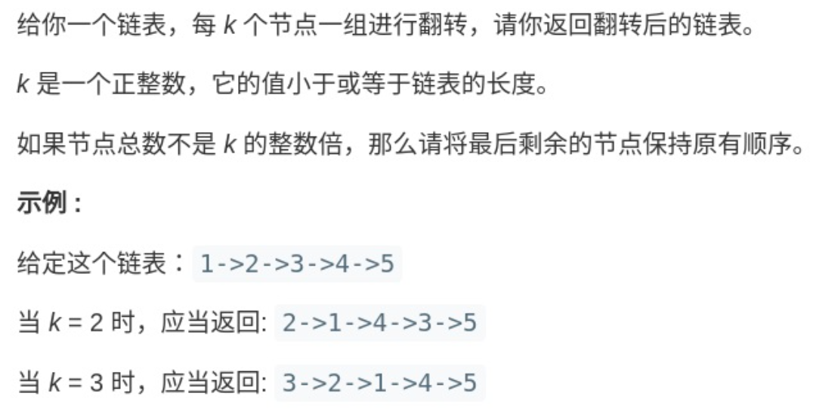

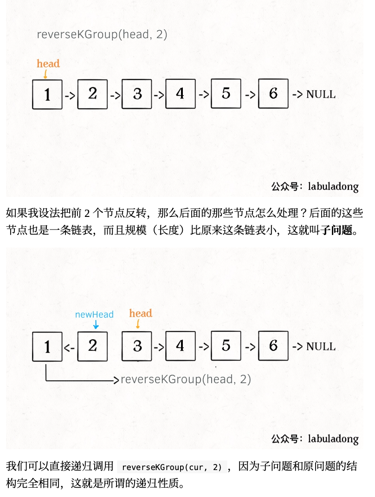

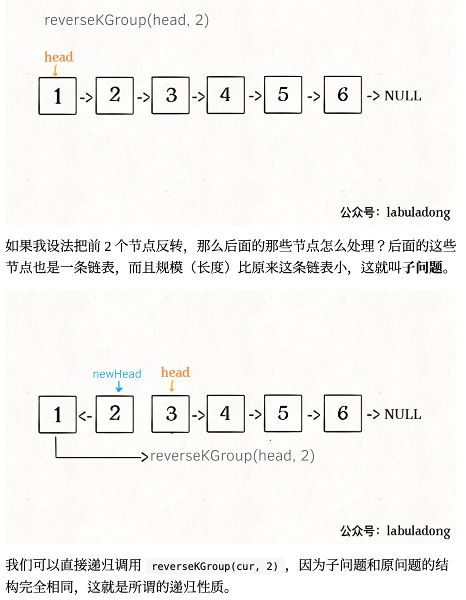

**1**、先反转以 **head** **开头的** **k** **个元素**。

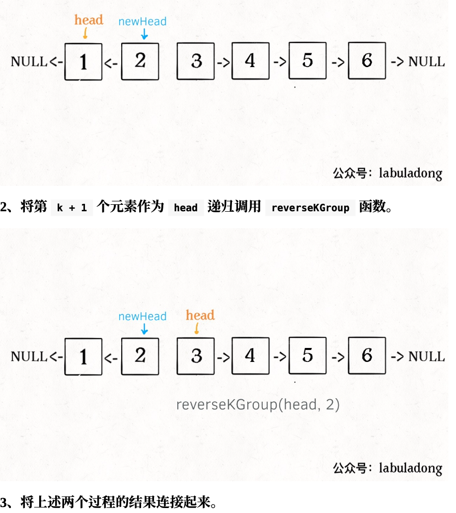

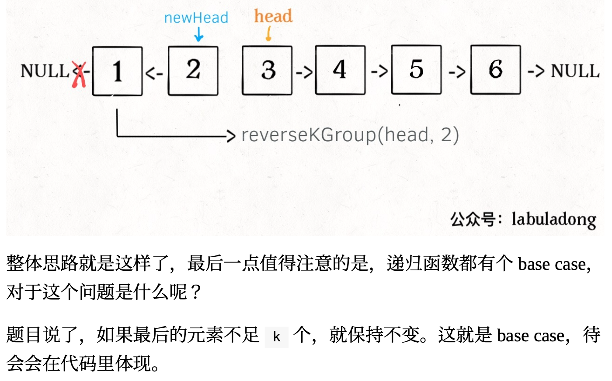

```java
ListNode reverseKGroup(ListNode head, int k) {
        if (head == null) return null;
// 区间 [a, b) 包含 k 个待反转元素
        ListNode a, b;
        a = b = head;
        for (int i = 0; i < k; i++) {
// 不足 k 个，不需要反转，base case
            if (b == null) return head;
        }
        b = b.next;
    }

    // 反转前 k 个元素
    ListNode newHead = reverse(a, b); // 递归反转后续链表并连接起来
    a.next =

    reverseKGroup(b, k);
    return newHead;
}
```

# 7. 不含有重复字符的最长子串的长度（线性法）

LeetCode 第 03 题：给定一个字符串，请你找出其中不含有重复字符的最长子串的长度。

示例 1

输入："abcabcbb"

输出：3

解释：因为无重复字符的最长子串是"abc"，其长度为3。

示例 2

输入："bbbbb"

输出：1

解释：因为无重复字符的最长子串是 "b"，其长度为 1。

示例 3

输入："pwwkew"

输出：3

解释：因为无重复字符的最长子串是 "wke"，其长度为 3。

注意：答案必须是子串的长度，"pwke" 是一个子序列，不是子串。

先来看下暴力法怎么做：


找出所有的子串，然后一个一个地去判断每个子串里是否包含有重复的字符。假设字符串的长度为 n，那么有 n×(n + 1) / 2 个非空子串。计算过程如下。 

长度为 1 的子串，有 n 个

长度为 2 的子串，每两个每两个相邻地取，一共有 n - 1 个

长度为 3 的子串，每三个每三个相邻地取，一共有 n - 2 个

……

以此类推，长度为 k 的子串，有 n - k + 1 个。

当 k 等于 n 的时候，n - k + 1=1，即长度为 n 的子串有 1 个。

所有情况相加，得到所有子串的长度为： 

n + (n - 1) + (n - 2) + (n - 3) + … + 2 + 1 = n×(n + 1) / 2 

算上空字符串，那么就一共有 n×(n + 1) / 2 + 1 个。 

拓展一下，对于一个长度为 n 的字符串，一共有多少个子序列呢？和子串不一样，子序列里的元素不需要相互挨着。 

同理分析，长度为 1 的子序列有 n 个，即 Cn^1，长度为 2 的子序列个数为 Cn^2，以此类推，长度为 k 的子序列有 Cn^k，那么所有子序列的个数（包括空序列）是 Cn^0 + Cn^1 + Cn^2 + … Cn^n = 2^n 

注意：对于统计子串和子序列个数的方法和结果，大家务必记下来，对于在分析各种问题时会有很大帮助。

回到本来问题，如果对所有的子串进行判断，从每个子串里寻找出最长的那个并且没有重复字符的，那么复杂度就是：O(n×(n + 1)/2×n) = O(n^3)。

**线性法**


可以定义两个指针 i 和 j。

i 是慢指针，j 是快指针，当 j 遇到了一个重复出现的字符时，从慢指针开始一个一个地将 i 指针指向的字符从集合里删除，然后判断一下是否可以把新字符加入到集合里而不会产生重复。

把字符 d 删除后，i 指针向前移动一步，此时集合里还剩下：e, a, b, c，很明显，字符 a 还在集合里，仍然要继续删除。

把字符 e 删除后，集合里还剩 a，b，c，字符 a 还在集合里，继续删除慢指针 i 指向的字符 a。

集合里剩 b，c，可以放心地把新的字符 a 放入到集合里，然后快指针 j 往前移动一步。

通过这样不断尝试，每当新的字符加入到集合里的时候，统计一下当前集合里的元素个数，最后记录下最长的那个。

```java
// 定义一个哈希集合 set，初始化结果 max 为 0
int lengthOfLongestSubstring(String s) {
    Set<Character> set = new HashSet<>();
    int max = 0;

    // 用快慢指针 i 和 j 扫描一遍字符串，如果快指针所指向的字符已经出现在哈希集合里，不断地尝试将慢指针所指向的字符从哈希集合里删除
    for (int i = 0, j = 0; j < s.length(); j++) {
        while (set.contains(s.charAt(j))) {
            set.remove(s.charAt(i));
            i++;
        }
        
        // 当快指针的字符加入到哈希集合后，更新一下结果 max
        set.add(s.charAt(j));
        max = Math.max(max, set.size());
    }
    return max;
}
```

优化的线性算法：

```java
// 定义一个哈希表用来记录上一次某个字符出现的位置，并初始化结果 max 为 0
int lengthOfLongestSubstring(String s) {
    Map<Character, Integer> map = new HashMap<>();
    int max = 0;

    // 用快慢指针 i 和 j 扫描一遍字符串，若快指针所对应的字符已经出现过，则慢指针跳跃
    for (int i = 0, j = 0; j < s.length(); j++) {
        if (map.containsKey(s.charAt(j))) {
            i = Math.max(i, map.get(s.charAt(j)) + 1);
        }
        map.put(s.charAt(j), j);
        max = Math.max(max, j - i + 1);
    }
    
    return max;
}
```

# 8. 两个有序数组的中位数（切分法）

LeetCode 第 04 题：给定两个大小为 m 和 n 的有序数组 nums1 和 nums2。请你找出这两个有序数组的中位数，并且要求算法的时间复杂度为 O(log(m+n))。你可以假设 nums1 和 nums2 不会同时为空。

**示例1**

nums1 = [1, 3]

nums2 = [2]

则中位数是 2.0

**示例2**

nums1 = [1, 2]

nums2 = [3, 4]

则中位数是 (2 + 3)/2 = 2.5

**解答：**

假设 m+n = L，若 L 为奇数，即两个数组的元素总个数为奇数，那么它们的中位数就是第 int(L / 2) + 1 小的数。例如，数组 { 1, 2, 3 } 的中位数是 2，2 就是第二小的数 2 = int(3/2) + 1。

如果 L 是偶数，那么中位数就是第 int(L/2) 小与第 int(L/2)+1 小的数的和的平均值。例如，数组 {1, 2, 3, 4} 的中位数是 (2 + 3) / 2 = 2.5，其中，2  = int(4/2)，3 = int(4/2) + 1。

因此这个问题就转变为在两个有序数组中寻找第 k 小的数 f(k)，当 L 是奇数的时候，另 k = L/2，结果为 f(k + 1)；而当 L 是偶数的时候，结果为 (f(k) + f(k + 1) ) /  2。

如何从两个排好序的数组里找出第 k 小的数？

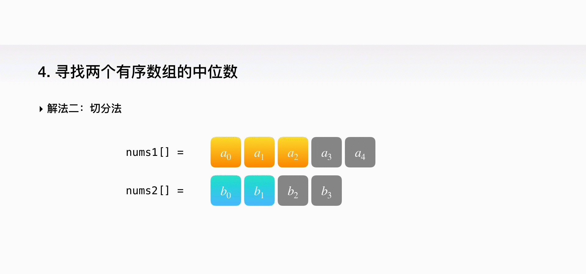

```java
double findMedianSortedArrays(int nums1[], int nums2[]) {
    int m = nums1.length;
    int n = nums2.length;
  
    int k = (m + n) / 2;
  
    if ((m + n) % 2 == 1) {
        return findKth(nums1, 0, m - 1, nums2, 0, n - 1, k + 1);
      } else {
        return (
            findKth(nums1, 0, m - 1, nums2, 0, n - 1, k) + 
            findKth(nums1, 0, m - 1, nums2, 0, n - 1, k + 1)
        ) / 2.0;
    }
}

double findKth(int[] nums1, int l1, int h1, int[] nums2, int l2, int h2, int k) {
    int m = h1 - l1 + 1;
    int n = h2 - l2 + 1;
  
    if (m > n) {
        return findKth(nums2, l2, h2, nums1, l1, h1, k);
    }
  
    if (m == 0) {
        return nums2[l2 + k - 1];
    }
  
    if (k == 1) {
        return Math.min(nums1[l1], nums2[l2]);
    }
  
    int na = Math.min(k/2, m);
    int nb = k - na;
    int va = nums1[l1 + na - 1];
    int vb = nums2[l2 + nb - 1];
  
    if (va == vb) {
        return va;
    } else if (va < vb) {
        return findKth(nums1, l1 + na, h1, nums2, l2, l2 + nb - 1, k - na);
    } else {
       return findKth(nums1, l1, l1 + na - 1, nums2, l2 + nb, h2, k - nb);
    }
}
```

1. 主体函数其实就是根据两个字符串长度的总和进行判断，看看如何调用递归函数以及返回结果。当总长度是奇数的时候，返回正中间的那个数；当总长度是偶数的时候，返回中间两个数的平均值。

2. 进入 findkth 函数，这个函数的目的是寻找第 k 小的元素。
3. 如果 nums1 数组的长度大于 nums2 数组的长度，我们将它们互换一下，这样可以让程序结束得快一些。
4. 当 nums1 的长度为 0 时，直接返回 nums2 数组里第 k 小的数。当 k 等于 1 的时候，返回两个数组中的最小值。
5. 接下来，分别选两个数组的中间数。
6. 比较一下两者的大小，如果相等，表明我们找到了中位数，返回它；如果不等的话，我们进行剪枝处理。


# 1. 子集

问题很简单，输入一个**不包含重复数字**的数组，要求算法输出这些数字的所有子集。

```
vector<vector<int>> subsets(vector<int>& nums);
```

比如输入 `nums = [1,2,3]`，你的算法应输出 8 个子集，包含空集和本身，顺序可以不同：

[ [],[1],[2],[3],[1,3],[2,3],[1,2],[1,2,3] ]

**第一个解法是利用数学归纳的思想**：假设我现在知道了规模更小的子问题的结果，如何推导出当前问题的结果呢？

具体来说就是，现在让你求 `[1,2,3]` 的子集，如果你知道了 `[1,2]` 的子集，是否可以推导出 `[1,2,3]` 的子集呢？先把 `[1,2]` 的子集写出来瞅瞅：

[ [],[1],[2],[1,2] ]

你会发现这样一个规律：

subset(`[1,2,3]`) - subset(`[1,2]`)

= [3],[1,3],[2,3],[1,2,3]

而这个结果，就是把 sebset(`[1,2]`) 的结果中每个集合再添加上 3。

换句话说，如果 `A = subset([1,2])` ，那么：

subset(`[1,2,3]`)

= A + [A[i].add(3) for i = 1..len(A)]

这就是一个典型的递归结构嘛，`[1,2,3]` 的子集可以由 `[1,2]` 追加得出，`[1,2]` 的子集可以由 `[1]` 追加得出，base case 显然就是当输入集合为空集时，输出子集也就是一个空集。

翻译成代码就很容易理解了：

```java
vector<vector<int>> subsets(vector<int>& nums) {
    // base case，返回一个空集
    if (nums.empty()) return {{}};
    // 把最后一个元素拿出来
    int n = nums.back();
    nums.pop_back();
    // 先递归算出前面元素的所有子集
    vector<vector<int>> res = subsets(nums);

    int size = res.size();
    for (int i = 0; i < size; i++) {
        // 然后在之前的结果之上追加
        res.push_back(res[i]);
        res.back().push_back(n);
    }
    return res;
}
```

**这个问题的时间复杂度计算比较容易坑人**。我们之前说的计算递归算法时间复杂度的方法，是找到递归深度，然后乘以每次递归中迭代的次数。对于这个问题，递归深度显然是 N，但我们发现每次递归 for 循环的迭代次数取决于 `res` 的长度，并不是固定的。

根据刚才的思路，`res` 的长度应该是每次递归都翻倍，所以说总的迭代次数应该是 2^N。或者不用这么麻烦，你想想一个大小为 N 的集合的子集总共有几个？2^N 个对吧，所以说至少要对 `res` 添加 2^N 次元素。

那么算法的时间复杂度就是 O(2^N) 吗？还是不对，2^N 个子集是 `push_back` 添加进 `res` 的，所以要考虑 `push_back` 这个操作的效率：

```
for (int i = 0; i < size; i++) {
    res.push_back(res[i]); // O(N)
    res.back().push_back(n); // O(1)
}
```

因为 `res[i]` 也是一个数组呀，`push_back` 是把 `res[i]` copy 一份然后添加到数组的最后，所以一次操作的时间是 O(N)。

综上，总的时间复杂度就是 O(N*2^N)，还是比较耗时的。

空间复杂度的话，如果不计算储存返回结果所用的空间的，只需要 O(N) 的递归堆栈空间。如果计算 `res` 所需的空间，应该是 O(N*2^N)。

**第二种通用方法就是回溯算法**。旧文「回溯算法详解」写过回溯算法的模板：

```
result = []
def backtrack(路径, 选择列表):
    if 满足结束条件:
        result.add(路径)
        return
    for 选择 in 选择列表:
        做选择
        backtrack(路径, 选择列表)
        撤销选择
```

只要改造回溯算法的模板就行了：

```
vector<vector<int>> res;

vector<vector<int>> subsets(vector<int>& nums) {
    // 记录走过的路径
    vector<int> track;
    backtrack(nums, 0, track);
    return res;
}

void backtrack(vector<int>& nums, int start, vector<int>& track) {
    res.push_back(track);
    for (int i = start; i < nums.size(); i++) {
        // 做选择
        track.push_back(nums[i]);
        // 回溯
        backtrack(nums, i + 1, track);
        // 撤销选择
        track.pop_back();
    }
}
```

可以看见，对 `res` 更新的位置处在前序遍历，也就是说，**`res` 就是树上的所有节点**：

[](https://github.com/labuladong/fucking-algorithm/blob/master/pictures/子集/1.jpg)

### 二、组合

输入两个数字 `n, k`，算法输出 `[1..n]` 中 k 个数字的所有组合。

```
vector<vector<int>> combine(int n, int k);
```

比如输入 `n = 4, k = 2`，输出如下结果，顺序无所谓，但是不能包含重复（按照组合的定义，`[1,2]` 和 `[2,1]` 也算重复）：

[ [1,2], [1,3], [1,4], [2,3], [2,4], [3,4] ]

这也是典型的回溯算法，`k` 限制了树的高度，`n` 限制了树的宽度，继续套我们以前讲过的回溯算法模板框架就行了：

[](https://github.com/labuladong/fucking-algorithm/blob/master/pictures/子集/2.jpg)

```
vector<vector<int>>res;

vector<vector<int>> combine(int n, int k) {
    if (k <= 0 || n <= 0) return res;
    vector<int> track;
    backtrack(n, k, 1, track);
    return res;
}

void backtrack(int n, int k, int start, vector<int>& track) {
    // 到达树的底部
    if (k == track.size()) {
        res.push_back(track);
        return;
    }
    // 注意 i 从 start 开始递增
    for (int i = start; i <= n; i++) {
        // 做选择
        track.push_back(i);
        backtrack(n, k, i + 1, track);
        // 撤销选择
        track.pop_back();
    }
}
```

`backtrack` 函数和计算子集的差不多，区别在于，更新 `res` 的时机是树到达底端时。

### 三、排列

输入一个**不包含重复数字**的数组 `nums`，返回这些数字的全部排列。

```
vector<vector<int>> permute(vector<int>& nums);
```

比如说输入数组 `[1,2,3]`，输出结果应该如下，顺序无所谓，不能有重复：

[ [1,2,3], [1,3,2], [2,1,3], [2,3,1], [3,1,2], [3,2,1] ]

「回溯算法详解」中就是拿这个问题来解释回溯模板的。这里又列出这个问题，是将「排列」和「组合」这两个回溯算法的代码拿出来对比。

首先画出回溯树来看一看：

[](https://github.com/labuladong/fucking-algorithm/blob/master/pictures/子集/3.jpg)

我们当时使用 Java 代码写的解法：

```
List<List<Integer>> res = new LinkedList<>();

/* 主函数，输入一组不重复的数字，返回它们的全排列 */
List<List<Integer>> permute(int[] nums) {
    // 记录「路径」
    LinkedList<Integer> track = new LinkedList<>();
    backtrack(nums, track);
    return res;
}

void backtrack(int[] nums, LinkedList<Integer> track) {
    // 触发结束条件
    if (track.size() == nums.length) {
        res.add(new LinkedList(track));
        return;
    }
    
    for (int i = 0; i < nums.length; i++) {
        // 排除不合法的选择
        if (track.contains(nums[i]))
            continue;
        // 做选择
        track.add(nums[i]);
        // 进入下一层决策树
        backtrack(nums, track);
        // 取消选择
        track.removeLast();
    }
}
```

回溯模板依然没有变，但是根据排列问题和组合问题画出的树来看，排列问题的树比较对称，而组合问题的树越靠右节点越少。

在代码中的体现就是，排列问题每次通过 `contains` 方法来排除在 `track` 中已经选择过的数字；而组合问题通过传入一个 `start` 参数，来排除 `start` 索引之前的数字。

**以上，就是排列组合和子集三个问题的解法，总结一下**：

子集问题可以利用数学归纳思想，假设已知一个规模较小的问题的结果，思考如何推导出原问题的结果。也可以用回溯算法，要用 `start` 参数排除已选择的数字。

组合问题利用的是回溯思想，结果可以表示成树结构，我们只要套用回溯算法模板即可，关键点在于要用一个 `start` 排除已经选择过的数字。

排列问题是回溯思想，也可以表示成树结构套用算法模板，关键点在于使用 `contains` 方法排除已经选择的数字，前文有详细分析，这里主要是和组合问题作对比。

记住这几种树的形状，就足以应对大部分回溯算法问题了，无非就是 `start` 或者 `contains` 剪枝，也没啥别的技巧了。