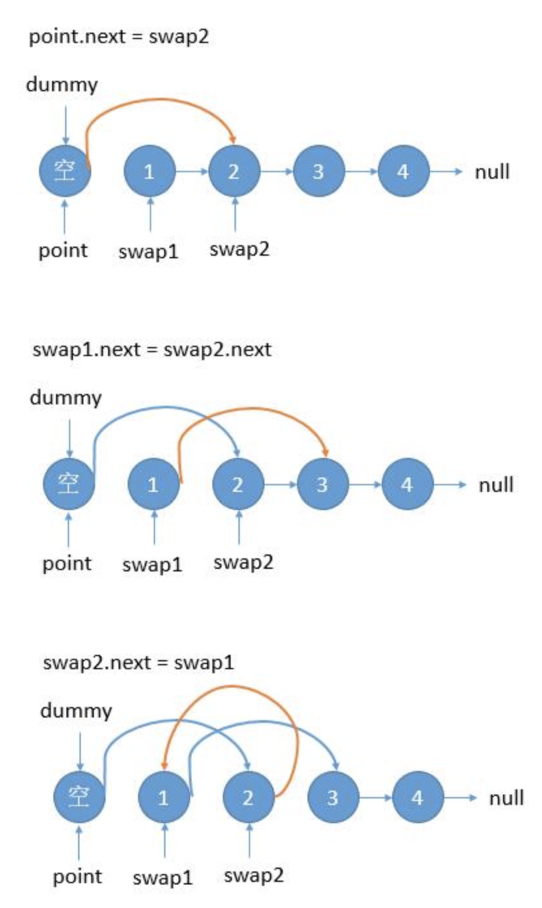
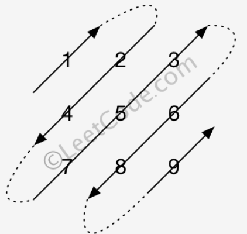

# 递归

## 24-两两交换链表中的节点

迭代解法：



```java
public ListNode swapPairsCycle(ListNode head) {
        ListNode pre = new ListNode(0);
        pre.next = head;
        ListNode cur = pre;
        while (cur.next != null && cur.next.next != null) {
            ListNode swap1 = cur.next;
            ListNode swap2 = cur.next.next;
            cur.next = swap2;
            swap1.next = swap2.next;
            swap2.next = swap1;
            cur = swap1;
        }
        return pre.next;
    }
```

递归：

```java
public ListNode swapPairsRecursive(ListNode head) {
        if ((head == null) || (head.next == null)) {
            return head;
        }
        ListNode n = head.next;
        head.next = swapPairsRecursive(head.next.next);
        n.next = head;
        return n;
    }
```

## 50-Pow(x,n)-快速幂

实现 [pow(*x*, *n*)](https://www.cplusplus.com/reference/valarray/pow/) ，即计算 x 的 n 次幂函数。

示例 1:

输入: 2.00000, 10
输出: 1024.00000
示例 2:

输入: 2.10000, 3
输出: 9.26100
示例 3:

输入: 2.00000, -2
输出: 0.25000
解释: 2-2 = 1/22 = 1/4 = 0.25

- -100.0 < *x* < 100.0
- *n* 是 32 位有符号整数，其数值范围是 [−2^31, 2^31 − 1] 。

```java
class Solution {
     private double fastPow(double x, long n) {
        if (n == 0) {
            return 1.0;
        }
        double half = fastPow(x, n / 2);
        if (n % 2 == 0) {
            return half * half;
        } else {
            return half * half * x;
        }
    }
    public double myPow(double x, int n) {
        if (n < 0) {
            x = 1 / x;
            n = -n;
        }

        return fastPow(x, n);
    }
}
```

## 95-不同的二叉搜索树

```java
/**
 * 给定一个整数 n，生成所有由 1 ... n 为节点所组成的二叉搜索树。
 * 输入: 3
 * 输出:
 * [
 *   [1,null,3,2],
 *   [3,2,null,1],
 *   [3,1,null,null,2],
 *   [2,1,3],
 *   [1,null,2,null,3]
 * ]
 * https://leetcode.com/problems/unique-binary-search-trees-ii/discuss/31494/A-simple-recursive-solution
 *
 * I start by noting that 1..n is the in-order traversal for any BST with nodes 1 to n.
 * So if I pick i-th node as my root, the left subtree will contain elements 1 to (i-1),
 * and the right subtree will contain elements (i+1) to n.
 * I use recursive calls to get back all possible trees for left and right subtrees and combine them in all possible ways with the root.
 */
public class GenerateTrees_95 {
    class TreeNode {
        int val;
        TreeNode left;
        TreeNode right;

        TreeNode(int x) {
            val = x;
        }
    }

    // 递归
    public List<TreeNode> generateTreesRecursive(int n) {
        if (n == 0) {
            return new LinkedList<TreeNode>();
        }
        return generateTreesHelper(1, n);
    }

    public LinkedList<TreeNode> generateTreesHelper(int start, int end) {
        LinkedList<TreeNode> all = new LinkedList<TreeNode>();
        if (start > end) {
            all.add(null);
            return all;
        }

        // pick up a root
        for (int i = start; i <= end; i++) {
            // all possible left subtrees if i is choosen to be a root
            LinkedList<TreeNode> left = generateTreesHelper(start, i - 1);

            // all possible right subtrees if i is choosen to be a root
            LinkedList<TreeNode> right = generateTreesHelper(i + 1, end);

            // connect left and right trees to the root i
            for (TreeNode l : left) {
                for (TreeNode r : right) {
                    TreeNode current = new TreeNode(i);
                    current.left = l;
                    current.right = r;
                    all.add(current);
                }
            }
        }
        return all;
    }
```


## 119-杨辉三角

给定一个非负索引 *k*，其中 *k* ≤ 33，返回杨辉三角的第 *k* 行。在杨辉三角中，每个数是它左上方和右上方的数和。

```
输入: 3
输出: [1,3,3,1]
```


```java
class Solution {
    public List<Integer> getRow(int rowIndex) {
        List<Integer> res = new ArrayList<>();
        for(int i = 0; i <= rowIndex; i++) {
            res.add(1);
          // 从倒数第二个元素开始往前更新:它等于原来这个位置的数 + 前一个位置的数行[i] = 行[i] + 行[i-1]
            for(int j = i-1; j > 0; j--) {
                res.set(j, res.get(j-1) + res.get(j));
            }
        }
        return res;
    }
}
```

## 779- 第K个语法符号@@@

```java
/**
 * 第K个语法符号
 * 在第一行我们写上一个0。接下来的每一行，将前一行中的0替换为01，1替换为10。
 * 给定行数 N 和序数 K，返回第 N 行中第 K个字符。（K从1开始）
 * <p>
 * 输入: N = 1, K = 1
 * 输出: 0
 * 输入: N = 2, K = 1
 * 输出: 0
 * 输入: N = 2, K = 2
 * 输出: 1
 * 输入: N = 4, K = 5
 * 输出: 1
 * 解释:
 * 第一行: 0
 * 第二行: 01
 * 第三行: 0110
 * 第四行: 01101001
 * <p>
 * <p>
 * 注意:
 * N 的范围 [1, 30].
 * K 的范围 [1, 2^(N-1)].
 */
public class kthGrammar_779 {
    /**
     * 可以看出，如果K小于等于所在行的一半，也就是2^N-2，那么直接去上一行找，也就是下面的helper(N-1, K, flag);
     * 反之，要从后半部分找，而后半部分，正是01翻转后的前一行，也就是helper(N-1, K - half, 1-flag)。
     * 这里 flag 是0或1，来回翻转。
     */
    public int kthGrammar(int N, int K) {
        return kthGrammarHelper(N, K, 0);
    }
    private int kthGrammarHelper(int N, int K, int flag) {
        if (N == 1) {
            return flag;
        }
        int half = (1 << (N - 2));
        if (K <= half) {
            return kthGrammarHelper(N - 1, K, flag);
        } else {
            return kthGrammarHelper(N - 1, K - half, 1 - flag);
        }
    }
}
```

# 数组&字符串

## 14-最长公共前缀

```java
/**
 * 最长公共前缀
 * 编写一个函数来查找字符串数组中的最长公共前缀。如果不存在公共前缀，返回空字符串 ""。
 * 示例 1:
 * 输入: ["flower","flow","flight"]
 * 输出: "fl"
 * 示例 2:
 * 输入: ["dog","racecar","car"]
 * 输出: "",解释: 输入不存在公共前缀。
 */
public class LongestCommonPrefix_14 {
    /**
     * 当字符串数组长度为 0 时则公共前缀为空，直接返回
     * 令最长公共前缀 ans 的值为第一个字符串，进行初始化
     * 遍历后面的字符串，依次将其与 ans 进行比较，两两找出公共前缀，最终结果即为最长公共前缀
     * 如果查找过程中出现了 ans 为空的情况，则公共前缀不存在直接返回
     * 时间复杂度：O(s)，s 为所有字符串的长度之和
     */
    public String longestCommonPrefix(String[] strs) {
        if (strs.length <= 0 || strs == null) {
            return "";
        }
        String ans = strs[0];
        for (int i = 1; i < strs.length; i++) {
            int j = 0;
            for (; j < ans.length() && j < strs[i].length(); j++) {
                if (ans.charAt(j) != strs[i].charAt(j)) {
                    break;
                }
            }
            ans = ans.substring(0, j);
            // 及时剪枝
            if (ans.equals("")) {
                return ans;
            }
        }
        return ans;
    }
}
```

## 28-实现strStr

## 36-有效的数独@@@


```java
/**
 * 题目:判断一个 9x9 的数独是否有效。只需要根据以下规则，验证已经填入的数字是否有效即可。
 * 数字 1-9 在每一行只能出现一次。
 * 数字 1-9 在每一列只能出现一次。
 * 数字 1-9 在每一个以粗实线分隔的 3x3 宫内只能出现一次。
 * 1. 输入:
 * [
 * ["5","3",".",".","7",".",".",".","."],
 * ["6",".",".","1","9","5",".",".","."],
 * [".","9","8",".",".",".",".","6","."],
 * ["8",".",".",".","6",".",".",".","3"],
 * ["4",".",".","8",".","3",".",".","1"],
 * ["7",".",".",".","2",".",".",".","6"],
 * [".","6",".",".",".",".","2","8","."],
 * [".",".",".","4","1","9",".",".","5"],
 * [".",".",".",".","8",".",".","7","9"]
 * ]
 * 输出: true
 * 2. 输入:
 * [
 *   ["8","3",".",".","7",".",".",".","."],
 *   ["6",".",".","1","9","5",".",".","."],
 *   [".","9","8",".",".",".",".","6","."],
 *   ["8",".",".",".","6",".",".",".","3"],
 *   ["4",".",".","8",".","3",".",".","1"],
 *   ["7",".",".",".","2",".",".",".","6"],
 *   [".","6",".",".",".",".","2","8","."],
 *   [".",".",".","4","1","9",".",".","5"],
 *   [".",".",".",".","8",".",".","7","9"]
 * ]
 * 输出: false
 * 解释: 除了第一行的第一个数字从 5 改为 8 以外，空格内其他数字均与 示例1 相同。
 * 但由于位于左上角的 3x3 宫内有两个 8 存在, 因此这个数独是无效的。
 * 说明：
 * 一个有效的数独（部分已被填充）不一定是可解的。
 * 只需要根据以上规则，验证已经填入的数字是否有效即可。
 * 给定数独序列只包含数字 1-9 和字符 '.' 。
 * 给定数独永远是 9x9 形式的。
 */
public class ValidSudoku_36 {
    public boolean isValidSudoku(char[][] board) {
        if (board == null || board.length != 9 || board[0].length != 9) {
            return false;
        }
        // 数组的第一个值表示第一行/列/子数组，第二个表示1-9这9个数字
        int[][] rows = new int[9][9];
        int[][] cols = new int[9][9];
        int[][] sbox = new int[9][9];
        for (int row = 0; row < 9; ++row) {
            for (int col = 0; col < 9; ++col) {
                if (board[row][col] != '.') {
                    // 判断num这个数(1-9)是否在row行，col列以及indexBox出现过
                    int num = board[row][col] - '1';
                    // indexBox需要回计算，我们共有9个box。
                    int indexBox = (row / 3) * 3 + (col / 3);
                    if (rows[row][num] == 1) {
                        return false;
                    }
                    if (cols[col][num] == 1) {
                        return false;
                    }
                    if (sbox[indexBox][num] == 1) {
                        return false;
                    }

                    rows[row][num] = 1;
                    cols[col][num] = 1;
                    sbox[indexBox][num] = 1;
                }
            }
        }
        return true;
    }
}
```

## 48-旋转图像

[旋转图像](https://leetcode-cn.com/problems/rotate-image/)

```java
/**
 * 旋转图像
 * 给定一个 n × n 的二维矩阵表示一个图像。将图像顺时针旋转 90 度。
 * <p>
 * 示例 1:
 * 给定 matrix =
 * [
 * [1,2,3],
 * [4,5,6],
 * [7,8,9]
 * ],
 * 原地旋转输入矩阵，使其变为:
 * [
 * [7,4,1],
 * [8,5,2],
 * [9,6,3]
 * ]
 * 示例 2:
 * 给定 matrix =
 * [
 * [ 5, 1, 9,11],
 * [ 2, 4, 8,10],
 * [13, 3, 6, 7],
 * [15,14,12,16]
 * ],
 * 原地旋转输入矩阵，使其变为:
 * [
 * [15,13, 2, 5],
 * [14, 3, 4, 1],
 * [12, 6, 8, 9],
 * [16, 7,10,11]
 * ]
 */
public class Rotate_48 {
    public void rotate(int[][] matrix) {
        int length = matrix.length;
        if (matrix == null || matrix.length != matrix[0].length) {
            return;
        }
        //转置整个矩阵
        for (int i = 0; i < length; ++i) {
            for (int j = i; j < length; ++j) {
                int temp = matrix[j][i];
                matrix[j][i] = matrix[i][j];
                matrix[i][j] = temp;
            }
        }
        // 反转每一行
        for (int i = 0; i < length; ++i) {
            for (int j = 0; j < length / 2; ++j) {
                int temp = matrix[i][j];
                matrix[i][j] = matrix[i][length - j - 1];
                matrix[i][length - j - 1] = temp;
            }
        }
    }
}
```

## 67-二进制求和

```java
/**
 * 给你两个二进制字符串，返回它们的和（用二进制表示）。输入为非空字符串且只包含数字1和0。
 * 示例 1:
 * 输入: a = "11", b = "1"
 * 输出: "100"
 * <p>
 * 示例 2:
 * 输入: a = "1010", b = "1011"
 * 输出: "10101"
 */
public class AddBinary_67 {
    // 整体思路是将两个字符串较短的用0补齐，使得两个字符串长度一致，然后从末尾进行遍历计算，得到最终结果。
    public String addBinary(String a, String b) {
        StringBuilder ans = new StringBuilder();
        //进位
        int ca = 0;
        for (int i = a.length() - 1, j = b.length() - 1; i >= 0 || j >= 0; i--, j--) {
            int sum = ca;
            sum += (i >= 0 ? a.charAt(i) - '0' : 0);
            sum += (j >= 0 ? b.charAt(j) - '0' : 0);
            ans.append(sum % 2);
            ca = sum / 2;
        }
        ans.append(ca == 1 ? "1" : "");
        return ans.reverse().toString();
    }
}
```

## 209-长度最小的子数组

```java
/**
 * 题目：长度最小的子数组
 * 给定一个含有n个正整数的数组和一个正整数 s ，找出该数组中满足其和 ≥ s 的长度最小的连续子数组，并返回其长度。
 * 如果不存在符合条件的连续子数组，返回 0。
 * 输入: s = 7, nums = [2,3,1,2,4,3]。输出: 2
 * 解释: 子数组 [4,3] 是该条件下的长度最小的连续子数组。
 */
public class MinSubArrayLen_209 {
    /**
     * 滑动窗口，双指针。用双指针 left 和 right 表示一个窗口。
     * 1. right 向右移增大窗口，直到窗口内的数字和大于等于了 s。进行第 2 步。
     * 2. 记录此时的长度，left 向右移动，开始减少长度，每减少一次，就更新最小长度。直到当前窗口内的数字和小于了 s，回到第 1 步。
     */
    public int minSubArrayLen(int s, int[] nums) {
        if (nums.length <= 0 || s <= 0) {
            return 0;
        }
        int left = 0, right = 0;
        int minLen = Integer.MAX_VALUE;
        int sumLeftToRight = 0;
        while (right < nums.length) {
            sumLeftToRight += nums[right];
            right++;
            while (sumLeftToRight >= s) {
                minLen = Math.min(minLen, right - left);
                // left向右滑动
                sumLeftToRight -= nums[left];
                left++;
            }
            //left一直增加，right却不增加，以至于left>right，只有一种可能，即nums存在一个元素>=s,当right指向该元素时，left会一直增加直到超过right
            if (left > right) {
                return 1;
            }
        }
        return minLen == Integer.MAX_VALUE ? 0 : minLen;
    }
}
```

## 350-两个数组的交集 II

```java
import java.util.ArrayList;
import java.util.Arrays;
import java.util.HashMap;
import java.util.Map;

/**
 * 两个数组的交集 II
 * 给定两个数组，编写一个函数来计算它们的交集。
 * 示例 1:
 * 输入: nums1 = [1,2,2,1], nums2 = [2,2]
 * 输出: [2,2]
 * 示例 2:
 * 输入: nums1 = [4,9,5], nums2 = [9,4,9,8,4]
 * 输出: [4,9]
 * 说明：
 * 输出结果中每个元素出现的次数，应与元素在两个数组中出现的次数一致。
 * 我们可以不考虑输出结果的顺序。
 * <p>
 * 进阶:
 * 如果给定的数组已经排好序呢？你将如何优化你的算法？
 * 如果 nums1 的大小比 nums2 小很多，哪种方法更优？
 * 如果 nums2 的元素存储在磁盘上，磁盘内存是有限的，并且你不能一次加载所有的元素到内存中，你该怎么办？
 * @author anapodoton
 */
public class Intersect_350 {
    /**
     * 使用hashmap来解决
     */
    public int[] intersect(int[] nums1, int[] nums2) {
        Map<Integer, Integer> map = new HashMap<>();
        for (int i : nums1) {
            if (map.containsKey(i)) {
                map.put(i, map.get(i) + 1);
            } else {
                map.put(i, 1);
            }
        }
        ArrayList<Integer> ans = new ArrayList<>();
        for (int i : nums2) {
            if (map.containsKey(i) && map.get(i) > 0) {
                map.put(i, map.get(i) - 1);
                ans.add(i);
            }
        }
        int[] res = new int[ans.size()];
        int len = 0;
        for (int i : ans) {
            res[len++] = i;
        }
        return res;
    }

    // 如果是已经排好序的
    public int[] intersectSort(int[] nums1, int[] nums2) {
        int i = 0, j = 0, k = 0;
        while (i < nums1.length && j < nums2.length) {
            if (nums1[i] < nums2[j]) {
                ++i;
            } else if (nums1[i] > nums2[j]) {
                ++j;
            } else {
                nums1[k++] = nums1[i++];
                ++j;
            }
        }
        return Arrays.copyOfRange(nums1, 0, k);
    }
}
```

## 498-对角线遍历@@@

给定一个含有 M x N 个元素的矩阵（M 行，N 列），请以对角线遍历的顺序返回这个矩阵中的所有元素，对角线遍历如下图所示。

**示例:**

```
输入:
[
 [ 1, 2, 3 ],
 [ 4, 5, 6 ],
 [ 7, 8, 9 ]
]

输出:  [1,2,4,7,5,3,6,8,9]

解释:
```



**说明:**

1. 给定矩阵中的元素总数不会超过 100000 。


找规律：

每一趟对角线中元素的坐标（x, y）相加的和是递增的。
第一趟：1 的坐标(0, 0)。x + y == 0。
第二趟：2 的坐标(1, 0)，4 的坐标(0, 1)。x + y == 1。
第三趟：7 的坐标(0, 2), 5 的坐标(1, 1)，3 的坐标(2, 0)。第三趟 x + y == 2。
第四趟：……

每一趟都是 x 或 y 其中一个从大到小（每次-1），另一个从小到大（每次+1）。
第二趟：2 的坐标(1, 0)，4 的坐标(0, 1)。x 每次-1，y 每次+1。
第三趟：7 的坐标(0, 2), 5 的坐标(1, 1)，3 的坐标(2, 0)。x 每次 +1，y 每次 -1。

确定初始值。例如这一趟是 x 从大到小， x 尽量取最大，当初始值超过 x 的上限时，不足的部分加到 y 上面。
第二趟：2 的坐标(1, 0)，4 的坐标(0, 1)。x + y == 1，x 初始值取 1，y 取 0。
第四趟：6 的坐标(2, 1)，8 的坐标(1, 2)。x + y == 3，x 初始值取 2，剩下的加到 y上，y 取 1。

确定结束值。例如这一趟是 x 从大到小，这一趟结束的判断是， x 减到 0 或者 y 加到上限。
第二趟：2 的坐标(1, 0)，4 的坐标(0, 1)。x 减到 0 为止。
第四趟：6 的坐标(2, 1)，8 的坐标(1, 2)。x 虽然才减到 1，但是 y 已经加到上限了。

这一趟是 x 从大到小，那么下一趟是 y 从大到小，循环进行。 并且方向相反时，逻辑处理是一样的，除了x，y和他们各自的上限值是相反的。
x 从大到小，第二趟：2 的坐标(1, 0)，4 的坐标(0, 1)。x + y == 1，x 初始值取 1，y 取 0。结束值 x 减到 0 为止。
x 从小到大，第三趟：7 的坐标(0, 2)，5 的坐标(1, 1)，3 的坐标(2, 0)。x + y == 2，y 初始值取 2，x 取 0。结束值 y 减到 0 为止。

```java
/**
 * 对角线遍历
 * 给定一个含有 M x N 个元素的矩阵（M 行，N 列），请以对角线遍历的顺序返回这个矩阵中的所有元素，对角线遍历如下图所示。
 * 输入:
 * [
 * [ 1, 2, 3 ],
 * [ 4, 5, 6 ],
 * [ 7, 8, 9 ]
 * ]
 * <p>
 * 输出:  [1,2,4,7,5,3,6,8,9]
 */
public class FindDiagonalOrder_498 {
    public int[] findDiagonalOrder(int[][] matrix) {
        if (matrix == null || matrix.length <= 0) {
            return new int[]{};
        }
        int rows = matrix.length;
        int cols = matrix[0].length;
        int[] result = new int[rows * cols];
        // 索引，遍历多少趟
        int index = 0, nums = 0;
        while (nums < rows + cols - 1) {
            // 奇数趟
            int x1 = (nums < rows) ? nums : (rows - 1);
            int y1 = nums - x1;
            while (x1 >= 0 && y1 < cols) {
                result[index++] = matrix[x1][y1];
                x1--;
                y1++;
            }
            nums++;
            if (nums >= rows + cols - 1) break;
            // 偶数趟
            int y2 = (nums < cols) ? nums : (cols - 1);
            int x2 = nums - y2;
            while (y2 >= 0 && x2 < rows) {
                result[index++] = matrix[x2][y2];
                x2++;
                y2--;
            }
            nums++;
        }
        return result;
    }
}
```

# 链表

## 234-回文链表

```java
/**
 * 回文链表
 * 输入: 1->2
 * 输出: false
 * 输入: 1->2->2->1
 * 输出: true
 */
public class PalindromeList_234 {
    public boolean isPalindrome(ListNode head) {
        if (head == null || head.next == null) {
            return true;
        }
        // 一块一慢两个指针，为了找到需要翻转的半条链表的起点。
        ListNode slow = head;
        ListNode fast = head;
        // 用于辅助翻转前半条链表,遍历的同时翻转前半个列表
        // 注意：如果要求不可以修改链表，那么我们可以通过栈来实现
        ListNode pre = null;
        while (fast != null && fast.next != null) {
            ListNode cur = slow;
            slow = slow.next;
            fast = fast.next.next;
            cur.next = pre;
            pre = cur;
        }
        if (fast != null) {
            slow = slow.next;
        }
        // 两个半长链表的比较 遍历两个半长链表
        while (pre != null) {
            if (pre.val != slow.val) {
                return false;
            }
            slow = slow.next;
            pre = pre.next;
        }
        return true;
    }

    public class ListNode {
        int val;
        ListNode next;

        ListNode(int x) {
            val = x;
        }
    }
}
```

## 430-扁平化多级双向链表

```java
/**
 * 扁平化多级双向链表
 * 多级双向链表中，除了指向下一个节点和前一个节点指针之外，它还有一个子链表指针，可能指向单独的双向链表。
 * 这些子列表也可能会有一个或多个自己的子项，依此类推，生成多级数据结构。
 * 输入：head = [1,2,3,4,5,6,null,null,null,7,8,9,10,null,null,11,12]
 * 输出：[1,2,3,7,8,11,12,9,10,4,5,6]
 * 输入：head = [1,2,null,3]
 * 输出：[1,3,2]
 */
public class Flatten_430 {
    private Node prev = null;

    /**
     * 多级链表结构的扁平化类似二叉树的先序遍历
     * child就相当于left tree，next相当于right tree
     * 需要维护一个prev指针用于访问当前节点的上一个节点
     * prev指针非空时，建立prev与当前节点的双向连接
     * 处理完一个child后记得把它设为null
     */
    public Node flatten(Node head) {
        dfs(head);
        return head;
    }

    private void dfs(Node head) {
        if (head == null) {
            return;
        }
        Node next = head.next;
        if (prev != null) {
            prev.next = head;
            head.prev = prev;
        }
        prev = head;
        dfs(head.child);
        head.child = null;
        dfs(next);
    }
}
```

# 栈

## 739-每日温度

[每日温度](https://leetcode-cn.com/problems/daily-temperatures/)

```java
public int[] dailyTemperatures(int[] T) {
        Stack<Integer> stack = new Stack<>();
        int length = T.length;
        int[] result = new int[length];
        for (int i = 0; i < length; ++i) {
            while (!stack.empty() && T[i] > T[stack.peek()]) {
                int pre = stack.pop();
                result[pre] = i - pre;
            }
            stack.add(i);
        }
        return result;
    }
```

# 树

## 108-将有序数组转换成二叉搜索树

```java
/**
 * 将有序数组转换为二叉搜索树
 * 将一个按照升序排列的有序数组，转换为一棵高度平衡二叉搜索树。
 * 本题中，一个高度平衡二叉树是指一个二叉树每个节点 的左右两个子树的高度差的绝对值不超过 1。
 * 给定有序数组: [-10,-3,0,5,9],一个可能的答案是：[0,-3,9,-10,null,5]
 * 0
 * / \
 * -3   9
 * /   /
 * -10  5
 */
public class SortedArrayToBST_108 {
    private int[] nums;
    public TreeNode sortedArrayToBST(int[] nums) {
        this.nums = nums;
        return helper(0, nums.length - 1);
    }

    private TreeNode helper(int left, int right) {
        if (left > right) {
            return null;
        }
        int mid = (left + right) >> 1;
        TreeNode root = new TreeNode(nums[mid]);
        root.left = helper(left, mid - 1);
        root.right = helper(mid + 1, right);
        return root;
    }
}
```

# BFS

使用 BFS 的两个主要方案：`遍历`或`找出最短路径`。

遍历模板：

```java
/**
 * Return the length of the shortest path between root and target node.
 */
int BFS(Node root, Node target) {
    Queue<Node> queue;  // store all nodes which are waiting to be processed
    int step = 0;       // number of steps neeeded from root to current node
    // initialize
    add root to queue;
    // BFS
    while (queue is not empty) {
        // 变量 step 指示从根结点到我们正在访问的当前结点的距离。
        step = step + 1;
        // iterate the nodes which are already in the queue
        int size = queue.size();
        for (int i = 0; i < size; ++i) {
            Node cur = the first node in queue;
            return step if cur is target;
            for (Node next : the neighbors of cur) {
                add next to queue;
            }
            remove the first node from queue;
        }
    }
    return -1;          // there is no path from root to target
}
```

确保我们永远`不会访问一个结点两次`很重要。否则，我们可能陷入无限循环。如果是这样，我们可以在上面的代码中添加一个哈希集来解决这个问题。

```java
/**
 * Return the length of the shortest path between root and target node.
 */
int BFS(Node root, Node target) {
    Queue<Node> queue;  // store all nodes which are waiting to be processed
    Set<Node> used;     // store all the used nodes
    int step = 0;       // number of steps neeeded from root to current node
    // initialize
    add root to queue;
    add root to used;
    // BFS
    while (queue is not empty) {
        step = step + 1;
        // iterate the nodes which are already in the queue
        int size = queue.size();
        for (int i = 0; i < size; ++i) {
            Node cur = the first node in queue;
            return step if cur is target;
            for (Node next : the neighbors of cur) {
                if (next is not in used) {
                    add next to queue;
                    add next to used;
                }
            }
            remove the first node from queue;
        }
    }
    return -1;          // there is no path from root to target
}
```

# DFS

## 岛屿问题

[岛屿问题](https://leetcode-cn.com/problems/number-of-islands/solution/dao-yu-lei-wen-ti-de-tong-yong-jie-fa-dfs-bian-li-/)

# 动态规划

## 494-目标和


# 其他

## 384-洗牌算法

```java
import java.util.Random;

/**
 * 打乱数组,打乱一个没有重复元素的数组。
 * <p>
 * // 以数字集合 1, 2 和 3 初始化数组。
 * int[] nums = {1,2,3};
 * Solution solution = new Solution(nums);
 * // 打乱数组 [1,2,3] 并返回结果。任何 [1,2,3]的排列返回的概率应该相同。
 * solution.shuffle();
 * // 重设数组到它的初始状态[1,2,3]。
 * solution.reset();
 * // 随机返回数组[1,2,3]打乱后的结果。
 * solution.shuffle();
 */
public class Shuffle_384 {
    private int[] nums;
    private int[] original;
    private Random rand = new Random();

    public Shuffle_384(int[] nums) {
        this.nums = nums;
        original = nums.clone();
    }

    // 这里需要注意，nums也需要重置，如果把nums指向original，那么original也需要重新clone，否则会被修改
    public int[] reset() {
        nums = original;
        original = original.clone();
        return original;
    }

    public int[] shuffle() {
        int length = nums.length;
        //
        for (int i = 0; i < length; ++i) {
            // 从 i 到最后一个随机选一个元素
            int randIndex = randInt(i, length);
            swap(i, randIndex);
        }
        return nums;
    }

    private void swap(int num1, int num2) {
        int temp = nums[num1];
        nums[num1] = nums[num2];
        nums[num2] = temp;
    }

    // 注意这里面的坑，rand.nextInt返回的是0~n之间的任意一个数，包括0，不包括n，n必须大于0
    private int randInt(int start, int end) {
        return rand.nextInt(end - start) + start;
    }
}
```

