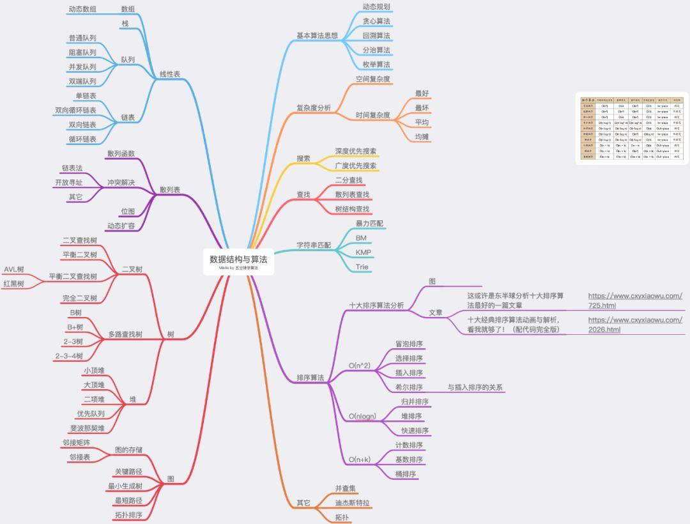
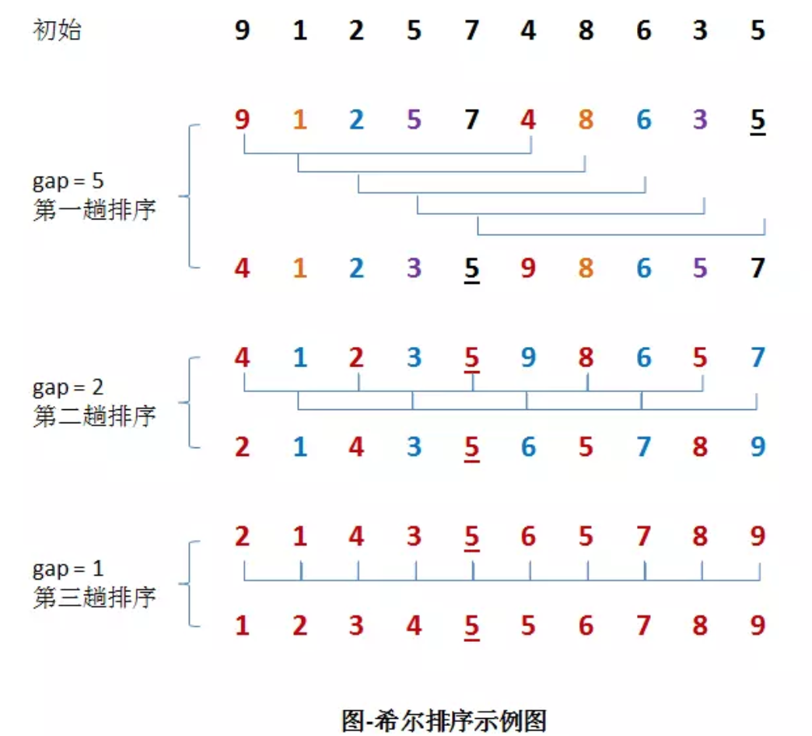

<!--ts-->
   * [前言](#前言)
   * [1. 交换类排序](#1-交换类排序)
      * [1.1 冒泡排序](#11-冒泡排序)
         * [1.1.1 算法描述](#111-算法描述)
         * [1.1.2 代码实现](#112-代码实现)
         * [1.1.3 算法分析](#113-算法分析)
         * [1.1.4 数字交换方法](#114-数字交换方法)
      * [1.2 快排](#12-快排)
         * [1.2.1 算法描述](#121-算法描述)
         * [1.2.2 代码实现](#122-代码实现)
         * [1.2.3 算法分析](#123-算法分析)
         * [1.2.4 快排 vs 归并](#124-快排-vs-归并)
   * [2. 选择类排序](#2-选择类排序)
      * [2.1 简单选择排序（Selection Sort）](#21-简单选择排序selection-sort)
         * [2.1.1 算法描述](#211-算法描述)
         * [2.1.2 代码实现](#212-代码实现)
         * [2.1.3 算法分析](#213-算法分析)
      * [2.2 堆排序（Heap Sort）](#22-堆排序heap-sort)
         * [2.2.1 算法描述](#221-算法描述)
         * [2.2.2 代码实现](#222-代码实现)
         * [2.2.3 算法分析](#223-算法分析)
   * [3. 插入排序](#3-插入排序)
      * [3.1 直接插入排序](#31-直接插入排序)
         * [3.1.1 算法描述](#311-算法描述)
         * [3.1.2 代码实现](#312-代码实现)
         * [3.1.3 算法分析](#313-算法分析)
      * [3.2 希尔排序（Shell Sort）](#32-希尔排序shell-sort)
         * [3.2.1 算法描述](#321-算法描述)
         * [3.2.2 代码实现](#322-代码实现)
         * [3.2.3 算法分析](#323-算法分析)
   * [4. 归并排序](#4-归并排序)
      * [4.1 算法描述](#41-算法描述)
      * [4.2 代码实现](#42-代码实现)
      * [4.3 算法分析](#43-算法分析)
   * [5. 基数排序](#5-基数排序)
      * [5.1 算法描述](#51-算法描述)
      * [5.2 代码实现](#52-代码实现)
      * [5.3 算法分析](#53-算法分析)
   * [6. 总结](#6-总结)

<!-- Added by: anapodoton, at: 2020年 7月19日 星期日 11时23分23秒 CST -->

<!--te-->

# 前言

排序算法分为内部排序和外部排序，内部排序把数据记录放在内存中进行排序，而外部排序因排序的数据量大，内存不能一次容纳全部的排序记录，所以在排序过程中需要访问外存。

**常见术语：**

- **稳定**：如果a原本在b前面，而a=b，排序之后a仍然在b的前面；
- **不稳定**：如果a原本在b的前面，而a=b，排序之后a可能会出现在b的后面；
- **内排序**：所有排序操作都在内存中完成；
- **外排序**：由于数据太大，因此把数据放在磁盘中，而排序通过磁盘和内存的数据传输才能进行；
- **时间复杂度：** 一个算法执行所耗费的时间。
- **空间复杂度**：运行完一个程序所需内存的大小。

下面再来看算法的总结：


**图片名词解释：**

- n: 数据规模
- k: “桶”的个数
- In-place: 占用常数内存，不占用额外内存
- Out-place: 占用额外内存

那么算法的分类是什么样子的呢？


值得我们注意的是，我们在排序中经常看到**比较**这个概念：

常见的**快速排序、归并排序、堆排序、冒泡排序**等属于**比较排序**。**在排序的最终结果里，元素之间的次序依赖于它们之间的比较。每个数都必须和其他数进行比较，才能确定自己的位置。**
在**冒泡排序**之类的排序中，问题规模为n，又因为需要比较n次，所以平均时间复杂度为O(n²)。在**归并排序、快速排序**之类的排序中，问题规模通过**分治法**消减为logN次，所以时间复杂度平均**O(nlogn)**。
比较排序的优势是，适用于各种规模的数据，也不在乎数据的分布，都能进行排序。可以说，**比较排序适用于一切需要排序的情况。**

**计数排序、基数排序、桶排序**则属于**非比较排序**。非比较排序是通过确定每个元素之前，应该有多少个元素来排序。针对数组arr，计算arr[i]之前有多少个元素，则唯一确定了arr[i]在排序后数组中的位置。
非比较排序只要确定每个元素之前的已有的元素个数即可，所有一次遍历即可解决。算法时间复杂度**O(n)**。
**非比较排序时间复杂度底，但由于非比较排序需要占用空间来确定唯一位置。所以对数据规模和数据分布有一定的要求。**

比较完整的图片:



# 1. 交换类排序

## 1.1 冒泡排序

冒泡排序（Bubble Sort）是一种简单的排序算法。它重复访问要排序的数列，一次比较两个元素，如果他们的顺序错误就把他们交换过来。访问数列的工作是重复地进行直到没有再需要交换的数据，也就是说该数列已经排序完成。这个算法的名字由来是因为越小的元素会经由交换慢慢“浮”到数列的顶端，像水中的气泡从水底浮到水面。


### 1.1.1 算法描述

冒泡排序算法的算法过程如下：

①. 比较相邻的元素。如果第一个比第二个大，就交换他们两个。

②. 对每一对相邻元素作同样的工作，从开始第一对到结尾的最后一对。这步做完后，最后的元素会是最大的数。

③. 针对所有的元素重复以上的步骤，除了最后一个。

④. 持续每次对越来越少的元素重复上面的步骤①~③，直到没有任何一对数字需要比较。

### 1.1.2 代码实现

```java
/**
     * 冒泡排序,每次把最大的放在最后边
     *
     * @param array
     * @return
     */
    public static int[] bubbleSort(int[] array) {
        if (array == null || array.length == 0) {
            return array;
        }
        //算法的优化，如果该标志位为true，则说明已经有序，不需要继续排序
        boolean flag = false;
        for (int i = 0; i < array.length; i++) {
            for (int j = 0; j < array.length - 1 - i; j++) {
                flag = true;
                if (array[j] > array[j + 1]) {
                    int temp = array[j + 1];
                    array[j + 1] = array[j];
                    array[j] = temp;
                    flag = false;
                }
            }
            // 有序，直接返回
            if (flag == true) {
                break;
            }
        }
        return array;
    }
```

### 1.1.3 算法分析

**最佳情况：T(n) = O(n)  最差情况：T(n) = O(n^2)  平均情况：T(n) = O(n^2)**

冒泡排序是稳定的排序算法，最容易实现的排序, 最坏的情况是每次都需要交换, 共需遍历并交换将近n²/2次, 时间复杂度为O(n²). 最佳的情况是内循环遍历一次后发现排序是对的, 因此退出循环, 时间复杂度为O(n). 平均来讲, 时间复杂度为O(n²). 由于冒泡排序中只有缓存的temp变量需要内存空间, 因此空间复杂度为常量O(1)。

### 1.1.4 数字交换方法

这里面还有一个知识点，就是数字交换的方法，总共有三种，分别是**临时变量法、算术法、位运算法**。

```java
import java.util.Arrays;

public class SwapDemo {

    public static void main(String[] args) {
        // 临时变量法
        int[] array = new int[]{10, 20};
        System.out.println(Arrays.toString(array));
        swapByTemp(array, 0, 1);
        System.out.println(Arrays.toString(array));
        // 算术法
        array = new int[]{10, 20};
        swapByArithmetic(array, 0, 1);
        System.out.println(Arrays.toString(array));
        // 位运算法
        array = new int[]{10, 20};
        swapByBitOperation(array, 0, 1);
        System.out.println(Arrays.toString(array));
    }

    /**
     * 通过临时变量交换数组array的i和j位置的数据
     *
     * @param array 数组
     * @param i     下标i
     * @param j     下标j
     */
    public static void swapByTemp(int[] array, int i, int j) {
        int temp = array[i];
        array[i] = array[j];
        array[j] = temp;
    }

    /**
     * 通过算术法交换数组array的i和j位置的数据（有可能溢出）
     *
     * @param array 数组
     * @param i     下标i
     * @param j     下标j
     */
    public static void swapByArithmetic(int[] array, int i, int j) {
        array[i] = array[i] + array[j];
        array[j] = array[i] - array[j];
        array[i] = array[i] - array[j];
    }


    /**
     * 通过位运算法交换数组array的i和j位置的数据
     *
     * @param array 数组
     * @param i     下标i
     * @param j     下标j
     */
    public static void swapByBitOperation(int[] array, int i, int j) {
        array[i] = array[i] ^ array[j];
        array[j] = array[i] ^ array[j]; //array[i]^array[j]^array[j]=array[i]
        array[i] = array[i] ^ array[j]; //array[i]^array[j]^array[i]=array[j]
    }
}
```

## 1.2 快排

快速排序的基本思想：通过一趟排序将待排记录分隔成独立的两部分，其中一部分记录的关键字均比另一部分的关键字小，则可分别对这两部分记录继续进行排序，以达到整个序列有序。

### 1.2.1 算法描述

快速排序使用分治策略来把一个序列（list）分为两个子序列（sub-lists）。步骤为：

①. 从数列中挑出一个元素，称为”基准”（pivot）。

②. 重新排序数列，所有比基准值小的元素摆放在基准前面，所有比基准值大的元素摆在基准后面（相同的数可以到任一边）。在这个分区结束之后，该基准就处于数列的中间位置。这个称为分区（partition）操作。

③. 递归地（recursively）把小于基准值元素的子数列和大于基准值元素的子数列排序。

递归到最底部时，数列的大小是零或一，也就是已经排序好了。这个算法一定会结束，因为在每次的迭代（iteration）中，它至少会把一个元素摆到它最后的位置去。


左右指针法

用伪代码描述如下：

（1）low = L; high = R; 选取a[low]作为关键字记录为key。

（2）high--，由后向前找比它小的数

（3）low++，由前向后找比它大的数

（4）交换第（2）、（3）步找到的数

（5）重复（2）、（3），一直往后找，直到left和right相遇，这时将key和a[low]交换位置。

###  1.2.2 代码实现

```java
package com.code.offer.sort_basic;

public class QuickSort {
    /**
     * 快速排序方法
     *
     * @param array
     * @param start
     * @param end
     * @return
     */
    public static int[] quickSort(int[] array, int start, int end) {
        if (array.length < 1 || start < 0 || end >= array.length || start > end) {
            return null;
        }
        int index = partition(array, start, end);
        quickSort(array, start, index - 1);
        quickSort(array, index + 1, end);
        return array;
    }

    /**
     * 快速排序算法——partition
     *
     * @param arr
     * @param left
     * @param right
     * @return
     */
    public static int partition(int arr[], int left, int right) {
        int temp = arr[left];
        while (left < right) {
            while (left < right && arr[right] > temp) {
                right--;
            }
            arr[left] = arr[right];
            while (left < right && arr[left] <= temp) {
                left++;
            }
            arr[right] = arr[left];
        }
        arr[left] = temp;
        return left;
    }
}
```

其中，partition算法是十分重要的，很多地方都有使用。

### 1.2.3 算法分析

**最佳情况：T(n) = O(nlogn)  最差情况：T(n) = O(n^2)  平均情况：T(n) = O(nlogn)**　

快速排序并不稳定，快速排序每次交换的元素都有可能不是相邻的, 因此它有可能打破原来值为相同的元素之间的顺序。

### 1.2.4 快排 vs 归并

**归并排序和快排的比较，二者是互补的：**

|      | 快速排序                             | 归并排序                                                     |
| ---- | ------------------------------------ | ------------------------------------------------------------ |
| 方式 | 当两个子数组都有序时整个数组就有序了 | 将数组分成两个子数组分别排序，并且将有序的子数组进行归并以将整个数组进行排序 |
|      | 递归在处理整个数组之后               | 递归在处理整个数组之前                                       |
|      | partition的位置取决于数组的内容      | 等分为两半                                                   |

# 2. 选择类排序

## 2.1 简单选择排序（Selection Sort）

**无论什么数据进去都是O(n^2)的时间复杂度**，所以用到它的时候，数据规模越小越好。唯一的好处可能就是不占用额外的内存空间了吧。理论上讲，选择排序可能也是平时排序一般人想到的最多的排序方法了吧。

选择排序(Selection-sort)是一种简单直观的排序算法。它的工作原理：首先在未排序序列中找到最小（大）元素，存放到排序序列的起始位置，然后，再从剩余未排序元素中继续寻找最小（大）元素，然后放到已排序序列的末尾。以此类推，直到所有元素均排序完毕。 

### 2.1.1 算法描述

①. 从待排序序列中，找到关键字最小的元素；

②. 如果最小元素不是待排序序列的第一个元素，将其和第一个元素互换；

③. 从余下的 N - 1 个元素中，找出关键字最小的元素，重复①、②步，直到排序结束。


### 2.1.2 代码实现

```java
/**
 * 选择排序
 *
 * @param array
 * @return
 */
public static int[] selectionSort(int[] array) {
    if (array == null || array.length == 0) {
        return array;
    }
    for (int i = 0; i < array.length; i++) {
        int minIndex = i;
        for (int j = i; j < array.length; j++) {
            //找到最小的数
            if (array[j] < array[minIndex]) {
                //将最小数的索引保存
                minIndex = j;
            }
        }
        int temp = array[minIndex];
        array[minIndex] = array[i];
        array[i] = temp;
    }
    return array;
}
```

### 2.1.3 算法分析

**最佳情况：T(n) = O(n^2)  最差情况：T(n) = O(n^2)  平均情况：T(n) = O(n^2)**

**不稳定排序算法**，选择排序的简单和直观名副其实，这也造就了它出了名的慢性子，无论是哪种情况，哪怕原数组已排序完成，它也将花费将近n²/2次遍历来确认一遍。 唯一值得高兴的是，它并不耗费额外的内存空间。

## 2.2 堆排序（Heap Sort）

堆排序（Heapsort）是指利用堆这种数据结构所设计的一种排序算法。堆积是一个近似完全二叉树的结构，并同时满足堆积的性质：即子结点的键值或索引总是小于（或者大于）它的父节点。

堆排序的基本思想是：将待排序序列构造成一个大顶堆，此时，整个序列的最大值就是堆顶的根节点。将其与末尾元素进行交换，此时末尾就为最大值。然后将剩余n-1个元素重新构造成一个堆，这样会得到n个元素的次小值。如此反复执行，便能得到一个有序序列了。

### 2.2.1 算法描述

再简单总结下堆排序的基本思路：

  a.将无需序列构建成一个堆，根据升序降序需求选择大顶堆或小顶堆;

  b.将堆顶元素与末尾元素交换，将最大元素"沉"到数组末端;

  c.重新调整结构，使其满足堆定义，然后继续交换堆顶元素与当前末尾元素，反复执行调整+交换步骤，直到整个序列有序。   


### 2.2.2 代码实现

```java
package com.code.offer.sort_basic;

public class HeapSort {
    //声明全局变量，用于记录数组array的长度；
    static int len;

    /**
     * 堆排序算法
     *
     * @param array
     * @return
     */
    public static int[] HeapSort(int[] array) {
        len = array.length;
        if (len < 1) {
            return array;
        }
        //1.构建一个最大堆
        buildMaxHeap(array);
        //2.循环将堆首位（最大值）与末位交换，然后在重新调整最大堆
        while (len > 0) {
            swap(array, 0, len - 1);
            len--;
            adjustHeap(array, 0);
        }
        return array;
    }

    /**
     * 建立最大堆
     *
     * @param array
     */
    public static void buildMaxHeap(int[] array) {
        //从最后一个非叶子节点开始向上构造最大堆
        for (int i = (len / 2 - 1); i >= 0; i--) {
            adjustHeap(array, i);
        }
    }

    /**
     * 调整使之成为最大堆
     *
     * @param array
     * @param i
     */
    public static void adjustHeap(int[] array, int i) {
        int maxIndex = i;
        //如果有左子树，且左子树大于父节点，则将最大指针指向左子树
        if (i * 2 < len && array[i * 2] > array[maxIndex]) {
            maxIndex = i * 2;
        }
        //如果有右子树，且右子树大于父节点，则将最大指针指向右子树
        if (i * 2 + 1 < len && array[i * 2 + 1] > array[maxIndex]) {
            maxIndex = i * 2 + 1;
        }
        //如果父节点不是最大值，则将父节点与最大值交换，并且递归调整与父节点交换的位置。
        if (maxIndex != i) {
            swap(array, maxIndex, i);
            adjustHeap(array, maxIndex);
        }
    }

    /**
     * 交换数组内两个元素
     *
     * @param array
     * @param i
     * @param j
     */
    public static void swap(int[] array, int i, int j) {
        int temp = array[i];
        array[i] = array[j];
        array[j] = temp;
    }
}
```

### 2.2.3 算法分析

**最佳情况：T(n) = O(nlogn) 最差情况：T(n) = O(nlogn) 平均情况：T(n) = O(nlogn)**

由于堆排序中初始化堆的过程比较次数较多, 因此它不太适用于小序列。同时由于多次任意下标相互交换位置, 相同元素之间原本相对的顺序被破坏了, 因此, 它是不稳定的排序。

①. 建立堆的过程, 从length/2 一直处理到0, 时间复杂度为O(n);

②. 调整堆的过程是沿着堆的父子节点进行调整, 执行次数为堆的深度, 时间复杂度为O(lgn);

③. 堆排序的过程由n次第②步完成, 时间复杂度为O(nlgn).

# 3. 插入排序

## 3.1 直接插入排序

插入排序（Insertion-Sort）的算法描述是一种简单直观的排序算法。它的工作原理是通过构建有序序列，对于未排序数据，在已排序序列中从后向前扫描，找到相应位置并插入。插入排序在实现上，通常采用in-place排序（即只需用到O(1)的额外空间的排序），因而在从后向前扫描过程中，需要反复把已排序元素逐步向后挪位，为最新元素提供插入空间。

### 3.1.1 算法描述

一般来说，插入排序都采用in-place在数组上实现。具体算法描述如下：

①. 从第一个元素开始，该元素可以认为已经被排序

②. 取出下一个元素，在已经排序的元素序列中从后向前扫描

③. 如果该元素（已排序）大于新元素，将该元素移到下一位置

④. 重复步骤3，直到找到已排序的元素小于或者等于新元素的位置

⑤. 将新元素插入到该位置后

⑥. 重复步骤②~⑤


### 3.1.2 代码实现

```java
/**
 * 插入排序
 *
 * @param array
 * @return
 */
public static int[] insertionSort(int[] array) {
    if (array == null || array.length == 0) {
        return array;
    }
    int current;
    for (int i = 0; i < array.length - 1; i++) {
        // 先取出待插入数据保存，因为向后移位过程中会把覆盖掉待插入数
        current = array[i + 1];
        int preIndex = i;
        // 如果是比待插入数据大，就后移
        while (preIndex >= 0 && current < array[preIndex]) {
            array[preIndex + 1] = array[preIndex];
            preIndex--;
        }
        // 找到比待插入数据小的位置，将待插入数据插入
        array[preIndex + 1] = current;
    }
    return array;
}
```

### 3.1.3 算法分析

**最佳情况：T(n) = O(n)  最坏情况：T(n) = O(n^2)  平均情况：T(n) = O(n^2)**

**对非随机数组比较有效**。

## 3.2 希尔排序（Shell Sort）

希尔排序是希尔（Donald Shell）于1959年提出的一种排序算法。希尔排序也是一种插入排序，它是简单插入排序经过改进之后的一个更高效的版本，也称为缩小增量排序，同时该算法是冲破O(n^2）的第一批算法之一。它与插入排序的不同之处在于，它会优先比较距离较远的元素。希尔排序又叫缩小增量排序。

**希尔排序是把记录按下表的一定增量分组，对每组使用直接插入排序算法排序；随着增量逐渐减少，每组包含的关键词越来越多，当增量减至1时，整个文件恰被分成一组，算法便终止。**

**为什么希尔排序更加高效**？

> 如果元素是乱序的，最坏情况下，直接插入排序方法插入到正确的位置需要n-1次移动。
>
> 原因在于权衡了子数组的规模和有序性。排序前，各个子数组都很短，排序之后子数组都是部分有序的，这两种情况下都很适合采用插入排序，子数组部分有序的程度取决于递增序列的选择。
>
> 希尔排序对于中等大小的数组比较好，相比于很复杂的算法，运行速度也就比希尔排序快2倍的样子。
>
> 对于部分有序和小规模的数组应该选择插入排序。

### 3.2.1 算法描述

我们来看下希尔排序的基本步骤，在此我们选择增量gap=length/2，缩小增量继续以gap = gap/2的方式，这种增量选择我们可以用一个序列来表示，**{n/2,(n/2)/2...1}**，称为**增量序列**。希尔排序的增量序列的选择与证明是个数学难题，我们选择的这个增量序列是比较常用的，也是希尔建议的增量，称为希尔增量，但其实这个增量序列不是最优的。此处我们做示例使用希尔增量。

先将整个待排序的记录序列分割成为若干子序列分别进行直接插入排序，具体算法描述：

①. 选择一个增量序列t1，t2，…，tk，其中ti>tj，tk=1；（一般初次取数组半长，之后每次再减半，直到增量为1）

②. 按增量序列个数k，对序列进行k 趟排序；

③. 每趟排序，根据对应的增量ti，将待排序列分割成若干长度为m 的子序列，分别对各子表进行直接插入排序。仅增量因子为1 时，整个序列作为一个表来处理，表长度即为整个序列的长度。



在上面这幅图中： 初始时，有一个大小为 10 的无序序列。

在第一趟排序中，我们不妨设 gap1 = N / 2 = 5，即相隔距离为 5 的元素组成一组，可以分为 5 组。

接下来，按照直接插入排序的方法对每个组进行排序。

在第二趟排序中，我们把上次的 gap 缩小一半，即 gap2 = gap1 / 2 = 2 (取整数)。这样每相隔距离为 2 的元素组成一组，可以分为 2 组。

按照直接插入排序的方法对每个组进行排序。

在第三趟排序中，再次把 gap 缩小一半，即gap3 = gap2 / 2 = 1。 这样相隔距离为 1 的元素组成一组，即只有一组。 按照直接插入排序的方法对每个组进行排序。此时，排序已经结束。

需要注意一下的是，图中有两个相等数值的元素 5 和 5 。我们可以清楚的看到，在排序过程中，两个元素位置交换了。 所以，希尔排序是不稳定的算法。

### 3.2.2 代码实现

```java
/**
 * 希尔排序
 *
 * @param array
 * @return
 */
public static int[] ShellSort(int[] array) {
    int len = array.length;
    int temp, gap = len / 2;
    while (gap > 0) {
        for (int i = gap; i < len; i++) {
            temp = array[i];
            int preIndex = i - gap;
            while (preIndex >= 0 && array[preIndex] > temp) {
                array[preIndex + gap] = array[preIndex];
                preIndex -= gap;
            }
            array[preIndex + gap] = temp;
        }
        //不断缩小gap，直到1为止
        gap /= 2;
    }
    return array;
}
```

### 3.2.3 算法分析

**最佳情况：T(n) = O(nlog2 n)  最坏情况：T(n) = O(nlog2 n)  平均情况：T(n) =O(nlog2n)**　

不稳定排序算法，希尔排序第一个突破O(n2)的排序算法；是简单插入排序的改进版；它与插入排序的不同之处在于，它会优先比较距离较远的元素，直接插入排序是稳定的；而希尔排序是不稳定的，希尔排序的时间复杂度和步长的选择有关，常用的是Shell增量排序，也就是N/2的序列，Shell增量序列不是最好的增量序列，其他还有Hibbard增量序列、Sedgewick 增量序列等，具体可以参考，[希尔排序增量序列简介](https://link.juejin.im/?target=https%3A%2F%2Fblog.csdn.net%2FFoliciatarier%2Farticle%2Fdetails%2F53891144)。

可以用在大型数组之上，对任意排序的数组表现很好，我们很难去构造一个使希尔排序运行缓慢的数组。

# 4. 归并排序

和选择排序一样，归并排序的性能不受输入数据的影响，但表现比选择排序好的多，因为始终都是O(n log n）的时间复杂度。代价是需要额外的内存空间。

归并排序是建立在归并操作上的一种有效的排序算法。该算法是采用分治法（Divide and Conquer）的一个非常典型的应用。归并排序是一种稳定的排序方法。将已有序的子序列合并，得到完全有序的序列；即先使每个子序列有序，再使子序列段间有序。若将两个有序表合并成一个有序表，称为2-路归并。 

归并排序是分治法的典型应用。 

## 4.1 算法描述

采用递归法： ①. 将序列每相邻两个数字进行归并操作，形成 floor(n/2)个序列，排序后每个序列包含两个元素；

②. 将上述序列再次归并，形成 floor(n/4)个序列，每个序列包含四个元素；

③. 重复步骤②，直到所有元素排序完毕


## 4.2 代码实现

```java
public static int[] mergeSort(int[] array, int left, int right) {
        if (left >= right) {
            return array;
        }
        int mid = (left + right) / 2;
        mergeSort(array, left, mid);
        mergeSort(array, mid + 1, right);
        merge(array, left, mid, right);
        return array;
    }

    /**
     * 归并排序——将两段排序好的数组结合成一个排序数组
     */
    private static void merge(int[] arr, int low, int mid, int high) {
        //temp数组用于暂存合并的结果
        int[] temp = new int[high - low + 1];
        //左半边的指针
        int i = low;
        //右半边的指针
        int j = mid + 1;
        //合并后数组的指针
        int k = 0;

        //将记录由小到大地放进temp数组
        for (; i <= mid && j <= high; k++) {
            if (arr[i] < arr[j]) {
                temp[k] = arr[i++];
            } else {
                temp[k] = arr[j++];
            }
        }

        //接下来两个while循环是为了将剩余的（比另一边多出来的个数）放到temp数组中
        while (i <= mid) {
            temp[k++] = arr[i++];
        }

        while (j <= high) {
            temp[k++] = arr[j++];
        }

        //将temp数组中的元素写入到待排数组中
        for (int l = 0; l < temp.length; l++) {
            arr[low + l] = temp[l];
        }
    }
```

## 4.3 算法分析

**最佳情况：T(n) = O(n)  最差情况：T(n) = O(nlogn)  平均情况：T(n) = O(nlogn)**

稳定排序算法，从效率上看，归并排序可算是排序算法中的”佼佼者”. 假设数组长度为n，那么拆分数组共需logn, 又每步都是一个普通的合并子数组的过程，时间复杂度为O(n)， 故其综合时间复杂度为O(nlogn)。另一方面， 归并排序多次递归过程中拆分的子数组需要保存在内存空间， 其空间复杂度为O(n)。 和选择排序一样，归并排序的性能不受输入数据的影响，但表现比选择排序好的多，因为始终都是O(nlogn）的时间复杂度。代价是需要额外的内存空间。

归并排序算法的改进：对小规模子数组使用插入排序，测试数组是否已经有序，不将元素复制到辅助数组。 

# 5. 基数排序

基数排序也是非比较的排序算法，对每一位进行排序，从最低位开始排序，复杂度为O(kn),为数组长度，k为数组中的数的最大的位数；

基数排序是按照低位先排序，然后收集；再按照高位排序，然后再收集；依次类推，直到最高位。有时候有些属性是有优先级顺序的，先按低优先级排序，再按高优先级排序。最后的次序就是高优先级高的在前，高优先级相同的低优先级高的在前。基数排序基于分别排序，分别收集，所以是稳定的。

基数排序（Radix sort）是一种非比较型整数排序算法，其原理是将整数按位数切割成不同的数字，然后按每个位数分别比较。由于整数也可以表达字符串（比如名字或日期）和特定格式的浮点数，所以基数排序也不是只能使用于整数。

将所有待比较数值（正整数）统一为同样的数位长度，数位较短的数前面补零。然后，从最低位开始，依次进行一次排序。这样从最低位排序一直到最高位排序完成以后，数列就变成一个有序序列。

基数排序按照优先从高位或低位来排序有两种实现方案：

**MSD（Most significant digital）** 从最左侧高位开始进行排序。先按k1排序分组, 同一组中记录, 关键码k1相等, 再对各组按k2排序分成子组, 之后, 对后面的关键码继续这样的排序分组, 直到按最次位关键码kd对各子组排序后. 再将各组连接起来, 便得到一个有序序列。MSD方式适用于位数多的序列。

**LSD（Least significant digital）** 从最右侧低位开始进行排序。先从kd开始排序，再对kd-1进行排序，依次重复，直到对k1排序后便得到一个有序序列。LSD方式适用于位数少的序列。

## 5.1 算法描述

- 取得数组中的最大数，并取得位数；
- arr为原始数组，从最低位开始取每个位组成radix数组；
- 对radix进行计数排序（利用计数排序适用于小范围数的特点）；


## 5.2 代码实现

```java
package com.code.offer.sort_basic;

import java.util.ArrayList;

public class RadixSort {
    /**
     * 基数排序
     *
     * @param array
     * @return
     */
    public static int[] RadixSort(int[] array) {
        if (array == null || array.length < 2) {
            return array;
        }
        // 1.先算出最大数的位数；
        int max = array[0];
        for (int i = 1; i < array.length; i++) {
            max = Math.max(max, array[i]);
        }
        int maxDigit = 0;
        while (max != 0) {
            max /= 10;
            maxDigit++;
        }
        int mod = 10, div = 1;
        ArrayList<ArrayList<Integer>> bucketList = new ArrayList<ArrayList<Integer>>();
        for (int i = 0; i < 10; i++) {
            bucketList.add(new ArrayList<Integer>());
        }
        for (int i = 0; i < maxDigit; i++, mod *= 10, div *= 10) {
            for (int j = 0; j < array.length; j++) {
                int num = (array[j] % mod) / div;
                bucketList.get(num).add(array[j]);
            }
            int index = 0;
            for (int j = 0; j < bucketList.size(); j++) {
                for (int k = 0; k < bucketList.get(j).size(); k++) {
                    array[index++] = bucketList.get(j).get(k);
                }
                bucketList.get(j).clear();
            }
        }
        return array;
    }
}
```

## 5.3 算法分析

**最佳情况：T(n) = O(n \* k)  最差情况：T(n) = O(n \* k)  平均情况：T(n) = O(n \* k)**

基数排序更适合用于对时间, 字符串等这些整体权值未知的数据进行排序，适用于。

(1)数据范围较小，建议在小于1000

(2)每个数值都要大于等于0

基数排序 vs 计数排序 vs 桶排序

这三种排序算法都利用了桶的概念，但对桶的使用方法上有明显差异：

基数排序：根据键值的每位数字来分配桶

计数排序：每个桶只存储单一键值

桶排序：每个桶存储一定范围的数值

# 6. 总结

从时间复杂度来说：

(1). 平方阶O(n²)排序：各类简单排序：直接插入、直接选择和冒泡排序；

(2). 线性对数阶O(nlog₂n)排序：快速排序、堆排序和归并排序；

(3). O(n1+§))排序，§是介于0和1之间的常数：希尔排序

(4). 线性阶O(n)排序：基数排序，此外还有桶、箱排序。

时间复杂度极限：

当被排序的数有一些性质的时候（比如是整数，比如有一定的范围），排序算法的复杂度是可以小于O(nlgn)的。比如：

计数排序 复杂度O( k+n) 要求：被排序的数是0~k范围内的整数

基数排序 复杂度O( d(k+n) ) 要求：d位数，每个数位有k个取值

桶排序 复杂度 O( n ) （平均） 要求：被排序数在某个范围内，并且服从均匀分布

但是，当被排序的数不具有任何性质的时候，一般使用基于比较的排序算法，而基于比较的排序算法时间复杂度的下限必须是O( nlgn) 。参考[很多高效排序算法的代价是 nlogn，难道这是排序算法的极限了吗](https://link.juejin.im/?target=https%3A%2F%2Fwww.zhihu.com%2Fquestion%2F24516934)？

说明 当原表有序或基本有序时，直接插入排序和冒泡排序将大大减少比较次数和移动记录的次数，时间复杂度可降至O（n）；

而快速排序则相反，当原表基本有序时，将蜕化为冒泡排序，时间复杂度提高为O（n2）；

原表是否有序，对简单选择排序、堆排序、归并排序和基数排序的时间复杂度影响不大
