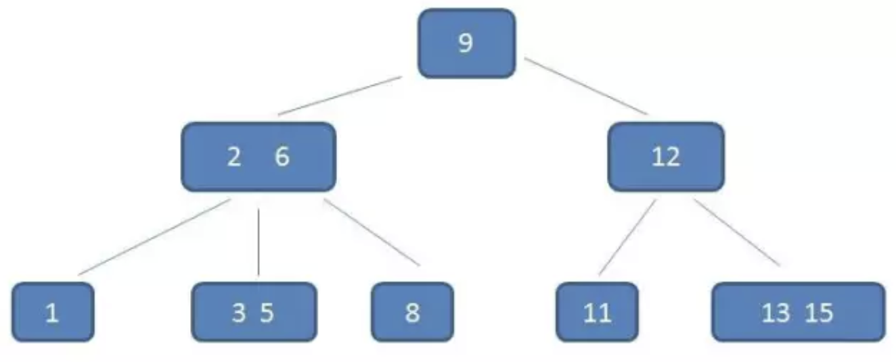
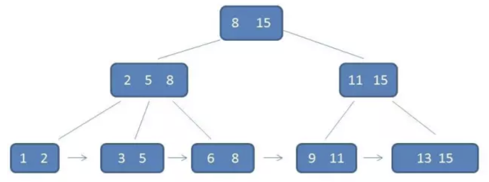
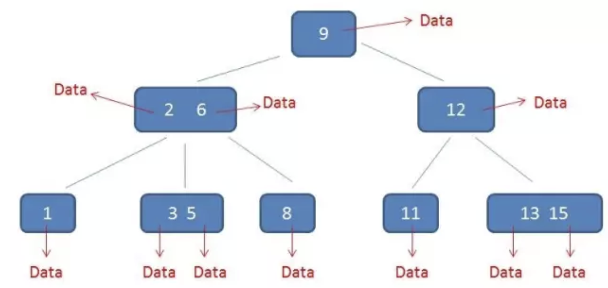
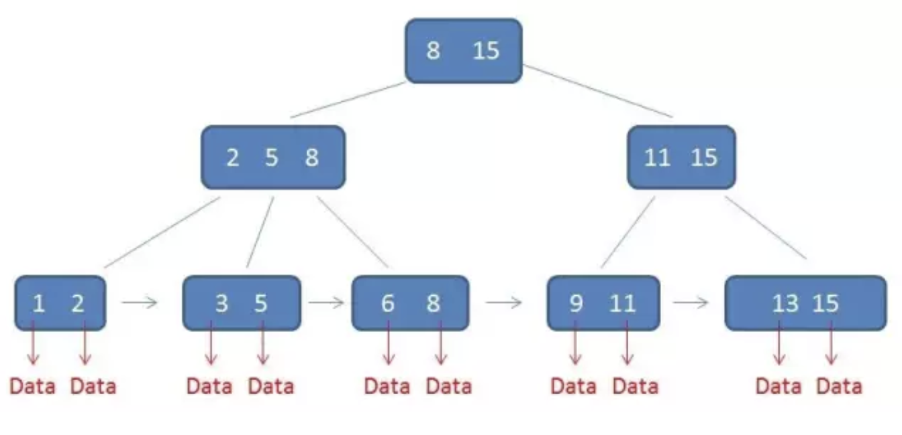

# 二叉查找树BST

1.**左**子树上所有结点的值均**小于或等于**它的根结点的值。

2.**右**子树上所有结点的值均**大于或等于**它的根结点的值。

3.左、右子树也分别为二叉排序树。

# 红黑树

1.节点是红色或黑色。

2.根节点是黑色。

3.每个叶子节点都是黑色的空节点（NIL节点）。

4 每个红色节点的两个子节点都是黑色。(从每个叶子到根的所有路径上不能有两个连续的红色节点)

5.从任一节点到其每个叶子的所有路径都包含相同数目的黑色节点。

推论：**红黑树从根节点到叶子的最长路径不会超过最短路径的2倍**。

添加或者删除节点的时候，可能会出现不满足红黑树性质的情况，这个时候我们需要进行调整，调整的方法有**变色和旋转**。变色分为红变黑和黑变红。

# 平衡二叉树AVL

首先是二叉查找树，然后左右子树的高度差小于1。

# B树

[B树](https://mp.weixin.qq.com/s?__biz=MzIxMjE5MTE1Nw==&mid=2653190965&idx=1&sn=53f78fa037386f85531832cd5322d2a0&chksm=8c9909efbbee80f90512f0c36356c31cc74c388c46388dc2317d43c8f8597298f233ca9c29e9&scene=21#wechat_redirect)

下面来具体介绍一下B-树（Balance Tree），一个m阶的B树具有如下几个特征：

1.根结点至少有两个子女。

2.每个中间节点都包含k-1个元素和k个孩子，其中 m/2 <= k <= m

3.每一个叶子节点都包含k-1个元素，其中 m/2 <= k <= m

4.所有的叶子结点都位于同一层。

5.每个节点中的元素从小到大排列，节点当中k-1个元素正好是k个孩子包含的元素的值域分划。

# B+ 树

[B+树](https://mp.weixin.qq.com/s?__biz=MzIxMjE5MTE1Nw==&mid=2653191027&idx=1&sn=4ba22e3ec8bd149f69fc0aba72e4347e&chksm=8c9909a9bbee80bfa1d8497ff0525df130414c1731b5aa5287bf16ea1cf86c8d8e6f20782184&scene=21#wechat_redirect)

**特征**：

1.有k个子树的中间节点包含有k个元素（B树中是k-1个元素），每个元素不保存数据，只用来索引，所有数据都保存在叶子节点。

2.所有的**叶子结点中包含了全部元素的信息**，及指向含这些元素记录的指针，且叶子结点本身依关键字的大小自小而大顺序链接。

3.所有的中间节点元素都同时存在于子节点，**在子节点元素中是最大（或最小）元素**。

卫星数据：索引元素指向的数据记录，比如数据库中的某一行。B-树中，中间节点和叶子节点都有卫星数据。B-树中的卫星数据（Satellite Information）：

在B+树中，只有叶子节点带有卫星数据，其余中间节点是索引，没有与任何数据进行关联。

B+树中的卫星数据（Satellite Information）：

在数据库的聚集索引（Clustered Index）中，叶子节点直接包含卫星数据。在非聚集索引（NonClustered Index）中，叶子节点带有指向卫星数据的指针。

**B+树的优势：**

1.单一节点存储更多的元素，使得查询的IO次数更少。

2.所有查询都要查找到叶子节点，查询性能稳定。

3.所有叶子节点形成有序链表，便于范围查询。